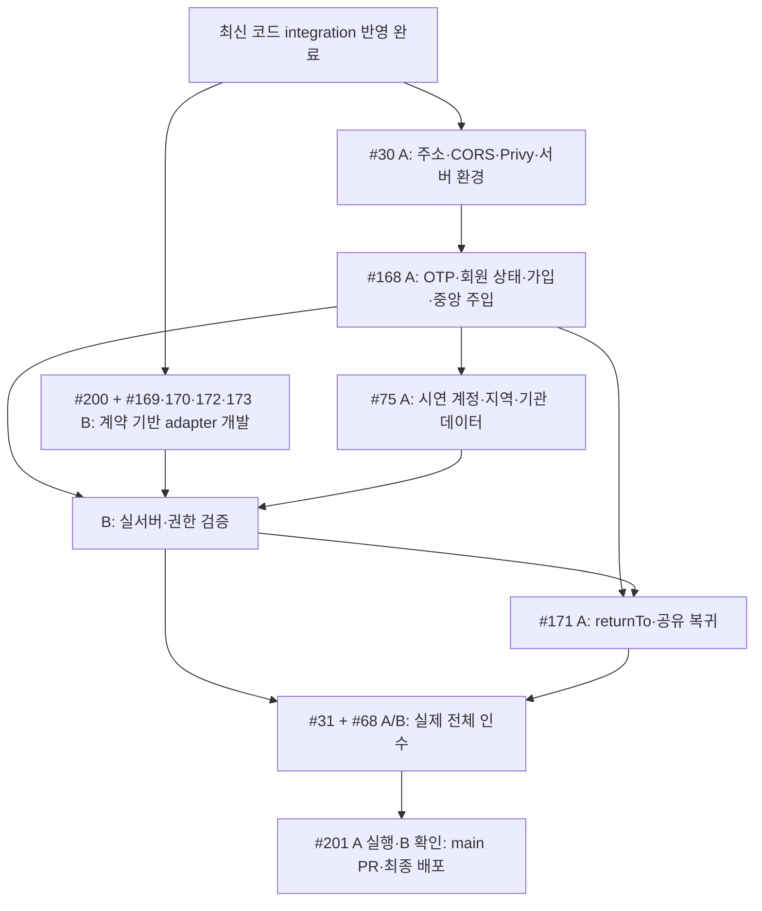

# Discushion FE/BE 통합 검증 보고서 — 2026-10-09

## 안전한 업로드 문서 처리

새 FE/BE 통합 지침 검토본의 운영 설정 서술이 자동 승인 검토에서 두 차례 거절됐다. 실제 secret/JWT 형식은 발견되지 않았지만 거절된 긴 본문은 업로드하지 않는다. 해당 새 검토본을 운영 설정/식별값 없는 짧은 통합 판단·확인 필요 문서로 대체했다. 원본 branch 문서47개 보존은 유지한다. 로컬 자체 commit 이력은 유지하되 원격에는 안전하게 정리한 최종 tree를 BE→FE 두-parent merge 구조로 올리므로 로컬 자체 commit SHA와 원격 통합 SHA는 다르다. 기존 FE/BE 이력과 코드 tree는 동일하다.

## 원격 업로드 후속 지시 — 2026-10-09 02:19 KST

사용자가 이전 검증 결과를 보고 `integration/develop`을 원격에 올리도록 명시적으로 요청했다. 이에 기존 통합 결과를 검토용 임시 branch로 push한다. 이 지시는 이전 push 보류 결정을 대체하지만 검증 실패/미검증·정책·Contract 차이를 해결한 것으로 해석하지 않는다. main과 두 develop에는 commit/merge/push하지 않는다.

일반 HTTPS git push는 실행환경의 GitHub 쓰기 credential 부재로 실패했다. 연결된 GitHub Git Data 기능으로 로컬에서 직접 병합한 것과 동일한 tree·parent 관계를 업로드한다. 인증된 작성자 메타데이터가 달라 자체 통합 commit SHA는 달라질 수 있지만 원본 FE/BE commit SHA와 이력은 그대로 보존한다. 로컬 통합 이력은 reset/rebase하지 않고 유지한다.

업로드 직전 fetch에서 origin/back/develop은 `6ff69300e4257f5d49dcd13fc8cf7096b32e25ff`(#17 통합 게시판 목록·필터·커서 조회)로 전진했고 origin/front/develop과 origin/main은 이전과 동일했다. 이번 업로드는 기존 BE 기준 `eb9a7d4`와 FE 기준 `108cb47`의 통합 결과다. 새 BE #17 commit은 아직 integration에 merge하지 않았다. 아래 endpoint 누락·Issue 상태 및 원격 integration 부재/push 미실행 설명은 최초 검증 시점의 기록이며, 최신 BE 상태나 업로드 이후 원격 상태를 뜻하지 않는다. 최신 BE 반영과 그 이후 계약/빌드 재검증은 별도 후속 작업이다.

---

Repository: `2026-KW-HACKATHON/33_Last-Stand-Before-Enlistment`

**최종 판정: C. Conflict/정책 확인 필요 — 연결 시작 금지.** Git 병합은 성공했으나 MVP 범위 정책, FE/BE adapter와 wire 차이, 누락 endpoint가 남아 있다. Backend build/test는 도구 다운로드 차단으로 실행하지 못했다. 사용자 push 조건을 충족하지 않아 원격에 올리지 않았다.

## 통합 기준

| 기준 | SHA |
| --- | --- |
| main | `dc139f43ce9e7cbe09d660202ee0ccec033b0f5f` |
| front/develop | `108cb477322eaffdfb42c520a93a5e53794031ce` |
| back/develop | `eb9a7d4a734a744731d7bb85564b32f3c8f3b39c` |
| integration/develop 시작 | `dc139f43ce9e7cbe09d660202ee0ccec033b0f5f` |
| 첫 merge (BE) | `3ceb5c6a00cc2a7e18ba265f29b2b579c0d1ac55` |
| 두 번째 merge (FE) | `c8e6f8c88d2c38de84c49079c5c532524f42a670` |

보고서 추가 commit 전 검증 기준은 두 번째 merge SHA다. 보고서 commit은 문서만 추가하며 FE/BE 코드는 동일하다. 최종 branch HEAD는 `git rev-parse integration/develop`으로 확인한다.

| merge-base | SHA |
| --- | --- |
| front/develop ↔ back/develop | `eeec7eff45f206947e63eb25f21b413a099dad4e` |
| main ↔ front/develop | `eeec7eff45f206947e63eb25f21b413a099dad4e` |
| main ↔ back/develop | `fa3a21d42878cf49d18ddbb6ed3fd48633630139` |

최초 workspace에는 사용자 Git checkout이 없었다. `repository/`에 no-checkout clone을 만들고 status/worktree/fetch/remote branches를 확인했다. no-checkout의 파일 부재는 기존 사용자 변경이 아니며 해당 worktree를 수정하지 않았다. 별도 `integration/` worktree에서 최신 origin/main으로 새 local integration/develop을 생성했다. local/remote integration 기존 이력·미완료 merge는 없었다. 최종 원격 재조회에서도 위 세 SHA는 동일하고 origin/integration/develop은 존재하지 않는다.

## 병합 순서

1. `origin/back/develop → integration/develop`
2. `origin/front/develop → integration/develop`

선택 이유: main 기준 FE 343경로·BE 358경로 변경, 양쪽 공통 변경 경로 11개를 비교했다. root/.github/docs/config/API를 확인하고 merge-tree로 예상 충돌을 비교했다. main→BE는 충돌0, main→FE는 README/ERD/유저플로우3개 충돌이다. Backend가 실제 wire/API·DB/실행환경을 제공하고 FE가 소비하는 관계이므로 BE를 먼저 보존하면 불필요한 초기 문서 충돌을 줄일 수 있다. 두 번째 충돌8개는 모두 문서이며 코드 충돌은 없다.

## Merge 결과

| 순서 | branch | 명령 | 결과 | conflict |
| --- | --- | --- | --- | --- |
| 1 | back/develop | `git merge --no-ff origin/back/develop` | merge commit 성공 | 없음 |
| 2 | front/develop | `git merge --no-ff --no-commit origin/front/develop` 후 문서 처리·commit | merge commit 성공 | 문서8개, 모두 index 해결 |

각 merge commit은 기존 integration HEAD와 해당 develop HEAD를 두 parent로 보존한다. rebase/squash/force/reset을 사용하지 않았다. 첫 병합 후 status/log를 확인한 뒤 두 번째를 진행했다.

## Conflict 해결

| 파일 | Front 의도 | Back 의도 | 해결 내용 |
| --- | --- | --- | --- |
| `AGENTS.md` | FE 세부 지침·Figma/UI/Mock 범위·FE 담당 | BE1 A/C/D 및 #14~17 이관·승인0 정책 | first BE merge 원본 유지, 새 검토본에 FE 지침·BE 책임과 사용자 예외 A/B를 기록 |
| `README.md` | FE 기준 문서·ERD·유저플로우 링크 | BE 실행 안내·결정 기록 링크 | 양쪽 안내를 새 검토본에 보존. 초기화 상태 서술은 현재 FE/BE 존재 사실로 보완 |
| `docs/api/Discushion_API_SPEC_v2.md` | FE UI/Mock 범위와 서버 계약의 분리 | 실제 auth/지역/기관/공유/참여/사진/AI wire | 비충돌 변경 통합, 서로 다른 범위 문구는 병기. 실제 API 변경 없음 |
| `docs/collaboration/Discushion_프론트엔드_Git_GitHub_협업전략_2026-10-06_v2.md` | 복구된 FE UI/Mock 범위 | 기존 MVP 필수 범위 제외 목록 | 상충 정책 확인 필요. 실제 (1) 없는 통합 지침 경로를 새 검토본에서 설명 |
| `docs/specs/Discushion_MVP_백엔드_프론트엔드_통합_지침서.md` | Figma 기반 UI/Mock·확장 FE 흐름 | 최신 계약·사진 lifecycle·BE 권한/인수 | 공통 부분 통합. 역할/범위 상충 병기, port/wire를 같다고 가정하지 않음 |
| `docs/specs/Discushion_PRD_2026-10-07_MVP반영_정리본_v10.2.md` | FE 범위 복구, API 부재와 제품 제외 구분 | MVP 제외 유지·사진/AI 추가 결정 | 확인 필요 — 최종 MVP 및 FE/BE 분리 범위를 임의 확정하지 않음 |
| `docs/specs/Discushion_기능명세서_2026-10-07_MVP반영_정리본_v10.2.md` | 기능 ID별 FE/UI/Mock 대상 확대 | 기존 BE 제외 목록·최신 파일 처리 | 기능 ID/공통 권한 보존, 범위 충돌 병기 |
| `docs/specs/Discushion_유저플로우_와이어프레임기반_2026-10-06.md` | 확장 UI/Mock 화면 흐름 | 변경 후 인증·사진·MVP 경계 | main/FE/BE 원본 모두 보존, 정본 정책 대체 금지. 상충 흐름 확인 필요 |

문서 원본 경로는 첫 번째 BE 병합 직후 상태를 유지했다. 이는 BE 내용을 최신 정본으로 자동 선택한 것이 아니다. Front와 Back의 정확한 내용은 각각 다른 보존 경로에 있으며, 양쪽 유효·비충돌 변경은 새 검토본으로 옮겼다. 상충 구간은 분기별 원문을 병기하고 확인 필요로 남겼다. 별도 main 원문도 보존했다. 새로운 정책·제품 기능·endpoint·Schema·UI 변경은 없다.

새 검토본의 상충 구간은 문서 비교 자료다. 그 안의 이전 '확정/완료' 표현을 이번 통합의 승인으로 해석하지 않는다. 옛 README 초기화 문구와 경과 기록은 원문 시점 자료다. 최신 구현 상태는 이 보고서가 기록한다.

## 문서 처리

A=원본 유지, B=단순 merge, C=새 통합본 생성, D=확인 필요. 각 원본은 아래 한 가지 처리로 기록하고 C 내 정책 미확정은 이유에 별도 표시한다.

| 기존 문서 | 처리 | 새 통합본 | 이유 |
| --- | --- | --- | --- |
| `AGENTS.md` | 새 통합본 생성 | `AGENTS_FE_BE_통합검토본_2026-10-09.md` | 양쪽 변경 보존; first BE merge 원본 유지, 새 검토본에 FE 지침·BE 책임과 사용자 예외 A/B를 기록 |
| `README.md` | 새 통합본 생성 | `README_FE_BE_통합검토본_2026-10-09.md` | 양쪽 변경 보존; 양쪽 안내를 새 검토본에 보존. 초기화 상태 서술은 현재 FE/BE 존재 사실로 보완 |
| `backend/README.md` | 원본 유지 | `—` | 기존 내용 그대로 유지 |
| `docs/README.md` | 단순 merge | `—` | 비충돌 양쪽 변경 병합; 분기 원문도 보존 |
| `docs/api/Discushion_API_CONTRACT_검토표_2026-10-07.md` | 원본 유지 | `—` | 기존 내용 그대로 유지 |
| `docs/api/Discushion_API_SPEC_v2.md` | 새 통합본 생성 | `docs/api/Discushion_API_SPEC_v2_FE_BE_통합검토본_2026-10-09.md` | 양쪽 변경 보존; 비충돌 변경 통합, 서로 다른 범위 문구는 병기. 실제 API 변경 없음 |
| `docs/api/README.md` | 원본 유지 | `—` | 기존 내용 그대로 유지 |
| `docs/architecture/Discushion_Issue3_DB_구현검증_2026-10-07.md` | 원본 유지 | `—` | 기존 내용 그대로 유지 |
| `docs/architecture/Discushion_Issue3_MVP_v10.2_반영.md` | 원본 유지 | `—` | 기존 내용 그대로 유지 |
| `docs/architecture/Discushion_MVP_DB_SCHEMA_준비명세_2026-10-07.md` | 원본 유지 | `—` | 기존 내용 그대로 유지 |
| `docs/architecture/Discushion_MVP_DB_검증계획_2026-10-07.md` | 원본 유지 | `—` | 기존 내용 그대로 유지 |
| `docs/collaboration/Discushion_Git_GitHub_통합협업전략_2026-10-06.md` | 원본 유지 | `—` | 기존 내용 그대로 유지 |
| `docs/collaboration/Discushion_백엔드_Git_GitHub_협업전략_2026-10-06.md` | 원본 유지 | `—` | 기존 내용 그대로 유지 |
| `docs/collaboration/Discushion_프론트엔드_2인_개발시작전_합의사항_병렬개발.md` | 원본 유지 | `—` | 기존 내용 그대로 유지 |
| `docs/collaboration/Discushion_프론트엔드_2인_담당분배_병렬개발순서.md` | 원본 유지 | `—` | 기존 내용 그대로 유지 |
| `docs/collaboration/Discushion_프론트엔드_Git_GitHub_협업전략_2026-10-06_v2.md` | 새 통합본 생성 | `docs/collaboration/Discushion_프론트엔드_Git_GitHub_협업전략_2026-10-06_v2_FE_BE_통합검토본_2026-10-09.md` | 양쪽 변경 보존; 상충 정책 확인 필요. 실제 (1) 없는 통합 지침 경로를 새 검토본에서 설명 |
| `docs/collaboration/backend-db-connection-decisions.md` | 원본 유지 | `—` | 기존 내용 그대로 유지 |
| `docs/collaboration/backend-environment-decisions.md` | 원본 유지 | `—` | 기존 내용 그대로 유지 |
| `docs/collaboration/task-card-template.md` | 원본 유지 | `—` | 기존 내용 그대로 유지 |
| `docs/collaboration/team-workspace.md` | 원본 유지 | `—` | 기존 내용 그대로 유지 |
| `docs/design/Discushion_최종디자인_디자인기준 v2.md` | 원본 유지 | `—` | 기존 내용 그대로 유지 |
| `docs/frontend/Discushion_MVP_프론트엔드_개발_상세지침서.md` | 원본 유지 | `—` | 기존 내용 그대로 유지 |
| `docs/specs/Discushion_MVP_ERD.mmd` | 원본 유지 | `—` | 기존 내용 그대로 유지 |
| `docs/specs/Discushion_MVP_ERD_상세명세.md` | 원본 유지 | `—` | 기존 내용 그대로 유지 |
| `docs/specs/Discushion_MVP_결정변경_2026-10-07.md` | 원본 유지 | `—` | 기존 내용 그대로 유지 |
| `docs/specs/Discushion_MVP_백엔드_프론트엔드_통합_지침서.md` | 새 통합본 생성 | `docs/specs/Discushion_MVP_백엔드_프론트엔드_통합_지침서_FE_BE_통합검토본_2026-10-09.md` | 양쪽 변경 보존; 공통 부분 통합. 역할/범위 상충 병기, port/wire를 같다고 가정하지 않음 |
| `docs/specs/Discushion_PRD_2026-10-06_MVP반영_정리본_v10.1.md` | 원본 유지 | `—` | main의 기존 v10.1 파일을 복원해 경로/원문 유지; develop의 v10.2도 보존 |
| `docs/specs/Discushion_PRD_2026-10-07_MVP반영_정리본_v10.2.md` | 새 통합본 생성 | `docs/specs/Discushion_PRD_2026-10-07_MVP반영_정리본_v10.2_FE_BE_통합검토본_2026-10-09.md` | 양쪽 변경 보존; 확인 필요 — 최종 MVP 및 FE/BE 분리 범위를 임의 확정하지 않음 |
| `docs/specs/Discushion_기능명세서_2026-10-06_MVP반영_정리본_v10.1.md` | 원본 유지 | `—` | main의 기존 v10.1 파일을 복원해 경로/원문 유지; develop의 v10.2도 보존 |
| `docs/specs/Discushion_기능명세서_2026-10-07_MVP반영_정리본_v10.2.md` | 새 통합본 생성 | `docs/specs/Discushion_기능명세서_2026-10-07_MVP반영_정리본_v10.2_FE_BE_통합검토본_2026-10-09.md` | 양쪽 변경 보존; 기능 ID/공통 권한 보존, 범위 충돌 병기 |
| `docs/specs/Discushion_유저플로우_와이어프레임기반_2026-10-06.md` | 새 통합본 생성 | `docs/specs/Discushion_유저플로우_와이어프레임기반_2026-10-06_FE_BE_통합검토본_2026-10-09.md` | 양쪽 변경 보존; main/FE/BE 원본 모두 보존, 정본 정책 대체 금지. 상충 흐름 확인 필요 |
| `frontend/README.md` | 원본 유지 | `—` | 기존 내용 그대로 유지 |
| `frontend/src/components/README.md` | 원본 유지 | `—` | 기존 내용 그대로 유지 |
| `frontend/src/features/account-info/README.md` | 원본 유지 | `—` | 기존 내용 그대로 유지 |
| `frontend/src/features/auth/README.md` | 원본 유지 | `—` | 기존 내용 그대로 유지 |
| `frontend/src/features/bookmarks/README.md` | 원본 유지 | `—` | 기존 내용 그대로 유지 |
| `frontend/src/features/email-change/README.md` | 원본 유지 | `—` | 기존 내용 그대로 유지 |
| `frontend/src/features/institution/README.md` | 원본 유지 | `—` | 기존 내용 그대로 유지 |
| `frontend/src/features/interest-keywords/README.md` | 원본 유지 | `—` | 기존 내용 그대로 유지 |
| `frontend/src/features/interest-regions/README.md` | 원본 유지 | `—` | 기존 내용 그대로 유지 |
| `frontend/src/features/logout/README.md` | 원본 유지 | `—` | 기존 내용 그대로 유지 |
| `frontend/src/features/my-page/README.md` | 원본 유지 | `—` | 기존 내용 그대로 유지 |
| `frontend/src/features/my-votes/README.md` | 원본 유지 | `—` | 기존 내용 그대로 유지 |
| `frontend/src/features/neighbor/README.md` | 원본 유지 | `—` | 기존 내용 그대로 유지 |
| `frontend/src/features/notification-settings/README.md` | 원본 유지 | `—` | 기존 내용 그대로 유지 |
| `frontend/src/features/notifications/README.md` | 원본 유지 | `—` | 기존 내용 그대로 유지 |
| `frontend/src/features/officer-agendas/README.md` | 원본 유지 | `—` | 기존 내용 그대로 유지 |
| `frontend/src/features/personal-lists/README.md` | 원본 유지 | `—` | 기존 내용 그대로 유지 |
| `frontend/src/features/profile/README.md` | 원본 유지 | `—` | 기존 내용 그대로 유지 |
| `frontend/src/features/settings/README.md` | 원본 유지 | `—` | 기존 내용 그대로 유지 |
| `frontend/src/features/signup/README.md` | 원본 유지 | `—` | 기존 내용 그대로 유지 |
| `frontend/src/features/withdrawal/README.md` | 원본 유지 | `—` | 기존 내용 그대로 유지 |
| `frontend/src/lib/api/README.md` | 원본 유지 | `—` | 기존 내용 그대로 유지 |
| `frontend/src/lib/navigation/README.md` | 원본 유지 | `—` | 기존 내용 그대로 유지 |
| `supabase/README.md` | 원본 유지 | `—` | 기존 내용 그대로 유지 |

`docs/integration/originals/{main,front,back}/`에 47개 원문 버전을 보존했다. `preservation-manifest.json`은 source branch/SHA, 원래 경로, 보존 경로와 SHA-256을 기록한다. 47개 모두 source blob ↔ working file ↔ committed blob이 byte 단위로 동일함을 확인했다. 기존 root/backend/frontend README, AGENTS, API, 정책, 협업, DB/ERD 문서가 대상에 포함된다. 양쪽에서 동일하거나 해당 branch 원문이 그대로 남은 문서는 불필요하게 복제하지 않았다. 원본의 의도적 Markdown 두 칸 공백 등을 그대로 보존해 일부 inherited whitespace 경고가 남는다. 새 검토본8개는 diff-check 통과다. 원본 whitespace를 임의 변경하지 않았다.

## 포함 검증

- `git merge-base --is-ancestor origin/front/develop HEAD`: **0**.
- `git merge-base --is-ancestor origin/back/develop HEAD`: **0**.
- 그래프/log/status 확인: 두 merge commit, merge 미완료 없음, unresolved conflict0.
- origin/main22파일, origin/front/develop352파일, origin/back/develop365파일의 모든 경로가 통합 worktree에 존재한다. 소스 파일 삭제/누락0.
- `frontend/` tree = front/develop tree `f5b1a749ddcff21864b050b8aabec3c9276a003e`와 정확히 동일.
- `backend/` tree = back/develop tree `c80cd0ca3f3b36ce4f5cf3bb11f40f6bf3bfade8`와 정확히 동일.
- frontend workflow는 FE 원본, backend/supabase/scripts/render.yaml/backend workflow는 BE 원본과 diff0.
- main 대비 최종 삭제0. root config·Docker/env examples·CI 양쪽 유지.
- 새 검토본8개의 Git conflict marker0. 제품 정책 미확정은 별도 문서 상태로만 남아 있으며 Git conflict와 구분한다.

## Frontend 검증

`frontend/package.json` 실제 scripts만 실행했다. Windows npm.cmd 대신 Linux npm을 사용했다.

| 항목 | 명령 | 결과 |
| --- | --- | --- |
| dependencies | `npm ci --ignore-scripts --no-audit --no-fund` | 성공 |
| typecheck | `npm run typecheck` | 통과, exit0 |
| lint | `npm run lint` | 통과, exit0 |
| test | — | 미실행 — test script 없음. 테스트 소스 파일은 있으나 runner/script가 설정돼 있지 않음 |
| build | `npm run build` | 통과, exit0 |

환경 기본 Node24.19.0/npm11.9.0은 engine-strict에 막혔다. 저장소 engines에 맞는 Node24.21.0/npm11.19.0을 저장소 밖 임시 toolchain에 설치하고 다시 실행했다. package.json/lockfile/.npmrc는 수정하지 않았다.

## Backend 검증

Java17 / Spring Boot4.0.8 / Gradle Wrapper9.7.1을 실제 build.gradle과 wrapper에서 확인했다.

| 항목 | 명령/조건 | 결과 |
| --- | --- | --- |
| test | `sh ./gradlew --no-daemon test build --console=plain` | 실행 시도, Wrapper 배포 다운로드 실패로 테스트 미시작 |
| build | 위 명령의 build task | 미검증 — Wrapper 다운로드 전 중단, 소스 컴파일 실패로 판정하지 않음 |
| DB/Provider opt-in | 실제 credentials 미제공 | 실행하지 않음. 임의 secret/API key/원격 DB 설정을 만들지 않음 |

services.gradle.org 배포 ZIP 다운로드는 Java Network is unreachable, 같은 URL의 curl 및 공식 downloads.gradle.org 대체 경로는 proxy CONNECT timeout이었다. 로컬 검증 도구 문제이며 branch 기존 CI 성공을 이번 통합의 test/build 성공으로 대체하지 않았다. 현재 환경에서 실행한 test 수/skip 수는 없으므로 0통과나 일부 skip으로 꾸미지 않는다.

## FE/BE Contract

아래는 실제 소스의 정적 대조다. 실제 HTTP wire 사용자 흐름 검증을 대신하지 않는다.

| 항목 | Frontend | Backend | 판정 |
| --- | --- | --- | --- |
| Base URL | NEXT_PUBLIC_API_BASE_URL 빈 예시, createApiClient explicit injection | PORT 기본8080 | 확인 필요 — 실제 주소·주입 없음 |
| Prefix | client가 prefix 자동 추가 안 함 | 제품 `/api/v1`, health `/health` | adapter/base에 prefix 포함 필요. health는 제품 prefix 밖임 |
| 일반 게시판 목록 | BoardPage/toBoardQuery UI/Mock 존재 | GET `/api/v1/posts` Controller 없음 | **Blocker, BE1 #17 open** |
| 개인 활동 횟수 | MyPage service port | GET `/api/v1/users/me/activity` 없음 | 해당 기능 Blocker, BE1 #5 open; 다른 count로 대체 금지 |
| Method/endpoint | 대부분 화면 service port, 운영 wire adapter 없음 | 가입POST·프로필GET/PATCH·투표PUT·반응PUT/DELETE·공유GET·사진POST/PUT/GET/DELETE | 구현 API는 보존했지만 FE가 실제 소비하는 endpoint/method는 미연결 |
| ID type | 주로 string, region Mock ID도 slug | JSON positive safe integer ≤9007199254740991 | 숫자↔검증된10진string 변환과 region/subject 정본 연결 필요 |
| post/reaction enums | LOCAL_AGENDA/LOCAL_ACTIVITY/VOTE, EMPATHY/NEEDED/CURIOUS | 동일 | enum 집합 일치(정적), wire shape 동일 의미 아님 |
| 사진 size | 10×1024×1024 =10,485,760 bytes | PhotoContent.MAX_BYTES=10,000,000 | **심각한 제한 차이**. 10,000,001~10,485,760을 FE는 허용/BE는 거부. 계약 임의 수정 안 함 |
| 사진 전송 | PhotoSelection/File·상태 port/Mock | reserve→PUT RAW content→complete, 소유권 검사; Storage 서버 중계 | 실제 adapter와 예약/소유자 fileId·nullable/status·취소200/202 연결 필요 |
| 기관 상태 | none/unknown/completed/expired, subjectId·기관stringID·responsibleRegions 배열 | NOT_SUBMITTED/COMPLETED/EXPIRED, data.id 회원number·단일 responsibleRegion|null | §15/PR154 변환 계약 있음, FE 구현/사람 승인·실제 흐름은 별도 |
| 지도 Request | MapViewport centerRegionId·zoom | regionIds 필수CSV, centerRegionId 선택 | viewport→실제 visible region ID 집합/geometry 연결 미구현 |
| 목록 Response | pageInfo.nextCursor?:string | meta.nextCursor:string|null, hasNext:boolean | adapter의 nullable/paging 변환 필요 |
| 요약 enum | SUCCEEDED/SOURCE_TOO_SHORT/FAILED | 해당 상태 + PENDING | 중복 요청 등의 PENDING을 FE 상태로 변환 필요 |
| 투표 Request | string option ID·선택/변경 UI | number optionId, confirmChange boolean 모두 필수 | adapter에서 입력/서버 결과 변환 필요. 임시 선택 자동 제출 금지 |
| success envelope | decodeApiResponse(data) opt-in | data 또는 data+meta | 공통 data 원칙 일치; 도메인 decode/추가 meta 처리는 미주입 |
| error envelope | ApiError는 kind/status와 optional mapError | 최상위 code/message/details/traceId | custom mapError 미주입 시 도메인 code/details가 연결 안 됨. 403 USER_REGISTRATION_REQUIRED를 일반 금지와 구분 필요 |
| Authorization | prepareRequest hook 존재, auth/session adapter 미제공 | Privy access token Bearer 직접 검증 | 전달 구조 지원, 실 토큰/동일 앱/갱신·회원조회 연결 미완 |
| Privy | AppProviders가 sessionAdapter 없이 loading. package에 Privy SDK 없음 | 앱ID/JWKS·server app secret verified email | 실제 앱·SDK·OTP·subject/member 연결 필요, 합성 인증을 등록하지 않음 |
| 공유 | shared route/token 구조·Mock port | X-Post-Share-Token·post-bound 서명/7일 | 공유 data source/wire adapter·header 연결 확인 필요 |
| CORS | 다른 origin API를 fetch할 수 있는 generic client | CORS mapping/annotation/config 소스 없음 | 직접 cross-origin 방식은 **Blocker**. OPTIONS 예외는 허용 header 발급과 다름. proxy/CORS 방식을 #30에서 결정 |
| Storage | 앱 client에 secret 없음 | Supabase 서버 key, PHOTO flags 기본false | 키·버킷·DB permissions·실제10MB·relay/cleanup 검증 미준비 |
| 환경변수 | API base만 빈 예시; 실제 .env 없음 | DB/Privy/Storage/Gemini placeholder 예시; 실제 .env 없음 | 정상값 임의 생성 안 함, 서버 secret FE 공개 금지 유지 |
| AI Provider | summary display port/fallback | Gemini3.5 Flash-Lite, flags 기본false·revision 저장 | 개념 일치, 키/실 호출/adapter 흐름 미검증 |

공유 상세의 `frontend/src/features/share/SharedPostScreen.tsx`는 summary/comment/evaluation/vote Mock service를 내부에서 생성한다. 일부 composition port만 교체해도 공유 기능 전체가 실 API로 바뀌지는 않는다. Mock은 요청 범위대로 유지했으며 교체·guest credential·토큰 전달은 후속 Integration의 명시 작업이다.

**확인 필요 — 제품 범위:** FE PRD/기능명세·FE Git·통합 지침은 관심 지역/키워드, 추천, 알림/설정/예약, 신고, 참고 링크/익명/임시저장, 설정/로그아웃, Privy 이메일 변경/탈퇴 등 UI/Mock을 복구했다. BE 문서 및 열린 #74/#30/#31은 기존 MVP 제외 정책을 유지한다. 이는 'FE Mock은 가능 / BE 후순위'의 두 축으로 정리 가능한 부분과 실제 제품 정책 상충이 섞여 있다. 최신 사용자 합의가 양쪽 문서에 일치한다고 판단할 근거가 없어 이번 작업에서 어느 쪽도 최종 정책으로 확정하지 않았다. API 추가·FE 삭제로 해결하지 않았다.

## 실제 연동

| 항목 | 결과 |
| --- | --- |
| Backend 실행 | 불가 — Gradle/운영 JAR 미준비. 제품 실행에는 실제 DB/Privy/환경 준비도 필요 |
| Frontend 실행 | `npm run start -- --hostname 127.0.0.1 --port 3100` 시작 확인, 검사 후 종료 |
| Frontend HTTP | `/`, `/home`, `/dev/shared-preview`, `/shared/posts/1?token=review-only` 모두200(text/html). 화면 shell 응답만 확인한 것이며 권한/공유 token/업무 성공이 아님 |
| Health | 미검증 — Backend 실행 못 함. 소스 계약은 GET /health→data.status UP |
| FE→BE | 미검증 — BE 미실행·실 adapter 미주입·credentials 없음 |
| 미검증 사유 | 환경 미준비로 실행 검증 불가(Backend/실제 연동). FE 자체 실행만 검증 |

## Git

- local `integration/develop`: 두 develop 전체 이력을 포함하며 위 두 merge 이후 보고서만 추가.
- push: **미실행**. 사용자 §21 조건상 심각한 Contract 차이와 Backend build 미검증·정책 확인 필요가 남아 원격에 올리지 않는다.
- origin/integration/develop: 존재하지 않음. origin/main/front/develop/back/develop의 SHA는 최초/최종 조회 동일.
- integration worktree: clean, 진행 중 merge 없음. branch upstream이 origin/main으로 잘못 남지 않도록 해제했다.
- main/front/develop/back/develop에 commit·merge·push 없음. main의 파일을 작업용으로 수정하지 않음.
- CI: 기존 workflow2개 보존. 둘 다 integration/develop push를 자동 검증 대상으로 포함하지 않는다. frontend workflow는 front/develop PR만, backend workflow는 back/develop/main PR 및 BE feature/develop push다. workflow_dispatch는 있으나 이번 작업에서 원격 실행/정책 변경 안 함.
- Docker/config: BE Dockerfile.vercel·render.yaml와 root/영역별 env 예시 보존. 현재 CI/배포 경로의 integration branch 지원은 후속 BE2 확인 필요.

## 발견된 후속 문제

| 내용 | FE/BE 담당 | 파일/근거 | Blocker 여부 |
| --- | --- | --- | --- |
| FE 복구 범위↔BE MVP 제외 충돌 최종 정책 확인 | FE1/FE2·BE1/BE2, 제품 결정자 | 새 PRD/기능/통합/Git 검토본, #74/#30/#31 | **Yes — C 판정 근거** |
| 10MB byte 수치 불일치 | FE2·BE2/API Owner BE1 | frontend/src/features/post-editor/model.ts; backend/src/main/java/com/discushion/photos/PhotoContent.java | **Yes — 사진 연동/push** |
| 통합 게시판 목록 endpoint 미구현 | BE1·FE2 | backend/src/main/java/com/discushion/posts/; #17 open | **Yes — 게시판 연결** |
| 활동 횟수 API/실제 등록 이벤트 미구현 | BE1·FE1 | #5 open, my-page service, API 계약 검토표 §18/20 | **Yes — 해당 마이 활동 기능** |
| 실 API/Auth/service adapter 미주입 | FE1/FE2·BE1/BE2 | frontend/src/app/providers.tsx; auth/session-adapter.tsx; 표시 models | **Yes — 모든 실 연결** |
| CORS 또는 same-origin proxy 방식 미구성 | BE2·FE | backend Controllers/config, #30 | **Yes — 직접 cross-origin 연결** |
| 숫자ID/string·기관 단일↔배열/상태/nullable·map regionIds·PENDING·paging/error 매핑 | FE1/FE2·각 BE 담당, 공통 BE1 | frontend/src/features/**/model.ts, features/share/SharedPostScreen.tsx, API 검토표 §15~20, controllers | **Yes — 각 도메인 실 adapter** |
| Gradle 다운로드 차단·BE test/build 검증 불가 | 검증 환경·BE2 | backend/gradle/wrapper/gradle-wrapper.properties | **Yes — push 기본 검증 미충족** |
| 실제 Privy/DB/Storage/Gemini 및 photo flags 준비 | BE2·BE1·FE | backend/.env.example, #30/#75 | **Yes — 실제 실행** |
| integration branch CI 자동 검증 미설정 | BE2·FE 공통 CI 담당 | .github/workflows/backend-ci.yml; frontend.yml | 후속 필요 — 미검증 상태를 CI통과로 표시 금지 |

## Issue/PR 근거

2026-10-09 확인: [#74](https://github.com/2026-KW-HACKATHON/33_Last-Stand-Before-Enlistment/issues/74), [#17](https://github.com/2026-KW-HACKATHON/33_Last-Stand-Before-Enlistment/issues/17), [#5](https://github.com/2026-KW-HACKATHON/33_Last-Stand-Before-Enlistment/issues/5), [#30](https://github.com/2026-KW-HACKATHON/33_Last-Stand-Before-Enlistment/issues/30), [#31](https://github.com/2026-KW-HACKATHON/33_Last-Stand-Before-Enlistment/issues/31)는 open. [PR#84](https://github.com/2026-KW-HACKATHON/33_Last-Stand-Before-Enlistment/pull/84)는 FE 문서 동기화로 merged(body 없음). FE 문서 확대의 후속 직접 commit78c4d6c도 확인했다. [PR#154](https://github.com/2026-KW-HACKATHON/33_Last-Stand-Before-Enlistment/pull/154)는 기관 조회 계약·FE port 변환을 기록하고 재승인 후 merged이며, 실제 FE adapter 완료로 보지 않는다. 첨부 v10 문서는 이전 기준이며 저장소의 각 branch v10.2·추가 계약/결정과 구분했다. Issue/PR 내용은 참조만 했으며 외부 댓글·리뷰·메시지 전송/상태 변경은 하지 않았다.

## 최종 판정

**C. Conflict/정책 확인 필요 — 연결 시작 금지.**

Git 이력·파일·문서 보존은 성공했다. 실제 연결 가능/완료 판정은 아니다. 정책 충돌을 확인하고 FE/BE wire adapter·사진 byte 제한·미구현 endpoint·실제 환경·BE build/test를 각 담당 Feature→develop 흐름으로 해결한 뒤 최신 develop을 다시 integration에 직접 merge해 재검증해야 한다. main은 건드리지 않는다. 조건 통과 전 push하지 않는다.

## 로컬 결과 복구

원격 push 대신 검토용 `Discushion_integration_develop_2026-10-09.bundle`을 제공한다. 이 bundle은 이미 원격에 있는 기준 main/FE/BE 전체를 중복하지 않는 증분이며 위 세 기준 commit이 필요하다.

1. 대상 저장소에서 `git status`, `git worktree list`, `git fetch origin --prune`를 확인한다.
2. `git bundle verify <다운로드한 bundle 경로>`로 전제 commit을 확인한다.
3. local integration/develop이 없는 경우 `git fetch <bundle 경로> integration/develop:integration/develop` 후 별도 worktree에 연결한다.
4. 기존 local integration이 있으면 덮거나 force하지 말고 HEAD·이력 차이를 먼저 확인한다. 복구해도 원격 push 조건은 그대로 유지한다.

## 2026-10-09 사용자 결정: 2인 실제 서비스 통합 실행 계획

이 절은 이전 초기 병합 보고서와 별개인 최신 실행 계획이다. 사용자 요청으로 역할별 BE1/BE2·FE1/FE2 구분 대신 담당 A/B로 실제 통합 작업을 나눈다. 코드 병합·API 단독 검증·Mock·실제 FE 연결을 구분하며 미정 제품 정책이나 계약을 이 계획으로 임의 확정하지 않는다. 같은 주제의 이전 담당/통합 Git 절차에는 이 사용자 지시를 우선한다. 실제 GitHub assignee는 계정을 확인한 뒤 지정한다.

### 현재 기준과 남은 환경 조건

- front/develop: 108cb477322eaffdfb42c520a93a5e53794031ce.
- back/develop: 4ac960d40af7e53c0755ab909be53716b9c85ad1, #8 복원 PR #199 병합.
- integration/develop: 16eb99f, 최신 FE 코드와 #8 포함 BE 코드 반영. 백엔드/프론트 코드 tree를 각각 develop과 대조했다.
- 실제 프론트 adapter·OTP·프로젝트 화면/배포 origin/CORS 연결은 완료되지 않았다.
- 예정 FE origin https://galds.shop은 실제 DNS/HTTPS/배포 확인이 필요하다. API 후보 https://discushion-api.onrender.com/api/v1은 기존 실행 기록의 주소이며 현재 배포/접근성은 #30에서 재확인한다.
- 준비 중인 CORS/환경변수 코드4파일은 미커밋으로 보존한다. 이번 계획 commit/push에는 포함하지 않으며 환경 설정·배포 완료로 표시하지 않는다.

### 하나의 시간선과 두 사람의 실행 범위

| 단계 | Issue | 담당 | 범위와 착수/완료 조건 |
| --- | --- | --- | --- |
| 2 환경 연결 | [#30](https://github.com/2026-KW-HACKATHON/33_Last-Stand-Before-Enlistment/issues/30) | A | 실제 FE/API 주소·CORS·Privy 허용 origin·배포 SHA·TLS·DB 권한/통합 Migration 확인. B에게 실제 API Client/Bearer 공급 규약 전달 |
| 3 인증·가입 | [#168](https://github.com/2026-KW-HACKATHON/33_Last-Stand-Before-Enlistment/issues/168) | A | Privy OTP→#8 세 가입 상태→#7 최초 가입→회원/session·가입 프로필/지역. #30의 실제 연결 환경 준비 후 검증 |
| 3 복귀 | [#171](https://github.com/2026-KW-HACKATHON/33_Last-Stand-Before-Enlistment/issues/171) | A, 공유 상세 소비는 B 협력 | 안전한 returnTo·공유 컨텍스트·취소/오류·삭제 원본·행동 자동 실행 없음. B 공유 adapter 준비 후 교차 검증 |
| 4 콘텐츠 연결 | [#200](https://github.com/2026-KW-HACKATHON/33_Last-Stand-Before-Enlistment/issues/200) | B | 홈/게시판/지도·생성/상세/수정/삭제·사진·댓글/반응/평가/투표·공유·AI 실제 adapter. 계약이 준비된 기능부터 병렬 개발 가능 |
| 4 자격·참여 | [#169](https://github.com/2026-KW-HACKATHON/33_Last-Stand-Before-Enlistment/issues/169) | B | 완료 지역/타지역/미완료·회원/게스트 실제 권한 연결 |
| 4 북마크 | [#170](https://github.com/2026-KW-HACKATHON/33_Last-Stand-Before-Enlistment/issues/170) | B | 상세 저장·해제·목록 재조회·실패 rollback·삭제 비노출 |
| 4 기관 업무 | [#172](https://github.com/2026-KW-HACKATHON/33_Last-Stand-Before-Enlistment/issues/172) | B | 유효/만료 기관·담당 지역·채택/취소·공개 관계 연결 |
| 4 프로필·개인 | [#173](https://github.com/2026-KW-HACKATHON/33_Last-Stand-Before-Enlistment/issues/173) | B | 본인 프로필 조회/PATCH(사진 제외)·작성/참여/투표/북마크 기록. #5 활동 횟수 구현은 건너뜀 유지 |
| 5 시연 데이터 | [#75](https://github.com/2026-KW-HACKATHON/33_Last-Stand-Before-Enlistment/issues/75) | A, 콘텐츠는 B | 준비 설계는 병렬 가능. 실제 Privy 회원/확정 Schema 준비 후 완료 지역·유효/만료 기관·소유권/게스트 사례 구성 |
| 6 전체 인수 | [#31](https://github.com/2026-KW-HACKATHON/33_Last-Stand-Before-Enlistment/issues/31) · [#68](https://github.com/2026-KW-HACKATHON/33_Last-Stand-Before-Enlistment/issues/68) | A+B 공동 | 같은 최종 integration/배포 SHA로 프로젝트 FE→HTTP→DB 저장/재조회·권한·오류 여정 검증. Mock/관리자/API 단독 시험과 구분 |
| 7 공개 | [#201](https://github.com/2026-KW-HACKATHON/33_Last-Stand-Before-Enlistment/issues/201) | A 실행, B 기능/결과 확인 | 전체 인수 통과 코드의 main PR·필수 CI/리뷰·실제 배포·배포 후 사용자 흐름·rollback 기록 |



### 충돌을 줄이는 파일 경계

- A: frontend/src/app/layout.tsx·providers.tsx, frontend/src/lib/api 공통 Client/prepareRequest, features/auth·signup·session, 가입 입력/지역 편집과 profile/editors의 인터페이스, 환경변수·CORS·Render/Vercel/Privy 설정·DB rollout/seed 실행.
- B: 인증/가입을 제외한 기능별 실제 Service/decoder/변환·해당 UI, profile의 조회/PATCH adapter, 콘텐츠·사진·참여·자격·개인·기관/공유·탐색·AI와 필요한 backend 기능 수정.
- B는 service 생성 함수·타입·주입 prop을 A에게 전달하고 A만 root/provider에 등록한다. profile Service의 공통 계약은 A의 가입 소비와 대조한 뒤 고정하며 같은 파일을 두 사람이 동시에 수정하지 않는다.
- 토큰 검증/저장·공통 API client를 기능별로 중복 구현하지 않는다. B의 추가 DB/권한 변경안은 A가 rollout/실서버 검증을 조율한다. 적용된 Migration은 수정하지 않는다.
- 등록되지 않은 지역/geometry·미구현 API·프로필 사진/활동 집계를 임의로 만들어 성공 상태로 표시하지 않는다. 제품 범위 충돌/미정 계약은 해당 접점에서 확인하고 다른 확정 작업은 진행한다.

### 검증 후 직접 push하는 규칙

사용자가 이번 2인 통합 작업은 PR 대신 검증 후 바로 push하도록 지시했다. 직접 push 대상은 integration/develop이다. main/front/develop/back/develop 직접 push·force/reset/rebase로 공유 이력 덮어쓰기는 하지 않는다. 최종 main 통합은 #201의 PR 절차와 main 필수 조건을 따른다.

각자는 별도 작업 공간/Feature 브랜치에서 작은 단위로 구현한다. 공유 전 최신 origin/integration/develop을 fetch→merge하고 최종 diff/의도하지 않은 파일·미커밋 보존·관련 test/lint/typecheck/build·실제 API/브라우저 결과를 확인한 뒤 integration/develop으로 fast-forward 가능한 결과를 push한다. 상대가 먼저 push해 원격이 전진하면 다시 merge·영향 검증한 뒤 push한다. Git push 성공이나 한 사람의 Mock 통과를 실제 FE/배포 완료로 기록하지 않는다.

이번 계획 변경은 GitHub 이슈10개 갱신·#200/#201 생성 및 이 문서 갱신만 포함한다. 실제 assignee 변경·이슈 종료·환경 저장·DB 적용·배포·main 병합은 수행하지 않는다.

## 2026-10-09 재분배 — A/B가 독립적으로 완료하는 실행 계약

이 절은 바로 앞의 2인 계획에서 A/B 사이에 남아 있던 구현 의존을 제거한 최신 기준이다. 같은 범위의 이전 표·"협력" 표현은 아래 완료 단위와 파일 경계를 따른다. **공동 작업은 #31/#68 최종 인수와 #201 main PR·배포뿐이다.**

### A 완료 단위 — 실제 연결 기반

A는 #30·#168·#171·#75를 하나의 완료 단위로 맡는다. B의 기능 adapter 구현이나 UI 변경을 기다리지 않는다.

1. #30: 실제 FE origin·API base URL·CORS allowlist·Privy allowed origin·Vercel/Render 배포 SHA·TLS·최소 권한 DB rollout을 적용하고 확인한다.
2. #168: Privy SDK OTP, Bearer 공급, #8 로그인 상태 조회, #7 가입, session·공통 ApiClient의 `prepareRequest`를 연결한다.
3. #171: `returnTo`의 허용 내부 경로 보존·로그인/가입 후 화면 복귀의 공통 동작을 구현한다. 게시물/공유 상세 데이터 호출은 포함하지 않는다.
4. #75: 일반 회원·완료 지역·타지역·유효/만료 기관·게스트의 시연 계정/데이터와 안전한 재현 절차를 준비한다.

A의 완료 기준은 **프로젝트 FE에서 OTP → #8 세 회원 상태 → #7 가입 → 로그인 완료·안전한 복귀까지 실제로 확인**하고, 기능 adapter가 소비할 `ApiClient`/Bearer/환경값·시연 계정 시나리오를 integration/develop에 제공하는 것이다. A가 수정하는 파일은 root layout/providers, 공통 API client·환경변수, auth/signup/session, CORS·배포·DB/seed 절차로 한정한다.

### B 완료 단위 — 기능 화면과 실제 API adapter

B는 #200에 #169·#170·#172·#173의 범위를 묶어 독립 완료한다. A의 파일을 수정하거나 별도 인증/토큰 저장 방식을 만들지 않는다.

1. 기존 공통 `ApiClient`를 인자로 받는 기능별 실제 adapter와 decoder를 만든다. 홈/게시판/지도, 생성/상세/수정/삭제, 사진, 댓글/반응/평가/투표, 공유, AI, 지역 참여, 북마크, 기관 채택, 프로필 조회·수정, 개인 목록이 범위다.
2. 기존 Mock과 화면 모델 사이의 숫자 ID·상태 enum·nullable·시간·cursor·오류 변환을 기능별 테스트로 고정한다. 이 단계는 A의 배포 완료를 기다리지 않고 시작·완료할 수 있다.
3. B는 `createFeatureServices(apiClient)`처럼 기능 service 묶음과 필요한 타입만 제공한다. A가 root/provider에 한 번만 주입한다.
4. A가 integration-ready 결과를 push하면, B는 실제 시연 계정으로 각 기능의 저장·재조회·거부·삭제/종료·재시도 화면을 검증해 B 범위를 완료한다.

B는 `frontend/src/features/**`의 인증/가입 이외 기능, 기능별 decoder/service/UI와 필요한 backend 기능 수정만 담당한다. root layout/providers·공통 API client·환경변수·CORS·Privy·DB rollout/seed는 수정하지 않는다.

### 동시에 시작할 수 있는 일과 순서

| 지금 동시에 시작 | A | B |
| --- | --- | --- |
| 코드·계약 작업 | #30의 CORS/주소/배포 설정, #168의 Privy/session·#8/#7 연결, #171의 returnTo 공통 처리 | #200·#169·#170·#172·#173의 adapter·decoder·기능 화면과 transport 기반 계약 테스트 |
| 각자 완료 후 | #75 시연 계정/권한 데이터와 실제 로그인·가입 검증 | A가 제공한 ApiClient와 시연 계정으로 실제 기능 저장/재조회·권한 화면 검증 |
| 두 사람이 함께 | #31/#68 실제 전체 사용자 여정 | #201 main PR·최종 배포 |

위 표의 "B 실제 기능 검증"만 A의 integration-ready handoff 이후 실행한다. 이것은 B의 구현을 멈추라는 의존이 아니라, 실제 서버 결과를 확인할 때 필요한 환경 입력이다. B가 코드·기능 단위 테스트를 마친 뒤 그 입력으로 최종 검증을 수행하면 B 범위를 독립적으로 종료할 수 있다.

### 공유와 직접 push 규칙

- A와 B 모두 자기 Feature/worktree에서 검증한다. 공유 전에 최신 origin/integration/develop을 merge하고 영향받은 검사만 다시 실행한 뒤 integration/develop에 직접 push한다.
- A는 B의 service 묶음이 준비된 commit을 integration/develop에서 받아 root/provider에 연결한다. B는 A의 공통 client를 소비할 뿐 root를 수정하지 않는다.
- 새 Migration·공통 권한이 필요하면 B는 변경안을 commit으로 제공하고, A가 실제 DB 적용과 최소 권한 검증을 실행한다. 기능 코드·Migration 작성과 실제 공유 DB 적용은 같은 사람이 동시에 책임지지 않는다.
- #5 활동 횟수와 #10 프로필 사진, 아직 제공하지 않는 서버 API는 각각 보류로 남긴다. 대체 데이터나 Mock 결과를 실제 완료로 기록하지 않는다.

## B 기능 adapter·화면 구현 및 A 연결 이관

사용자가 실제 API 기준 주소를 `https://discushion-api.onrender.com/api/v1`로 확인했다. A가 이 값을 공통 ApiClient의 base URL과 환경 설정에 사용한다. B는 주소·Bearer·Privy를 기능 내부에 별도로 저장하지 않는다.

### 구현 위치와 주입

- `frontend/src/features/integration/index.ts`: `createFeatureServices(apiClient)`와 FeatureServices 타입. 콘텐츠·사진·댓글·평가·반응·투표·공유·AI·탐색·지역/기관 자격·북마크·기관 채택·프로필·개인 목록의 서버 adapter를 제공한다.
- 같은 디렉터리의 `wire.ts`, `post-decoder.ts`, `content-services.ts`, `editor-services.ts`, `member-services.ts`: 실제 Java 응답 기준 숫자 ID, offset 시간, CANCELED 상태, flat 오류, nullable 회원 상태, cursor와 파일/사진 ID를 검증한다. 공개 작성자 응답에 없는 회원 ID를 만들지 않는다.
- `provider.tsx`, `bindings.tsx`: A가 root에 한 번 등록할 context와 기존 AppProviders 주입 props. `PostHost`, `EditorHost`, `ExploreHost`, `SharedHost`, `MapHost`는 해당 실제 service로 화면을 연결한다. A 소유 root/providers·공통 client·인증·환경 파일은 이번 B 변경에서 수정하지 않았다.
- 사진은 예약→동일 서버 relay RAW PUT→complete를 사용한다. 불명확한 전송 결과는 기존 예약 ID로 조회/확인하고 무조건 재전송하지 않는다. 게시물 생성이 수락된 뒤 재조회만 실패하면 받은 postId를 보존한다. 게시물/사진 삭제 예약과 Storage 실제 삭제 완료를 구분해 후속 상태 조회를 제공한다.
- 공유 토큰은 공유 상세·댓글·요약 허용 경로에만 전달한다. 지역 참여/기관 권한은 서버 상태를 다시 조회하며, 개인 목록 소유권은 인증 subject scope에 묶는다. 로그인 이후 쓰기를 자동 재실행하지 않는다.

A 등록 예시(인증·가입 props와 ApiClient 생성은 기존 A 구현을 유지):

```tsx
const services = useMemo(
  () => createFeatureServices(apiClient),
  [apiClient, subjectKey],
);
return (
  <FeatureServicesProvider services={services} subjectKey={subjectKey}>
    <AppProviders
      {...existingAuthAndSignupProps}
      apiClient={apiClient}
      subjectKey={subjectKey}
      {...featureProviderProps(services)}
    >
      {children}
    </AppProviders>
  </FeatureServicesProvider>
);
```

subjectKey는 로그인 완료된 **로컬 회원 숫자 ID의 문자열**이며 게스트는 null이다. 계정 전환/로그아웃에 맞춰 client와 scope를 갱신한다. Privy 식별자를 로컬 회원 ID로 대체하지 않는다. 공통 prepareRequest가 정상 회원 요청의 Bearer를 공급하고 공유 요청의 허용 헤더를 보존해야 한다.

### 지금 확정한 지도 SDK·경계·지역 ID 매핑

사용자가 미정 지도 선택을 지금 결정하도록 요청해 다음을 채택했다.

| 항목 | 선택 및 위치 |
| --- | --- |
| SDK | Leaflet 1.9.4, `frontend/src/features/map/GeographicMapRenderer.tsx` |
| 배경 | OpenStreetMap 표준 tile, 화면 저작자 표시. 별도 지도 API 키 없이 사용 |
| 행정동 | SGIS 기반 vuski/admdongkor 2026-07-01, 전국 3,558개 EPSG:4326 Polygon/MultiPolygon |
| 데이터 | `frontend/public/maps/administrative-dongs-20260701.geojson` |
| 출처/재생성 | 같은 디렉터리 `provenance.json`, upstream commit `dd1881663fcabc69b81393604e91ebf3a4202e9a`, source SHA256 포함 |
| 라이선스 | 같은 디렉터리 `LICENSE-DATA.txt`, SGIS 공공누리 1유형 및 가공 데이터 CC BY 4.0 출처 표시 |
| 매핑 | 서버 `/regions`의 mapFeatureKey를 MOIS 10자리 `adm_cd2`에 연결. key가 null일 때만 NFC/양끝 공백 정규화한 **전체 행정동 이름**의 유일한 일치를 허용 |

`map-geometry.ts`가 중복 코드/이름·잘못된 좌표·미등록 key를 거부한다. 짧은 동 이름이나 화면 위치로 지역 ID를 추측하지 않는다. 예를 들어 전체 이름 `서울특별시 노원구 월계1동`의 경계 코드는 `1135056000`이며 서버 ID는 `/regions` 응답에서만 얻는다. 실제 배포 DB에 이 지역이 등록돼 있는지는 별도 확인한다. 화면 bbox와 교차하는 매핑 완료 지역 ID만 지도 API에 보낸다.

전국 경계는 mapshaper 0.7.81로 50m 단순화·좌표 소수점 6자리 처리해 약 6.6MB로 저장했다. 원본/처리 hash와 재생성 명령을 provenance에 기록했다. 도구가 보고한 전국 경계 교차 2개는 남아 있으며, 이 데이터는 지도 표시용이다. 권한/참여 가능 지역 판정은 서버 회원·지역 상태를 기준으로 한다. tile 접근 실패 시 실제 경계와 지역 선택을 유지한다.

### 시연 계정 사용 절차와 남은 실제 검증

API 주소는 확정했지만 OTP 수신 가능한 계정과 배포 DB의 시연 권한 적용 결과는 제공되지 않았다. 실제 준비 절차는 다음으로 정한다.

1. A가 팀이 소유한 시연 메일함으로 Privy OTP→가입→`/me` 로컬 회원 ID를 확인한다. 비밀번호/OTP/access token을 채팅이나 저장소에 기록하지 않는다.
2. 일반 미완료 회원, 완료 지역 회원, 타지역 회원, 유효 기관 담당자, 만료 기관 담당자의 계정과 게스트 공유 시나리오를 준비한다. 지역은 실제 `/regions` 결과에서 선택한다.
3. A가 backend의 NeighborDemoProvisioner/InstitutionDemoProvisioner 및 #75 절차로 지정 회원의 시연 상태를 적용하고 조회 결과·만료시간·담당 지역을 확인한다. 이것들은 서버 관리용 구성요소이며 공개 provision API나 회원 자체 인증 버튼을 추가하지 않는다.
4. 계정별 접근 방법·기대 상태·실제 서버 지역 ID와 A integration-ready commit을 이 문서에 남긴다. B가 저장→재조회, 타지역 거부, 게스트 공유, 댓글/투표 종료, 북마크/채택 취소, 사진 삭제 완료를 실제 화면에서 검증한다.

현재 클라우드 런타임에서 API와 GitHub REST 접근은 proxy CONNECT 403으로 차단된다. onboarding 환경 **초안**의 추가 허용 도메인에 `api.github.com`, `discushion-api.onrender.com`, `tile.openstreetmap.org`를 저장했다. 환경 설정 검토·저장 및 publish 후 적용된 런타임에서 확인해야 한다. 초안 저장을 현재 런타임 적용이나 배포 성공으로 기록하지 않는다.

### 실행한 검증과 완료 판정

- Node 24.21.0/npm 11.19.0의 저장소 고정 버전으로 의존성을 설치하고 검증했다.
- API transport/decoder 및 관련 기존 기능 회귀 테스트, 실제 번들 경계 매핑 테스트 **200/200 통과**(실패·skip 0). 기존 TypeScript compiler + node:test 방식으로 저장소 밖 임시 출력에서 실행했다.
- `npm run lint`, `npm run typecheck`, `npm run build` 모두 exit 0. production build 44개 페이지 생성 성공.
- 로컬 Chromium에서 게시물 상세, 북마크 저장·재조회, 반응 저장·재조회, Leaflet 실제 경계, 확대 후 서버 regionIds 재조회, 투표 작성 입력 보존과 offset 시간 전송을 확인했다. 브라우저 오류 0개. HTTP fixture 검증이며 실제 Render API/Privy/DB 인수 결과는 아니다.
- `dev/integration-preview`는 개발 환경 전용 fixture 주입 화면이다. production에서는 404이며 제품 root에 fixture를 등록하지 않는다.

B 기능 구현 및 로컬 검증과 **실제 시연 계정 기반 연결 완료**를 구분한다. A의 root 등록·인증/시연 handoff와 적용된 네트워크 이후 실제 API 인수를 수행해야 #200·#169·#170·#172·#173을 최종 종료할 수 있다.

## A 구현 및 실제 배포 점검 — 2026-10-09 KST

사용자가 B에 이어 A 전체 작업을 요청해 root·공통 인증·배포 구성·시연 준비 범위를 구현했다. 아래는 소스/로컬 검증 완료와 외부 적용 결과를 구분한 이관 기록이다.

### #168 인증·가입·세션 및 B root 등록

- `frontend/src/app/runtime.tsx`와 `features/auth/PrivyRuntime.tsx`: Privy React SDK 3.48.0, 이메일 OTP만 설정하고 자동 지갑 생성은 끈다. `layout.tsx`가 실제 runtime을 등록하고 B의 `createFeatureServices`와 `featureProviderProps`를 같은 공통 ApiClient로 주입한다.
- `features/auth/api-adapter.ts`: SDK의 sendCode/loginWithCode/getAccessToken/logout을 소비한다. 별도 토큰 저장·JWT 검증·자체 세션 교환·무조건 mutation 재시도는 추가하지 않는다. 토큰 갱신 중 principal이 바뀌거나 인증 토큰이 없으면 transport 호출 전에 거부한다.
- `/auth/login`의 NOT_REGISTERED·INCOMPLETE·COMPLETED를 검증하며 Privy 신규 계정 여부를 로컬 가입 완료로 사용하지 않는다. `/users/me`, 이웃 완료 지역, 기관 자격 조회에서 현재 회원 scope와 실제 grants를 구성한다. 활동 지역 선택을 이웃 완료로 간주하지 않는다.
- `/auth/sign-up`에 실제 agreements/profile DTO만 보낸다. 회원/역할/이메일/토큰은 폼에서 전달하지 않는다. 가입 수락 후 재조회가 실패하면 unknown/non-retryable로 처리하고 별도 회원 상태 재조회 버튼을 제공한다.
- OTP 완료는 복귀 경로를 확정한 뒤 root identity에 반영한다. 가입 완료는 성공 화면의 계속 버튼 이후 반영한다. 계정 전환·로그아웃은 회원별 profile/signup 및 기능 stores와 navigation scope를 정리한다. SDK 로그인 결과가 취소 이후 도착하면 그 인증을 종료한다.
- `NEXT_PUBLIC_PRIVY_APP_ID`가 없으면 실제 OTP를 사용할 수 없다는 안내와 guest 상태를 제공한다. 공개 공유 API는 사용할 수 있지만 Mock 인증을 production에 등록하지 않는다. 보류 정책인 프로필 사진 및 미제공 GPS 지역 API의 입력을 실제 프로필/가입 편집기에 노출하지 않는다.

### #171 안전한 복귀

`lib/navigation/safe-return.ts`는 등록된 canonical 내부 URL만 허용한다. 외부 URL·상대 외부 경로·쿼리/fragment·auth loop·비정상 숫자 게시물 ID를 거부한다. 새 로그인 진입의 returnTo query는 허용된 내부 페이지일 때만 소비하며 저장된 쓰기 동작을 재실행하지 않는다.

공유 로그인은 기존 memory navigation의 opaque 참조에 원래 공유 링크를 연결한다. 취소하면 같은 게시물의 token query를 포함한 원래 URL로 돌아가고, 성공하면 회원 상세로 이동한다. 공유/access token을 localStorage/sessionStorage나 문서에 저장하지 않는다. 게시물 재조회가 403/404/410이면 복귀 불가로 처리하고, 네트워크 실패는 다시 확인하도록 유지한다.

### #30 CORS·배포·DB 적용 준비

- `backend/src/main/java/com/discushion/CorsConfiguration.java`: `CORS_ALLOWED_ORIGINS`의 exact HTTPS origin 및 명시한 localhost origin만 허용한다. wildcard·외부 HTTP·경로·userinfo·query를 거부한다. Authorization/Content-Type/X-Post-Share-Token과 실제 기능 Method를 허용하며, CORS filter가 Bearer filter보다 먼저 실행되어 오류 응답에도 허용 origin을 보존한다. 쿠키 credentials는 사용하지 않는다.
- `render.yaml`은 integration/develop을 대상으로 하고, 실제 backend가 사용하는 PRIVY_APP_ID/PRIVY_APP_SECRET, CORS_ALLOWED_ORIGINS, PUBLIC_WEB_BASE_URL, SHARE_TOKEN_SIGNING_KEY 및 provider 설정을 선언했다. auto deploy는 기존 off를 유지한다. 구성 파일 변경을 Render 적용으로 간주하지 않는다.
- FE 배포 root는 frontend, Node 24.21.0/npm 11.19.0, frozen lock install 및 Next build/start를 사용한다. FE에는 `NEXT_PUBLIC_API_BASE_URL`과 **공개** `NEXT_PUBLIC_PRIVY_APP_ID`만 공급한다. Privy 대시보드에서 Email OTP와 실제 FE exact origin을 등록하고 backend와 같은 앱을 사용해야 한다.
- 기존 문서의 FE 후보는 `https://galds.shop`이다. 이번 런타임에서 해당 origin 확인은 CONNECT 403이므로 실제 배포 주소로 확정하지 않았다. origin이 확인되면 Render의 CORS_ALLOWED_ORIGINS/PUBLIC_WEB_BASE_URL과 Privy 허용 주소를 동일하게 설정한다.
- 기존 Migration의 서버 역할/RLS·쓰기 권한을 사용하며 새 Schema·임의 관리자 GRANT는 추가하지 않았다. 실제 Supabase admin/runtime 자격증명은 환경에 없으므로 원격 이력 비교·LOGIN/비밀번호·최소 권한 실제 DB 시험·시연 적용은 미실행이다. 기존 적용 파일을 변경하지 않았다.

읽기 전용 재현 검사: `scripts/integration/verify-a-runtime.mjs`에 NEXT_PUBLIC_API_BASE_URL과 **실제** DISCUSHION_FE_ORIGIN을 공급한다. 클라우드 proxy 환경에서는 NODE_USE_ENV_PROXY=1과 환경 proxy CA를 Node에 공급하고 실행한다. 2026-10-09 확인 결과:

| 실제 배포 점검 | 결과 |
| --- | --- |
| `/health` | 200, UP |
| `/api/v1/regions` | 200, ID 1 / 서울특별시 노원구 월계1동 / mapFeatureKey null |
| 비로그인 `/users/me` | 401, UNAUTHORIZED |
| 비로그인 POST `/auth/login` `{}` | 404, VALIDATION_ERROR. 현재 소스의 기대 401과 다름; 배포 SHA/route 확인 필요 |
| localhost:3000 origin OPTIONS | 200이지만 Access-Control-Allow-Origin/Headers 없음. 브라우저 인증 연결 조건 미충족 |

### #75 관리자 시연 실행 도구

`backend/src/demo/java/com/discushion/demo/DemoProvisionMain.java`는 별도 demo source set이며 **운영 bootJar에 포함되지 않는다**. 기존 NeighborDemoProvisioner/InstitutionDemoProvisioner를 사용하고 공개 시연 권한 부여 API를 만들지 않는다. 실제 가입 완료 회원·등록 지역/기관·별도 관리자 권한과 원격 verify-full/공식 CA를 먼저 검증한다. 모든 ID 입력을 확인한 뒤 자격을 부여한다. 각 자격 부여는 기존 provisioner의 독립 트랜잭션이며, 도중 실패 시 전체 plan rollback을 보장하지 않는다. 같은 입력 재실행은 기존 idempotent 계약을 따른다.

팀이 소유한 메일함으로 OTP·가입을 완료하고 `/me`에서 받은 ID를 외부 plan.json에 적는다. entries의 각 항목은 kind(unverified/neighbor/institution), memberId, regionId와 기관 시나리오의 institutionId/completedAt(UTC instant)을 사용한다. 이름/메일로 회원을 추측하거나 없는 기관·타지역을 자동 생성하지 않는다. 동일 회원을 여러 시나리오에 재사용하지 않는다. 예시는 실제 ID를 얻은 후 채우며, 저장소에 계정/OTP/token을 추가하지 않는다.

```bash
# backend 디렉터리. DEMO_DB_URL/DEMO_DB_USERNAME/DEMO_DB_PASSWORD는 별도 관리자 환경에서 공급.
./gradlew demoProvision -PdemoPlan=/absolute/external/plan.json
# 첫 명령으로 DB/plan을 확인한 후 같은 명시적 입력에 대해 적용한다.
./gradlew demoProvision -PdemoPlan=/absolute/external/plan.json -PdemoApply=true
```

일반 미완료, 완료 지역, 실제 등록 타지역, 유효 기관, 만료 기관은 서로 다른 회원으로 준비한다. 현재 배포 regions에는 1개만 관찰됐으므로 타지역 거부를 위해 필요한 실제 등록 타지역 데이터는 관리자에게 확인해야 한다. 게스트는 계정 생성 없이 유효한 서버 발급 공유 링크로 검증한다. 자격 적용 후 각 회원으로 실제 API를 재조회해 결과를 기록해야 #75 완료다.

### 실행 검증 및 외부 완료 조건

- 프론트 인증/가입/복귀/profile/logout 회귀 **123/123 통과**. 인증 adapter 신규 18개는 합성 SDK port/HTTP transport 계약 검증이며 실제 OTP 수신 시험을 대체하지 않는다.
- Java 17.0.20.1+1의 CORS 4개·demo plan 3개 통과. 인증/가입/identity 포함 관련 backend 회귀 총 120개 중 **65개 통과·55개 DB 조건 skip**, 실패/오류 0. bootJar 성공 및 관리자 runner 미포함 확인.
- Chromium production 화면에서 B root 주입·guest 공유 헤더·로그인 취소 후 공유 token URL 복귀·설정 없는 OTP 성공 방지·이메일 보존·production fixture 404·브라우저 오류 0을 확인했다. 합성 API 응답을 사용했고 실제 Privy 인증으로 기록하지 않는다.
- 실제 로컬 Java JAR의 health UP와 configured CORS 사전 요청의 exact origin/feature headers를 확인했다. local profile은 DB 없는 health workflow로서 실제 회원 API 검증이 아니다.
- lint/typecheck/production build 통과. 클라우드에 고정 Node/npm/Java/Gradle·검증된 설치 및 시작 지침, 보존한 네트워크 도메인에 galds.shop/Privy/Render/Vercel 목적지, 공개 설정 요구사항과 Render/Vercel 관리 토큰 요구사항을 **환경 초안**에 저장했다. 검토·secure 값 입력·저장/publish는 별도이며 runtime 적용·외부 배포 성공으로 표시하지 않는다.

남은 실제 완료 조건은 **Privy 공개 App ID/실제 FE origin 및 Email OTP 설정, Render/Vercel 관리 접근과 이 커밋 배포, 별도 DB 관리자/runtime 구성과 실 계정·시연 자격 적용, 실제 OTP→세 회원 상태→가입→복귀 및 B 기능 인수**다. 소스/로컬 검증 완료만으로 #30/#168/#171/#75 또는 공동 #31/#68/#201을 종료하지 않는다.
