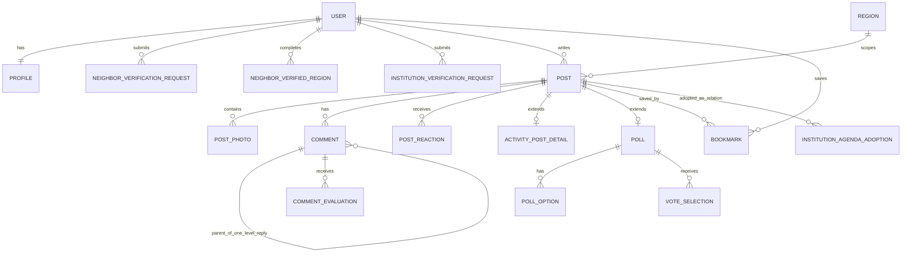
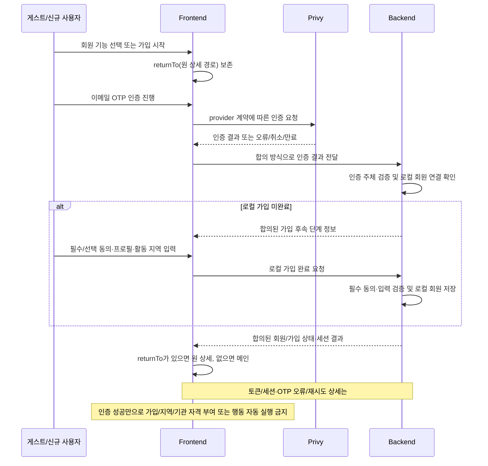
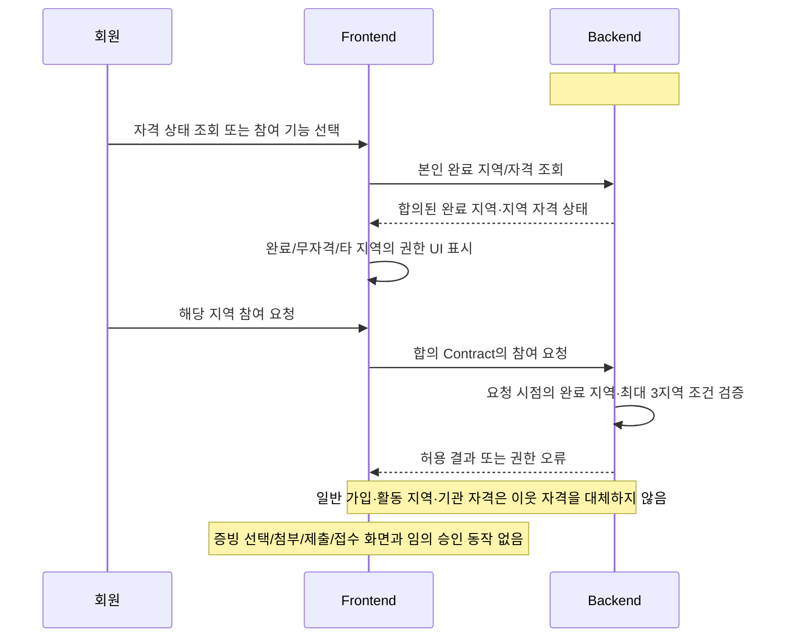
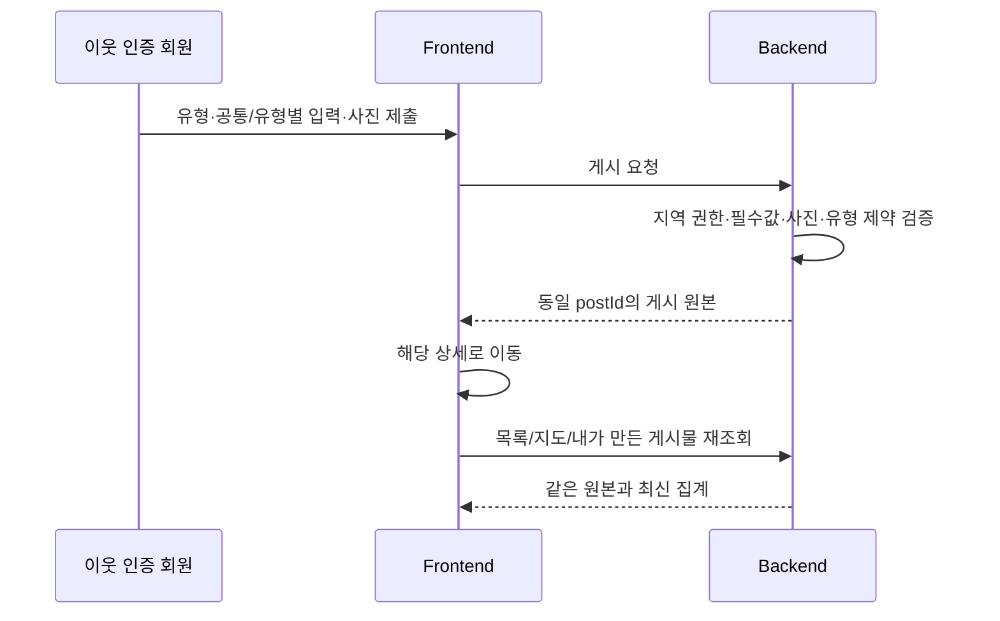
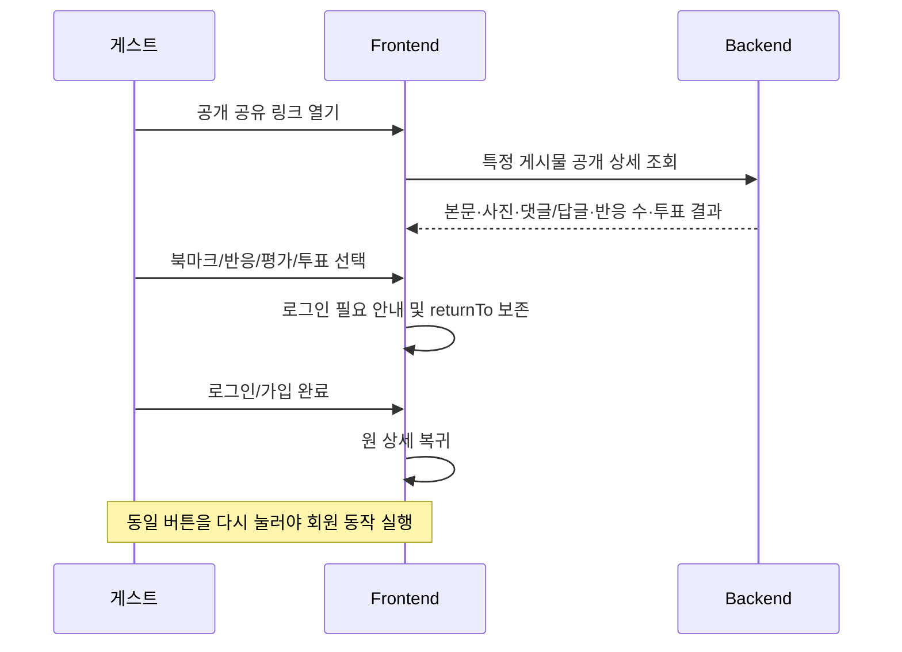
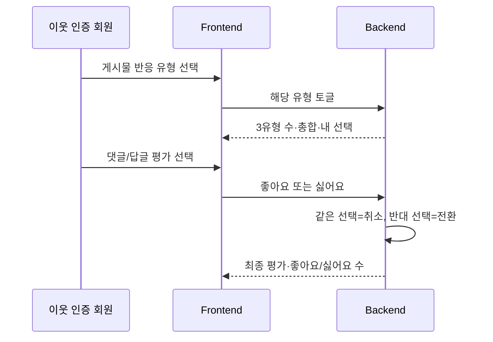
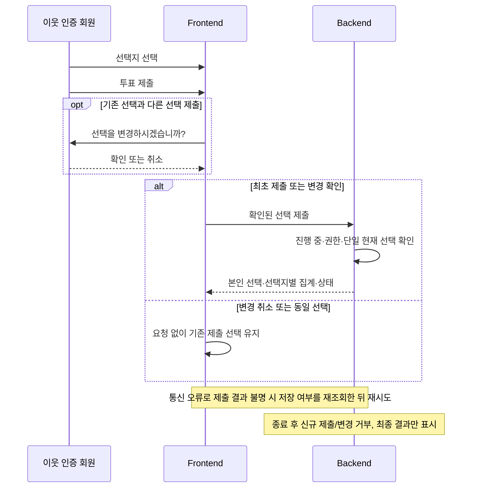
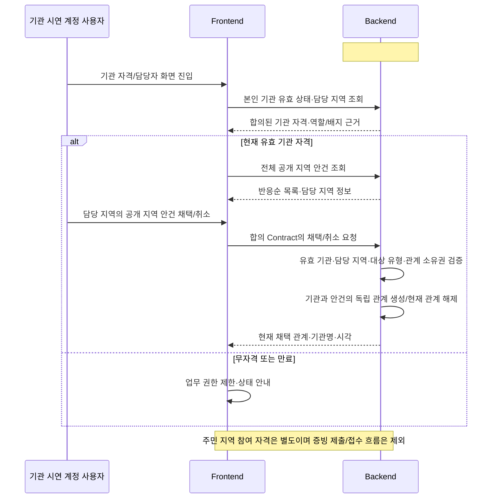

# Discushion MVP 백엔드·프론트엔드 통합 지침서

## 2026-10-07 결정 반영

현재 저장소의 재정렬된 PRD·기능명세 v10.2와 최신 유저플로우를 적용한다. 이전 본문·예시·제외 표보다 최신 확정 정책과 FE 복구 범위가 우선한다. 제품 범위·서비스 선택, FE 화면/Mock 구현, BE 계약·API·업무 로직, 실제 Integration 완료를 구분한다. develop 브랜치는 현재 코드 상태 확인용이며 제품 범위를 줄이는 기준이 아니다. 기존 기능 ID와 문서 파일명·경로를 유지한다.

- **계정:** Privy 이메일 OTP로 인증·로그인한다. 최초 사용자는 필수/선택 동의·프로필·활동 지역을 완료해 로컬 회원으로 가입한다. 자체 비밀번호 설정·확인·로그인과 자체 가입 코드 발급은 대체한다. OTP 세부 제한과 토큰/회원 연결 계약은 #74에서 합의한다. `returnTo`를 전체 과정에서 보존하고 복귀만으로 참여·북마크를 자동 실행하지 않는다.
- **이웃 자격:** 증빙 선택·첨부·신청 제출·접수·실제 인증 처리는 이번 MVP에서 제외한다. 별도 시연용 계정의 완료 지역을 서버에 준비하고 상태 조회·최대 3지역·해당 지역 참여 자격은 유지한다. 일반 가입·Privy 로그인·활동 지역 설정·기관 자격만으로 이웃 자격을 부여하지 않는다. 계정 준비는 #75, 조회 계약은 #74/#11을 따른다.
- **기관 자격:** 기관 증빙 입력·첨부·자료 제출·접수·실제 심사는 이번 MVP에서 제외한다. 별도 시연용 계정의 기관 정본·담당 지역·유효기간/완료 상태를 준비하고 현재 유효 상태 기반 역할·배지·업무 권한은 유지한다. 기관 자격이 주민 참여의 이웃 자격을 대신하지 않는다. 계정 준비는 #75, 조회 계약은 #74/#12를 따른다.
- **사진:** 게시물 사진은 Supabase Storage에 저장하며 회원·게스트·사진 URL을 아는 앱 외부 사람 모두 열람할 수 있다. JPG/PNG·최대 10장·게시물 합계 10MB를 유지한다. 사진 제거·교체 및 게시물 전체 삭제 시 해당 저장 파일을 지운다. 미완료 업로드는 임시 보관 후 24시간이 지나면 정리한다. 업로드 권한·최종 연결·bytes 환산·삭제 보상·24시간 기준시각/정리 간격/경합·임시 파일 공개 시점은 #74/#13/#30에서 합의한다. 미완료 사진의 24시간 정리는 게시물 초안 보관기간이 아니다. 세 작성 양식의 임시 저장 버튼·완료/실패·입력 유지 UI는 FE 대상이고, 실제 초안 서버 보관·복구 계약은 별도 확인한다.
- **AI:** Google Gemini 3.5 Flash-Lite 선택. 공개 지역 안건 원문 기반 3문장 한 문단·원문 fallback은 유지한다. 실제 API 모델 ID·사용 가능 여부·키/요금·생성/저장/재생성/재시도 기준은 #20/#30에서 확인·합의한다.
- **진행:** 완료된 #2의 변경 후속은 #74, 별도 시연용 계정은 #75. 지역·기관·소유권·게스트 공유 범위는 유지한다. 자체 비밀번호·자체 가입 코드 흐름은 복구하지 않는다. 이메일 변경·회원 탈퇴 화면은 FE에 복구하며 본인/이메일 확인은 Privy를 사용한다. 실제 Provider 지원·로컬 회원 갱신·세션/탈퇴 계약은 확인 필요다. 증빙 첨부 기능 ID `S-JRMYIV`는 변경 이력으로 유지하되 현재 MVP에서 제외한다.

> 문서 개정일: 2026-10-07 / 제품 기준: 현재 저장소의 PRD·기능명세서 v10.2 / 통신 기준: 최신 API SPEC 및 실제 합의 Contract (실구현·연동 별도 확인)
> 제품 기능·권한·MVP 포함 여부의 근거: `Discushion_PRD_2026-10-07_MVP반영_정리본_v10.2.md`, `Discushion_기능명세서_2026-10-07_MVP반영_정리본_v10.2.md`
> 표기: **[확정]**은 두 기준 문서에서 MVP로 명시된 정책, **[권장안]**은 확정 정책을 만족시키기 위한 기술적 설계 제안, **[확인 필요]**는 해당 정책·계약의 담당자가 결정하거나 FE/BE가 합의해야 할 항목이다. 확인이 필요한 데이터 연결만 보류하고 독립 구현 가능한 FE 작업은 계속한다. 권장안은 제품 정책을 새로 만드는 근거가 아니다.
> 이번 개정: 최신 FE 복구 범위를 기능표·책임·사용자 흐름·화면 상태·QA에 동기화했다. Design / FE / BE / Integration의 네 상태 축과 제품 포함/제외 정책을 구분한다. Backend 범위를 이 문서만으로 확대하거나 구현 완료 처리하지 않는다.

## 1. 문서 목적 및 적용 범위

### MVP 목표

해커톤 MVP는 주민 회원이 지역 콘텐츠를 탐색하고, **이웃 인증이 완료된 지역에서만** 게시·참여하며, 공유 링크 게스트는 받은 특정 공개 게시물 안에서만 열람·댓글/답글을 할 수 있게 하는 통합 구현 기준이다. 세 게시물 유형(지역 안건, 지역 활동 정보, 투표)은 하나의 게시물 원본을 공유한다. 기관 인증 완료 사용자는 전체 공개 지역 안건을 열람하고 담당 지역의 안건을 기관 관계로 채택할 수 있다. [확정]

### 참조 문서와 우선순위

| 순위 | 판단 대상 | Source of Truth 및 적용 기준 |
| --- | --- | --- |
| 1 | 제품 기능·사용자 경험·권한 | 현재 저장소의 최신 [기능명세서 v10.2](./Discushion_기능명세서_2026-10-07_MVP반영_정리본_v10.2.md): 확정 정책·범위 대조·기능 ID별 명세 |
| 2 | 제품 기능·MVP 범위 | 현재 저장소의 최신 [PRD v10.2](./Discushion_PRD_2026-10-07_MVP반영_정리본_v10.2.md) |
| 3 | FE 화면·시각 구현 | Figma `KW 해커톤 디자인`의 [최종디자인](https://www.figma.com/design/Wobmrjd8xSUNKQISplV5aR?node-id=1136-6698) |
| 4 | FE 사용자 이동·상태·복귀 | 최신 [유저플로우](./Discushion_유저플로우_와이어프레임기반_2026-10-06.md): 본문과 현재 정책 적용 안내를 따르며 접힌 과거 원문은 추적용이다. |
| 5 | 공통 시각 규격 | [최종디자인 디자인기준 v2](../design/Discushion_최종디자인_디자인기준%20v2.md) |
| 6 | 기존 제외에서 복구된 FE 범위 | `Discushion_NON-MVP_FE_복구목록_2026-10-07.md`의 17개 복구 항목과 검색·현재 위치 보조 2항목. 아래 확인 한계를 함께 기록한다. |
| 7 | FE 현재 구현 상태 | 작업 시점 최신 `front/develop`의 실제 코드·SHA·검증 결과 |
| 8 | BE 현재 구현 상태 | 작업 시점 최신 `back/develop`의 실제 코드·SHA·검증 결과 |
| 9 | FE-BE 통신 계약 | 최신 [API SPEC](../api/Discushion_API_SPEC_v2.md) 및 합의 Contract: Endpoint·DTO·nullable·Enum·인증·오류·합의 여부를 확인한다. |

**참조 확인 한계:** 이번 작업 시 저장소에서 FE 복구목록 파일을 찾지 못했다. 해당 파일을 새로 만들지 않고 첨부 요청의 전체 항목, 최신 PRD·기능명세의 복구 대조표, 최신 유저플로우와 Figma metadata로 17+2항목을 대조했다. 복구목록 파일 자체의 직접 대조 완료는 주장하지 않는다.

기능·권한·MVP 정책은 1~2를 따른다. 화면은 3~5와 복구 범위 6을 적용한다. 과거 Figma와 최신 확정 동작이 다르면 필요한 UI를 수정한다. 예를 들어 I04의 반응 종류별 조회는 현재 유형별 필터로 대체한다. 명시적으로 대체·제거한 자체 비밀번호/자체 가입 코드·증빙 제출은 복구하지 않는다. 해결되지 않는 정책 충돌은 영향받는 항목만 확인하고 독립 가능한 FE 작업을 계속한다. 기술 권장안과 미합의 API/DB 설계를 제품 정책으로 확정하지 않는다.

### 구현 상태 판단 기준

**Backend 미구현 ≠ Frontend 미구현. Backend API 미구현 ≠ Frontend 구현 보류.** 제품의 포함/제외 정책을 먼저 확인한 뒤 구현 상태는 다음 네 축으로 기록한다. 주체 없는 `미구현`으로 묶지 않는다.

| 판단 축 | 상태 | 확인 근거 |
| --- | --- | --- |
| Design | `존재` / `미존재` | 최종디자인의 대응 Frame·상태·흐름. 디자인 존재가 코드 완료를 뜻하지 않는다. |
| Frontend | `FE 구현 대상` / `FE 구현 완료` / `FE 부분 구현 / 수정 필요` / `FE 신규 구현 필요` | Route·Page·Component·상태·사용자 흐름과 실제 검증. 공통 기반만으로 개별 화면 완료를 선언하지 않는다. |
| Backend | `BE 구현 완료` / `BE 부분 구현` / `BE API 미구현` / `BE 업무 로직 미구현` / `BE 계약 확인 필요` | Controller·Service·인증/권한·저장/조회·업무 로직과 검증. 계약 문서나 Issue 존재만으로 완료를 선언하지 않는다. |
| Integration | `Mock/Contract` / `실 API 연동 대기` / `Integration 완료` | 데이터 원천과 연결 범위, 실제 요청/응답·인증·권한·저장/재조회·오류 검증. Mock, Health Check, 개별 build는 실제 Integration 완료 근거가 아니다. |

`FE 구현 대상`은 범위 판단이고, 신규/부분/완료는 코드 진행 상태다. `BE API 미구현`과 `BE 업무 로직 미구현`, `BE 계약 확인 필요`는 함께 기록할 수 있다. 확인하지 않은 상태는 해당 축에 `확인 필요 / 미검증`을 붙인다. 제품에서 명시적으로 제거·대체한 범위는 별도 `제품 예외 / FE·BE 구현 제외`로 적으며 API 부재와 혼동하지 않는다.

| 완료 구분 | 필요한 증거 | 남은 작업의 표기 |
| --- | --- | --- |
| FE Mock 구현 완료 | Figma UI, 사용자 Flow, Client State, Loading/Empty/Error, Mock Success/Failure·Retry, 권한 제한 UI, 화면 이동·복귀·입력 보존을 코드와 검증으로 확인 | `FE 구현 완료 (Mock 검증) / Integration: Mock/Contract, 실 API 연동 대기` |
| FE-BE Integration 완료 | 실 API·실제 인증/권한·실제 저장과 재조회·실제 오류 계약·대상 사용자 흐름을 검증 | `Integration 완료`와 환경·SHA·실행일·검증 결과를 기록 |

Mock 단계라는 이유로 FE를 신규 구현 상태로 되돌리지 않으며, Mock 성공을 서버 저장·실제 권한·전체 기능 완료로 표시하지 않는다. Contract도 없다면 확정 화면 상태의 개발용 Mock 가정을 명시하고 별도 API 정본으로 만들지 않는다.

### Frontend 구현 대상과 병렬 구현 원칙

**Figma 최종디자인에 존재 → FE 구현 대상. BE API 없음 → BE API 미구현. Figma 있음 + BE 없음 → Mock/Contract 기반 FE 선행 구현 + 실 API Integration 대기.** 최신 정본에서 명시적으로 제거·대체한 제품 예외만 구분한다. Backend API 또는 업무 로직이 아직 구현되지 않은 MVP 기능도 FE 구현 대상에서 제외하지 않는다. 화면·기능 자체가 FE 코드에 없으면 신규, 기존 화면의 누락이면 부분 구현/수정 필요다.

| 제품·디자인·코드 조건 | FE 작업 판단 |
| --- | --- |
| Figma에 있음 + 최신 MVP 포함 | FE 구현 대상이다. 최신 FE 코드를 확인해 신규/수정/완료를 판정한다. |
| Figma에 있음 + 최신 MVP 제외 | `제품 예외 / FE 구현 제외`다. 자체 비밀번호·자체 가입 코드·증빙 제출의 폐기 흐름만 유지한다. 복구된 알림·설정·계정 화면을 과거 제외 판단으로 되돌리지 않는다. |
| 최신 MVP 포함 + Figma 있음 + FE 코드 없음 | `FE 신규 구현 필요`로 기록하고 독립 구현 가능한 화면부터 진행한다. |
| 최신 MVP 포함 + Figma 있음 + FE 일부 구현 | `FE 부분 구현 / 수정 필요`로 기록하고 기존 공통 기반을 재사용해 완성한다. |
| 최신 MVP 포함 + BE API 없음 | FE 상태와 별도로 `BE API 미구현`, Integration은 `실 API 연동 대기`로 기록한다. FE는 합의 Contract/Mock 기반으로 진행한다. |

BE API가 준비되지 않은 경우 합의된 API Contract와 기존 Mock API Client·Mock data/provider를 사용한다. FE는 Route·Page·Layout·공통/도메인 Component, 사용자 입력·Client State, Loading/Empty/Error/Success/Failure/Retry/Disabled/Pending·권한 제한, Figma에 맞는 Modal/BottomSheet, 클릭·Navigation·뒤로가기·`returnTo`, 입력/필터/스크롤 보존과 Mock 데이터 변화을 가능한 범위까지 구현한다. 구현할 Route 이름·DTO·라이브러리는 기존 코드와 합의 기준을 확인한다.

Contract도 미확정이면 경로·DTO·세션 전달·권한 코드·nullable을 추측해 만들지 않는다. 해당 데이터 연결만 확인 대기로 두고, 확정된 화면 구조·입력·상태·내비게이션은 계속 구현한다. 합의된 Contract가 준비되면 같은 Service/Provider 경계에 Mock을 주입하고, 실제 API 준비 후 별도 Integration 작업에서 구현체를 교체·연결한다. Mock 성공을 서버 저장이나 실제 권한 검증 성공으로 표시하지 않는다.

기능별 기록 예: `FE 상태: FE 신규 구현 필요 / BE 상태: BE API 미구현 / 현재 FE 작업: 합의 Contract·Mock 기반 구현 진행 / Integration 상태: 실 API 연동 대기`. Design은 대응 Frame과 정책 차이를 별도로 기록한다.

### Frontend 현재 코드와 Figma가 다른 경우의 판정

최신 `front/develop`은 Frontend의 **현재 구현 상태를 확인하기 위한 기준**이지, 구현해야 할 화면의 최종 정답이 아니다. 최종 구현 요구사항은 최신 PRD/기능명세와 Figma `최종디자인`을 기준으로 판단한다.

최신 MVP에 포함된 화면에서 Figma와 현재 `front/develop`이 다른 경우에는 다음 기준을 적용한다.

- Figma에는 있으나 Frontend에 없는 요소 → 기존 화면의 누락이면 `FE 부분 구현 / 수정 필요`, 해당 화면·기능 자체가 없으면 `FE 신규 구현 필요`로 판정한다.
- Figma보다 Frontend 요소가 부족한 경우 → Frontend 누락으로 판정한다.
- Figma와 Frontend의 항목 수·아이콘·배치·화면 상태가 다른 경우 → 디자인 기준에 맞게 Frontend를 수정할 대상으로 기록한다.
- Backend API 미구현 여부를 이러한 UI 누락의 정당화 근거로 사용하지 않는다.

**BottomNavigation 최종 기준은 메인·지도·글쓰기·알림·마이의 독립된 5개 메뉴다.** 공통 노드 `1255:6597`과 헤더 `1255:6584`를 기준으로 알림 진입을 제공한다. 현재 FE가 4개라면 `FE 부분 구현 / 수정 필요`이며 알림 누락을 Backend 부재로 정당화하지 않는다. 공유 상세 게스트에게 일반 하단 내비게이션을 노출하지 않는 권한 규칙은 유지한다.

반대로 Figma에 남아 있더라도 최신 PRD/기능명세에서 MVP 제외된 요소는 Frontend에 추가하지 않는다.

### 작성 시점 기준 확인 결과 — 영구 제품 정책이 아님

아래 FE/BE SHA와 코드 상태는 이전 조사에서 기록한 2026-10-07 snapshot이다. 이번 문서 동기화에서 원격 코드·실행 상태를 새로 검증한 결과로 표시하지 않는다. Figma metadata는 이번 작업에서 다시 조회했다. 다음 구현 작업에서는 최신 develop과 검증 근거를 갱신하며 아래 상태를 영구 제품 정책으로 고정하지 않는다.

| 확인 대상 | 근거 | 확인 결과와 의미 |
| --- | --- | --- |
| FE `front/develop` (`4f4f4d5`) | `frontend/src/app/page.tsx`, `layout.tsx`, `components/`, `lib/api/` | 루트는 빈 Page이며 공통 UI·디자인 토큰과 API Client·오류·Mock·Provider 기반이 있다. 개별 제품 화면은 이 코드에서 확인되지 않으므로 MVP 대응 화면은 `FE 신규 구현 필요`다. 공통 기반은 개별 기능 완료의 증거가 아니다. |
| BE `back/develop` (`dad35c0`) | `backend/src/main/java/`의 Application·HealthController 및 실행 설정 | `/health`와 실행 환경이 있고 제품 기능의 인증·권한·저장/조회 API/서비스는 이 코드에서 확인되지 않는다. 해당 제품 API는 `BE API 미구현`이며 Privy/파일 등의 상세 계약은 별도 확인한다. |
| Design | Figma `최종디자인` 페이지 `1136:6698`의 metadata 직접 조회, 디자인기준 v2 | 157개 화면 Frame과 공통 UI를 확인했다. 예: 시작 `1157:905`, 메인 `1159:1694`, 통합게시판 `1159:2244`, 상세 `1160:2463`. 최신 기능명세의 분류는 일반 FE 108개 + Privy 대체 적용 27개 = FE 목표 135개, 제품 예외 22개(자체 비밀번호 17개·J 증빙 5개)다. 알림은 FE 대상이다. metadata 확인은 전 화면의 시각 QA 완료를 뜻하지 않는다. |
| Integration | 위 FE/BE 코드와 기능 연결 여부 대조 | 공통 Mock 경계·테스트 코드 존재는 확인했으나 개별 기능의 Mock 연결과 실제 FE-BE 연결은 확인되지 않았다. 제품 기능은 `실 API 연동 대기`이며 이번 문서 수정에서 실행·연동 검증을 수행한 것으로 기록하지 않는다. |

### 포함/제외 범위 요약

| 구분 | FE 구현 범위 | BE·Integration 별도 확인 | 제품 예외·금지 범위 |
| --- | --- | --- | --- |
| 계정·설정 | Privy OTP, 로컬 동의·프로필·활동 지역·returnTo, 설정·개인 목록 재진입·계정 정보·현재 기기 로그아웃·Privy 이메일 변경/탈퇴 | Provider 지원·세션/로컬 회원 연결·이메일 동기화·탈퇴 데이터 처리 | 자체 비밀번호 로그인/복구/변경·자체 가입 코드, 다크 모드 |
| 탐색·추천 | 메인·지도·목록·자유 검색·지역 후보 선택·추천 카드/이유/새 추천·관심 지역/키워드 | 검색·위치 후보 계약·추천 산출·관심 정보 영속 저장 | 별도 인기글 선정, 지속 GPS 추적·지도 실시간 위치·자동 이웃 인증 |
| 게시물 | 세 유형 작성·수정·삭제·상세·사진, 참고 링크·허용 범위 익명·임시 저장 상태·선택적 투표 종료 전 알림 | 원본 저장·권한·파일 처리·링크/익명 저장·초안 보관/복구·예약 실행/발송 | AI 이미지, 기관 사용자/활동 정보 익명 작성, 종료 투표 수정/삭제 |
| 참여·알림 | 댓글/답글·반응·평가·투표·북마크·개인 기록·신고·알림/활동/읽음·단일 Push 수신 설정 | 실 접수·중복 처리·알림 생성/조회/읽음·수신 저장·Push 및 심사 로직 | 게스트 회원 전용 행동·일반 탐색, 운영자 심사/제재 화면 |
| 자격·기관 | 완료 이웃 지역·유효 기관 상태/담당 지역·배지·권한 UI·기관 채택/취소 | 시연 자격 정본·실제 서버 권한·채택 관계·알림 연계 | 증빙 입력/첨부/신청/제출/접수·실제 심사, 외부 행정 연동·채택 후 행정 단계 |
| AI 요약 | 공개 안건 요약·원문/출처·Loading/Error/Retry·fallback | 실제 Gemini 호출·생성/저장/버전·실 API 모델 ID | AI 이미지 생성·원문 외 사실 추가 |

추천·관심 정보·알림·신고·작성 보조의 서버 개발 후순위는 **BE 상태**이며 FE 제외 목록이 아니다. API SPEC의 `비-MVP / 후순위`는 해당 API·서버 업무의 구현 범위와 우선순위로 해석하며, Frontend 화면·입력·상태·Mock 사용자 흐름의 제외를 뜻하지 않는다. FE 범위는 최신 PRD·기능명세와 FE 구현 기준으로 판단한다. FE 복구를 이유로 API SPEC을 변경하거나 Backend 구현 범위를 확대하지 않고, 미준비 API는 Mock/Contract 기반 FE 선행 구현 후 실 API Integration 대기로 기록한다. `일부 포함`은 최신 정본에 적힌 UI·권한 범위를 뜻한다. 이 문서 수정만으로 미합의 Endpoint·DTO·DB Schema·Backend 개발 일정을 확정하지 않는다.

## 2. 도메인 및 권한 모델

### 사용자 상태, 역할, 인증 상태, 지역 권한의 관계

**[확정]** 게스트는 계정 역할이 아니다. 로그인하지 않은 공유 링크 방문자라는 접근 컨텍스트다. 로그인 회원은 기본적으로 공개 콘텐츠를 열람할 수 있으나, 지역 참여는 해당 게시물 지역의 이웃 인증 완료 여부가 필요하다. 기관 인증은 이웃 인증을 대체하지 않는다.

| 구분 | 판정 입력 | 파생 결과 |
| --- | --- | --- |
| 주민 회원 | 로그인 세션/계정 | 메인·목록·지도·마이 접근, 본인 데이터 조회 가능 |
| 이웃 인증 완료 | 회원 + 완료 지역(최대 3개) | 그 지역에서 게시, 댓글/답글, 반응, 댓글 평가, 투표 제출 가능 |
| 기관 인증 완료 | 회원 + 현재 유효한 완료 상태 + 담당 지역 | 기관 역할, 파란 배지, 담당자 안건 목록 접근, 담당 지역 안건 채택 가능 |
| 공유 링크 게스트 | 공개 게시물의 유효한 공유 진입 | 그 **특정 게시물 상세**의 공개 본문·사진·댓글/답글·반응 수·투표 결과 열람 및 게스트 댓글/답글 가능 |

기관 상태 조회 실패·미확인 시 승인 배지를 임의 표시하지 않고 재조회/권한 제한을 제공한다. 기관 배지는 별도 저장 플래그가 아니라 현재 유효한 기관 인증 완료 상태에서 파생한다. 기관 인증의 1년 유효기간 정책은 유지하며, 만료 시 기관 전용 접근과 과거 작성물의 배지를 제거한다. 일반 회원으로서의 게시 권한은 유지하되, 지역 참여에는 여전히 이웃 인증이 필요하다. [확정]

기관 인증 사용자(민원담당자)는 실제 민원 업무 담당자만을 의미한다. 단순 학교·기관 소속 학생이나 실제 민원 업무 담당자가 아닌 일반 직원에게 기관 권한을 부여하지 않는다. 실제 심사 UI는 비-MVP이나, 이 기준은 시연용 완료 상태를 설정하거나 역할을 설명할 때도 변경하지 않는다. [확정 정책·심사 UI 비-MVP]

### 주민 회원/게스트/기관 인증 사용자별 접근 가능 기능

| 기능 | 주민 회원(이웃 미완료/타 지역) | 해당 지역 이웃 인증 회원 | 공유 링크 게스트 | 현재 유효 기관 인증 완료 사용자 |
| --- | --- | --- | --- | --- |
| 메인·통합 게시판·전체 지도 | 가능 | 가능 | 불가 | 가능 |
| 공개 상세 열람 | 가능 | 가능 | 공유받은 특정 게시물만 | 가능 |
| 게시물 작성·수정·삭제 | 불가(대상 지역 기준) | 본인 게시물, 유형 규칙 내 가능 | 불가 | **담당 지역과 무관하게** 이웃 인증을 완료한 해당 지역에서 동일 적용 |
| 댓글·답글 | 불가(대상 지역 기준) | 가능 | 공유 링크의 특정 공개 게시물에서만 가능 | 이웃 인증 완료 지역에서만 가능 |
| 게시물 반응·댓글 평가·투표 | 불가 | 가능 | 불가; 로그인 안내 | 이웃 인증 완료 지역에서만 가능 |
| 북마크 | 로그인 회원이면 가능 | 가능 | 저장 불가, 로그인 안내 | 가능 |
| 추천·관심 정보·알림·설정·계정 | 로그인 본인 범위 가능 | 동일 | 불가; 회원 진입 안내 | 본인 범위 가능 |
| 신고 | 로그인 회원의 상세 진입 | 동일 | 회원 전용 진입 안내 | 동일; 실제 접수 계약은 별도 |
| 기관 안건 목록 | 불가 | 불가 | 불가 | 전체 공개 지역 안건 열람 가능 |
| 기관 채택 | 불가 | 불가 | 불가 | 담당 지역의 공개 **지역 안건**만 가능 |

게스트가 반응·평가·투표·북마크를 누르면 `로그인이 필요한 기능입니다.`를 안내하고 로그인/가입 흐름으로 이동한다. 복귀 후에는 원 동작을 자동 실행하지 않는다. [확정]

### 지역별 이웃 인증 및 기관 담당 지역의 권한 판정

| 작업 | 백엔드 필수 조건 | 프론트엔드 선행 안내 |
| --- | --- | --- |
| 게시, 댓글/답글, 반응, 댓글 평가, 투표 제출 | 로그인 회원이고 `post.regionId`가 사용자의 이웃 인증 완료 지역 | 미완료/타 지역은 참여 불가 상태를 표시하되 서버 거부를 대체하지 않음 |
| 공유 링크 게스트 댓글/답글 | 요청이 유효한 공개 공유 상세 컨텍스트이고 해당 게시물에 한정 | 작성자명 `게스트`, 로그인·전화번호 인증 요구 없음 |
| 기관 안건 열람 | 현재 유효 기관 인증 완료 | 담당 지역 밖도 열람 가능 |
| 기관 채택/취소 | 현재 유효 기관 인증 완료 + 대상이 공개 지역 안건 + 대상 지역이 담당 지역 + 본인 기관 관계 | 담당 지역 밖/다른 유형에는 채택 UI 비활성 또는 미노출 |

### 프론트엔드 가드와 백엔드 권한 검증의 책임 분리

| 층 | 책임 |
| --- | --- |
| 프론트엔드 | 세션과 합의된 권한 응답(`capabilities` 등 실제 Contract)을 사용해 버튼/입력 상태를 표시한다. 게스트의 회원 기능 시도에는 안내와 안전한 `returnTo`를 보존한다. 확인 대화상자(투표 변경)를 표시하고, 일반 요청 실패 시 낙관 상태를 되돌린다. 투표 제출 결과를 알 수 없는 통신 오류는 재조회로 저장 여부부터 확인한다. |
| 백엔드 | 요청 시점에 로그인, 공유 상세 범위, 공개/삭제 상태, 이웃 인증 완료 지역, 기관 인증 유효성·담당 지역, 작성자 소유권, 투표 종료를 재검증한다. 클라이언트 전달 `regionId`, 배지, 역할을 신뢰하지 않는다. |
| 공통 계약 | 상세/목록 응답은 화면이 재추론하지 않도록 본인 선택·집계·권한 가능 여부를 반환한다. 권한 오류의 사유 코드는 UI가 로그인 유도와 이웃 인증 안내를 구분하는 데만 사용한다. [권장안] |

FE는 Figma 기반 화면·사용자 흐름·Client State, 권한에 따른 노출/비노출/비활성, Loading/Empty/Error 및 Mock/Contract 기반 병렬 구현을 담당한다. 실제 API가 준비되면 Service/Provider 경계에서 교체·연결한다. BE는 실제 데이터 정본, 인증/세션과 권한 검증, DB 저장/조회·API·서버 Validation, 동시성·데이터 무결성, 실제 AI 처리와 파일 저장/삭제 및 권한·보안의 최종 강제를 담당한다.

**FE 권한 UI는 BE 권한 검증을 대체하지 않는다. 반대로 BE 권한 검증이 아직 준비되지 않았다는 이유로 FE 화면 구현을 중단하지 않는다.** 권한 Mock은 FE 상태 검증용이며 실제 서버 권한 부여의 근거가 아니다.

## 3. 핵심 도메인 모델 및 데이터 설계 지침

### 엔터티 목록과 책임

아래는 기존 개념 모델의 책임 설명이며 실제 Schema/Migration 확정안이 아니다. 복구된 추천·관심·알림·신고·초안·계정 UI는 FE ViewModel/Mock으로 구현할 수 있다. 해당 UI를 근거로 서버 테이블·Column·Relation을 추가하지 않는다. 영속화·이벤트·탈퇴 연결 정리는 BE1과 별도 계약 정본에서 확인한다.

| 엔터티 | 책임 및 연결 |
| --- | --- |
| User / Profile | Privy 인증 주체·로컬 회원 연결/가입 완료 상태와 공개 프로필(사진, 닉네임, 한 줄 소개, 복수 이웃 속성, 기본 활동 지역)을 분리한다. 식별자/연결 상세는 #74 합의 대상이며 자체 비밀번호 저장을 요구하지 않는다. |
| Region | 활동/탐색/인증/게시물/기관 담당 지역이 참조하는 지역 식별자다. 동 단위 지도 데이터와 연결한다. |
| NeighborVerifiedRegion | #75 시연 계정의 사용자별 이웃 인증 완료 지역을 연결하고 최대 3지역·지역 참여 자격의 근거로 쓴다. 신청/증빙/접수 구조는 이번 MVP에서 제외한다. |
| InstitutionCredential | #75 시연 계정의 기관 정본·담당 지역·유효기간/완료 상태를 참조하고 현재 유효한 역할/배지·업무 권한의 근거로 쓴다. 신청/증빙/접수 구조는 이번 MVP에서 제외한다. |
| Post | 세 게시물 유형의 공통 원본: 유형, 주제, 지역, 제목, 본문, 작성자, 게시/삭제 상태, 시각. |
| ActivityPostDetail | 활동 정보 전용: 출처, 일정, 장소, 활동 상태, 선택적 외부 참여 링크. |
| Poll / PollOption / VoteSelection | 투표 질문·선택지·종료 일시와 회원별 현재 선택을 분리한다. |
| PostPhoto | 게시물 사진의 정렬 순서와 파일 참조를 보관한다. |
| Comment | 부모 댓글 또는 1단계 답글, 대상 사용자 표시, 공개 작성자명, 게스트/회원 작성 주체를 보관한다. |
| PostReaction | 회원-게시물-반응유형의 독립 반응 관계다. |
| CommentEvaluation | 회원-댓글/답글-평가(좋아요/싫어요)의 상호배타 관계다. |
| Bookmark | 회원-게시물 저장 관계다. |
| ActivityEvent | 실제 행동 횟수와 참여 목록을 재구성하는 원본 행동 기록이다. [권장안: 아래 규칙을 만족하는 방식이면 구현체는 자유] |
| InstitutionAgendaAdoption | 기관-지역 안건-채택 사용자-채택 시각의 독립 관계이며 취소 이력을 보존한다. |
| AiAgendaSummary | 공개 지역 안건 원문과 생성 상태·생성 시각·요약 결과를 연결한다. |

### 연결 구조

아래 기존 개념 ER 도식은 이번 작업에서 변경하지 않았다. `NEIGHBOR_VERIFICATION_REQUEST`·`INSTITUTION_VERIFICATION_REQUEST` 관계는 이전 범위의 참조이며 현재 MVP의 신청/증빙/접수 구현 요구가 아니다. 현재 포함 범위는 위 엔터티 책임과 v10.2를 따른다. 실제 DB Schema/ERD·식별자·Relation·Migration의 확정·변경은 BE1과 별도 계약 정본에서 다룬다.

### 엔터티별 핵심 필드, 상태값, 식별자, 제약조건

| 엔터티 | 핵심 필드/상태 | 필수 제약 |
| --- | --- | --- |
| User/Profile | 로컬 회원·Privy 주체의 합의된 식별/연결 정보, 등록 이메일, 가입 완료 상태, 닉네임(중복 불가·최대 10자), 소개(최대 50자), 기본 활동 지역, 이웃 속성(거주자/학생/직장인/상인 복수) | 인증·로컬 가입·공개 프로필을 구분; #74의 식별자/중복 처리/nullable 계약을 추측하지 않음; 이웃 속성은 권한/배지를 부여하지 않음 |
| Post | `postId`, `type`(지역 안건/지역 활동 정보/투표), `topic`(7개), `regionId`, 제목, 본문, `authorId`, 게시/삭제 상태, 작성/수정 시각 | `전체`는 저장값이 아님; 유형·주제·지역은 하나씩; 삭제 게시물은 공개 상세 불가 |
| ActivityPostDetail | `postId`, 출처, 일정, 장소, 활동 상태(예정/진행/종료/취소), 외부 링크 | 출처·일정·장소·상태 필수, 상태 기본값 없음; 종료/취소 시 외부 링크 비활성 |
| Poll/PollOption | `postId`, 질문, 종료 일시, 선택지 식별자/내용, 진행/종료 | 선택지 2~10개; 진행 중 작성자는 제목·본문·사진·참고 링크·종료 일시와 선택적 알림 설정을 수정; 질문·선택지·지역·주제 불가; 종료 후 수정/삭제 불가 |
| PostPhoto | `photoId`, `postId`, 파일 참조, MIME, 크기, 첨부 순서 | JPG/PNG, 최대 10장, 게시물 전체 합계 최대 10MB; 첫 번째가 지도 썸네일 |
| Comment | `commentId`, `postId`, `parentCommentId`(답글만), `replyToDisplayName`(기존 답글에 답할 때), 본문, 작성 주체, 공개명, 시각 | 답글 깊이 1; 게스트 공개명은 정확히 `게스트`; 빈 내용 불가; 금칙어 사전 통과 뒤 즉시 공개; 게스트 댓글/답글은 가입 후 새 회원 계정으로 자동 이관하지 않음 |
| PostReaction | `postId`, `userId`, `reactionType`, 생성/변경 시각 | `(postId,userId,reactionType)` 유일; 3유형은 서로 독립·복수 가능 |
| CommentEvaluation | 대상 댓글/답글 식별자, `userId`, 평가 종류 | 한 회원-한 대상은 하나만; 반대 선택은 전환, 같은 선택 재클릭은 취소 |
| VoteSelection | `pollId`, `userId`, `optionId`, 제출 시각 | `(pollId,userId)` 유일; 종료 후 생성/변경 불가 |
| Bookmark | `userId`, `postId`, 등록 시각 | `(userId,postId)` 유일; 삭제 게시물 관계 자동 해제 |
| ActivityEvent | 사용자, 게시물, 행동 종류, 발생 시각 | 활동 +1 규칙을 반영; 현재 참여 표시와 행동 횟수는 별도 집계 |
| 이웃/기관 자격 | 사용자별 완료 지역, 기관 정본·담당 지역·유효기간/완료 상태 | 이웃 완료 지역 최대 3개; 유효 기관 자격과 이웃 자격은 독립; 증빙 제출/접수로 자격을 생성하지 않음 |
| InstitutionAgendaAdoption | 기관, 지역 안건, 채택 사용자, 채택 시각, 현재 유효 여부/취소 이력 | 게시물 상태를 변경하지 않음; 기관별 독립; 공개에는 기관명·채택 시각만 |

이웃/기관 증빙의 입력·첨부·제출·접수·실제 인증 처리와 파일 제한 검증은 이번 MVP의 FE/BE 구현 대상이 아니다. 변경 전 증빙 정책을 근거로 화면·업로드 DTO·신청 테이블을 추가하지 않는다. 시연 자격 저장/조회는 포함하며 상세 상태/필드/nullable은 #74/#11/#12/#75에서 확인한다.

### 집계값의 정의와 갱신 원칙

| 집계 | 정의 | 갱신/표시 원칙 |
| --- | --- | --- |
| 게시물 반응 수 | 공감해요 + 필요해요 + 궁금해요 | 투표 수·댓글 수와 별도; 지도/기관 목록은 이 합계를 참조 |
| 댓글 수 | 부모 댓글 + 답글 수 | 반응 수와 섞지 않음 |
| 댓글 좋아요/싫어요 | 대상별 현재 유효 평가 수 | 답글 좋아요는 부모 댓글 정렬에 합산하지 않음 |
| 투표 결과 | 선택지별 현재 선택 수, 득표율, 전체 참여자 수 | 다른 사용자의 개인 선택은 공개하지 않음 |
| 지도 대표 | 동별 지역 안건/투표 중 반응 수 최대, 동률 최신 | 활동 정보·댓글 수·투표 득표 수 제외; 반응 변경 후 재조회 시 재선정 |
| 개인 활동 횟수 | 아래 +1 행동의 누적 횟수 | 참여 게시물 카드 수와 다름 |

활동 횟수는 게시물 작성, 북마크 등록, 세 반응 각각의 등록, 댓글 작성, 답글 작성, 댓글 좋아요/싫어요, 답글 좋아요/싫어요, 투표 최초 참여에 각각 +1이다. 조회·수정·삭제·설정 변경·반응/평가 취소·평가 직접 전환·투표 선택 변경은 +0이다. 취소 뒤 같은 행동 재등록과 북마크 재등록은 다시 +1이다. [확정]

### 삭제·취소·전환 시 관계 및 집계 처리

| 사건 | 확정 처리 |
| --- | --- |
| 반응 재선택 | 해당 반응만 취소; 나머지 반응 유지; 반응 집계 갱신 |
| 댓글 평가 반대 선택 | 기존 평가 제거 후 반대 평가 적용; 활동 횟수 +0 |
| 댓글 평가 같은 선택 | 평가 취소; 활동 횟수 +0 |
| 투표 선택 변경 | 확인 후 기존 표 대체; 참여 1회 유지; 집계 원자적으로 재계산 |
| 투표 종료 | 신규 제출·변경 거부, 최종 결과만 표시; 실제 예약이 있으면 종료/삭제 시 취소하는 BE 로직을 별도 검증 |
| 투표 종료 일시 변경 | FE는 기존 알림 예약 취소·작성자 새 시점 재설정을 안내한다. 기존 간격으로 자동 이동하지 않으며 실제 취소/재예약은 BE·Integration 상태로 기록 |
| 회원 탈퇴 | FE는 게시물·댓글/답글 유지/탈퇴 사용자 표시(익명 유지), 반응·평가·투표 집계 유지·회원 식별 연결 제거, 북마크·개인 설정·활동 문의 이메일 제거를 안내한다. 실제 처리 순서·참조 무결성·세션 종료는 BE/Privy 계약 확인 필요 |
| 게시물 삭제 | 상세 콘텐츠 비공개; 북마크 자동 해제·목록 제거; 참여 투표 기록은 유지하되 상세는 접근 불가 안내와 함께 본문/선택지 재노출 금지 |
| 기관 채택 취소 | 해당 기관의 현재 표시/목록에서 제거, 다른 기관 채택 유지, 취소 이력 내부 보존 |

사진 제거·교체 및 게시물 전체 삭제 시 해당 Supabase Storage 파일을 지우는 것은 v10.2 확정 정책이다. 미완료 업로드는 24시간 후 정리하며 삭제 실패 보상·정리 기준시각/간격/경합은 #74/#13/#30에서 합의한다. 댓글·반응·투표 선택·활동 기록·채택 기록의 물리 삭제/비공개·보존 상세는 별도 확인한다. 공개 접근 차단과 명시된 북마크/투표 기록 처리는 유지하고, 사진 파일 삭제 정책을 미정 보존 항목으로 되돌리지 않는다.

### 데이터 무결성 규칙

- 모든 목록·상세·지도·개인 기록·기관 목록은 같은 `Post` 원본과 관계를 참조한다. 복제본으로 집계가 갈라지지 않게 한다. [확정]
- 반응, 북마크, 투표 선택, 댓글 평가는 유일 제약과 트랜잭션/원자적 갱신으로 중복 요청에도 일관되게 처리한다. [권장안]
- 게시물 수정/삭제는 작성자 소유권과 유형별 상태를 서버가 확인한다. 기관 채택은 게시물 작성 상태와 독립이다. [확정]
- AI 요약은 공개 지역 안건 원문에만 연결한다. 다른 유형·비공개 원문·원문 외 사실을 입력/출력 근거로 삼지 않는다. [확정]

## 4. 프론트엔드·백엔드 책임 매트릭스

아래 표는 각 기능에서 구현해야 할 FE/BE 책임이며 현재 구현 완료 목록이 아니다. 모든 행에 1절의 상태 판단 기준을 적용해 FE 코드·BE 코드·Integration을 따로 기록한다. BE API 미구현 시에도 합의된 Contract/Mock으로 해당 FE 책임을 진행한다.

| 기능 (영역/ID) | 화면·클라이언트 상태 | 서버 검증·저장 | 성공 응답/실패 처리 | 동시성·중복 요청 |
| --- | --- | --- | --- | --- |
| 가입 A / F-KZRSXU | Privy OTP·동의/프로필/지역·returnTo 보존 | 검증된 Privy 주체·로컬 가입 상태·필수 동의/프로필/지역 저장 | 인증과 로컬 가입 완료 분리·실패 시 상태 보존 | token/회원·OTP 오류 계약 #74 |
| 로그인 A / F-TSOXGG | Privy OTP·로그인 상태·returnTo | 토큰 검증·로컬 회원 상태 확인 | 기존 회원 복귀/미가입 후속 단계·자동 행동 금지 | #74 토큰/세션·오류 합의 |
| 권한 A,C,Y,Z,AA | `capabilities`, 게스트/회원 UI, 이웃·기관 상태 | 요청 시 지역·유효기관·담당지역 재판정 | 로그인 안내/권한 오류; 서버 상태 재조회 | 상태 변경 직후 최신 권한 응답 사용 |
| 작성 G,H,I / F-FTLHCX | 유형별 입력, 사진 큐, 저장 실패 시 초안 유지 | 이웃 인증, 필수 필드, 소유자 수정, 투표/활동 제약 | 원본 상세; 유효성 오류는 필드별, 저장 실패 재시도 | 게시 요청 중복 방지 키 [권장안] |
| 사진 / F-GSMCLD | 미리보기·교체·제거, 취소/실패 시 기존 입력 유지; 합의된 직접 업로드 흐름/상태 표시 | 권한·소유권·형식/개수/총량 검증, 원본과 최종 연결, 저장 파일 삭제·미완료 24시간 정리 | 합의된 파일 참조; 업로드 실패 시 해당 파일 미연결·기존 입력 유지 | 삭제 실패 보상·정리 경합 등 #74/#13/#30 합의, 최종 게시 시 서버 재검증 |
| 반응 K / S-HNVDPO | 3개 독립 선택 상태, 요청 중 버튼 | 로그인·이웃 인증·공개/삭제, 유형별 토글 | 유형별 수·총합·내 선택; 실패 시 낙관 갱신 롤백 | `(user,post,type)` 유일, 같은 유형 최종 상태 하나 |
| 댓글/답글 L,N / S-JCEZAP,S-YYDGUS | 입력값, 부모/대상 사용자, 정렬, 게스트 컨텍스트·빈 값/단순 문자열 포함 금칙어·중복 제출 제한 | 이웃 인증 또는 유효 공유 게스트, 빈 값·금칙어, 깊이 1 | 생성 항목/정렬용 집계; 실패 시 입력 유지 | idempotency 키로 동일 의견 중복 생성 방지 [권장안] |
| 댓글 평가 M / F-CDIBRF | 현재 평가·집계, 게스트 로그인 유도 | 로그인·이웃 인증, 대상 존재, 상호배타 전환 | 최종 평가/좋아요·싫어요 수; 실패 시 완료 표시 금지 | 대상별 단일 현재 평가를 원자 전환 |
| 투표 O / S-CMGJIG | 임시 선택과 제출 선택 분리, 변경 확인 모달 | 이웃 인증, 진행 중, 옵션 소속, `(poll,user)` 단일 선택 | 최신 결과·본인 실제 선택·상태; 종료/권한 오류 안내 | 변경과 종료 경합에서 서버 시점 우선, 중복 표 금지 |
| 북마크 R / F-FYQJPT | 상세 단일 버튼, 저장 팝업, 게스트 `returnTo` | 로그인 회원·게시물 공개/삭제, 관계 토글 | 본인 저장 상태; 등록 시 `저장되었습니다`, 게스트는 저장 없음 | `(user,post)` 유일; 삭제 시 관계 제거 |
| 자격 상태 C,Y | 실제 완료 지역/기관 유효 상태·제한 안내; 기관 상태 미확인 시 배지 숨김 | 시연 상태 조회·지역/유효기간/담당 지역 판정 | 일반/완료/타 지역/만료 구분 | 증빙 신청/접수 제외, #75로 데이터 준비 |
| 기관 채택 AA / F-TUGMEP | 채택/취소 가능 여부, 현재 기관 표기 | 유효 기관 인증·담당 지역·지역 안건·관계 소유권 | 현재 채택 관계/기관명/시각; 실패 시 표시 갱신 안 함 | 기관-안건 관계 단위로 중복 생성 방지, 취소 이력 보존 |

### 복구된 FE 범위의 책임·연결 대조 (17항목 + 보조 2항목)

아래 표는 FE 구현 대상과 책임이며 완료 보고가 아니다. 각 행의 Design은 대응 Frame `존재`로 확인했다. FE 진행 상태는 최신 코드로 신규/부분/완료를 판정한다. 기존 BE 조사 snapshot에서는 제품 API를 확인하지 못했으므로 `BE API 미구현`, 해당 업무 처리도 없으면 `BE 업무 로직 미구현`, 미합의 사항은 `BE 계약 확인 필요`로 따로 기록한다. 최신 BE 코드를 다시 확인하기 전 구현 완료를 단정하지 않는다. FE는 확정 화면 상태의 Mock을 선행하며 Integration은 실제 기능별 Mock 검증 전에는 완료로 적지 않고 실 API 연결을 별도 대기한다.

| 복구 영역·기능 ID | Design 근거 | Frontend | Backend (API·업무 로직·계약 별도) | Integration |
| --- | --- | --- | --- | --- |
| AI 의제 추천·개인 맞춤·새 추천 / F-QZITNN | C01/F19/F23 · `1159:2244`, `1162:6978`, `1162:7372` | FE 구현 대상: 추천 카드·이유·결과·새 추천·원문 상세/요약, Loading/Empty/Error/Retry. 새 후보가 없으면 기존 카드와 안내 유지 | 활동 지역·관심 지역·관심 키워드만 산출 입력; 열람 이력·가중치를 임의 추가하지 않음. 산출/저장 계약 확인 | Mock/Contract 선행, 실 API 연동 대기: 실제 추천 결과·상세/원문 연결 검증 |
| 관심 지역 관리 / F-MBJNPG | I08 · `1160:5516`, `1164:11981`, `1164:12042` | FE 구현 대상: 검색·추가·개별 삭제·0개·개수 제한 없음·실패/Retry. 탐색/추천 입력에만 사용 | 본인 설정 저장/조회·중복과 오류 계약; 관심 정보가 지역 참여 자격이나 알림 수신 조건을 만들지 않음 | Mock/Contract 선행, 실 API 연동 대기: 저장 후 재조회·0개 시 활동 지역/키워드 추천 fallback |
| 관심 키워드 관리 / F-OAPPBV | L07 · `1160:6874`, `1164:6114`, `1164:9400` | FE 구현 대상: 7개 주제 중 최대 4개·선택 제한·저장 중/성공/실패/Retry. 실패 시 기존 저장값 유지 | 본인 키워드 영속 저장·추천 반영; 자유 입력·게시판 자동 필터에 전용하지 않음 | Mock/Contract 선행, 실 API 연동 대기: 실 저장/재조회·추천 입력 반영 |
| 하단 알림 진입 / F-WLXSSC, F-ITKTQN | 공통 Nav/Header · `1255:6597`, `1255:6584` | FE 구현 대상: 메인·지도·글쓰기·알림·마이 5개 독립 메뉴와 활성 상태·H01 이동 | 탐색 UI를 API 부재로 차단하지 않음; 대상 데이터 API는 별도 | Mock/Contract 선행, 실 API 연동 대기: 알림 화면의 실제 데이터 연결은 별도 검증 |
| 알림·활동 목록 / F-ITKTQN, S-KIPYBM | H01/H02/H03 · `1160:3940`, `1160:4069`, `1160:4427` | FE 구현 대상: 헤더/하단 진입·전체/알림/활동·읽음/미읽음·Loading/Empty/Error/Retry·상세/삭제 안내·기관 채택/취소 표시 | 본인 대상 생성·조회·읽음 저장·중복 방지·자기 행동 수신 제외. Push와 앱 기록 구분 | Mock/Contract 선행, 실 API 연동 대기: 본인 기록·실 읽음/재조회·상세·삭제 대응 |
| Push 수신 설정 / S-EJZFTB | L08 · `1160:6943` | FE 구현 대상: 단일 ON/OFF·저장 중/성공/실패/Retry, OFF에도 앱 기록 유지 | 수신값 저장·실 Push 1회 시도, 실패 자동 재전송 없음. OS 권한과 설정 저장 구분 | Mock/Contract 선행, 실 API 연동 대기: 실 저장/재조회·OS/Provider/발송 결과 별도 검증 |
| 투표 종료 전 알림 입력 / S-ASBCKL | E04/E06 · `1159:4002`, `1159:4271` | FE 구현 대상: 선택적 설정·미설정도 게시 가능·종료 이전 시점 검증·종료 변경 시 취소/재설정 안내·Mock 상태 | 예약 보관·실행·중복 방지·종료/삭제/종료 변경 시 취소. 새 시점은 작성자가 재설정 | Mock/Contract 선행, 실 API 연동 대기: 실 예약/취소/발송 검증; 투표 작성·참여를 발송 완료에 종속하지 않음 |
| 신고 / F-VXHBWJ | F08 · `1160:3218` | FE 구현 대상: 상세 진입·자유 입력 사유·제출/취소·Mock 성공/실패/Retry·삭제된 게시물 안내 | 실 접수·사용자/게시물 중복 신고 제한·심사 데이터. 운영자 경고/제재 UI는 제외 | Mock/Contract 선행, 실 API 연동 대기: 실 접수·중복/권한/삭제 오류 검증; Mock으로 게시물 자동 삭제 금지 |
| 참고 자료 링크 / F-FTLHCX, F-PUDHYO | E02/E03/E04/E09 · `1159:3688`, `1159:3823`, `1159:4002`, `1162:7932` | FE 구현 대상: 선택 입력·상세 표시·수정 허용 화면의 편집·사진 왕복/취소 시 값 보존 | 링크 저장/조회·검증 계약. 활동 출처·외부 참여 링크와 다른 의미 유지 | Mock/Contract 선행, 실 API 연동 대기: 실 저장/상세/허용 수정·외부 이동 검증 |
| 허용 범위 익명 / F-FTLHCX, S-NVXXYQ | E02/F01 · `1159:3688`, `1160:2463` | FE 구현 대상: 일반 회원 지역 안건의 익명 선택·공개 익명 표시. 기관 사용자/활동 정보는 금지, 투표에 임의 확장하지 않음 | 공개명과 실제 작성자/본인 기록 관계 분리·역할/유형 서버 검증 | Mock/Contract 선행, 실 API 연동 대기: 익명 공개·본인 관리/기록·소유권 검증 |
| 임시 저장 / F-FTLHCX, S-TBFIHO | E02/E03/E04 · `1159:3688`, `1159:3823`, `1159:4002` | FE 구현 대상: 세 양식 임시 저장 버튼·Pending/완료/실패·입력 유지, 정식 게시와 별도 Mock 상태 | 초안 서버 보관/복구·보관기간 계약 확인. 미완료 사진 24시간을 초안 기간으로 쓰지 않음 | Mock/Contract 선행, 실 API 연동 대기: 실 보관/복구 계약 준비 후 연결·재조회; Mock을 공개 게시로 취급하지 않음 |
| 설정 진입·메뉴 / F-SAOWVT | L01 · `1160:6401` | FE 구현 대상: 메인 헤더/마이 → 설정 메뉴 → 연결 화면 → 뒤로/원 진입 복귀 | 화면 진입과 각 설정의 실제 조회/저장 API를 분리 | Mock/Contract 선행, 실 API 연동 대기: 연결된 기능별 실 데이터·세션 검증 |
| 설정의 개인 목록 재진입 / F-SSHXAA, F-NZTUYE, F-FYQJPT | I03/I04/I02 · `1160:4807`, `1160:4930`, `1160:4653` | FE 구현 대상: 내가 쓴 글→I03, 댓글 남긴 글→기존 참여한 게시물 I04, 스크랩→I02. 기존 원본/목록·필터 재사용 | 새 데이터 정본/댓글 전용 사본을 만들지 않음. 본인 기존 목록 조회 | Mock/Contract 선행, 실 API 연동 대기: 동일 원본·유형 필터·목록/상세 왕복 검증 |
| 계정 정보 / F-JRAFSD | L02 · `1160:6480` | FE 구현 대상: 등록 이메일·Loading/Error/Retry·변경 진입·설정/마이 복귀 | 본인 등록 이메일·가입/계정 상태 조회 | Mock/Contract 선행, 실 API 연동 대기: Privy 주체와 로컬 회원·현재 등록 이메일 일치 |
| 현재 기기 로그아웃 / S-HDQTIR | L01/A01 · `1160:6401`, `1157:905` | FE 구현 대상: 처리 중·실패/Retry·실패 시 로그인 유지·성공 A01 시작 | 현재 기기 Privy/로컬 세션 종료 계약. 전체 기기 종료를 추가하지 않음 | Mock/Contract 선행, 실 API 연동 대기: 실 종료 후 보호 요청 거부·재로그인 검증 |
| Privy 이메일 변경 / S-YXAQIT | L03/L04 · `1160:6527`, `1160:6577` | FE 구현 대상: 변경 입력·Privy 본인/이메일 확인·성공/실패/중복·취소/복귀. 실패 시 기존 이메일 유지 | Provider 지원·다른 회원 이메일 중복 거절·동일 로컬 회원/문의 이메일 동기화 계약 확인 | Mock/Contract 선행, 실 API 연동 대기: 실 확인·변경·재조회·세션 검증. 중복을 계정 복구로 전환하지 않음 |
| Privy 회원 탈퇴 / S-FIUQIE | L09~L12 · `1160:6991`, `1160:7035`, `1160:7084`, `1160:7128` | FE 구현 대상: 주의사항→Privy 확인→최종 확인→처리 중→성공 L12→A02. 실패/Retry·취소 | 로컬 회원·식별 연결·개인 설정/문의 정보 정리·집계 보존·세션 종료 계약. Provider 전체 계정 삭제 추정 금지 | Mock/Contract 선행, 실 API 연동 대기: 실 본인 확인·탈퇴·데이터 처리·종료 검증 |
| 자유 검색·결과 / F-EAJPVC, F-UPRLMN | B/C 검색 · `1159:1694`, `1159:2751`, `1159:2933`, `1159:3129` | FE 구현 대상: 검색어·지역·유형·주제·결과 있음/없음·Loading/Error/Retry·상세 이동·조건/복귀 보존 | 검색 수행·일치 규칙·결과/오류 계약 확인. 인기글/자동 추천 검색어를 임의 추가하지 않음 | Mock/Contract 선행, 실 API 연동 대기: 실 검색 결과·필터 조합·상세 왕복 검증 |
| 현재 위치 기반 지역 후보 / F-QQKYLC | A09/I07 · `1157:1910`, `1160:5452`, `1164:11917` | FE 구현 대상: 버튼→권한 요청→지역 후보→사용자 선택. 실패/거부→직접 검색 fallback | 좌표/지역 후보 변환·저장 계약 확인; 선택과 기본 활동 지역 저장 구분 | Mock/Contract 선행, 실 API 연동 대기: 실 권한·후보·선택 저장/재조회. 지속 GPS/지도 실시간 위치/자동 자격 부여 금지 |

## 5. API 계약 지침

아래 경로와 HTTP 상태 코드는 **[권장안]**이며 이 표를 별도의 API 계약 정본으로 사용하지 않는다. 문서가 확정한 것은 제품 리소스·권한·동작이다. 최신 API SPEC/합의 Contract와 실제 BE 라우팅을 대조하고 차이는 BE1과 확인한다. **BE API 실구현 여부는 최신 `back/develop`에서 확인하며, BE API 미구현 시에도 FE는 합의 Contract/Mock 기준으로 구현한다.**

### 공통 계약 원칙

복구 UI를 이유로 이 문서에서 새 Endpoint·DTO·Schema를 발명하지 않는다. 기존 계약을 먼저 확인한다. 합의 전에는 화면 상태 Mock의 가정을 문서화하고, 연결할 데이터 경계만 확인 대기로 남긴다. 추천 산출/이유/새 후보 없음, 관심 정보 저장, 알림/읽음/수신값, 신고 중복/삭제 오류, 참고 링크/익명·초안 보관/복구, 선택적 투표 예약/취소, 검색/지역 후보, Privy 이메일 변경/탈퇴·현재 기기 세션 종료의 실제 계약은 각각 BE1/담당자와 확인한다. 논리 책임 표의 항목은 실제 응답 필드명을 확정하지 않는다.

- 목록은 `region`, `type`, `topic` 필터를 지원한다. `전체`는 조회값일 뿐 저장 열거값이 아니다. 목록 복귀 시 진입한 지역·유형·주제·페이지/커서 맥락을 유지한다. [확정]
- 목록 갱신 방식(페이지 번호/커서)은 문서 미정이다. 대량 데이터와 신규 게시 반영을 위해 불투명 `cursor` + `nextCursor`를 쓰는 방식을 권장한다. [권장안]
- 상세는 프론트엔드가 별도 조합하지 않도록 공통 원본, 유형 확장 정보, 사진, 집계, 댓글/답글, 현재 채택 기관, 로그인 본인의 선택/저장/권한 가능 여부를 한 응답에 포함한다. 게스트 응답에는 타인의 개인 정보나 본인 상태를 넣지 않는다. [권장안]
- 권한 관련 오류는 확정 제품 메시지를 우선한다. `401/403/404/409/422` 등 상태 코드는 구현 권장안이며 제품 정책 자체가 아니다.
- FE는 최신 `front/develop`의 기존 API Client·Mock·Provider 경계를 먼저 확인해 재사용한다. 화면 내부에 fixture나 Mock/실 API 분기를 반복하지 않으며 두 구현체는 같은 합의 타입·호출·오류 구조를 사용한다.
- DTO의 `field?: T`와 `field: T | null`, 빈 배열·무본문을 구분하고 합의 전 임의 변환/필드를 만들지 않는다. Privy 전달·가입 완료·401/403 사유·직접 업로드/파일 DTO는 #74 및 실제 합의 상태를 확인한다.
- Contract 미확정, BE API 미구현, FE 구현 상태, Integration 검증 대기는 각각 따로 표시한다. 계약 대기를 해당 기능 전체의 FE 구현 제외로 해석하지 않는다.

| API 그룹 (권장 경로) | 목적·요청 주체·권한 | 요청 핵심값 | 성공 응답 핵심 필드 | 오류/프론트 처리 |
| --- | --- | --- | --- | --- |
| 인증 (경로 #74 합의 대기) | Privy OTP 및 로컬 가입 | 합의된 토큰·동의·프로필·활동 지역·returnTo | 검증된 회원/가입 상태·합의된 세션 | provider 확인된 OTP 오류/재시도·미가입 처리, 자체 비밀번호 제외 |
| 내 정보 (`/users/me`, 지역 후보 `/regions`) | 프로필·활동 지역; 본인 정보만 수정 | 닉네임, 소개, 사진, 속성, 기본 활동 지역 | 최신 프로필, 파생 배지, 완료 지역/권한 요약 | 닉네임 중복·길이 오류 표시; 탐색 지역은 여기 저장하지 않음 |
| 게시물 목록/상세 (`/posts`, `/posts/{id}`) | 회원 목록, 회원/공유 링크 상세 | 필터·정렬·커서; 공유 컨텍스트 | 공통 카드/상세, `typeDetail`, 사진, 반응/댓글/투표 집계, `myState`, `capabilities`, 채택 표시 | 게스트 목록 거부; 삭제/비공개 상세는 콘텐츠 미반환 |
| 게시물 작성/수정/삭제 (`/posts`, `/posts/{id}`) | 이웃 인증 완료 회원/작성자 | 공통 필드 + 활동/투표 확장 | 원본 `postId`, 최신 상태, 상세 이동 대상 | 필수값·지역 권한·투표 수정 제한; 입력 보존 |
| 미디어 (직접 업로드 경로/DTO #74 합의 대기) | 합의된 업로드 권한·소유권·지역 참여 조건을 충족한 회원 | JPG/PNG 파일, 합의된 파일 참조/순서 | 합의된 파일 참조·크기·순서 | 10장/전체 10MB/형식 오류 안내; 취소/실패 시 기존 유지; 파일 삭제·정리 책임은 BE |
| 댓글 (`/posts/{id}/comments`, `/comments/{id}/replies`) | 이웃 인증 회원 또는 유효 공유 게스트 | 본문, 부모/대상 사용자 | 생성 댓글, 공개명, 시각, 집계 | 금칙어·빈 값·권한 오류; 입력 보존, 중복 생성 방지 |
| 반응 (`/posts/{id}/reactions/{type}`) | 이웃 인증 완료 회원 | 반응 유형 | 3개 수, 총합, 내 3개 선택 | 게스트는 로그인 안내; 타 지역은 참여 불가 안내 |
| 댓글 평가 (`/comments/{id}/evaluation`) | 이웃 인증 완료 회원 | 좋아요/싫어요 또는 토글 의도 | 최종 내 평가, 좋아요/싫어요 수 | 게스트 로그인 안내; 실패 시 UI 롤백 |
| 투표 (`/posts/{postId}/vote`) | 이웃 인증 완료 회원 | `optionId`, 변경 확인 후 제출 | 본인 선택, 선택지별 수/율, 참여자 수, 진행/종료 | 종료/권한/중복 오류; 변경 취소 시 요청하지 않음 |
| 북마크 (`/posts/{id}/bookmark`, `/users/me/bookmarks`) | 로그인 회원 | 등록/해제 의도, 목록 필터 | 저장 상태, 목록 카드 | 게스트는 API 호출 없이 로그인 이동; 삭제 게시물 제거 |
| AI 요약 (`/posts/{postId}/summary`) | 회원, 유효 공유 상세 게스트 | 없음 | 3문장 한 문단/생성 상태/**원문과 출처**/원문 링크 | 실패·짧은 원문은 원문 우선과 상태 안내 |
| 이웃 자격 (조회 경로 #74 대조) | 로그인 본인 | 검증된 서버 주체 | 완료 지역·지역 자격 | 최대 3지역·타 지역/무자격 제한, 신청/증빙 제외 |
| 기관 자격 (조회 경로 #74 대조) | 로그인 본인 | 검증된 서버 주체 | 현재 유효 상태·담당 지역·파생 역할/배지 | 만료/담당 지역 제한, 신청/증빙 제외 |
| 기관 목록/채택 (`/officer/agendas`, `/posts/{postId}/adoptions`, 취소 시 `/{adoptionId}` 추가) | 유효 기관 인증 사용자 | 지역 필터, 안건, 채택/취소 | 반응순 안건, 현재 채택 관계, 공개 기관명/시각 | 담당 지역 밖·비안건·미인증 거부; 채택/취소 알림 UI 포함, 실제 이벤트 생성/발송은 BE 별도 상태이며 실패가 채택을 되돌리지 않음 |
| 개인 기록 (`/users/me/posts`, `/users/me/participations`, `/users/me/votes`, `/users/me/activity`) | 로그인 본인 | 유형/주제·투표 상태 필터, 커서 | 원본 카드, 내 유효 행동, 실제 선택, 활동 횟수 | 삭제 투표는 기록 유지·상세 접근 불가 표시 |

## 6. 기능별 통합 구현 지침

아래 영역은 최신 MVP의 구현 요구와 인수 기준이다. Figma 대응 화면이 있고 최신 FE 코드에 해당 기능이 없으면 `FE 신규 구현 필요`이며, BE API 구현 여부와 무관하게 확정 UI 및 합의 Contract/Mock 작업을 진행한다. 표의 원본 저장·서버 권한·동시성 검증은 BE 책임이고 실제 연결은 별도 Integration 단계다.

| 영역 | 요구사항 ID | 통합 구현 지침·인수 기준 |
| --- | --- | --- |
| A 회원가입/로그인 | R-TIUREM, F-WLXSSC, F-TSOXGG, F-KZRSXU | Privy OTP 인증/로그인 → 최초 동의·프로필·활동 지역 완료. returnTo 보존·자동 행동 금지. 토큰/회원 계약은 #74. |
| B 프로필 | R-TIUREM, F-RBVFZX | 본인 프로필 조회/수정, 사진·닉네임·소개·복수 속성·활동 지역을 저장한다. 닉네임 중복/10자, 소개 50자를 검증한다. 비익명 작성자 표시는 최신 프로필을 반영한다. |
| C 이웃 자격 | R-TIUREM, F-ATWJDJ | #75 시연 완료 지역을 #11에서 조회. 최대 3지역·지역 참여 판정 유지. 증빙 신청/접수 제외. |
| D 메인 | R-ERLWRR, F-UPRLMN | 로그인 후 현재 탐색 지역 콘텐츠·검색과 게시판/지도/상세·헤더 설정/알림 진입, 메인·지도·글쓰기·알림·마이 5개 하단 메뉴를 제공한다. 데이터가 없으면 섹션/CTA를 유지하고 `아직 등록된 게시물이 없습니다.`를 표시한다. 진행 중 투표 미리보기는 원본 상세로 이동하며 공유는 동일 게시물 공유 정책을 따른다. |
| E 통합 게시판 | R-ERLWRR, F-EAJPVC | 세 유형을 단일 원본에서 지역→유형→주제 순으로 필터한다. 7개 주제를 사용하며 필터 복귀 맥락을 보존한다. 게스트에게 일반 목록을 제공하지 않는다. |
| F AI 안건 요약 | R-OLUPOB, F-WSCKDN | 공개 지역 안건 원문만 3문장 자연스러운 한 문단으로 요약한다. 원문 외 사실을 추가하지 않으며, **원문과 출처를 함께 확인**할 수 있게 한다. 생성 실패/짧은 원문에는 원문 우선·상태 안내·원문 링크를 제공한다. |
| G 지역 안건 | R-UKZZFM, F-FTLHCX, S-NVXXYQ | 지역·주제·제목·본문·선택 사진을 같은 `Post`에 저장한다. 활동 전용 입력은 넣지 않는다. 선택적 참고 링크·임시 저장 상태와 일반 회원의 익명 선택은 FE에 포함하며 실제 보관/저장은 별도 계약이다. 이웃 인증 완료 지역의 작성자만 작성하고 완료 뒤 상세로 이동한다. |
| H 지역 활동 정보 | R-JXMZJA, F-UCDVNA, F-FTLHCX | 공통 원본에 출처·일정·장소·상태를 필수, 외부 링크를 선택으로 저장한다. 상태는 예정/진행/종료/취소에서 필수 선택하고 자동 변경하지 않는다. 종료/취소 시 외부 링크를 비활성화한다. 문의는 현재 등록 로그인 이메일을 참조하며 없으면 지정 문구를 표시한다. |
| I 투표 게시물 | R-UKZZFM, S-TBFIHO | 공통 필드+질문+2~10개 선택지+종료 일시+선택 사진을 독립 투표 원본으로 저장한다. 진행 중 수정은 제목/본문/사진/참고 링크/종료 일시와 선택적 알림 설정이며 질문/선택지/지역/주제는 불가하다. 종료 뒤 수정/삭제 불가다. 종료 전 알림 입력·미설정·검증·예약 변경 안내는 FE 대상, 실제 예약/발송은 BE 업무 로직·Integration 별도 상태다. |
| J 공통 상세 | R-ERLWRR, F-PUDHYO | 한 응답/화면에서 공통 정보, 사진, 작성자/배지, 반응, 댓글/답글, 공유, 북마크, 유형 확장, 채택 표시·참고 링크·허용 익명·신고 진입을 렌더링한다. 삭제물은 콘텐츠를 표시하지 않는다. |
| K 게시물 반응 | R-UOLHDN, F-GOMLGG, S-HNVDPO | 세 반응을 독립적으로 복수 선택·등록/취소하고 각 수와 합계를 갱신한다. 투표/댓글 집계와 섞지 않는다. 이웃 인증 완료 회원만 가능하다. |
| L 댓글/답글 | R-UOLHDN, F-EDNVWZ, S-JCEZAP, S-YYDGUS | 회원은 지역 인증 조건, 게스트는 공유 상세 예외로 작성한다. 금칙어 단순 포함 검사 통과 시 즉시 공개한다. 답글은 부모 아래 1단계만 저장하고 기존 답글에 답할 땐 같은 부모+대상 사용자명을 저장한다. |
| M 댓글/답글 평가 | R-UOLHDN, F-CDIBRF | 좋아요/싫어요는 상호배타, 반대 선택 전환, 같은 선택 취소다. 댓글과 답글 모두 같은 규칙이며 게스트는 불가다. 답글 좋아요를 부모 정렬에 더하지 않는다. |
| N 댓글 정렬 | R-UOLHDN, S-OXTKEP | 부모 댓글만 좋아요 내림차순(동률 최신) 또는 최신순으로 정렬한다. 답글은 부모 아래 순서를 유지한다. |
| O 실제 투표 참여 | R-UOLHDN, F-FCPVIS, S-CMGJIG | 선택은 임시 상태이고 `투표 제출` 때 저장한다. 다른 기존 선택 제출은 `선택을 변경하시겠습니까?` 확인 후 교체, 취소 시 기존 유지다. 종료 후 신규/변경 불가, 본인 선택은 본인에게만 공개한다. |
| P 게시물 공유 | R-UKZZFM, F-OWFYWE | 공개 게시물 식별자를 참조하는 링크 생성/복사/공유를 제공한다. 링크는 로그인 없이 상세로 직행한다. |
| Q 공유 링크 게스트 | R-UKZZFM, F-OWFYWE, S-NYUECP | 특정 공개 상세의 공개 본문·사진·댓글/답글·반응 수·투표 결과만 제공한다. 일반 메인/목록/지도는 노출하지 않으며 회원 행동은 로그인 유도 후 재클릭 원칙이다. |
| R 북마크 | R-AWYGMM, F-FYQJPT | 상세의 단일 버튼으로 회원은 등록/해제·`저장되었습니다`·현재 상세 유지를, 게스트는 저장 없이 로그인 이동을 처리한다. 개인 목록은 유형/주제 필터와 원본 상세 이동을 제공한다. 등록만 활동 +1, 참여 게시물에는 미포함이다. |
| S 이슈 지도 | R-ERLWRR, F-QIGKAK | 기본 활동 지역 중심으로 동을 표시하며 GPS·실시간 위치 추적·지도 표시용 위치 권한은 사용하지 않는다. 동별 지역 안건/투표 중 최고 반응(동률 최신) 하나만 말풍선, 첫 사진만 썸네일로 쓴다. 후보 없는 동은 유지하고 `등록된 게시물이 없습니다`를 표시한다. |
| T 마이페이지 | R-AWYGMM, F-WYMXXP | 프로필·나의 활동·내가 만든/참여한 게시물·참여 투표·북마크·프로필 수정·이웃/기관 자격 상태와 제한 안내를 제공한다. 관심 지역/키워드·알림·설정·계정 정보·로그아웃·Privy 이메일 변경/탈퇴 진입도 제공한다. 증빙 제출 진입은 비노출/대체 안내로 처리한다. |
| U 내가 만든 게시물 | R-AWYGMM, F-SSHXAA | 세 유형 본인 원본을 유형별로 조회한다. 안건은 별도 상태 없음, 활동은 4상태, 투표는 진행/종료를 표시한다. 수정/삭제는 작성자 및 투표 상태 규칙을 적용한다. |
| V 참여한 게시물 | R-AWYGMM, F-NZTUYE | 전체/지역 안건/지역 활동 정보/투표의 유형 필터를 사용하며 과거 반응 종류별 필터는 대체한다. 세 반응·댓글/답글·댓글 평가·투표 참여를 게시물당 한 카드로 유효 행동만 표시한다. 북마크만 한 게시물/타인의 내 글 행동은 제외한다. 빈 상태는 `아직 참여한 게시물이 없습니다`+게시판 CTA다. |
| W 참여한 투표 | R-AWYGMM, F-QPGNCF | 실제 참여 투표만 전체/진행 중/종료 필터로 표시한다. 실제 본인 선택과 최다 득표를 혼동하지 않는다. 삭제/접근 불가 투표는 기록을 남기되 본문/선택지는 재노출하지 않는다. |
| X 개인 활동 횟수 | R-AWYGMM, F-WYMXXP | 3절의 +1/+0 규칙을 행동 원본에 적용한다. 게시물별 참여 카드 수와 같은 값으로 구현하지 않는다. |
| Y 기관 자격 | R-HVZQJW, F-OPNIXL, S-YLSPHQ, F-GDASNA, F-MUBDJD | #75 시연 기관 유효 상태·담당 지역을 #12에서 조회. 역할/배지/권한 유지. 증빙 제출 제외. |
| Z 기관 담당자 화면 | R-HVZQJW, F-CNNPYL, S-PCCNUU | 유효 기관 인증 사용자만 전체 공개 지역 안건을 반응 수 내림차순, 지역 필터로 조회한다. 제목·지역·반응 수·의견 수·게시 시각·상세를 제공하고 담당 지역은 열람 범위를 제한하지 않는다. |
| AA 기관 안건 채택 | R-HVZQJW, F-TUGMEP, S-AQOBIE | 담당 지역 공개 지역 안건만 기관↔안건 관계로 채택/취소한다. 기관별 독립·복수 채택, 게시물 상태 미변경, 현재 유효 관계만 일반 상세/담당자 목록에 표시, 기관명·시각만 공개한다. |
| AB 추천 카드·새 추천 | F-QZITNN | 개인 맞춤 카드·이유·새 추천·상세/요약 이동·후보 없음·Loading/Error/Retry. 현재 카드 제외 외 신규 후보가 없으면 카드와 안내 유지. 실제 산출은 BE 계약·API 상태 별도. |
| AC 관심 지역·관심 키워드 | F-MBJNPG, F-OAPPBV | 지역 검색/추가/삭제·0개·무제한, 키워드 7개 중 최대 4개·저장/실패/Retry. 관심 0개는 활동 지역/키워드로 추천. 영속 저장 별도, 자격/알림/게시판 자동 필터에 전용 금지. |
| AD 알림·활동 및 수신 설정 | F-ITKTQN, S-KIPYBM, S-ASBCKL, S-EJZFTB | 5개 하단바/헤더 진입·전체/알림/활동·읽음·상세/삭제 안내·채택/취소 표시·단일 Push 토글과 저장 상태. 생성/조회/읽음·예약/발송은 BE·Integration 별도. |
| AE 신고 화면 | F-VXHBWJ | 상세 진입·자유 사유·제출/취소·Mock 접수 성공/실패/Retry·삭제 안내. 실 접수/중복/심사·제재는 별도이며 운영자 UI를 추가하지 않음. |
| AF 글쓰기 보조 UI | F-FTLHCX, S-NVXXYQ, S-TBFIHO, S-ASBCKL | 세 양식 참고 링크·임시 저장 상태·입력 유지, 지역 안건 일반 회원 익명, 선택적 투표 종료 전 알림/재설정 안내. 링크/익명·초안 보관/예약 실처리는 별도. |
| AG 설정·Privy 계정 관리·로그아웃/탈퇴 | F-SAOWVT, F-JRAFSD, S-YXAQIT, S-HDQTIR, S-FIUQIE | 메인/마이 → 설정·계정·기존 I03/I04/I02·관심 키워드/알림 설정. Privy 이메일 변경·탈퇴와 현재 기기 로그아웃의 성공/실패/취소/복귀 UI. 자체 비밀번호는 복구하지 않음. |
| AH 검색·지역 선택 보조 UI | F-EAJPVC, F-UPRLMN, F-QQKYLC | 검색어/지역/유형/주제·결과 유무·Loading/Error·상세 복귀, 현재 위치 버튼/권한/후보/선택·실패/거부→직접 검색. 실제 검색/위치 계약은 별도. 지속 추적/지도 실시간 위치/자동 자격 없음. |

### 영역별 프론트엔드·백엔드 인수 보완

| 영역 | 사용자 흐름·프론트엔드 구현 | 백엔드·데이터 영향 | 권한·예외·인수 기준 |
| --- | --- | --- | --- |
| A | Privy OTP 및 최초 동의/프로필/지역·returnTo를 연결한다. | 토큰 검증·로컬 회원 연결/가입 상태를 제공한다. | 인증 성공만으로 로컬 가입/지역 자격 완료 또는 자동 행동 불가. |
| B | 프로필 편집 취소/실패 시 저장 전 값을 유지하고 작성자 영역은 최신 공개 프로필을 렌더링한다. | 프로필만 갱신하고 로그인 정보·기관 인증을 분리한다. | 본인만 수정; 닉네임 중복/길이 오류 시 저장 불가. |
| C | 실제 완료 지역·참여 제한을 표시한다. | #75의 상태를 저장/조회하고 지역 수·권한을 검증한다. | 증빙 신청/접수 제외, 기본 지역과 자격 분리. |
| D | 현재 탐색 지역별 로딩/빈 상태와 상세·게시판·지도 진입을 제공한다. | 메인 카드도 동일 게시물/투표 집계를 조회한다. | 회원 탐색 영역; 빈 상태 CTA 유지가 인수 기준이다. |
| E | 지역→유형→주제 필터와 상세 복귀 상태를 유지한다. | 공통 원본에 필터와 목록 갱신을 적용한다. | 게스트 목록 접근 불가; `전체` 저장 금지, 신규 게시 원본 반영. |
| F | 요약/생성 실패/짧은 원문 상태와 **원문·출처 확인 및 원문 이동**을 표시한다. | 지역 안건 원문과 요약 상태·시각을 연결한다. | 공개 안건만; 원문 외 사실 금지, 3문장 한 문단과 원문·출처 확인이 인수 기준. |
| G | 공통 항목·선택 사진/참고 링크·일반 회원 익명·임시 저장 상태, 실패 시 입력 보존. | 원본 작성/소유권·역할/유형 검증; 링크/익명·초안 실제 보관은 계약 별도. | 완료 지역만; 활동 전용 입력과 기관 사용자 익명은 금지. |
| H | 활동 전용 입력과 외부 링크 비활성 상태, 문의 이메일/미확인 문구를 렌더링한다. | 활동 확장 값과 현재 등록 이메일 참조를 저장한다. | 필수 4항목 누락 차단; 종료/취소는 링크 비활성, 내부 신청/결제 없음. |
| I | 질문·2~10 선택지·종료 시각·참고 링크·선택적 종료 전 알림·미설정/변경 안내를 표시한다. | 원본/선택지 저장·수정 제한과 실제 예약 보관/취소/실행을 분리한다. | 완료 지역만; 미설정도 게시 가능, 시점은 종료 이전, 종료 후 수정/삭제 불가. |
| J | 한 상세 화면에서 공통/유형/집계/권한 상태를 렌더링한다. | 관계들을 같은 `postId`로 조립해 응답한다. | 삭제물 콘텐츠 차단; 게스트는 공유 상세 범위만. |
| K | 세 버튼의 독립 선택·수와 요청 중 상태를 관리한다. | 반응 유형별 유일 관계와 합계 집계를 갱신한다. | 완료 지역만; 같은 유형 재선택은 그 유형만 취소, 복수 선택 인수. |
| L | 부모·대상 사용자·게스트 이름·금칙어 오류를 표시한다. | 댓글/답글 부모 관계, 게스트 식별자/공개명을 저장하며 가입 후에도 게스트 작성물을 회원 계정으로 자동 이관하지 않는다. | 완료 회원 또는 공유 게스트; 빈 값/금칙어/2단계 답글 거부. |
| M | 대상별 좋아요/싫어요와 최종 상태를 표시한다. | 단일 평가 관계를 전환/취소하고 참여 기록에 반영한다. | 완료 지역 회원만; 게스트 평가 불가, 답글 좋아요 미합산. |
| N | 좋아요순/최신순 선택과 현재 정렬 상태를 유지한다. | 부모 댓글 집계·시각으로만 정렬한다. | 공개 열람 범위; 답글은 독립 정렬하지 않는 것이 인수 기준. |
| O | 선택과 제출을 분리하고 변경 확인 모달을 제어한다. | 회원별 현재 한 표와 선택지 집계를 원자 갱신한다. | 완료 지역 회원만; 종료/권한 오류 저장 금지, 타인 선택 비공개. |
| P | 공유 버튼에서 링크를 복사/전달한다. | 공개 게시물 식별자를 링크 조회에 연결한다. | 삭제물 링크는 콘텐츠 미표시. |
| Q | 일반 내비게이션 없이 공유 상세와 게스트 댓글/답글만 보인다. | 공유 컨텍스트가 대상 게시물과 공개 상태를 검증한다. | 회원 기능은 로그인 유도만, 복귀 뒤 재클릭이 인수 기준. |
| R | 상세 단일 버튼·저장 팝업·저장 목록 필터를 제공한다. | 회원-게시물 관계와 활동 등록 이벤트를 함께 처리한다. | 게스트 저장 금지; 삭제 시 관계 제거; 북마크만 참여 목록 제외. |
| S | 지도 로딩/재시도·확대/축소·말풍선/후보 없음 상태를 제공하고 위치 권한 요청 UI를 두지 않는다. | 동별 대표를 반응 합계·최신 시각·첫 사진으로 계산한다. | 회원 전용 지도; GPS/실시간 위치 추적 없이 기본 활동 지역 중심, 활동 정보/댓글/득표는 대표 계산에서 제외. |
| T | 마이·관심/알림·설정/계정·Privy 이메일 변경/탈퇴와 기존 개인 목록 진입·복귀를 제공한다. | 본인 원본 조회와 설정/계정 계약·실제 처리를 구분한다. | 로그인 본인만; 복구 메뉴를 BE API 부재로 제외하지 않는다. |
| U | 유형 필터와 투표 상태 카드, 본인 수정/삭제 진입을 제공한다. | 작성자 관계와 유형별 상태를 조회한다. | 본인만; 종료 투표 수정/삭제 불가. |
| V | 전체/지역 안건/지역 활동 정보/투표 유형 필터로 과거 반응별 필터를 대체하고, 게시물당 유효 행동 표시와 빈 상태 CTA를 제공한다. | 반응/댓글/평가/투표 원본을 `postId`로 중복 제거한다. | 본인만; 북마크만/타인 행동 제외. |
| W | 진행/종료 필터와 실제 본인 선택·결과를 분리 표시한다. | 투표 원본·현재 선택·집계를 읽는다. | 본인만; 삭제 투표는 기록 유지·본문/선택지 미노출. |
| X | 나의 활동 숫자를 카드 개수와 별도 표시한다. | 행동별 +1 이벤트/집계를 사용한다. | 취소·전환·표 변경 +0, 재등록 +1을 인수한다. |
| Y | 실제 기관 유효/만료·담당 지역·배지를 표시한다. | 시연 기관 자격·담당 지역·유효기간을 조회/검증한다. | 증빙 입력/제출 제외, 현재 유효 상태에서만 권한 파생. |
| Z | 기관 담당자에게 반응순·지역 필터·채택 목록 구역을 제공한다. | 공개 지역 안건과 반응/의견 집계를 조회한다. | 유효 기관만; 담당 지역 밖도 열람 가능, 빈 목록 안내. |
| AA | 채택/취소 버튼과 현재 기관명·시각 표시를 동기화한다. | 기관-안건 독립 관계와 취소 이력을 저장한다. | 유효 기관+담당 지역+지역 안건만; 게시물 상태/행정 후속 상태 변경 금지. 채택/취소 알림 UI 포함, 실제 생성·발송은 BE 별도이며 실패가 채택을 되돌리지 않음. |
| AB | 카드·이유·새 추천·원문/요약 이동과 Loading/Empty/Error/Retry·기존 카드 유지 | 추천 산출·응답/저장·조건 계약 | 활동 지역/관심 지역/키워드 외 이력·가중치 임의 추가 금지 |
| AC | 관심 지역 0개/추가/삭제와 키워드 최대 4개·저장 실패 복구 | 본인 관심 정보 저장/재조회·추천 반영 | 지역 무제한·키워드 7개 중 4개; 자격/알림/게시판 필터 불변 |
| AD | 하단/헤더 알림·필터·읽음·상세/삭제·Push 단일 토글 상태 | 알림 생성/조회/읽음·수신 저장·실 예약/Push | OFF 앱 기록 유지; 발송 실패로 원 행동 취소 금지 |
| AE | 사유 입력·제출/취소·Mock 성공/실패/Retry·삭제 안내 | 실 접수·사용자/게시물 중복·심사 데이터 | Mock 접수와 실 접수 구분; 운영자 심사/제재 화면 제외 |
| AF | 링크·허용 익명·세 양식 임시 저장·선택적 투표 알림·사진 왕복 입력 보존 | 링크/익명 저장·초안 보관/복구·예약 취소/실행 | 익명 실제 작성자 관계 유지; 초안과 게시, 사진 24시간 정리 구분 |
| AG | 설정/계정·기존 목록·Privy 이메일 변경/탈퇴·현재 기기 로그아웃 왕복 | Privy 지원·본인 확인·이메일 중복/동기화·탈퇴/세션 계약 | 실패 기존 정보/로그인 유지; 탈퇴 L12→A02, 로그아웃→A01 |
| AH | 검색 조건/결과·상세 왕복, 현재 위치 권한/후보/선택·직접 검색 fallback | 실 검색·좌표/지역 후보·선택 저장 계약 | 검색 조건 유지, 위치 거부로 수동 선택 차단 금지·자동 이웃 인증 금지 |

## 7. 상태 전이 및 주요 시퀀스

아래는 구현 목표의 상태 전이이며 BE API 배포나 FE-BE 연결 완료의 기록이 아니다. FE는 합의 Contract를 따르는 Mock/provider로 같은 입력·화면 상태·복귀 흐름을 검증하고 실제 BE 연결을 별도 검증한다. 미확정 token/DTO/Endpoint는 시퀀스의 논리 메시지를 근거로 임의 확정하지 않는다.

### Privy 이메일 OTP 회원가입 및 로그인 후 복귀 (A)

**2026-10-07 현재 흐름**

Privy 이메일 OTP로 인증·로그인한다. 최초 사용자는 필수/선택 동의·프로필·활동 지역을 완료해 로컬 회원으로 가입한다. 자체 비밀번호 설정·확인·로그인과 자체 가입 코드 발급은 대체한다. OTP 세부 제한과 토큰/회원 연결 계약은 #74에서 합의한다. `returnTo`를 전체 과정에서 보존하고 복귀만으로 참여·북마크를 자동 실행하지 않는다.

FE는 Privy 인증 결과를 합의된 방식으로 Backend에 전달하고 Backend는 인증 주체와 로컬 가입 상태를 확인한다. 가입 미완료자는 동의·프로필·활동 지역을 완료한다. 구체 Endpoint/세션 방식·오류는 #74에서 합의한다.

### 이웃 완료 지역 조회와 지역 참여 권한 판정 (C)

**2026-10-07 현재 흐름**

증빙 선택·첨부·신청 제출·접수·실제 인증 처리는 이번 MVP에서 제외한다. 별도 시연용 계정의 완료 지역을 서버에 준비하고 상태 조회·최대 3지역·해당 지역 참여 자격은 유지한다. 일반 가입·Privy 로그인·활동 지역 설정·기관 자격만으로 이웃 자격을 부여하지 않는다. 계정 준비는 #75, 조회 계약은 #74/#11을 따른다.

별도 시연 상태 준비 → 로그인 → 완료 지역 조회 → 쓰기마다 서버에서 대상 지역 자격 확인 → 허용/거부. FE 임의 승인 동작은 없다.

### 게시물 작성부터 통합 목록/상세 반영 (G,H,I,E,J)

### 게스트 공유 링크 열람과 로그인 유도 (P,Q,R)

### 게시물 반응 및 댓글 좋아요/싫어요 토글 (K,M)

### 투표 제출·변경·종료 처리 (I,O)

### 기관 인증 상태와 안건 채택 (Y,Z,AA)

**2026-10-07 현재 흐름**

기관 증빙 입력·첨부·자료 제출·접수·실제 심사는 이번 MVP에서 제외한다. 별도 시연용 계정의 기관 정본·담당 지역·유효기간/완료 상태를 준비하고 현재 유효 상태 기반 역할·배지·업무 권한은 유지한다. 기관 자격이 주민 참여의 이웃 자격을 대신하지 않는다. 계정 준비는 #75, 조회 계약은 #74/#12를 따른다.

별도 시연 상태 준비 → 로그인 → 기관 현재 유효 상태 조회 → 전체 공개 안건 열람 → 담당 지역 안건만 채택/취소 → 기관명·시각 공개 표시. 주민 참여 자격은 별도로 판정한다.

### 최신 유저플로우의 복구 화면 이동·실패 복귀

아래 WF 이름은 화면 추적 기준이며 실제 URL을 새로 확정하지 않는다. 기존 Route·Service/Provider를 재사용하고 미합의 경로를 발명하지 않는다. 사용자 여정은 Backend 개발 순서와 독립이다. 각 행은 FE Mock으로 왕복·결과/실패·입력 보존을 검증할 수 있으며 실제 API/Provider 동작은 별도 Integration 대상이다.

| 여정 | 사용자 화면 이동 | 실패·취소·뒤로/상태 보존 |
| --- | --- | --- |
| 5개 하단 메뉴·헤더 | 메인/지도/글쓰기/알림/마이 → 각 화면, 헤더 알림 → H01, 헤더/마이 설정 → L01 | 선택 탭·원 진입/상세 복귀 맥락을 유지한다. 공유 게스트에는 일반 내비게이션 없음 |
| 추천 | C01 추천 카드/이유 → F 상세·요약/원문 → 뒤로 C01; 새 추천 → 결과 교체 | Loading → 결과/Empty/Error → Retry. 새 후보 없으면 기존 카드 유지·안내; 실제 산출 완료로 기록하지 않음 |
| 관심 지역 | I01 → I08 검색 → 후보 추가 → 추가됨 → 개별 삭제 → 제거됨 → I01 | 0개 허용·무제한, 검색 결과 없음/조회 실패→직접 검색/Retry. 저장 실패 안내, 권한/알림 조건은 그대로 |
| 관심 키워드 | L01 → L07 교통/주거/안전/복지/생활정보/환경/기타 중 최대 4개 → 저장 중 → 성공 L01 | 초과 선택 제한. 실패→이전 저장값 유지·Retry/취소. 추천에만 사용하며 게시판 자동 필터 없음 |
| 알림·활동 | 하단 알림 또는 헤더 → H01 전체/알림/활동 → 읽음 처리·관련 게시물 상세 → H01 | Loading/Empty/Error/Retry·미읽음/읽음. 삭제/접근 불가 대상→H03 안내→목록; 삭제 본문 미노출, 채택/취소 카드 연결 |
| 알림 수신 | L01 → L08 단일 Push ON/OFF → 저장 중 → 성공 → 뒤로 L01 | 실패→Retry. OFF여도 앱 기록 유지; Mock 설정 반영과 OS 권한/실제 Push를 구분 |
| 투표 종료 전 알림 | E04/E06 투표 양식 → 선택적 시점 입력 또는 미설정 → 종료 이전 검증 → 게시/허용 수정 | 종료 일시 변경→기존 예약 취소 안내→작성자가 새 시점 재설정; 자동 간격 이동 없음. 종료/삭제 취소는 BE 로직 별도 |
| 신고 | 상세 → F08 자유 사유 입력 → 제출 중 → Mock 접수 → 기존 상세 | 빈 사유 차단·중복 예시·실패→입력 유지/Retry, 취소→상세. 삭제 대상→H03 안내. 접수만으로 자동 삭제 없음 |
| 참고 자료 링크 | E02/E03/E04 및 허용 수정 → 선택적 링크 입력 → 사진 선택 왕복 → 게시/수정 → 상세 표시 | 링크·공통 입력·사진을 취소/실패에 보존. 활동 출처/외부 참여 링크와 별도 입력/표시 |
| 익명 | 일반 회원 지역 안건 E02에서 익명 선택 → 상세 익명 표시 → I03 본인 원본/관리 | 실제 작성자/본인 기록 관계 유지. 기관 사용자·활동 정보 익명 불가, 투표 익명을 임의 추가하지 않음 |
| 임시 저장 | 세 작성 양식 → 임시 저장 → Pending → 완료 표시 → 작성 계속 | 실패→입력 유지/Retry. 공개 게시/상세 이동과 구분, 실제 초안 보관·재진입 복원은 미합의 계약으로 표시 |
| 설정 | 메인 헤더 또는 I01 → L01 → 계정/개인 목록/키워드/알림/로그아웃/탈퇴 | 연결 화면 뒤로→L01, 설정 뒤로→원 진입 화면. 폐기된 비밀번호·증빙 제출로 연결하지 않음 |
| 기존 개인 목록 재진입 | L01 내가 쓴 글→I03, 댓글 남긴 글→I04 참여한 게시물, 스크랩→I02 → 상세 → 원 목록 | 기존 Route/원본·필터 유지·L01 복귀. I04는 유형별 필터이며 반응 종류별 조회/댓글 전용 사본 없음 |
| 계정 정보 | L01 또는 I01 계정 → L02 등록 이메일 → L03 변경 또는 뒤로 원 진입 L01/I01 | Loading/Error/Retry. 실패를 빈 이메일/탈퇴 상태로 추정하지 않음 |
| Privy 이메일 변경 | L02 → L03 새 이메일 → L04에 Privy 본인/이메일 확인 상태 적용 → 처리 중 → 성공 L02 → 원 진입 | 발송 실패/불일치/만료→Privy 계약에 따른 재확인/Retry. 다른 회원 이메일 중복은 거절·수정, 취소/실패→기존 이메일 유지. 자체 비밀번호/자체 코드 시스템 없음 |
| Privy 회원 탈퇴 | L01 → L09 주의사항 → L10 Privy 본인 확인 → L11 최종 확인 → 처리 중 → 성공 L12 → A02 로그인 | L09/L10/L11 취소→L01. 확인 실패→재확인/설정, 탈퇴 실패→오류·Retry/취소; 성공 화면으로 보내지 않음 |
| 현재 기기 로그아웃 | L01 로그아웃 → 처리 중 → 성공 A01 시작 | 실패→로그인 유지·오류·Retry/취소 L01. 다른 기기 전체 종료를 추가하지 않음 |
| 자유 검색 | B 메인/ C 게시판 → 검색어·지역·유형·주제 → 결과 있음/없음 → 원본 상세 → 검색 결과 | Loading/Error/Retry, 조건·목록 위치·왕복 상태 보존. 빈 결과를 인기글/추천 검색어로 임의 대체하지 않음 |
| 현재 위치 지역 후보 | A09 또는 I07 현재 위치 버튼 → 위치 권한 → 지역 후보 → 사용자 한 지역 선택 → 해당 가입/프로필 단계 | 실패/권한 거부→직접 검색 fallback·Retry. 저장 실패→이전 저장 지역 유지. 위치/활동 지역은 이웃 인증 완료를 만들지 않음 |

Privy 인증이 성공했더라도 로컬 가입 미완료자는 동의·프로필·활동 지역을 이어서 완료한다. 이메일 변경은 동일 로컬 회원·활동 문의 이메일 동기화를 유지하고 이웃/기관 자격을 부여하거나 초기화하지 않는다. 탈퇴 주의사항은 3절의 공개 작성물/집계 보존·개인 관계 정리를 안내한다. 실제 Provider 지원·중복 확인·회원 갱신·탈퇴/세션 순서는 계약 확인 필요이며, 자체 비밀번호 확인이나 Privy 계정 전체 삭제를 추정하지 않는다.

## 8. 화면·상태 관리·오류 처리 지침

이 절의 화면 상태는 BE API가 없어도 확정 UI·합의 Contract/Mock으로 FE에서 구현할 대상이다. `BE 계약 확인 필요`인 값은 주입 가능한 경계를 두고 데이터 연결만 확인 대기로 남긴다. FE 성공 화면의 Mock 확인을 실제 데이터 저장·파일 업로드·AI 실행·권한 검증 성공으로 표시하지 않는다.

| 화면/영역 | 로딩·빈 상태 | 권한/유효성/서버 오류 | 상태 보존 |
| --- | --- | --- | --- |
| 시작·로그인·가입 | Privy 인증과 로컬 가입/후속 단계 구분 | provider 확인된 오류/취소/만료·필수 동의 차단 | 동의/프로필/지역 입력·returnTo 보존, 비밀번호 단계 제외 |
| 메인·게시판·지도 | 지역 데이터 없음은 `아직 등록된 게시물이 없습니다.`; 지도 로딩 실패는 오류+다시 시도 | 게스트는 일반 탐색 진입 불가 | 임시 탐색 지역, 필터, 목록 위치/커서, 상세 복귀 맥락 보존 |
| 상세 | 공통/유형 데이터·댓글·집계 로딩 상태를 구분 | 삭제된 게시물은 콘텐츠 미노출; 게스트 회원 행동은 `로그인이 필요한 기능입니다.` | `returnTo`, 원 목록 필터, 정렬, 임시 투표 선택을 적절히 보존 |
| 작성·수정 | 업로드별 진행/실패, 저장 중 상태 | 필수 필드/유형 제약·사진 한도 안내; 저장 실패 재시도 | 유형·공통/확장 입력·기존 사진은 사진 선택 취소/화면 왕복에 유지 |
| 댓글/답글 | 정렬 변경 시 부모+답글 구조 유지 | 빈 값/금칙어 차단과 수정 안내; 실패 시 입력 유지 | 부모 댓글, 대상 사용자, 내용, 정렬 상태 보존 |
| 투표 | 결과·본인 선택·진행/종료 상태 분리 | 종료/권한 오류는 저장하지 않음; 변경 확인 취소는 요청 없이 기존 선택 유지; 통신 오류로 결과 불명 시 재조회 후 재시도 | 선택지는 제출 전 임시 상태로만 보존; 복귀 후 자동 제출 금지 |
| 북마크 | 목록 빈 상태와 상세 저장 상태 동기화 | 게스트는 저장/팝업 없이 로그인, 삭제 게시물은 제거 | 복귀는 원 상세만; 재클릭 전 자동 저장 금지 |
| 이웃/기관 자격 상태 | 완료 지역·현재 유효 기관·담당 지역 조회의 로딩/빈 상태 | 무자격·타 지역·기관 만료·조회 실패 안내, 자격 조회 계약은 #74 확인 | 서버 제공 자격을 재조회해 표시; 활동/탐색 지역과 분리, 증빙 입력/제출/접수 UI 제외 |
| 마이/개인 기록 | 참여 없음은 지정 문구+CTA, 기관 목록 빈 안내 | 본인 데이터만 노출, 삭제 투표 상세는 접근 불가 안내 | 목록 필터와 상세 복귀 맥락 유지 |
| 추천·새 추천 | Loading/추천 결과/후보 없음; 후보 없으면 기존 카드+안내 | 산출/조회 실패는 Error/Retry, 상세/원문·요약 이동 유지 | 기존 추천 카드·이유·진입 지역 유지. Mock 교체와 실제 산출 구분 |
| 관심 지역·키워드 | 지역 0개/검색 후보 없음/Loading, 키워드 선택 상태 | 지역 조회/저장 실패·Retry, 4개 초과 제한·키워드 저장 실패 | 이전 저장값 유지·입력 재시도. 관심 정보로 권한/알림/게시판 필터 변경 금지 |
| 알림·활동·읽음 | 전체/알림/활동별 Loading/Empty·읽음/미읽음 | Error/Retry, 삭제/접근 불가 상세는 H03 안내 | 필터·스크롤/복귀, 본인 기록만. 채택/취소 표시와 실제 이벤트 생성 분리 |
| Push 수신 설정 | 단일 ON/OFF·저장 Pending/Success | Failure/Retry, 실제 OS 권한·Push 발송과 구분 | 저장 실패 상태를 표시하고 재시도/뒤로. OFF에서도 앱 기록 유지 |
| 투표 종료 전 알림 | 선택/미설정·Mock 설정 상태 | 시점은 종료 이전; 종료 변경 시 기존 예약 취소/새 시점 안내 | 미설정도 게시 가능·새 시점 수동 재설정. 실제 취소/발송 계약 별도 |
| 신고 | 자유 사유 입력·Pending/Mock Success | 빈 사유/중복·Failure/Retry·삭제 대상 안내 | 실패 내용/상세 맥락 유지·취소 복귀. 운영 심사·자동 삭제로 연결하지 않음 |
| 링크·익명·임시 저장 | 선택 링크/허용 익명·세 양식 초안 Pending/완료 | 형식/역할·유형 제한, 초안 Failure/Retry | 사진 화면 왕복/취소·실패 입력 유지, 익명 실제 작성자 관계 보존. Mock 초안과 공개 게시 분리 |
| 설정·기존 개인 목록·계정 | 메뉴·기존 목록 Loading/Empty, 이메일 Loading | 조회 Error/Retry; 권한 없는 본인 데이터 미노출 | L01↔기존 I03/I04/I02 및 L02↔마이/설정 복귀, 필터·원본 공유 |
| Privy 이메일 변경 | 본인/이메일 확인·변경 Pending/Success | 발송/확인/만료/중복/변경 Failure·Retry/취소 | 실패 기존 이메일·동일 로컬 회원 유지. 자체 비밀번호/코드 발급 UI 없음 |
| Privy 탈퇴·로그아웃 | 주의/본인/최종 확인·처리 중·성공 | 확인/처리 Failure·Retry·취소, 실패를 성공으로 이동하지 않음 | 탈퇴 취소→L01·성공 L12→A02. 로그아웃 실패 로그인 유지·성공 A01 |
| 자유 검색 | 검색 조건·결과 있음/없음·Loading | Error/Retry, 게스트 일반 목록 접근 제한 | 검색어/지역/유형/주제·목록 위치·상세 왕복 보존 |
| 현재 위치 지역 후보 | 권한 요청·후보 Loading·성공 후보·선택 | 거부/실패→직접 검색 fallback·Retry, 저장 실패 안내 | 사용자 선택·이전 저장 지역 유지. 지속 GPS·지도 위치·자동 이웃 자격 없음 |

**탐색 상태 원칙.** 기본 활동 지역은 프로필의 저장값이고, 메인에서 바꾼 탐색 지역은 임시값이다. 탐색 지역 변경으로 기본 활동 지역을 덮어쓰지 않는다. `returnTo`에는 최소한 원 게시물 식별자와 상세 경로를 포함하고, 신뢰할 수 있는 내부 경로만 허용한다. 경로 검증 방식은 보안 구현 권장안이다.

**사진 처리.** 작성 중 사진은 JPG/PNG, 최대 10장, 게시물 합계 10MB를 클라이언트에서 사전 안내하고 서버에서 확정 검증한다. 사진이 없으면 카드/상세/지도 말풍선의 이미지 영역 자체를 생략한다. 기본·대체 이미지나 AI 생성 이미지를 추가하지 않는다. [확정]

FE는 사진 큐·미리보기·순서·진행/실패·재시도·취소 시 입력 보존을 구현하고 합의된 직접 업로드/최종 연결을 호출한다. 실제 Storage 접근 권한·소유권·최종 연결의 검증, 저장 파일 삭제·삭제 실패 보상·미완료 업로드 24시간 정리 실행은 BE 책임이다. 이 정리를 FE 타이머로 구현하지 않으며 초안 보관기간으로 전용하지 않는다. FE에 서버 정리 작업이나 비밀키를 두지 않는다. BE 파일 API가 없어도 합의 Contract/Mock으로 FE 상태를 검증하고 실제 저장/삭제 검증은 Integration에 남긴다.

**AI 처리.** FE는 추천 카드/이유·새 추천·Empty/Error/Retry·상세/원문 이동과 요약 Loading/Pending·성공·실패/짧은 원문 fallback·원문/출처 연결을 구현한다. 추천 산출·요약 생성·저장/버전 관리는 BE 책임이며 계약을 확인한다. 실제 Gemini 호출·키 관리·원문 제한·응답 검증과 합의된 생성/저장 처리는 BE 책임이다. 선택 서비스는 Google Gemini 3.5 Flash-Lite이며 정확한 API 모델 ID·사용 가능 여부·요금·재생성/재시도 세부는 #20/#30에서 확인한다. FE Mock으로 상태를 검증할 수 있으나 이를 실제 AI 생성 완료로 기록하지 않는다.

**게스트 UI.** 게스트에게는 공유받은 상세만 렌더링하고 일반 내비게이션을 제공하지 않는다. 댓글/답글 입력은 허용하되 공개명은 `게스트`로 고정한다. 로그인 뒤에도 이웃 인증이 없는 지역의 참여 기능은 활성화하지 않는다.

### 개발환경 및 FE/BE 연결 기준 (초기 #1 → 실제 연결 #30 → 종합 QA #31)

초기 #1은 환경 출발점이며, 실제 서비스 버전/호스트·API/CORS 합의와 실제 FE/BE 연결 검증은 #30에서 기록하고 그 결과를 #31 종합 QA로 연결한다. 이는 문서의 작업 책임 구분이며 현재 GitHub Issue 완료 상태를 새로 확인한 기록이 아니다. 아래 기술 선택은 개발환경의 출발점이다. 기능 동작·API 계약은 이 문서와 API 정본을 따르며, 개발환경 선택만으로 미확정 계약을 확정하지 않는다.

| 구분 | 현재 기준 | 프론트엔드 전달 사항 |
| --- | --- | --- |
| Frontend | Next.js, TypeScript, Tailwind CSS | 버전과 App Router 여부는 실제 `package.json`에서 확인한다. TanStack Query, React Hook Form, Zod, Zustand, Axios는 선택 후보이며 설치를 선행조건으로 삼지 않는다. |
| Backend | Java 17, Spring Boot 4.0.8, Gradle Wrapper 9.7.1 (작업 시점의 실제 설정 재확인) | 실행 설정의 기본 port는 8080이지만 환경 설정으로 바뀔 수 있다. 실제 호스트·prefix·CORS는 BE2와 확인하며 `/api/v1`을 자동으로 붙이지 않는다. |
| Database / Storage | Supabase PostgreSQL·Supabase Storage 선택 | DB는 BE JDBC 연결용이며 FE가 DB에 직접 연결하거나 자격증명을 노출하지 않는다. 게시물 사진 Storage 선택은 v10.2에 반영됐다. Supabase Auth·Realtime의 추가 채택을 뜻하지 않는다. |
| Deployment | Vercel 사용 계획·실제 구성 상태 별도 확인 | 실제 프로젝트·배포 형태·FE→BE 라우팅과 환경별 API 주소는 최신 실행 설정 및 #30에서 BE2와 확인한다. 주소 부재를 영구 정책으로 고정하지 않는다. |

**API 및 인증 연결.** API SPEC의 `/api/v1`은 계약안이며 실제 호스트와 prefix는 합의된 환경 설정으로 주입한다. 환경변수 이름도 최신 FE 설정을 먼저 확인한다. 작성 시점의 #39 Client는 `NEXT_PUBLIC_API_BASE_URL` 또는 명시적 `baseUrl`을 사용하며 인증 전달은 `prepareRequest`, 오류 해석은 `mapError`, 응답 검증은 decoder 경계로 주입한다. 이는 모든 endpoint의 계약/연결이 완료됐다는 뜻이 아니다. 별도 호스트 배포·동일 프로젝트 라우팅·CORS는 BE2와, Privy 세션/토큰·가입 완료·401/403 사유·보호 경로는 #74/#4 및 BE1과 확인한다. BE API 미구현 시 FE는 기존 Mock/Provider 경계를 재사용하고 실제 연결만 대기한다. Health Check는 상태 확인용이며 제품 기능 API나 FE-BE Integration 검증을 대체하지 않는다. `/health` 200·UP만으로 DB·Privy·Storage·Gemini·브라우저 CORS 성공을 선언하지 않는다. 실제 연결 기록에는 환경·SHA·일시·담당자·요청/응답·권한/오류·저장 후 재조회 결과를 남긴다.

**사진 업로드·삭제·정리.** 게시물 사진은 Supabase Storage에 저장하며 회원·게스트·사진 URL을 아는 앱 외부 사람 모두 열람할 수 있다. JPG/PNG·최대 10장·게시물 합계 10MB를 유지한다. 사진 제거·교체 및 게시물 전체 삭제 시 해당 저장 파일을 지운다. 미완료 업로드는 임시 보관 후 24시간이 지나면 정리한다. 업로드 권한·최종 연결·bytes 환산·삭제 보상·24시간 기준시각/정리 간격/경합·임시 파일 공개 시점은 #74/#13/#30에서 합의한다. 미완료 사진의 24시간 정리는 게시물 초안 보관기간이 아니다. 세 작성 양식의 임시 저장 버튼·완료/실패·입력 유지 UI는 FE 대상이고, 실제 초안 서버 보관·복구 계약은 별도 확인한다. 직접 업로드와 최종 파일 연결의 구체 API/DTO는 #74에서 합의하고 FE가 #54, BE2가 #13에서 구현한다. 증빙 업로드는 이번 MVP에서 제외한다.

**합의 대기 항목.** 서비스 선택(Privy·Supabase Storage·Gemini)은 결정됐다. 환경별 API 주소·Privy 세션/회원 연결·직접 업로드/삭제·24시간 정리·시연 계정 세부·Vercel 실제 실행/도메인 설정은 작업 시점 최신 #74/#75/#30 계약과 코드로 확인한다. 합의/구성이 남은 항목은 영향받는 연결만 대기하고, 독립 가능한 FE 작업은 계속한다. Mock·BE API 단독·실제 FE-BE Integration의 검증 근거를 구분한다.

## 9. 통합 테스트 및 인수 체크리스트

테스트 전제: 해커톤 시연을 위해 담당 개발자는 #75 테스트 계정에 이웃 인증 **완료 지역**과 현재 유효 기관 인증 **완료 상태/담당 지역**을 준비한다. 일반 가입·Privy 인증·활동 지역 설정만으로 자격을 부여하지 않으며 신청/증빙/접수 흐름은 테스트를 위해서도 추가하지 않는다. [C,Y]

인수 기록은 1절의 제품/Design/FE/BE/Integration 상태를 분리한다. 아래 여정의 입력·UI·Mock 상호작용은 FE 독립 검증으로 먼저 실행할 수 있다. 실제 인증·권한·DB·Storage·AI·동시성의 성공은 BE 검증과 실제 FE-BE 연결 근거가 있을 때만 기록한다.

- [ ] 기능 ID·MVP 포함 여부와 대응 Figma Frame/정책 차이를 확인했다.
- [ ] 최신 `front/develop` 코드로 FE 신규/부분/완료/제외를 판정하고 대상 SHA·검증 결과를 기록했다.
- [ ] 최신 `back/develop` 코드로 BE API 구현·계약 상태를 별도로 판정했다.
- [ ] BE API 미구현을 이유로 FE 구현 대상을 제외하지 않았고, 합의 Contract/Mock 기반 구현 범위와 남은 연결을 명시했다.
- [ ] UI 완료·Mock/Contract 연동·실 API 연결·FE-BE Integration의 증거를 구분하고 미실행 검증을 통과로 기록하지 않았다.

| 사용자 여정 | 확인 항목 | 영역/요구사항 |
| --- | --- | --- |
| 게스트가 공유 투표 링크를 열고 댓글 작성 | 로그인 없이 특정 상세·공개 집계·`게스트` 댓글/1단계 답글은 가능, 메인/목록/지도는 불가; 이후 가입해도 기존 게스트 댓글/답글은 새 회원 계정으로 자동 이관되지 않음 | P,Q,L / F-OWFYWE,S-NYUECP,F-EDNVWZ |
| 게스트가 북마크/반응/평가/투표 시도 후 가입 | 로그인 안내와 `returnTo` 보존, 가입 뒤 원 상세 복귀, 어떤 동작도 자동 저장/제출되지 않음, 재클릭 후만 실행 | A,K,M,O,Q,R / F-TSOXGG,F-KZRSXU,F-FYQJPT |
| Privy OTP·최초 가입 실패와 재시도 | provider/합의 Contract의 오류·취소·만료·재시도 상태를 표시하고 인증과 로컬 가입 완료를 구분; 필수 동의·프로필·활동 지역 미완료 시 가입 완료로 처리하지 않음; 자체 코드 길이/타이머/재발송 정책을 추측하지 않음 | A / F-KZRSXU,F-TSOXGG |
| 이웃 완료 지역과 지역 참여 | #75의 완료/미인증/타 지역 계정으로 실제 참여 제한·최대 3지역을 검증. 증빙 신청/접수는 제외 | C,G,K,L,M,O / F-ATWJDJ |
| 세 유형 게시 및 원본 일관성 | 안건/활동/투표 작성 후 각각 상세로 이동, 목록·메인·내가 만든 게시물은 같은 원본/집계를 표시; 활동 필수 필드와 투표 2~10 선택지 검증 | E,G,H,I,J,U / F-FTLHCX,S-TBFIHO,F-UCDVNA |
| AI 안건 요약 열람 | 공개 지역 안건만 3문장 한 문단으로 요약하고, 요약 화면에서 원문과 출처를 함께 확인; 실패/짧은 원문은 원문 우선 | F / F-WSCKDN |
| 사진 한도/취소·삭제/정리 | JPG·PNG 외 거부, 10장·전체 10MB 초과 거부, 선택 취소/실패 시 입력·사진 유지, 사진 없음은 이미지 영역 없음; 실 API 검증에서 공개 열람과 쓰기 권한 분리·사진 제거/교체/게시물 삭제 시 파일 삭제·합의한 기준의 미완료 24시간 정리를 확인 | G,H,I / F-GSMCLD |
| 반응 복수/동시 요청 | 세 반응 동시 선택 가능, 한 유형 취소가 다른 유형에 영향 없음, 같은 유형 중복 요청에도 최종 상태 하나·총합 정확 | K,X / F-GOMLGG,S-HNVDPO |
| 댓글 정렬 및 평가 전환 | 좋아요순은 부모 좋아요/동률 최신, 답글은 부모 아래; 좋아요→싫어요 전환·같은 버튼 취소·답글 좋아요 미합산; 참여 카드/활동 횟수 규칙 확인 | L,M,N,V,X / F-EDNVWZ,S-OXTKEP,F-CDIBRF |
| 투표 제출·변경·종료 경합 | 선택만으로 저장되지 않음, 변경 확인 취소는 기존 유지, 확인은 한 표로 교체, 종료 직전/직후 요청은 서버 종료 상태 우선, 중복 표 없음 | I,O,W,X / F-FCPVIS,S-CMGJIG,F-QPGNCF |
| 삭제·개인 기록 | 게시물 삭제 시 북마크 제거·상세 비공개; 참여 투표 기록은 남지만 삭제 본문/선택지는 보이지 않음 | I,R,W / F-FYQJPT,F-QPGNCF |
| 지도 갱신 | 활동 정보 제외, 반응 합계 최대/동률 최신 대표, 첫 사진만 썸네일, 후보 없는 동 문구, 반응 변경 후 재조회 갱신; GPS/실시간 위치 추적·지도 표시용 위치 권한을 사용하지 않음 | S,K / F-QIGKAK |
| 기관 유효 상태와 배지 | #75의 유효/만료 기관·담당 지역으로 실제 배지/업무 권한을 검증. 증빙 신청/접수 제외 | Y / F-OPNIXL,S-YLSPHQ,F-GDASNA |
| 기관 계정의 지역 참여와 채택 분리 | 기관 담당 지역과 다른 이웃 인증 완료 지역에서는 일반 게시·댓글·반응·평가·투표 가능, 그러나 기관 채택은 담당 지역의 공개 지역 안건만 가능 | C,G,K,L,M,O,AA / F-ATWJDJ,F-TUGMEP,S-AQOBIE |
| 기관 열람·채택·취소 | 전체 공개 지역 안건을 반응순 열람, 담당 지역 밖은 열람만; 담당 지역 지역 안건만 채택; 게시물 상태 불변; 기관별 독립 채택/취소·공개는 기관명/시각만 | Z,AA / F-CNNPYL,S-PCCNUU,F-TUGMEP,S-AQOBIE |
| 개인 기록 재구성 | 북마크만 참여 목록 제외, 유효 행동은 게시물당 한 카드, 활동은 실제 행동 횟수, 취소/전환/표 변경은 +0·재등록 +1 | R,T,V,W,X / F-WYMXXP,F-NZTUYE,F-QPGNCF |
| 5개 메뉴·헤더 진입 | 메인·지도·글쓰기·알림·마이 5개와 활성/목적지, 헤더 알림 H01·설정 L01 왕복, 4개 구현은 FE 수정 대상으로 판정 | D,AD,AG / F-WLXSSC,F-ITKTQN,F-SAOWVT |
| 추천·새 추천 | 카드/이유/결과·상세/요약/원문, Loading/Empty/Error/Retry, 새 후보 없으면 기존 카드 유지; 실제 추천 산출 근거 별도 | AB / F-QZITNN |
| 관심 지역 | 검색/추가/삭제·0개·무제한·실패/Retry, 0개 시 활동 지역/키워드 fallback, 참여 권한/알림 조건 불변 | AC / F-MBJNPG |
| 관심 키워드 | 7개 중 최대 4개·초과 제한·저장 중/성공/실패/Retry·이전 저장값 유지, 추천에만 반영 | AC / F-OAPPBV |
| 알림·활동 | 전체/알림/활동·읽음/미읽음·Loading/Empty/Error/Retry·관련 상세/H03삭제 안내·기관 채택/취소 카드·필터/복귀 | AD / F-ITKTQN,S-KIPYBM |
| Push 수신 설정 | 단일 ON/OFF·저장/성공/실패/Retry, OFF 앱 기록 유지; 실제 Push 1회 시도/자동 재전송 없음은 별도 실 검증 | AD / S-EJZFTB |
| 선택적 투표 종료 전 알림 | 미설정도 게시 가능·종료 이전 시점·종료 변경 시 기존 예약 취소/수동 재설정 안내·Mock 상태; 실제 취소/예약/발송 별도 | AD,AF / S-ASBCKL |
| 신고 | 자유 사유·빈 값·제출/취소·Mock 성공/실패/Retry·중복 예시·삭제 대상 안내, 실 접수/운영 심사와 구분 | AE / F-VXHBWJ |
| 참고 자료 링크 | 세 양식 선택 입력·상세 표시·허용 수정·사진 왕복/취소/실패 보존, 활동 출처/참여 링크와 구분 | AF,J / F-FTLHCX,F-PUDHYO |
| 허용 익명 | 일반 회원 지역 안건 선택/공개명·실제 작성자/본인 기록 유지, 기관/활동 금지·미허용 유형 확대 없음 | AF,G / F-FTLHCX,S-NVXXYQ |
| 임시 저장 | 세 양식 버튼·Pending/완료/실패/Retry·입력 유지·정식 게시 구분, 서버 보관/복구/기간 미합의 표시·사진 24시간과 분리 | AF / F-FTLHCX,S-TBFIHO |
| 설정 메뉴·복귀 | 메인/마이→L01→연결 화면→L01→원 진입, 폐기 비밀번호/증빙 제출 연결 없음 | AG / F-SAOWVT |
| 설정의 기존 개인 목록 | 내가 쓴 글 I03/댓글 남긴 글 I04/스크랩 I02 재사용·상세 왕복, I04 유형 필터·원본 일치·별도 사본 없음 | AG,U,V,R / F-SSHXAA,F-NZTUYE,F-FYQJPT |
| 계정 정보 | 등록 이메일 Loading/Error/Retry·변경 진입·설정/마이 복귀, Privy/로컬 회원 연결 구분 | AG / F-JRAFSD |
| Privy 이메일 변경 | 본인/이메일 확인·새 이메일·성공/발송/불일치/만료/변경 실패·중복 거절·Retry/취소·기존 이메일 유지, 자체 비밀번호/코드 없음 | AG / S-YXAQIT |
| Privy 회원 탈퇴 | 주의→Privy확인→최종 확인→Pending→L12→A02, 실패/Retry/취소 L01, 작성물·집계/개인 관계 처리 안내와 실 처리 구분 | AG / S-FIUQIE |
| 현재 기기 로그아웃 | Pending·실패 로그인 유지/Retry·성공 A01·현재 기기 범위, 실 세션 종료/보호 요청 검증 별도 | AG / S-HDQTIR |
| 자유 검색 | 검색어/지역/유형/주제·결과 있음/없음·Loading/Error/Retry·상세 이동/조건·복귀 보존 | AH / F-EAJPVC,F-UPRLMN |
| 현재 위치 지역 후보 | 권한 요청→후보→선택, 거부/실패→직접 검색, 저장 실패 이전 지역 유지; 지속 추적/지도 실시간 위치/자동 이웃 인증 없음 | AH / F-QQKYLC |

### 이번 문서 동기화의 자체 검증 기준

아래는 문서 대조 기준이다. 위 사용자 여정의 UI 실행·Mock·실 API 테스트 통과 기록과 구분한다. 실제 실행하지 않은 lint/build·브라우저·서버 테스트를 통과 처리하지 않는다. 복구목록 원본은 현재 파일 부재로 직접 대조하지 못했으며 첨부 요청과 제품 정본의 동일 17+2항목으로 내용 대조만 수행한다.

| 번호 | 문서 확인 항목 | 확인 근거/판정 기준 |
| --- | --- | --- |
| 1 | 최신 PRD·기능명세 범위 | A~AH 34영역과 현재 확정 정책 대조 |
| 2 | FE 복구목록 전체 | 첨부/PRD/기능명세의 17+2항목 반영. 복구목록 파일 직접 대조는 미완료 |
| 3 | 최신 유저플로우 | 사용자 이동·실패/취소·복귀, I04 유형 필터, L12→A02·로그아웃→A01 |
| 4 | Figma 화면을 BE 부재로 제외하지 않음 | 대응 Frame과 FE 책임 대조, 명시적 제품 예외만 분리 |
| 5 | BottomNavigation 5개 | 메인·지도·글쓰기·알림·마이 |
| 6 | 알림/활동 FE 범위 | 전체/알림/활동·읽음·상세/삭제·채택/취소 |
| 7 | 검색 FE 범위 | 조건·결과/빈/오류·상세 복귀 |
| 8 | 추천 FE 범위 | 카드·이유·새 추천·Empty/Error/Retry |
| 9 | 관심 지역/키워드 FE 범위 | 지역 0개/무제한, 키워드 7개 중 최대 4개·저장 실패 |
| 10 | 신고 FE 범위 | 사유·제출/취소·Mock 성공/실패/Retry·삭제 안내 |
| 11 | 링크/익명/임시 저장 FE 범위 | 역할/유형 제한과 초안/공개 게시·실 보관 분리 |
| 12 | 설정/계정/로그아웃 FE 범위 | 기존 목록 재사용·계정 조회·현재 기기 종료 상태 |
| 13 | 이메일 변경/탈퇴 Privy 기준 | 본인/이메일 확인·성공/실패/중복·취소, 자체 비밀번호 없음 |
| 14 | 현재 위치 지역 후보 FE 범위 | 권한/후보/선택·직접 검색 fallback |
| 15 | 자체 비밀번호 구정책 폐기 | 로그인/찾기/재설정/변경·자체 코드 복구 없음 |
| 16 | 증빙 제출 Flow 폐기 | 완료 자격 조회/권한만 유지 |
| 17 | Design/FE/BE/Integration 분리 | 1절 네 상태 축·4절 책임·검증 근거 |
| 18 | BE 부재를 FE Blocker로 쓰지 않음 | 미합의 데이터 연결만 대기·화면/Mock 선행 |
| 19 | FE Mock과 실 API 완료 분리 | 실제 인증·권한·저장/재조회·오류 근거 필요 |
| 20 | 주체 없는 구현 상태 방지 | FE·BE API·BE 업무 로직·Integration 명시 |
| 21 | 다른 파일 보존 | 작업 시작 시 파일 해시와 종료 시 비교; Git의 기존 변경은 유지 |

## 10. 비-MVP 및 확인 필요 사항

### 비-MVP 기능 목록과 구현 금지 경계

다음은 최신 정본에서 명시적으로 대체·제거했거나 복구하지 않은 제품 범위다. 과거의 포괄적 제외 목록으로 복구된 FE 경험을 다시 제거하지 않는다.

- 자체 비밀번호 로그인·찾기·재설정·변경, 자체 가입 인증 코드 발급/검증 시스템. Privy 이메일 OTP와 이메일 변경/탈퇴의 Privy 확인 화면은 FE에 포함한다.
- 이웃/기관 증빙 선택·입력·첨부·신청·제출·접수·실제 인증 처리, 심사/승인/반려 화면, 보완 요청 이메일·증빙 운영. 완료 이웃 지역·유효 기관 상태/담당 지역 조회·배지·권한 UI 및 서버 검증은 포함한다.
- AI 이미지 생성, 다크 모드, 운영자 백오피스/심사·경고·제재 UI, 외부 행정 시스템 연동, 기관 채택 후 검토 중/처리 중/완료 행정 단계·실제 해결 보장. 신고 입력/Mock 접수와 채택/취소 알림 표시는 FE 대상이다.
- 별도 인기글 선정, 게스트 일반 탐색·회원 전용 참여·전화번호 인증/문자 알림·가입 후 게스트 댓글 자동 이관, 활동 내부 신청/결제, 기관 사용자/활동 정보 익명, 투표 참여자별 선택 공개, 지속 GPS/지도 실시간 위치·위치 기반 자동 이웃 인증은 기존 제품 제한을 유지한다. 위치 버튼으로 지역 후보를 찾아 사용자가 선택하는 UI는 FE 대상이다.

### BE 개발 후순위·계약 확인과 FE 포함 범위의 분리

추천·관심 지역/키워드·5개 하단 메뉴·알림/활동·Push 수신 설정·선택적 투표 종료 전 알림·신고·참고 링크·허용 익명·세 양식 임시 저장·설정·기존 개인 목록 재진입·계정 정보·로그아웃·Privy 이메일 변경/탈퇴·자유 검색·현재 위치 지역 후보는 **FE 구현 대상**이다. 이들을 `NON-MVP / FE 구현 제외`로 분류한 이전 문구는 적용하지 않는다.

실제 추천 계산·관심 영속 저장, 알림 생성/조회/읽음·수신 저장·Push·예약 보관/취소/실행, 신고 접수/중복/운영 처리, 링크/익명 저장·초안 보관/복구, 검색·지역 후보, Privy 계정 변경/탈퇴·세션 연결은 현재 코드와 계약을 확인해 `BE API 미구현 / BE 업무 로직 미구현 / BE 계약 확인 필요`를 각각 기록한다. FE 확정 화면/Mock 개발의 선행조건으로 묶지 않으며 이 문서만으로 BE 범위·일정·DB/API 계약을 확대하거나 완료 선언하지 않는다.

### 문서상 미확정 항목 및 연결 전 확인 질문

아래 질문은 영향받는 제품 세부·계약·BE 처리 또는 실제 연결의 확인 항목이다. FE의 확정 화면/입력/상태 개발을 일괄 중단하는 선행조건이 아니다. 계약상 미정 값은 임의 fixture/DTO로 확정하지 않고 해당 연결만 대기한다.

| 우선순위 | 문서 위치/기능 ID | 영향 범위 | 확인이 필요한 결정 |
| --- | --- | --- | --- |
| 높음 | 확정 정책 보완, F-EDNVWZ/S-JCEZAP | 댓글·답글 등록 | 실제 금칙어 사전 문자열 목록을 확인한다. 회원·게스트 모두 단순 문자열 포함·빈 값·중복 제출 제한 UI를 검증하되 미합의 사전을 제품 정본으로 만들지 않는다. |
| 높음 | F-ATWJDJ | 완료 지역·참여 자격 | 증빙 종류/파일 정책은 이번 구현 제외. #75 계정 상태·#74 조회 계약·제한 안내를 맞춘다. |
| 높음 | F-FTLHCX, F-FYQJPT, F-QPGNCF | 삭제·데이터 보존 | 사진 저장 파일 삭제는 확정이다. 삭제 실패 보상·미완료 파일 정리는 #74/#13/#30에서 합의한다. 댓글·반응·투표 선택·활동 이벤트·채택 관계의 보존 상세는 BE1과 확인하며 북마크 해제/삭제 투표 기록 정책은 유지한다. |
| 중간 | F-ATWJDJ, F-OPNIXL | 자격 상태 모델 | #74/#11/#12에서 완료 지역·무자격·기관 유효/만료·담당 지역의 응답/nullable/권한 사유를 합의한다. 제외된 신청/접수/반려 상태나 제출 workflow를 새로 추가하지 않는다. |
| 중간 | F-OWFYWE, S-NYUECP | 공유 링크 | 공유 링크의 수명·재발급·추측 방지 토큰 형식은 미정이다. 게시물 식별자 참조와 공개 상태 확인만 확정이다. |
| 중간 | F-WSCKDN | AI 요약 | 요약 결과의 저장/재생성 시점·실패 재시도 정책은 미정이다. 원문 기반 3문장·실패 시 원문 우선만 확정이다. |
| 중간 | F-FTLHCX, F-EDNVWZ | 수정/삭제 범위 | 게시물 외 댓글/답글의 수정·삭제 권한/UX는 명시되지 않았다. MVP에서 임의 제공하지 말아야 한다. |
| 낮음 | F-OPNIXL | 기관 운영 | 보완 요청 수신 이메일, 전화번호 별도 인증, 이메일 회신 자료 연결·보관·삭제 구조는 후순위 운영 세부다. |
| 낮음 | 목록 기능 전반 | API/UX | 페이지 번호/커서, 목록 정렬의 기본값(기관 목록 반응순 외)은 미정이다. 기술 방식은 권장안으로만 결정한다. |
| 높음 | F-JRAFSD, S-YXAQIT, S-FIUQIE, S-HDQTIR / #74 | 계정·Provider/세션 | Privy가 지원하는 본인/이메일 확인·변경/탈퇴 흐름, 중복 이메일 거절, 동일 로컬 회원·문의 이메일 동기화, 탈퇴 데이터 처리·현재 기기 세션 종료 순서/오류를 합의한다. 자체 비밀번호나 Provider 계정 전체 삭제를 추정하지 않는다. |
| 중간 | F-QZITNN, F-MBJNPG, F-OAPPBV | 추천·관심 | 실제 추천 입력/결과/이유·후보 없음·오류 및 관심 저장/조회 계약을 확인한다. 이력·가중치·추가 최대치·기본값을 임의 확정하지 않는다. |
| 중간 | F-ITKTQN, S-KIPYBM, S-ASBCKL, S-EJZFTB | 알림·예약·Push | 본인 목록·읽음·필터·수신값 저장/오류와 이벤트/중복·예약 취소/실행·Provider 전달 계약을 확인한다. 기본 ON/OFF 값이나 새 알림 종류를 임의 추가하지 않는다. |
| 중간 | F-VXHBWJ | 신고 | 실 접수·빈 사유·사용자/게시물 중복·삭제/권한 오류 계약과 운영 처리 경계를 확인한다. Mock 접수만으로 자동 삭제/제재하지 않는다. |
| 중간 | F-FTLHCX, S-NVXXYQ, S-TBFIHO | 글쓰기 보조 | 참고 링크/익명 데이터·초안 저장/복구·범위/기간·사진 참조 계약을 확인한다. FE 임시 저장 완료와 서버 영속 저장을 구분하고 24시간 사진 정리를 초안 기간으로 전용하지 않는다. |
| 중간 | F-EAJPVC, F-QQKYLC | 검색·지역 후보 | 검색 조건/결과/오류·좌표→지역 후보 변환·사용자 선택 저장 계약을 확인한다. 지속 GPS나 자동 인증을 추가하지 않는다. |

### 임의 구현이 특히 위험한 영역

1. **지역 참여 권한**: 활동 지역 설정·기관 인증·로그인만으로 지역 참여를 허용하면 확정 정책 위반이다. 완료 지역 판정을 모든 쓰기 API에 공통 적용해야 한다.
2. **게스트 범위**: 게스트에게 일반 탐색, 반응·평가·투표·북마크 저장, 로그인 후 자동 실행을 추가하면 안 된다.
3. **기관 채택**: 게시물 상태값으로 채택을 구현하거나 담당 지역 밖 안건을 채택하게 하면 안 된다. 독립 관계·기관별 독립·취소 이력 정책을 유지한다.
4. **집계와 개인 기록**: 게시물 반응/투표/댓글 평가를 하나의 카운터로 합치거나, 북마크를 참여 게시물에 넣거나, 활동 횟수를 게시물 카드 수로 대체하면 안 된다.
5. **인증 운영**: Privy 인증·로컬 가입·이웃/기관 자격을 혼동하거나 일반 가입에 권한을 자동 부여하면 안 된다. 제외된 증빙 제출/접수·실제 심사·보관 정책을 MVP 구현 대상으로 복구하지 않는다.

6. **복구 범위와 계약**: BE 부재·Contract 대기를 복구 FE 화면의 제외 사유로 쓰지 않는다. Mock 가정으로 실제 Endpoint/DTO·Schema·Provider 지원을 확정하거나 Mock 성공을 실 저장/인증/발송 완료로 표시하지 않는다.
