# Discushion MVP 상세 ERD 및 테이블 명세

## 2026-10-07 결정 반영

사용자가 확정한 아래 변경이 같은 주제의 변경 전 v10.1 본문·예시·MVP 표보다 우선한다. 상세 근거와 남은 계약은 [MVP 결정 변경 기록](./Discushion_MVP_결정변경_2026-10-07.md)을 확인한다. 제품 범위·서비스 선택과 팀 계약 합의·실제 구현/연동 완료를 구분한다. 기능 ID는 유지하며 PRD·기능명세서의 현재 파일명과 참조는 v10.2로 갱신했다.

- **계정:** Privy 이메일 OTP로 인증·로그인한다. 최초 사용자는 필수/선택 동의·프로필·활동 지역을 완료해 로컬 회원으로 가입한다. 자체 비밀번호 설정·확인·로그인과 자체 가입 코드 발급은 대체한다. OTP 세부 제한과 토큰/회원 연결 계약은 #74에서 합의한다. `returnTo`를 전체 과정에서 보존하고 복귀만으로 참여·북마크를 자동 실행하지 않는다.
- **이웃 자격:** 증빙 선택·첨부·신청 제출·접수·실제 인증 처리는 이번 MVP에서 제외한다. 별도 시연용 계정의 완료 지역을 서버에 준비하고 상태 조회·최대 3지역·해당 지역 참여 자격은 유지한다. 일반 가입·Privy 로그인·활동 지역 설정·기관 자격만으로 이웃 자격을 부여하지 않는다. 계정 준비는 #75, 조회 계약은 #74/#11을 따른다.
- **기관 자격:** 기관 증빙 입력·첨부·자료 제출·접수·실제 심사는 이번 MVP에서 제외한다. 별도 시연용 계정의 기관 정본·담당 지역·유효기간/완료 상태를 준비하고 현재 유효 상태 기반 역할·배지·업무 권한은 유지한다. 기관 자격이 주민 참여의 이웃 자격을 대신하지 않는다. 계정 준비는 #75, 조회 계약은 #74/#12를 따른다.
- **사진:** 게시물 사진은 Supabase Storage에 저장하며 회원·게스트·사진 URL을 아는 앱 외부 사람 모두 열람할 수 있다. JPG/PNG·최대 10장·게시물 합계 10MB를 유지한다. 사진 제거·교체 및 게시물 전체 삭제 시 해당 저장 파일을 지운다. 미완료 업로드는 임시 보관 후 24시간이 지나면 정리한다. 업로드 권한·최종 연결·bytes 환산·삭제 보상·24시간 기준시각/정리 간격/경합·임시 파일 공개 시점은 #74/#13/#30에서 합의한다. 이는 게시물 임시저장 기능을 추가한다는 뜻이 아니다.
- **AI:** Google Gemini 3.5 Flash-Lite 선택. 공개 지역 안건 원문 기반 3문장 한 문단·원문 fallback은 유지한다. 실제 API 모델 ID·사용 가능 여부·키/요금·생성/저장/재생성/재시도 기준은 #20/#30에서 확인·합의한다.
- **진행:** 완료된 #2의 변경 후속은 #74, 별도 시연용 계정은 #75. 지역·기관·소유권·게스트 공유 범위는 유지한다. 비밀번호 복구·계정 변경/탈퇴 등 비-MVP 기능은 추가하지 않는다.

> 작성일: 2026-10-06 (Asia/Seoul)
> 문서 버전: v1.1 · 2026-10-07 (결정 영향 검토, 최종 Schema 합의 대기)
> 변경 이력: v1.0 → v1.1. Privy 회원 연결·증빙 제외·사진 정리/삭제의 모델 영향을 구분했다. 변경 전 ERD/컬럼은 검토 이력이며 Migration 적용 완료가 아니다.
> 상태: 제공 명세를 구체화한 논리 ERD·물리 설계 제안. 실제 DB 생성·마이그레이션 실행 결과는 아님.
> 주 파일: 이 문서. 과거 편집 원본으로 언급한 `Discushion_MVP_ERD.mmd`는 현재 작업 트리에 없다. 새 원본/DDL을 임의 생성하지 않는다.
> 최초 문서 작성 시점의 논리 설계다. 현재 Backend 실행 골격이 있으며 실제 Entity·Schema/Migration과 대조는 #3/#74에서 수행한다.

## v10.2 확정 범위의 DB 호환 보완 — #3 작업 중

[후속 Migration](../../supabase/migrations/20261007021128_align_mvp_auth_and_demo_prerequisites.sql)은 기존 적용 이력과 데이터를 보존하면서 다음 필수 의존만 해제한다. localhost 검증 후 사용자 지정 Supabase에 적용했다.

| 컬럼 | 변경 | 유지되는 제한 |
| --- | --- | --- |
| users.password_hash | NULL 허용, 변경 전 이력 호환용 | 이메일·회원 PK/다른 필수 필드 유지. 자체 비밀번호 로그인 구현을 허용하는 결정 아님 |
| institution_credentials.request_id | NULL 허용, 신청 없는 시연 자격 준비 가능 | 회원·기관·담당 지역 FK와 유효기간 CHECK 유지. 기존 신청 참조가 있으면 단일/복합 FK 유지 |

이웃 완료 지역의 source_request_id는 이미 NULL 허용이다. 증빙/자체 이메일 코드 테이블 5개는 기존 데이터·참조 보존을 위해 legacy-only로 남기고 공개 API 접근 차단을 유지한다. 남아 있다는 이유로 이번 MVP의 구현 대상으로 해석하지 않는다. 27개는 현재 legacy 포함 물리 테이블 수이며 확정된 신규 MVP 테이블 수가 아니다.

사용자(BE1) 승인 후 [Privy·파일 lifecycle Migration](../../supabase/migrations/20261007023149_add_privy_registration_and_media_lifecycle.sql)도 구현·적용했다. [현재 컬럼·상태·관계의 상세 계약](../architecture/Discushion_Issue3_MVP_v10.2_반영.md)의 §2를 변경 전 그림보다 우선 적용한다. users에 privy_user_id(TEXT NULL UNIQUE)·registration_completed_at(TIMESTAMPTZ NULL), media_files에 lifecycle_status(TEXT NOT NULL), uploaded_at/linked_at/delete_requested_at/deleted_at/next_delete_attempt_at(TIMESTAMPTZ NULL), deletion_attempts(INTEGER NOT NULL), last_delete_error_code(TEXT NULL)을 추가했다. 현재 물리 구조는 legacy 포함 27테이블·176컬럼이다.

Privy subject와 회원 1:1·가입 미완료/완료 구분, 서버 확인 업로드 완료부터 24시간 미연결 POST_PHOTO 정리 후보, 연결 파일 보호, 삭제 대기/재시도/성공 기록을 승인했다. 기존 subject/가입 완료/업로드 시각은 자동 추측하지 않는다. 실제 참조 확인·잠금·Storage 삭제·재시도 worker와 API/FE 토큰/파일 전송 계약은 후속 작업이다. 변경 전 Mermaid/컬럼표는 이력을 보존하고 실제 카탈로그 검사는 두 NULL 변경과 신규 10컬럼·Privy UNIQUE를 모두 명시적으로 대조한다.

## 1. 근거와 설계 경계

| 근거 파일 | 반영 내용 |
| --- | --- |
| [API 명세](../api/Discushion_API_SPEC_v2.md) | 내부 버전 v1.1.2의 API §4~9 (변경 계약 합의 대기): 요청·응답 필드, 권한, 관계 유일성, 집계, 삭제·재시도 |
| [통합 지침서](./Discushion_MVP_백엔드_프론트엔드_통합_지침서.md) | §2~3: 기존 엔터티·ERD, 인증과 권한 분리, 유형별 게시물 확장 |
| [기능명세서](./Discushion_기능명세서_2026-10-07_MVP반영_정리본_v10.2.md) | 확정 정책 보완·MVP 범위·Domain 색인과 기능 ID |
| [PRD](./Discushion_PRD_2026-10-07_MVP반영_정리본_v10.2.md) | 사용자 흐름, 필수/선택 동의, 게스트, 기관 인증·채택 정책 |

문서에 오래된 참조 파일명이 남아 있어 위 표에는 현재 폴더에 실제 존재하는 파일명을 사용했다. 제품 정책은 최신 v10.2의 확정 정책과 MVP 범위를 우선하고 API의 영문 코드·저장 형식은 설계 제안으로 취급한다.

- **확정**: 원본에 명시된 제품 동작·제한.
- **설계 제안**: 이번 ERD에서 선택한 테이블 분리, 컬럼, 키, 저장 방식. 구현팀이 그대로 채택하거나 같은 정책을 만족하는 구조로 조정할 수 있다.
- **확인 필요**: 원본이 결정하지 않은 운영·입력·보존 세부. 세밀한 도식이 이를 제품 확정 사항으로 바꾸지는 않는다.

본 문서의 모든 테이블명·컬럼명·자료형은 설계 제안이다. BIGINT 식별자, SQL의 TEXT/BOOLEAN/TIMESTAMP 계열을 기준으로 기술하되 현재 DBMS 선택은 Supabase PostgreSQL이며 기존 타입·제약은 최종 Schema 계약과 대조한다. PostgreSQL의 TIMESTAMPTZ 또는 동등한 절대 시각 저장 방식을 사용하고 화면은 Asia/Seoul로 표시한다. DBMS가 정해지면 타입·부분 유일 인덱스·지연 제약을 실제 DDL로 옮긴다.

## 2. ERD 읽는 방법

| 표시 | 의미 |
| --- | --- |
| PK | 기본키. 한 행을 식별 |
| FK | 외래키. 아래 관계 목록의 부모 컬럼을 참조 |
| UK | 단일 컬럼 유일성. 복합 유일성은 상세 표와 제약 목록에서 별도 정의 |
| NN / NULL | 필수 / 선택 컬럼 |
| `||` | 정확히 1개 |
| `o|` | 0 또는 1개 |
| `o{` | 0개 이상 |
| `|{` | 1개 이상 |
| 식별 관계 `--` | 부모 키가 자식 PK 일부를 구성 |
| 비식별 관계 `..` | 자식이 별도 PK를 갖는 관계 |

그림의 FK 표시는 참조 역할을 보여준다. 실제 연결 컬럼과 복합 FK 구성은 §4에서 확인한다. 예를 들어 댓글의 두 자기 참조는 `parent_comment_id`와 `reply_to_comment_id`라는 서로 다른 목적의 연결이다.

변경 전 모델은 27개 핵심 테이블을 제안했다. 이 개수를 현재 MVP의 필수 테이블 수로 사용하지 않는다. `post_share_links`는 서버에 공유 토큰을 저장하는 방식을 채택할 때만 사용하는 1개 선택 테이블이며 그림과 상세 명세에서 따로 표시한다. 세션·refresh token은 미확정이므로 필수 테이블로 만들지 않았다.

## 3. 전체 상세 ERD

> **변경 전 논리 ERD:** password_hash·email_verifications·증빙 신청/연결은 현재 MVP에서 재검토/제외 대상이다. 그림을 그대로 DDL로 만들지 않는다. Privy 회원 연결·파일 24시간 상태/시각·삭제 보상의 구체 컬럼은 #74/#3에서 합의한다. 완료 지역·기관 자격은 유지하며 request FK의 필수성도 재검토한다.

아래 도식은 테이블 내부 컬럼까지 포함한다. 표준 Mermaid의 `erDiagram` 형식으로 작성했으며 확대·편집용 원본은 별도 .mmd 파일과 동일하다.

```mermaid
erDiagram
    users {
        bigint id PK "회원 식별자"
        text email UK "NN 등록 로그인 이메일"
        text password_hash "NN 비밀번호 검증값"
        timestamp email_verified_at "NN 가입 이메일 확인 시각"
        timestamp created_at "NN 가입 시각"
        timestamp updated_at "NN 계정 변경 시각"
    }
    profiles {
        bigint user_id PK,FK "users.id 일대일"
        varchar nickname UK "NN 최대 10자"
        varchar bio "NULL 최대 50자"
        bigint activity_region_id FK "NN 기본 활동 지역"
        bigint profile_image_file_id FK "NULL 프로필 사진"
        timestamp updated_at "NN 프로필 변경 시각"
    }
    profile_attributes {
        bigint user_id PK,FK "profiles.user_id"
        varchar attribute PK "복합 PK 복수 이웃 속성"
    }
    user_agreements {
        bigint user_id PK,FK "users.id"
        varchar agreement_type PK "필수 2종 선택 1종"
        boolean agreed "NN 동의 여부"
        text policy_version "NN 적용 약관 버전 제안"
        timestamp recorded_at "NN 선택 기록 시각"
    }
    email_verifications {
        bigint id PK "가입 전에도 생성"
        text email "NN 인증 대상 이메일"
        varchar purpose "NN SIGN_UP"
        text code_digest "NULL 발송 준비 전"
        varchar delivery_status "NN 발송 처리 상태"
        timestamp requested_at "NN 요청 시각"
        timestamp sent_at "NULL 성공 발송 시각"
        timestamp expires_at "NULL 코드 만료 시각"
        timestamp resend_available_at "NULL 재발송 가능 시각"
        integer attempt_count "NN 코드 확인 시도 수"
        timestamp verified_at "NULL 코드 확인 성공"
        timestamp invalidated_at "NULL 재발급 무효화"
        text proof_token_digest UK "NULL 가입 인증 증명 해시"
        timestamp proof_expires_at "NULL 증명 만료 시각"
        timestamp consumed_at "NULL 가입에 소비된 시각"
        bigint registered_user_id FK "NULL 가입 완료 회원"
    }
    regions {
        bigint id PK "동 단위 지역"
        text name "NN 지역 표시명"
        text external_code UK "NULL 원천 지역 코드"
        text map_feature_key UK "NULL 지도 경계 참조"
    }
    media_files {
        bigint id PK "업로드 파일 메타데이터"
        bigint owner_user_id FK "NN 업로드한 회원"
        text storage_key UK "NN 내부 파일 식별"
        text original_name "NN 원 파일명"
        text mime_type "NN 검증 MIME"
        bigint size_bytes "NN 파일 바이트 크기"
        varchar purpose "NN 파일 사용 용도"
        timestamp created_at "NN 저장 시각"
    }
    neighbor_verification_requests {
        bigint id PK "이웃 인증 신청"
        bigint user_id FK "NN 신청 회원"
        bigint region_id FK "NN 신청 지역"
        varchar status "NN RECEIVED 또는 COMPLETED"
        timestamp submitted_at "NN 최종 제출 시각"
        timestamp completed_at "NULL 완료 시각"
    }
    neighbor_verification_evidences {
        bigint request_id PK,FK "이웃 신청"
        bigint file_id PK,FK "비공개 증빙 파일"
        integer sort_order "NN 첨부 순서"
    }
    neighbor_verified_regions {
        bigint user_id PK,FK "NN 완료 회원"
        bigint region_id PK,FK "NN 완료 지역"
        bigint source_request_id FK,UK "NULL 시연 seed 허용 신청당 완료 관계 하나"
        timestamp verified_at "NN 완료 시각"
    }
    institutions {
        bigint id PK "기관 정본 식별자"
        text name "NN 기관명 이름만으로 동일성 판단 금지"
        text external_code UK "NULL 기관 원천 코드"
        timestamp created_at "NN 정본 등록 시각"
    }
    institution_verification_requests {
        bigint id PK "기관 인증 신청"
        bigint user_id FK "NN 신청 회원"
        bigint institution_id FK "NULL 접수 후 정본 연결"
        text submitted_institution_name "NN 신청에 입력한 기관명"
        text department_name "NN 부서"
        text position_name "NN 직책"
        text applicant_name "NN 담당자 이름 비공개"
        text work_email "NN 업무 이메일 비공개"
        text phone_number "NN 전화번호 비공개"
        bigint responsible_region_id FK "NN 담당 지역"
        varchar status "NN RECEIVED 또는 COMPLETED"
        timestamp submitted_at "NN 최종 제출 시각"
        timestamp completed_at "NULL 완료 시각"
    }
    institution_verification_evidences {
        bigint request_id PK,FK "기관 신청"
        bigint file_id PK,FK "재직 증빙 파일"
        integer sort_order "NN 첨부 순서"
    }
    institution_credentials {
        bigint id PK "완료 기관 인증"
        bigint request_id FK,UK "NN 완료 근거 신청"
        bigint user_id FK "NN 인증 회원"
        bigint institution_id FK "NN 확정 기관 정본"
        bigint responsible_region_id FK "NN 인증 담당 지역"
        timestamp completed_at "NN 인증 완료 시각"
        timestamp valid_until "NN 완료일부터 1년"
    }
    posts {
        bigint id PK "세 유형의 공통 게시물"
        bigint author_user_id FK "NN 작성 회원"
        bigint region_id FK "NN 게시물 지역"
        varchar type "NN 안건 활동 투표"
        varchar topic "NN 7개 주제 중 하나"
        text title "NN 제목"
        text content "NN 원문"
        varchar status "NN PUBLISHED 또는 DELETED"
        bigint content_revision "NN 요약 원문 버전"
        timestamp created_at "NN 최초 게시 시각"
        timestamp updated_at "NN 변경 시각"
        timestamp deleted_at "NULL 삭제 시각"
    }
    activity_post_details {
        bigint post_id PK,FK "LOCAL_ACTIVITY 전용"
        text source "NN 활동 출처"
        text schedule "NN 일정 문자열 제안"
        text place "NN 장소"
        varchar activity_status "NN 4상태 기본값 없음"
        text external_participation_url "NULL 외부 참여 링크"
    }
    polls {
        bigint id PK "투표 식별자"
        bigint post_id FK,UK "NN VOTE 게시물"
        text question "NN 투표 질문"
        timestamp ends_at "NN 서버 종료 기준"
    }
    poll_options {
        bigint id PK "선택지 식별자"
        bigint poll_id FK "NN 소속 투표"
        text content "NN 선택지 내용"
        integer sort_order "NN 표시 순서"
    }
    vote_selections {
        bigint poll_id PK,FK "회원당 해당 투표 한 표"
        bigint user_id PK,FK "복합 PK"
        bigint option_id FK "NN 동일 투표 선택지"
        timestamp first_submitted_at "NN 최초 참여 시각"
        timestamp updated_at "NN 현재 선택 변경 시각"
    }
    post_photos {
        bigint id PK "사진 관계 식별자"
        bigint post_id FK "NN 소속 게시물"
        bigint file_id FK "NN 이미지 파일"
        integer sort_order "NN 첫 순서가 썸네일"
    }
    comments {
        bigint id PK "댓글 또는 답글"
        bigint post_id FK "NN 소속 게시물"
        bigint parent_comment_id FK "NULL 원 부모 댓글"
        bigint reply_to_comment_id FK "NULL 지목한 댓글 또는 답글"
        bigint author_user_id FK "NULL 게스트일 때만"
        varchar author_kind "NN MEMBER 또는 GUEST"
        text content "NN 빈 내용 금지"
        text reply_to_display_name "NULL 지목 이름 기록 제안"
        timestamp created_at "NN 작성 시각"
    }
    post_reactions {
        bigint post_id PK,FK "NN 반응 게시물"
        bigint user_id PK,FK "NN 반응 회원"
        varchar reaction_type PK "복합 PK 세 반응 독립"
        timestamp created_at "NN 현재 등록 시각"
    }
    comment_evaluations {
        bigint comment_id PK,FK "NN 댓글 또는 답글"
        bigint user_id PK,FK "복합 PK 평가 회원"
        varchar evaluation_type "NN LIKE 또는 DISLIKE"
        timestamp created_at "NN 현재 관계 최초 등록"
        timestamp updated_at "NN 직접 전환 시각"
    }
    bookmarks {
        bigint post_id PK,FK "NN 저장 게시물"
        bigint user_id PK,FK "복합 PK 저장 회원"
        timestamp created_at "NN 현재 등록 시각"
    }
    activity_events {
        bigint id PK "누적 플러스1 행동"
        text transition_key UK "NN 실제 상태 전이 식별"
        bigint user_id FK "NN 행동 주체 회원"
        bigint post_id FK "NN 행동 대상 게시물"
        bigint comment_id FK "NULL 댓글 관련 행동"
        bigint poll_id FK "NULL 투표 최초 참여"
        varchar event_type "NN 활동 12개 종류"
        timestamp occurred_at "NN 발생 시각"
    }
    institution_agenda_adoptions {
        bigint id PK "채택 회차 식별자"
        bigint post_id FK "NN 공개 지역 안건"
        bigint institution_id FK "NN 채택 기관 정본"
        bigint adopted_by_user_id FK "NN 채택 회원 비공개"
        bigint credential_id FK "NN 당시 인증 근거 비공개"
        timestamp adopted_at "NN 채택 시각"
        timestamp canceled_at "NULL 현재 채택이면 비어 있음"
        bigint canceled_by_user_id FK "NULL 취소 회원 비공개"
    }
    ai_agenda_summaries {
        bigint post_id PK,FK "LOCAL_AGENDA 전용 최신 슬롯"
        bigint source_revision "NN 원문 버전"
        varchar status "NN 생성 결과 상태"
        text summary "NULL 성공한 3문장 한 문단"
        timestamp requested_at "NN 생성 착수 시각 제안"
        timestamp generated_at "NULL 성공 생성 시각"
        timestamp updated_at "NN 상태 갱신 시각"
    }
    post_share_links {
        bigint post_id PK,FK "선택 테이블 저장형 공유"
        text token_digest UK "NN 게시물 귀속 공유 토큰 해시"
        bigint issued_by_user_id FK "NN 발급 회원 감사용"
        timestamp created_at "NN 최초 발급 시각"
        timestamp expires_at "NULL 수명 미확정"
        timestamp revoked_at "NULL 무효화 시각 제안"
    }

    users ||--|| profiles : "id to user_id"
    profiles ||--o{ profile_attributes : "user_id to user_id"
    users ||--|{ user_agreements : "id to user_id"
    users o|..o{ email_verifications : "id to registered_user_id after signup"
    regions ||..o{ profiles : "id to activity_region_id"
    users ||..o{ media_files : "id to owner_user_id"
    media_files o|..o| profiles : "id to profile_image_file_id"
    users ||..o{ neighbor_verification_requests : "id to user_id"
    regions ||..o{ neighbor_verification_requests : "id to region_id"
    neighbor_verification_requests ||--|{ neighbor_verification_evidences : "id to request_id"
    media_files ||--o{ neighbor_verification_evidences : "id to file_id"
    users ||--o{ neighbor_verified_regions : "id to user_id"
    regions ||--o{ neighbor_verified_regions : "id to region_id"
    neighbor_verification_requests o|..o| neighbor_verified_regions : "id to source_request_id"
    users ||..o{ institution_verification_requests : "id to user_id"
    institutions o|..o{ institution_verification_requests : "id to institution_id"
    regions ||..o{ institution_verification_requests : "id to responsible_region_id"
    institution_verification_requests ||--|{ institution_verification_evidences : "id to request_id"
    media_files ||--o{ institution_verification_evidences : "id to file_id"
    institution_verification_requests ||..o| institution_credentials : "id to request_id"
    users ||..o{ institution_credentials : "id to user_id"
    institutions ||..o{ institution_credentials : "id to institution_id"
    regions ||..o{ institution_credentials : "id to responsible_region_id"
    users ||..o{ posts : "id to author_user_id"
    regions ||..o{ posts : "id to region_id"
    posts ||--o| activity_post_details : "id to post_id for activity"
    posts ||..o| polls : "id to post_id for vote"
    polls ||..|{ poll_options : "id to poll_id"
    polls ||--o{ vote_selections : "id to poll_id"
    users ||--o{ vote_selections : "id to user_id"
    poll_options ||..o{ vote_selections : "poll_id and id to poll_id and option_id"
    posts ||..o{ post_photos : "id to post_id"
    media_files ||..o{ post_photos : "id to file_id"
    posts ||..o{ comments : "id to post_id"
    users o|..o{ comments : "id to author_user_id MEMBER only"
    comments o|..o{ comments : "same post id to parent_comment_id"
    comments o|..o{ comments : "same thread id to reply_to_comment_id"
    posts ||--o{ post_reactions : "id to post_id"
    users ||--o{ post_reactions : "id to user_id"
    comments ||--o{ comment_evaluations : "id to comment_id"
    users ||--o{ comment_evaluations : "id to user_id"
    posts ||--o{ bookmarks : "id to post_id"
    users ||--o{ bookmarks : "id to user_id"
    users ||..o{ activity_events : "id to user_id"
    posts ||..o{ activity_events : "id to post_id"
    comments o|..o{ activity_events : "same post id to comment_id"
    polls o|..o{ activity_events : "same post id to poll_id"
    posts ||..o{ institution_agenda_adoptions : "id to post_id LOCAL_AGENDA"
    institutions ||..o{ institution_agenda_adoptions : "id to institution_id"
    users ||..o{ institution_agenda_adoptions : "id to adopted_by_user_id"
    users o|..o{ institution_agenda_adoptions : "id to canceled_by_user_id"
    institution_credentials ||..o{ institution_agenda_adoptions : "id user_id institution_id to credential_id adopted_by_user_id institution_id"
    posts ||--o| ai_agenda_summaries : "id to post_id LOCAL_AGENDA"
    posts ||--o| post_share_links : "id to post_id optional storage model"
    users ||..o{ post_share_links : "id to issued_by_user_id audit only"
```



### 3.1 주요 관계의 의미

| 관계 | 상세 의미 |
| --- | --- |
| 회원 → 프로필 → 지역 | 회원마다 프로필 1개, 기본 활동 지역 1개. 임시 탐색 지역은 이 FK를 바꾸지 않음 |
| 회원 → 신청 → 완료 지역 | 신청 N개, 완료 지역 최대 3개. 신청 행만 있어서는 참여 불가 |
| 회원 → 기관 신청 → 인증 → 기관 | 입력한 기관명과 정본 기관 ID를 구분. 담당자 여러 명이 같은 기관 ID를 공유 |
| 게시물 → 활동 상세 / 투표 | 활동과 투표만 각각 전용 확장 1개. 지역 안건은 공통 Post만 사용 |
| 투표 → 선택지 → 현재 표 | 선택지는 2~10개, 회원별 현재 선택 1개. 선택지와 투표 귀속을 복합 FK로 검증 |
| 댓글 → 원 부모 / 지목 대상 | 원 부모는 계층, 지목 대상은 답변 대상을 나타냄. 지목한 답글을 새 부모로 만들지 않음 |
| 회원·게시물 → 반응 | 반응 유형을 PK에 포함해 3종 동시 선택 가능 |
| 회원·댓글 → 평가 | PK에서 평가 종류를 제외해 LIKE/DISLIKE 중 한 관계만 존재 |
| 회원 → 현재 참여 / 누적 이벤트 | 현재 관계는 취소 가능, 이벤트는 실제 +1 등록 기록. 서로 다른 집계 |
| 기관·안건 → 채택 회차 | 현재 채택은 기관별 1개, 취소된 과거 회차는 여러 개 보존 |
| 게시물 → AI 요약 | 원문 버전과 요약 버전을 비교해 수정 전 요약의 잘못된 재사용 방지 |

## 4. 모든 FK의 실제 연결과 추가 무결성

> 변경 전 설계의 대응/제약 목록이다. 자체 코드·비밀번호·증빙 신청 연결은 현재 MVP에서 재검토/제외하며 Privy 회원 연결·시연 자격·파일 24시간 정리/삭제 영향은 #74/#3에서 맞춘다. 기존 관계와 권한 모델까지 일괄 삭제하거나 아래 목록을 확정 DDL로 적용하지 않는다.

단일 FK만으로 의미가 충분한 연결과, 여러 컬럼을 함께 비교해야 하는 연결을 구분한다. 아래 대상 테이블에 별도 표기가 없는 외래키는 부모 PK를 참조한다.

| 자식 컬럼 | 부모 컬럼 | NULL | 추가 검증 |
| --- | --- | --- | --- |
| profiles.user_id | users.id | 불가 | PK 겸 FK, 가입 트랜잭션에서 프로필 정확히 1개 생성 |
| profiles.activity_region_id | regions.id | 불가 | 지역 후보 정본 |
| profiles.profile_image_file_id | media_files.id | 허용 | 파일 소유자 = profiles.user_id, 용도 PROFILE_IMAGE |
| profile_attributes.user_id | profiles.user_id | 불가 | 복수 선택 값은 PK로 중복 제거 |
| user_agreements.user_id | users.id | 불가 | 가입 시 필수 두 종류 agreed=true |
| email_verifications.registered_user_id | users.id | 허용 | 가입 전 NULL, 완료 후 같은 이메일 회원 연결 |
| media_files.owner_user_id | users.id | 불가 | 클라이언트 전달 ID가 아닌 로그인 주체 |
| neighbor_verification_requests.user_id | users.id | 불가 | 신청자 |
| neighbor_verification_requests.region_id | regions.id | 불가 | 신청 지역 |
| neighbor_verification_evidences.request_id | neighbor_verification_requests.id | 불가 | 신청 연결과 파일 연결 함께 확정 |
| neighbor_verification_evidences.file_id | media_files.id | 불가 | 소유자 = 신청자, 용도 NEIGHBOR_EVIDENCE |
| neighbor_verified_regions.user_id | users.id | 불가 | 완료 지역 관계의 회원 |
| neighbor_verified_regions.region_id | regions.id | 불가 | 완료 지역 관계의 지역 |
| neighbor_verified_regions.(source_request_id,user_id,region_id) | neighbor_verification_requests.(id,user_id,region_id) | 첫 컬럼만 허용 | 복합 FK, 요청 상태 COMPLETED 별도 검증. seed는 source_request_id=NULL |
| institution_verification_requests.user_id | users.id | 불가 | 신청자 |
| institution_verification_requests.institution_id | institutions.id | 허용 | 접수 시 미연결 가능, 완료 시 반드시 정본 연결 |
| institution_verification_requests.responsible_region_id | regions.id | 불가 | 기관 담당 지역 |
| institution_verification_evidences.request_id | institution_verification_requests.id | 불가 | 해당 기관 신청 |
| institution_verification_evidences.file_id | media_files.id | 불가 | 소유자 = 신청자, 용도 INSTITUTION_EVIDENCE |
| institution_credentials.request_id | institution_verification_requests.id | 불가 | 요청당 인증 1개 |
| institution_credentials.user_id | users.id | 불가 | 인증 회원 |
| institution_credentials.institution_id | institutions.id | 불가 | 기관 정본 |
| institution_credentials.responsible_region_id | regions.id | 불가 | 인증 담당 지역 |
| institution_credentials.(request_id,user_id,institution_id,responsible_region_id) | institution_verification_requests.(id,user_id,institution_id,responsible_region_id) | 불가 | 복합 FK로 신청·회원·기관·지역 모두 일치 |
| posts.author_user_id | users.id | 불가 | 작성자 |
| posts.region_id | regions.id | 불가 | 공통 지역 정본 |
| activity_post_details.post_id | posts.id | 불가 | PK 겸 FK, Post.type=LOCAL_ACTIVITY |
| polls.post_id | posts.id | 불가 | UNIQUE FK, Post.type=VOTE |
| poll_options.poll_id | polls.id | 불가 | 해당 투표 소속 선택지 |
| vote_selections.poll_id | polls.id | 불가 | 해당 투표 |
| vote_selections.user_id | users.id | 불가 | 실제 투표한 회원 |
| vote_selections.(poll_id,option_id) | poll_options.(poll_id,id) | 불가 | 복합 FK로 다른 투표의 option 선택 방지 |
| post_photos.post_id | posts.id | 불가 | 동일 게시물의 정렬 사진 |
| post_photos.file_id | media_files.id | 불가 | 소유자 = 작성자, 용도 POST_PHOTO, JPEG/PNG |
| comments.post_id | posts.id | 불가 | 댓글의 원본 게시물 |
| comments.author_user_id | users.id | 허용 | MEMBER일 때 NN, GUEST일 때 반드시 NULL |
| comments.(post_id,parent_comment_id) | comments.(post_id,id) | 두 번째만 허용 | 복합 FK로 다른 게시물 부모 금지, 부모 자체는 parent=NULL |
| comments.(post_id,reply_to_comment_id) | comments.(post_id,id) | 두 번째만 허용 | 복합 FK, 같은 원 부모의 대상인지 트랜잭션 검증 |
| post_reactions.post_id / user_id | posts.id / users.id | 불가 | 별도 FK 2개, 지역 권한 확인 |
| comment_evaluations.comment_id / user_id | comments.id / users.id | 불가 | 별도 FK 2개, 댓글 게시물의 지역 권한 확인 |
| bookmarks.post_id / user_id | posts.id / users.id | 불가 | 별도 FK 2개, 이웃 인증은 필요 없음 |
| activity_events.user_id / post_id | users.id / posts.id | 불가 | 별도 FK 2개, 행동 주체와 대상 |
| activity_events.(post_id,comment_id) | comments.(post_id,id) | 두 번째만 허용 | 복합 FK, 댓글 관련 이벤트만 사용 |
| activity_events.(post_id,poll_id) | polls.(post_id,id) | 두 번째만 허용 | 복합 FK, 투표 최초 참여 이벤트만 사용 |
| institution_agenda_adoptions.post_id | posts.id | 불가 | LOCAL_AGENDA, 공개, 당시 담당 지역 일치 |
| institution_agenda_adoptions.institution_id | institutions.id | 불가 | 기관 단위 관계 |
| institution_agenda_adoptions.adopted_by_user_id | users.id | 불가 | 당시 실행자 |
| institution_agenda_adoptions.canceled_by_user_id | users.id | 허용 | 취소 실행자. 현재 기관 소속·지역 권한 별도 검증 |
| institution_agenda_adoptions.credential_id | institution_credentials.id | 불가 | 당시 인증 근거 보존 |
| institution_agenda_adoptions.(credential_id,adopted_by_user_id,institution_id) | institution_credentials.(id,user_id,institution_id) | 불가 | 복합 FK로 타인·타기관 인증을 감사 근거로 저장하지 못함 |
| ai_agenda_summaries.post_id | posts.id | 불가 | PK 겸 FK, LOCAL_AGENDA만 |
| post_share_links.post_id | posts.id | 불가 | 선택 테이블의 게시물 귀속 |
| post_share_links.issued_by_user_id | users.id | 불가 | 선택 테이블, 발급자는 감사용이며 공유 권한의 주체가 아님 |

복합 FK의 부모 쪽에는 아래 참조용 UNIQUE가 필요하다. PK에 id가 이미 있어도 일부 DBMS는 FK 대상 컬럼 조합에 명시적 UNIQUE를 요구하므로 DDL에서 선언한다.

```text
neighbor_verification_requests UNIQUE(id, user_id, region_id)
institution_verification_requests UNIQUE(id, user_id, institution_id, responsible_region_id)
institution_credentials UNIQUE(id, user_id, institution_id)
poll_options UNIQUE(poll_id, id)
comments UNIQUE(post_id, id)
polls UNIQUE(post_id, id)
```

nullable 복합 FK는 NULL인 선택 참조에만 검사를 생략하는 방식으로 구현한다. 따라서 단독 필수 FK(user_id, region_id, post_id)는 별도로 유지한다. 복합 FK는 행 간 귀속을 보장하며 공개 상태·인증 유효기간·댓글 깊이 같은 동적 조건은 보장하지 않는다.

## 5. 테이블별 컬럼 상세

공통 규칙: 표에 명시한 NULL 외에는 NOT NULL. PK는 자동 생성 BIGINT를 제안하며 복합 PK와 공유 PK는 부모 키를 사용한다. TEXT에는 임의 제품 길이 제한을 만들지 않았다. VARCHAR 길이가 확정된 항목은 닉네임 10자·소개 50자이며 그 외 Enum 코드 저장 길이는 DB 구현 선택이다. 생성 시각은 서버에서 기록하고 기존 행의 최초 시각은 유지한다.

### 5.1 users — 계정 정본

**2026-10-07 현재 모델 경계**

Privy 식별자와 로컬 회원의 안전한 연결/유일성·가입 완료 상태가 필요하다. 자체 password_hash를 이번 MVP 필수 컬럼으로 사용하지 않는다. 검증된 이메일/식별자와 중복 연결 정책·정확한 컬럼/제약은 #74/#3에서 합의한다.

<details>
<summary>변경 전 v10.1 / API 초안 — 이번 MVP에 적용하지 않음</summary>

아래 내용은 변경 이력 보존용이다. 현재 동작·완료 조건은 위의 2026-10-07 기준을 적용한다.

| 컬럼 | 타입·NULL | 역할·규칙 |
| --- | --- | --- |
| id | BIGINT PK | 회원 식별 |
| email | TEXT UNIQUE | 등록 로그인 이메일. 중복 불가, 정규화·대소문자 비교 정책은 합의 |
| password_hash | TEXT | 원문·확인 비밀번호를 저장하지 않음. 알고리즘 출력 수용 |
| email_verified_at | TIMESTAMP | 가입에 사용한 이메일 코드 인증 성공 시각 |
| created_at | TIMESTAMP | 가입 완료 시각 |
| updated_at | TIMESTAMP | 계정 정보 갱신 시각 |

비밀번호 8~64자·영문+숫자·공백 불가·확인 일치는 저장 전 서버 검증이다. 해시 길이를 이 64자 규칙에 맞추면 안 된다. 기관 역할·이웃 자격·게스트 역할을 계정의 고정 플래그로 저장하지 않는다.

</details>

### 5.2 profiles — 공개 프로필과 기본 지역

| 컬럼 | 타입·NULL | 역할·규칙 |
| --- | --- | --- |
| user_id | BIGINT PK/FK | users.id, 회원과 일대일 |
| nickname | VARCHAR(10) UNIQUE | 빈 값 거부, 최대 10자·중복 불가 |
| bio | VARCHAR(50) NULL | 최대 50자. 비어 있음을 NULL/빈 문자열 중 어떻게 표현할지 DTO 통일 |
| activity_region_id | BIGINT FK | regions.id. 가입 시 기본 활동 지역 저장 |
| profile_image_file_id | BIGINT FK NULL | media_files.id. 사진 미등록·제거 시 NULL |
| updated_at | TIMESTAMP | 최신 프로필 수정 시각 |

작성자명·사진·기관 배지는 조회 시 최신 프로필·기관 인증에서 조립한다. Post나 Comment에 작성자 닉네임·배지를 중복 저장하지 않는다. 프로필 사진 허용 형식·용량은 확인 필요이며 게시 사진 한도를 전용하지 않는다.

### 5.3 profile_attributes — 복수 이웃 속성

| 컬럼 | 타입·NULL | 역할·규칙 |
| --- | --- | --- |
| user_id | BIGINT PK/FK | profiles.user_id |
| attribute | Enum PK | RESIDENT / STUDENT / WORKER / MERCHANT |

복합 PK(user_id,attribute). 배열을 문자열로 이어 저장하지 않는다. 선택 개수의 별도 필수 최소치는 원문 미확정. 이 값은 참여 권한이나 기관 배지 근거가 아니다.

### 5.4 user_agreements — 가입 동의

| 컬럼 | 타입·NULL | 역할·규칙 |
| --- | --- | --- |
| user_id | BIGINT PK/FK | users.id |
| agreement_type | Enum PK | TERMS_OF_SERVICE / PRIVACY_COLLECTION / MARKETING |
| agreed | BOOLEAN | 앞의 두 종류 true 필수. MARKETING false 허용 |
| policy_version | TEXT | 적용 약관 버전 식별, 기술 제안이며 실제 값은 준비 필요 |
| recorded_at | TIMESTAMP | 동의 여부를 기록한 시각 |

가입 시 세 종류 행을 함께 기록하는 제안이다. 선택 동의 false도 기록한다. 동의 이력·철회 API는 MVP에 새로 추가하지 않는다. 동일 회원·동의 종류의 현재 기록을 복합 PK로 식별한다.

### 5.5 email_verifications — 가입 이메일 코드와 가입 증명

**2026-10-07 현재 모델 경계**

자체 가입 코드 발급/저장 및 가입 verificationToken은 Privy 인증으로 대체한다. 아래 테이블은 변경 전 제안이며 현재 필수 Migration 대상이 아니다.

<details>
<summary>변경 전 v10.1 / API 초안 — 이번 MVP에 적용하지 않음</summary>

아래 내용은 변경 이력 보존용이다. 현재 동작·완료 조건은 위의 2026-10-07 기준을 적용한다.

| 컬럼 | 타입·NULL | 역할·규칙 |
| --- | --- | --- |
| id | BIGINT PK | 발송 요청 회차 |
| email | TEXT | 가입 전 이메일. 기존 User FK가 필수이면 신규 가입이 불가능하므로 문자열 유지 |
| purpose | Enum | MVP SIGN_UP만 |
| code_digest | TEXT NULL | 발송 준비 후 기록하는 코드 검증값. 6자리 원문 그대로 보관하지 않음 |
| delivery_status | Enum | PENDING / SENT / FAILED, 기술 내부 발송 상태 제안 |
| requested_at | TIMESTAMP | 요청 기록 |
| sent_at | TIMESTAMP NULL | 실제 성공 발송 시각 |
| expires_at | TIMESTAMP NULL | 성공 발송 코드의 5분 유효 종료 |
| resend_available_at | TIMESTAMP NULL | 60초 재발송 대기 기준 |
| attempt_count | INTEGER | 기본 0, CHECK 0~5. 비교 실패를 포함한 코드 확인 시도 |
| verified_at | TIMESTAMP NULL | 인증 성공 시각 |
| invalidated_at | TIMESTAMP NULL | 재발급으로 이전 코드 무효화 시각 |
| proof_token_digest | TEXT UNIQUE NULL | API verificationToken의 검증값, 로그인 토큰과 구분 |
| proof_expires_at | TIMESTAMP NULL | 가입 증명 TTL은 확인 필요 |
| consumed_at | TIMESTAMP NULL | 가입 증명 일회 사용 정책을 채택할 때 기록 |
| registered_user_id | BIGINT FK NULL | 가입 성공 후 연결하는 users.id |

SENT 행은 code_digest/sent_at/expires_at/resend_available_at이 필수라는 조건부 CHECK를 둔다. FAILED를 인증 성공으로 취급하지 않는다. 발송 성공한 최신 코드만 허용하고 성공 재발급 시 이전 회차를 invalidated_at으로 무효화한다. 관련 갱신과 입력 5회 한도는 이메일 단위 잠금·원자 갱신으로 경합을 막는다.

수신 이메일 기준 30분 최대 5회 제한을 위해 (email,purpose,sent_at) 조회를 사용한다. 발송 실패도 제한 횟수에 포함하는지와 5분·60초 기산점을 어떤 성공 시각에 맞출지는 기술 계약에서 고정한다. 본 설계는 성공 발송 시각 기산·성공 발송 행 집계를 제안한다. 이메일 정규화는 가입 중복 검사와 동일하게 적용한다. 코드 해시는 짧은 코드의 단순 공개 해시 대신 비밀키를 사용하는 검증값을 제안한다.

세션 토큰의 형식·TTL·갱신·DB 저장 필요성은 확인 필요다. 로그인 응답에 accessToken이 있다는 이유만으로 세션 테이블을 필수 생성하지 않는다.

</details>

### 5.6 regions — 지역·지도 정본

| 컬럼 | 타입·NULL | 역할·규칙 |
| --- | --- | --- |
| id | BIGINT PK | 지역 후보 API와 모든 지역 FK의 공통 ID |
| name | TEXT | 동 이름 |
| external_code | TEXT UNIQUE NULL | 지역 원천 데이터 코드 |
| map_feature_key | TEXT UNIQUE NULL | 정적 지도 경계·feature 연결 식별 |

동 이름만 UNIQUE로 두면 서로 다른 시·구의 같은 동 이름을 합치므로 금지한다. 행정 계층·경계·좌표 원천은 확인 필요다. 이 ERD는 동 단위 정본만 제안하며 원천 확정 후 계층/정적 geometry를 확장한다. 사용자 GPS·실시간 위치 데이터는 저장하지 않는다. 지도 대표 게시물 ID는 관계 원본에서 계산한다.

### 5.7 media_files — 업로드 파일 메타데이터

> **2026-10-07:** 게시물 사진은 Supabase Storage에 저장하며 회원·게스트·사진 URL을 아는 앱 외부 사람 모두 열람할 수 있다. JPG/PNG·최대 10장·게시물 합계 10MB를 유지한다. 사진 제거·교체 및 게시물 전체 삭제 시 해당 저장 파일을 지운다. 미완료 업로드는 임시 보관 후 24시간이 지나면 정리한다. 업로드 권한·최종 연결·bytes 환산·삭제 보상·24시간 기준시각/정리 간격/경합·임시 파일 공개 시점은 #74/#13/#30에서 합의한다. 이는 게시물 임시저장 기능을 추가한다는 뜻이 아니다.

| 컬럼 | 타입·NULL | 역할·규칙 |
| --- | --- | --- |
| id | BIGINT PK | 파일 식별 |
| owner_user_id | BIGINT FK | 업로드 회원. 증빙·사진 연결 때 소유권 재검증 |
| storage_key | TEXT UNIQUE | 내부 저장소 object key. 공개 DTO에 직접 노출하지 않음 |
| original_name | TEXT | 본인 첨부 목록 표시용 원 파일명 |
| mime_type | TEXT | 서버가 검증한 실제 MIME |
| size_bytes | BIGINT | CHECK > 0 |
| purpose | Enum | PROFILE_IMAGE / POST_PHOTO / NEIGHBOR_EVIDENCE / INSTITUTION_EVIDENCE |
| created_at | TIMESTAMP | 저장 시각 |

이미지 URL은 이 파일과 접근 정책으로 조립한다. 증빙은 서버 접근을 제한하고 파일명·크기는 본인에게만 반환한다. 용도별 한도는 부모 연결을 기준으로 검사한다. 파일 크기만으로 게시물 전체 합계나 신청 전체 합계를 검사할 수 없다.

파일은 DB 행 자체에 바이너리를 넣는 대신 저장소 참조를 보관하는 제안이다. DB 트랜잭션 실패 시 이미 저장한 object를 정리하는 보상 처리를 마련한다. 물리 보관기간·고아 파일 정리 시점은 확인 필요다.

### 5.8 neighbor_verification_requests — 이웃 인증 신청

**2026-10-07 현재 모델 경계**

증빙 신청/제출·접수 구현은 이번 MVP에서 제외한다. 아래 신청 테이블은 변경 전 제안이다. 완료 지역 모델의 request_id 연결/필수성을 #74/#3에서 검토한다.

<details>
<summary>변경 전 v10.1 / API 초안 — 이번 MVP에 적용하지 않음</summary>

아래 내용은 변경 이력 보존용이다. 현재 동작·완료 조건은 위의 2026-10-07 기준을 적용한다.

| 컬럼 | 타입·NULL | 역할·규칙 |
| --- | --- | --- |
| id | BIGINT PK | 신청 회차 |
| user_id | BIGINT FK | 신청 회원 |
| region_id | BIGINT FK | 신청 지역 |
| status | Enum | RECEIVED / COMPLETED |
| submitted_at | TIMESTAMP | 신청 제출 시각 |
| completed_at | TIMESTAMP NULL | COMPLETED에서만 필수 |

첨부 선택은 FE 큐이며 최종 신청 제출 시 행을 생성한다. 접수와 완료를 구분한다. 같은 회원·지역의 신청 수를 1개로 제한하는 정책은 원문에 없으므로 UNIQUE(user_id,region_id)를 신청 테이블에 넣지 않는다.

</details>

### 5.9 neighbor_verification_evidences — 이웃 증빙 연결

**2026-10-07 현재 모델 경계**

이웃 증빙 수집/연결은 제외한다. 아래 테이블은 변경 전 제안이며 이번 MVP 필수 Schema가 아니다.

<details>
<summary>변경 전 v10.1 / API 초안 — 이번 MVP에 적용하지 않음</summary>

아래 내용은 변경 이력 보존용이다. 현재 동작·완료 조건은 위의 2026-10-07 기준을 적용한다.

| 컬럼 | 타입·NULL | 역할·규칙 |
| --- | --- | --- |
| request_id | BIGINT PK/FK | 이웃 인증 신청 |
| file_id | BIGINT PK/FK | 비공개 NEIGHBOR_EVIDENCE 파일 |
| sort_order | INTEGER | CHECK >=0, 신청 내 UNIQUE |

PK(request_id,file_id), UNIQUE(request_id,sort_order). 신청 완료 시 연결된 증빙 존재를 확인한다. 이웃 증빙의 종류·형식·개수·용량은 확인 필요이고 기관 파일 규칙을 적용하지 않는다. 그림의 1개 이상 연결은 증빙 첨부 후 신청이라는 흐름을 나타내며 최소 행 수는 FK만으로 강제되지 않는다.

</details>

### 5.10 neighbor_verified_regions — 완료 지역과 지역 참여 권한

> **2026-10-07:** 증빙 선택·첨부·신청 제출·접수·실제 인증 처리는 이번 MVP에서 제외한다. 별도 시연용 계정의 완료 지역을 서버에 준비하고 상태 조회·최대 3지역·해당 지역 참여 자격은 유지한다. 일반 가입·Privy 로그인·활동 지역 설정·기관 자격만으로 이웃 자격을 부여하지 않는다. 계정 준비는 #75, 조회 계약은 #74/#11을 따른다.

| 컬럼 | 타입·NULL | 역할·규칙 |
| --- | --- | --- |
| user_id | BIGINT PK/FK | 완료 회원 |
| region_id | BIGINT PK/FK | 완료 지역 |
| source_request_id | BIGINT FK UNIQUE NULL | 같은 회원·지역의 COMPLETED 신청. NULL은 여러 행 허용, 값이 있으면 신청당 완료 관계 하나 |
| verified_at | TIMESTAMP | 완료 시각 |

PK(user_id,region_id). UNIQUE(source_request_id)는 NULL을 여러 개 허용하는 방식으로 선언해 신청 1개가 여러 완료 관계를 만들지 못하도록 한다. 시연 seed는 신청 없는 NULL 근거를 허용하는 설계 제안이며 사용자 쓰기 API에서 이 경로를 열지 않는다.

최대 3개는 **완료 지역 수** 제한이다. 사용자 행을 잠근 후 기존 완료 지역 수를 검사하고 삽입한다. 같은 지역의 중복 완료는 기존 관계를 유지하며 4번째 서로 다른 지역은 거부한다. 신청 수에 같은 한도를 적용하지 않는다.

### 5.11 institutions — 기관 정본

| 컬럼 | 타입·NULL | 역할·규칙 |
| --- | --- | --- |
| id | BIGINT PK | 모든 인증·채택이 공유하는 기관 ID |
| name | TEXT | 공개 기관명 |
| external_code | TEXT UNIQUE NULL | 정본 기관 코드, 원천 확인 필요 |
| created_at | TIMESTAMP | 정본 등록 시각 |

기관명 문자열을 유일 키로 사용하지 않는다. 이름 변형·동명이기관 때문에 자동 병합하지 않는다. 신청에는 입력 기관명을 보존하고, 완료 처리에서 확정 기관 ID를 연결한다. 기관 ID 결정 기준·초기 seed 데이터는 합의 필요다.

### 5.12 institution_verification_requests — 기관 신청과 담당자 입력

**2026-10-07 현재 모델 경계**

기관 신청 입력/증빙 제출·접수 구현은 제외한다. 기관 정본·담당 지역·유효 상태는 유지하고 요청과 자격의 결합은 #74/#3에서 재검토한다.

<details>
<summary>변경 전 v10.1 / API 초안 — 이번 MVP에 적용하지 않음</summary>

아래 내용은 변경 이력 보존용이다. 현재 동작·완료 조건은 위의 2026-10-07 기준을 적용한다.

| 컬럼 | 타입·NULL | 역할·규칙 |
| --- | --- | --- |
| id | BIGINT PK | 신청 회차 |
| user_id | BIGINT FK | 신청 회원 |
| institution_id | BIGINT FK NULL | 완료 시 연결할 기관 정본 |
| submitted_institution_name | TEXT | 사용자가 입력한 기관명, 정본 이름과 구분 |
| department_name | TEXT | 부서 |
| position_name | TEXT | 직책 |
| applicant_name | TEXT | 담당자 이름, 공개 금지 |
| work_email | TEXT | 업무 이메일, 별도 6자리 인증 없음 |
| phone_number | TEXT | 전화번호, 문자열로 저장 |
| responsible_region_id | BIGINT FK | 신청 담당 지역 |
| status | Enum | RECEIVED / COMPLETED |
| submitted_at | TIMESTAMP | 자료 최종 제출 |
| completed_at | TIMESTAMP NULL | 완료 시각 |

COMPLETED 행은 institution_id와 completed_at이 필수다. 위 개인정보는 본인 신청 조회와 내부 처리에만 사용하며 일반 상세에는 기관 정본 이름만 전달한다. 업무 이메일을 로그인 이메일로 대체하지 않는다. 입력 필수 필드는 빈 문자열도 거부한다.

</details>

### 5.13 institution_verification_evidences — 기관 재직증빙 연결

**2026-10-07 현재 모델 경계**

기관 증빙 수집/연결은 제외한다. 아래 테이블은 변경 전 제안이며 이번 MVP 필수 Schema가 아니다.

<details>
<summary>변경 전 v10.1 / API 초안 — 이번 MVP에 적용하지 않음</summary>

아래 내용은 변경 이력 보존용이다. 현재 동작·완료 조건은 위의 2026-10-07 기준을 적용한다.

| 컬럼 | 타입·NULL | 역할·규칙 |
| --- | --- | --- |
| request_id | BIGINT PK/FK | 기관 신청 |
| file_id | BIGINT PK/FK | INSTITUTION_EVIDENCE 파일 |
| sort_order | INTEGER | CHECK >=0, 신청 내 UNIQUE |

PK(request_id,file_id), UNIQUE(request_id,sort_order). PDF/JPG/PNG, 파일별 최대 10MB·신청 전체 최대 50MB, 별도 파일 개수 제한 없음. 서버에서 파일 실제 형식·합계를 확인한다. MB의 bytes 환산은 FE/BE 합의 필요다. 운영상 HTTP body 제한을 파일 정책과 다르게 설정하지 않도록 한다.

</details>

### 5.14 institution_credentials — 완료 인증과 유효기간

> **2026-10-07:** 기관 증빙 입력·첨부·자료 제출·접수·실제 심사는 이번 MVP에서 제외한다. 별도 시연용 계정의 기관 정본·담당 지역·유효기간/완료 상태를 준비하고 현재 유효 상태 기반 역할·배지·업무 권한은 유지한다. 기관 자격이 주민 참여의 이웃 자격을 대신하지 않는다. 계정 준비는 #75, 조회 계약은 #74/#12를 따른다.

| 컬럼 | 타입·NULL | 역할·규칙 |
| --- | --- | --- |
| id | BIGINT PK | 인증 회차 식별 |
| request_id | BIGINT FK UNIQUE | 완료 근거 신청 |
| user_id | BIGINT FK | 인증된 회원 |
| institution_id | BIGINT FK | 인증된 기관 정본 |
| responsible_region_id | BIGINT FK | 인증된 담당 지역 |
| completed_at | TIMESTAMP | 신청 completed_at과 같은 완료 시각 |
| valid_until | TIMESTAMP | 완료일부터 1년 |

CHECK(valid_until > completed_at). 정확한 1년 계산은 달력 1년 기준 제안이며 윤년·경계 시각 처리도 시간 계약에 고정한다. 사용자별 동시에 사용할 현재 유효 인증은 1개라는 기술 제안으로 중복 유효기간을 막는다. 단순 UNIQUE(user_id)는 과거 회차 보존을 막으므로 사용하지 않는다. 완료 트랜잭션에서 사용자 잠금 후 중복 기간을 검사한다. 복수 기관·담당 지역 동시 인증 허용 정책은 원본 미확정이다.

기관 권한 판정: 연결 신청 COMPLETED이고 completed_at <= 서버 현재 시각 < valid_until이면 활성. NOT_SUBMITTED는 신청 없음, RECEIVED는 접수만 있음, EXPIRED는 과거 인증의 유효기간 경과로 DTO에서 파생한다. EXPIRED 배치가 실행돼야 권한이 사라지는 구조를 피한다.

새 기관 인증 시 과거 채택의 credential_id는 원래 인증을 유지한다. 조회 배지는 현재 유효 인증에서 계산하므로 과거 게시물도 만료 즉시 파란 배지를 잃는다.

### 5.15 posts — 세 유형의 공통 원본

| 컬럼 | 타입·NULL | 역할·규칙 |
| --- | --- | --- |
| id | BIGINT PK | 목록·상세·지도·개인 기록의 동일 postId |
| author_user_id | BIGINT FK | 작성자 |
| region_id | BIGINT FK | 대상 지역 |
| type | Enum | LOCAL_AGENDA / LOCAL_ACTIVITY / VOTE |
| topic | Enum | TRANSPORTATION / HOUSING / SAFETY / WELFARE / LIVING_INFORMATION / ENVIRONMENT / OTHER |
| title | TEXT | 필수 제목. 최대 길이는 확인 필요 |
| content | TEXT | 필수 원문. 최대 길이는 확인 필요 |
| status | Enum | PUBLISHED / DELETED, 생성 시 PUBLISHED |
| content_revision | BIGINT | 기본 1, CHECK >=1, 요약 입력 제목/본문 변경 시 증가하는 제안 |
| created_at | TIMESTAMP | 최초 게시 시각 |
| updated_at | TIMESTAMP | 게시물 변경 시각 |
| deleted_at | TIMESTAMP NULL | DELETED에서 필수 |

CHECK((status=PUBLISHED AND deleted_at IS NULL) OR (status=DELETED AND deleted_at IS NOT NULL))를 제안한다. 타입을 임의로 전환하는 API는 없다. `ALL`, 익명, draft, referenceLink, reminderAt은 저장값에 넣지 않는다. 기관 채택은 이 상태를 바꾸지 않는다.

물리 삭제 대신 상태 변경을 제안해 삭제 투표 기록과 활동 FK를 유지한다. 이는 보존 정책의 확정이 아니라 구현안이다. 댓글·사진·반응 등의 실제 보관기간과 물리 삭제 방식은 후속 결정이 필요하다. 모든 공개 조회는 PUBLISHED를 검사하고 삭제된 행의 제목·본문·사진·요약·선택지·excerpt를 반환하지 않는다.

### 5.16 activity_post_details — 활동 정보 확장

| 컬럼 | 타입·NULL | 역할·규칙 |
| --- | --- | --- |
| post_id | BIGINT PK/FK | Post.type=LOCAL_ACTIVITY |
| source | TEXT | 활동 출처, 필수 |
| schedule | TEXT | 일정 문자열 제안. 날짜/기간 구조 확정 시 재설계 |
| place | TEXT | 장소, 필수 |
| activity_status | Enum | SCHEDULED / IN_PROGRESS / ENDED / CANCELED |
| external_participation_url | TEXT NULL | 외부 참여 링크 |

activity_status에는 기본값이 없다. 작성자가 필수 선택하고 네 상태 사이에서 직접 변경한다. 시간 경과로 자동 갱신하지 않는다. 문의 이메일은 Post.author_user_id → users.email로 조회하며 별도 저장하지 않는다. 외부 링크 활성 여부는 상태와 URL 검증 결과로 파생한다.

### 5.17 polls — 투표 원본

| 컬럼 | 타입·NULL | 역할·규칙 |
| --- | --- | --- |
| id | BIGINT PK | 내부 pollId |
| post_id | BIGINT FK UNIQUE | Post.type=VOTE, 게시물당 1개 |
| question | TEXT | 필수 질문 |
| ends_at | TIMESTAMP | 종료 시각 |

별도 vote status 컬럼 없음. 서버 시각 < ends_at이면 OPEN, 그 외 CLOSED. 과거 종료 시각의 신규 입력 허용 여부는 확인 필요다. 진행 중 제목·본문·사진·ends_at만 수정하고 질문·선택지·지역·주제는 수정하지 않는다. 종료 후 수정·삭제·동일 옵션 재제출을 포함한 신규 투표 쓰기는 API 제안대로 거부한다.

### 5.18 poll_options — 선택지

| 컬럼 | 타입·NULL | 역할·규칙 |
| --- | --- | --- |
| id | BIGINT PK | optionId |
| poll_id | BIGINT FK | polls.id |
| content | TEXT | 필수 선택지 텍스트 |
| sort_order | INTEGER | CHECK >=0 |

UNIQUE(poll_id,sort_order), 참조용 UNIQUE(poll_id,id). 최종 선택지 수는 2~10개. 찬성/반대 강제 없음. 동일 텍스트 허용 여부는 미확정이므로 UNIQUE(poll_id,content)를 추가하지 않는다. 개수는 게시물·투표·옵션을 한 트랜잭션으로 저장할 때 검사한다.

### 5.19 vote_selections — 회원별 현재 한 표

| 컬럼 | 타입·NULL | 역할·규칙 |
| --- | --- | --- |
| poll_id | BIGINT PK/FK | 투표 |
| user_id | BIGINT PK/FK | 실제 참여 회원 |
| option_id | BIGINT 복합 FK | 같은 poll_id의 optionId |
| first_submitted_at | TIMESTAMP | 최초 참여 시각. 옵션 변경 후 유지 |
| updated_at | TIMESTAMP | 마지막 실제 선택 변경 시각 |

PK(poll_id,user_id). 행 추가 시 최초 참여 +1 이벤트. 같은 option 재요청은 기존 행·이벤트를 유지한다. 다른 option은 confirmChange=true 확인 뒤 option_id만 교체하고 최초 참여 횟수는 증가시키지 않는다. UI의 임시 선택과 confirmChange는 저장 컬럼이 아니다.

변경과 종료·삭제 경합은 Post → Poll → 기존 선택 순서 등 일관된 잠금 순서를 사용하고 잠금 후 서버 시각·상태를 다시 확인한다. 전체 참여자 수 = 해당 poll의 행 수, 옵션별 수 = 해당 option의 행 수. 개인 선택은 본인 응답에만 포함한다.

### 5.20 post_photos — 게시물 사진과 순서

| 컬럼 | 타입·NULL | 역할·규칙 |
| --- | --- | --- |
| id | BIGINT PK | API photoId |
| post_id | BIGINT FK | 게시물 |
| file_id | BIGINT FK | POST_PHOTO 파일 |
| sort_order | INTEGER | CHECK >=0, 0-based 순서 제안 |

UNIQUE(post_id,sort_order), UNIQUE(post_id,file_id). 최종 0~10장, 연결 파일 총합 최대 10MB, JPG/PNG. 순서가 가장 앞인 파일을 썸네일로 사용하며 없으면 null. 사진 정렬을 바꿀 때 UNIQUE 충돌을 피하도록 지연 제약 또는 재정렬 갱신 전략을 사용한다.

PATCH photoOrder 생략은 유지, 빈 배열은 전체 연결 제거. 클라이언트 photoId가 다른 게시물에 속하면 거부한다. 제거 파일의 물리 폐기 시점은 확인 필요다.

### 5.21 comments — 댓글과 1단계 답글

| 컬럼 | 타입·NULL | 역할·규칙 |
| --- | --- | --- |
| id | BIGINT PK | 댓글/답글 ID |
| post_id | BIGINT FK | 같은 원본 게시물 |
| parent_comment_id | BIGINT 자기 FK NULL | 부모 댓글은 NULL, 답글은 원 부모 ID |
| reply_to_comment_id | BIGINT 자기 FK NULL | 지목한 댓글/답글, 계층 부모와 별개 |
| author_user_id | BIGINT FK NULL | MEMBER면 필수, GUEST면 NULL |
| author_kind | Enum | MEMBER / GUEST |
| content | TEXT | 빈 내용 거부·동일 금칙어 포함 검사 |
| reply_to_display_name | TEXT NULL | 지목 대상 이름의 작성 시점 기록 제안 |
| created_at | TIMESTAMP | 작성 시각 |

CHECK((author_kind=MEMBER AND author_user_id IS NOT NULL) OR (author_kind=GUEST AND author_user_id IS NULL)). CHECK(parent_comment_id IS NULL OR parent_comment_id<>id), 지목 대상 자기 참조 금지. 부모 댓글이면 reply_to_comment_id와 reply_to_display_name 모두 NULL이라는 조건을 둔다. 지목 대상 ID와 이름의 nullability를 함께 맞춘다.

답글의 parent는 같은 게시물의 parent=NULL 행이어야 한다. reply_to가 있다면 그 대상이 원 부모 자신이거나 같은 원 부모의 답글인지 검사한다. 답글에 다시 답해도 parent는 원 부모 ID를 유지한다. 대상 ID가 경로의 댓글과 충돌하거나 다른 thread면 거부한다.

회원 작성자명·기관 배지는 최신 프로필에서 조회한다. GUEST의 공개명은 항상 정확히 `게스트`, 배지는 false이고 계정을 만들지 않는다. reply_to_display_name은 상대를 지목한 당시 문맥용 제안이며 회원 작성자명의 최신 표시 규칙과 별개다. 지목 이름도 항상 최신으로 표시할지의 세부는 구현 계약에서 고정한다.

회원 댓글은 COMMENT_CREATED, 회원 답글은 REPLY_CREATED 이벤트를 생성한다. 게스트는 개인 활동 이벤트 없음. 실제 금칙어 목록·댓글 길이·답글 표시 순서는 확인 필요. 수정/삭제 API는 신규 추가하지 않는다.

### 5.22 post_reactions — 3종 독립 반응

| 컬럼 | 타입·NULL | 역할·규칙 |
| --- | --- | --- |
| post_id | BIGINT PK/FK | 게시물 |
| user_id | BIGINT PK/FK | 반응 회원 |
| reaction_type | Enum PK | EMPATHY / NEEDED / CURIOUS |
| created_at | TIMESTAMP | 현재 관계 등록 시각 |

PK(post_id,user_id,reaction_type). 세 종류 동시 등록 가능. 실제 INSERT에만 해당 종류 +1 이벤트, 중복 PUT은 +0. DELETE는 현재 행 제거·누적 이벤트 유지. 해제 후 INSERT는 새 이벤트 +1.

### 5.23 comment_evaluations — 댓글/답글의 상호배타 평가

| 컬럼 | 타입·NULL | 역할·규칙 |
| --- | --- | --- |
| comment_id | BIGINT PK/FK | 댓글 또는 답글 |
| user_id | BIGINT PK/FK | 평가 회원 |
| evaluation_type | Enum | LIKE / DISLIKE |
| created_at | TIMESTAMP | 현재 관계 최초 등록 |
| updated_at | TIMESTAMP | 직접 종류 전환 시각 |

PK(comment_id,user_id). 직접 LIKE ↔ DISLIKE는 evaluation_type만 UPDATE하고 이벤트 +0. DELETE 후 새 등록은 +1. 평가 종류를 PK에 포함하면 한 회원이 두 평가를 동시에 저장할 수 있으므로 금지한다.

### 5.24 bookmarks — 현재 저장 관계

| 컬럼 | 타입·NULL | 역할·규칙 |
| --- | --- | --- |
| post_id | BIGINT PK/FK | 저장 대상 |
| user_id | BIGINT PK/FK | 저장 회원 |
| created_at | TIMESTAMP | 현재 등록 시각 |

PK(post_id,user_id). 실제 등록 +1, 취소 +0, 해제 후 재등록 +1. 게시물 삭제 트랜잭션에서 현재 북마크 행 제거. 과거 BOOKMARK_REGISTERED 이벤트는 누적 활동으로 유지하는 제안. 북마크만으로 참여 게시물 목록을 만들지 않는다.

### 5.25 activity_events — 누적 +1 행동 기록

| 컬럼 | 타입·NULL | 역할·규칙 |
| --- | --- | --- |
| id | BIGINT PK | 이벤트 행 |
| transition_key | TEXT UNIQUE | 실제 상태 전이에 서버가 부여한 식별자 |
| user_id | BIGINT FK | 행동을 한 회원 |
| post_id | BIGINT FK | 대상 원본 게시물 |
| comment_id | BIGINT 복합 FK NULL | 댓글 작성·답글 작성·댓글/답글 평가 이벤트 |
| poll_id | BIGINT 복합 FK NULL | VOTE_PARTICIPATED만 |
| event_type | Enum | 아래 12종 |
| occurred_at | TIMESTAMP | 실제 행동 확정 시각 |

이벤트 1행을 +1로 계산하는 설계이며 delta=0 행은 만들지 않는다.

```text
POST_CREATED
BOOKMARK_REGISTERED
EMPATHY_REGISTERED
NEEDED_REGISTERED
CURIOUS_REGISTERED
COMMENT_CREATED
REPLY_CREATED
COMMENT_LIKE_REGISTERED
COMMENT_DISLIKE_REGISTERED
REPLY_LIKE_REGISTERED
REPLY_DISLIKE_REGISTERED
VOTE_PARTICIPATED
```

댓글 관련 event_type은 comment_id만 NN, poll_id=NULL. VOTE_PARTICIPATED는 poll_id만 NN, comment_id=NULL. 나머지는 둘 다 NULL. 댓글 작성 주체·답글 여부·평가 종류와 이벤트 종류는 쓰기 트랜잭션에서 검증한다.

취소로 사라지는 반응/평가/북마크 행에 직접 FK를 두지 않는다. 그 FK가 CASCADE되면 누적 기록이 사라진다. 이벤트는 User·Post와 안정적으로 보존하는 Comment/Poll 원본에 연결한다. 댓글·투표 원본을 물리 삭제하는 다른 보존안을 선택하면 FK 보존 전략을 먼저 수정해야 한다.

UNIQUE(user_id,post_id,event_type)는 사용하지 않는다. 같은 반응/북마크의 취소 후 재등록은 새 +1이기 때문이다. transition_key는 동일 쓰기 재처리만 중복 제거하며 합법적인 재등록에는 새 키를 발급한다. 실제 INSERT/전환 판단과 이벤트 INSERT를 같은 트랜잭션으로 처리한다. 클라이언트 키를 쓸 경우 키 scope·payload 비교·보관기간은 별도 계약이 필요하다.

누적 이벤트로 현재 참여 여부를 판단하지 않는다. 현재 참여 표시는 유효 PostReaction·Comment·CommentEvaluation·VoteSelection에서 조회한다.

### 5.26 institution_agenda_adoptions — 기관별 채택 회차와 취소

| 컬럼 | 타입·NULL | 역할·규칙 |
| --- | --- | --- |
| id | BIGINT PK | 회차 ID, 기관용 취소 API의 adoptionId |
| post_id | BIGINT FK | 공개 LOCAL_AGENDA |
| institution_id | BIGINT FK | 기관 정본 |
| adopted_by_user_id | BIGINT FK | 실제 채택 담당자, 비공개 |
| credential_id | BIGINT 복합 FK | 당시 같은 회원·기관의 완료 인증 |
| adopted_at | TIMESTAMP | 채택 시각 |
| canceled_at | TIMESTAMP NULL | NULL이면 현재 관계 |
| canceled_by_user_id | BIGINT FK NULL | 취소 담당자. 원 채택 담당자와 다를 수 있음 |

CHECK((canceled_at IS NULL AND canceled_by_user_id IS NULL) OR (canceled_at IS NOT NULL AND canceled_by_user_id IS NOT NULL)). 취소 시각 >= 채택 시각. 같은 기관의 다른 유효 담당자도 현재 본인 기관 관계를 취소할 수 있다. 원 채택자와 동일 userId를 강제하지 않는다.

현재 관계만 UNIQUE(post_id,institution_id). 취소 행은 UPDATE로 남기고 재채택은 새 회차 INSERT를 제안한다. PostgreSQL을 채택하면 아래 부분 유일 인덱스가 가능하며, 다른 DBMS면 활성 관계 별도 테이블이나 동등한 키 방식으로 옮긴다.

```sql
CREATE UNIQUE INDEX uq_current_institution_agenda_adoption
ON institution_agenda_adoptions (post_id, institution_id)
WHERE canceled_at IS NULL;
```

UNIQUE(post_id,institution_id,canceled_at)는 NULL 처리 때문에 현재 관계의 유일성을 보장하지 못할 수 있으므로 사용하지 않는다. 기관 인증의 만료와 과거 채택 취소는 별개다. 명세에 없는 자동 채택 취소를 만들지 않는다. 채택 사용자·증빙·credential_id·취소 감사 정보는 일반 공개 DTO에서 제외한다.

### 5.27 ai_agenda_summaries — 원문 버전에 연결된 요약

> **2026-10-07:** Google Gemini 3.5 Flash-Lite를 선택했다. 원문 버전·생성/저장/재생성/재시도 계약은 아직 미정이며 아래 세부 컬럼을 확정 Schema로 간주하지 않는다.

| 컬럼 | 타입·NULL | 역할·규칙 |
| --- | --- | --- |
| post_id | BIGINT PK/FK | 공개 LOCAL_AGENDA 원본 |
| source_revision | BIGINT | 생성 입력의 posts.content_revision |
| status | Enum | PENDING / SUCCEEDED / FAILED / SOURCE_TOO_SHORT |
| summary | TEXT NULL | 성공한 자연스러운 3문장 한 문단 |
| requested_at | TIMESTAMP | 생성 시작 시각 제안 |
| generated_at | TIMESTAMP NULL | 성공 완료 시각 |
| updated_at | TIMESTAMP | 상태 갱신 시각 |

SUCCEEDED일 때 summary/generated_at NN, 나머지 상태에서는 NULL이라는 CHECK를 제안한다. post별 최신 1행 저장은 캐시 구현안이며 요약 저장 방식 자체는 합의 대상이다. 원문 수정 후 오래된 비동기 응답이 도착해도 source_revision 비교 후 최신 슬롯 덮어쓰기를 막는다.

source 응답은 Post·Profile에서 조립하며 원문 사본·별도 referenceLink를 만들지 않는다. 현재 원문 버전과 일치하지 않는 요약은 최신 결과로 반환하지 않는다. 실패/짧은 원문은 원문 fallback. PENDING은 생성 중 안내와 원문 표시이며 fallbackToSource의 API 표현은 계약대로 통일한다. 원문이 삭제되면 요약 단독 접근도 차단한다. provider·재시도·짧은 원문 임계값은 확인 필요다.

### 5.28 post_share_links — 선택: 저장형 공유 토큰

| 컬럼 | 타입·NULL | 역할·규칙 |
| --- | --- | --- |
| post_id | BIGINT PK/FK | 토큰이 허용하는 정확한 게시물 |
| token_digest | TEXT UNIQUE | 토큰 해시 |
| issued_by_user_id | BIGINT FK | 발급 당시 회원, 감사 용도 |
| created_at | TIMESTAMP | 최초 발급 |
| expires_at | TIMESTAMP NULL | 만료 정책 미확정 |
| revoked_at | TIMESTAMP NULL | 무효화 기능 채택 시 기록 |

공유 링크를 게시물별 재사용하고 원문 토큰은 URL에만 전달하는 저장형 구현 제안이다. 토큰 원문 재구성·보관 방안은 실제 발급 계약에서 정해야 한다. 단방향 해시만 저장하고 기존 토큰 원문을 매번 복구할 수 있다고 가정하지 않는다. 안전한 원문 보관 또는 서명 토큰의 재생성 등 동등 방식을 선택한다.

서명형 무상태 토큰을 채택하면 이 테이블 전체를 제외할 수 있다. 발급자가 아니라 토큰의 대상 postId와 현재 Post.status를 검증해 게스트 범위를 제한한다. 게스트 댓글 생성에도 대상 귀속 검사가 필요하다. 만료 기간·재발급 UI·API는 원문 미확정이며 새 필수 기능으로 추가하지 않는다.

## 6. UNIQUE·CHECK·인덱스 설계

> 변경 전 설계의 대응/제약 목록이다. 자체 코드·비밀번호·증빙 신청 연결은 현재 MVP에서 재검토/제외하며 Privy 회원 연결·시연 자격·파일 24시간 정리/삭제 영향은 #74/#3에서 맞춘다. 기존 관계와 권한 모델까지 일괄 삭제하거나 아래 목록을 확정 DDL로 적용하지 않는다.

### 6.1 핵심 유일성

| 테이블 | 키 | 목적 |
| --- | --- | --- |
| users | email | 중복 계정 방지 |
| profiles | user_id PK, nickname UNIQUE | 일대일 프로필·닉네임 중복 방지 |
| profile_attributes | (user_id,attribute) PK | 복수 속성 중복 방지 |
| user_agreements | (user_id,agreement_type) PK | 종류별 현재 기록 |
| neighbor_verified_regions | (user_id,region_id) PK, source_request_id UNIQUE(nullable) | 완료 지역 중복·근거 재사용 방지 |
| 기관/이웃 증빙 | (request_id,file_id) PK, (request_id,sort_order) UNIQUE | 파일·순서 중복 방지 |
| institution_credentials | request_id UNIQUE | 완료 신청 1개당 인증 1개 |
| polls | post_id UNIQUE | 투표 게시물당 원본 1개 |
| poll_options | (poll_id,sort_order) UNIQUE | 선택지 순서 |
| vote_selections | (poll_id,user_id) PK | 회원당 현재 한 표 |
| post_photos | (post_id,sort_order), (post_id,file_id) UNIQUE | 사진 순서·연결 중복 |
| post_reactions | (post_id,user_id,reaction_type) PK | 독립 세 반응 |
| comment_evaluations | (comment_id,user_id) PK | 단일 상호배타 평가 |
| bookmarks | (post_id,user_id) PK | 현재 저장 중복 방지 |
| activity_events | transition_key UNIQUE | 실제 같은 전이의 이벤트 중복 방지 |
| institution_agenda_adoptions | 현재 행의 (post_id,institution_id) UNIQUE | 기관별 현재 채택 하나 |
| ai_agenda_summaries | post_id PK | 최신 요약 슬롯 하나 |
| post_share_links | post_id PK, token_digest UNIQUE | 선택 저장형 구현의 게시물 귀속 |

nullable UNIQUE는 NULL 행을 여러 개 허용하는 동작을 전제로 한다. DBMS에 따라 일반 UNIQUE의 NULL 처리가 다르므로 source_request_id, proof_token_digest, external_code, map_feature_key에는 필요 시 NOT NULL 행만 대상으로 하는 부분/필터 유일 인덱스 등 동등한 구현을 사용한다.

### 6.2 FK·CHECK만으로 끝나지 않는 규칙

| 규칙 | 필요한 처리 |
| --- | --- |
| 회원마다 프로필·필수 동의 존재 | 가입 트랜잭션에서 모든 행 생성. users→profiles FK만으로 프로필 존재가 강제되지는 않음 |
| 가입 인증의 한도와 최신 회차 | 이메일 단위 원자 발송/확인 처리, 재발급 무효화·가입 증명 소비 |
| 이웃 완료 지역 최대 3개 | 사용자 단위 잠금 후 카운트·중복 확인 |
| 기관 완료와 credential 동시 생성 | 신청·정본·인증 시각의 일치 및 단일 활성 인증 제안 검증 |
| 파일 용도·소유자·MIME | 부모 연결과 media_files를 조회해 검증 |
| 사진 합계·신청 증빙 합계 | 부모 단위 잠금, 최종 집합 기준 count/sum |
| 활동 Post에는 활동 상세 정확히 1개 | Post.type 조건별 확장 존재·부재를 원자 저장 |
| 투표 Post에는 Poll 정확히 1개·옵션 2~10개 | Post+Poll+Options 생성 트랜잭션. FK만으로 최소 옵션 수를 강제할 수 없음 |
| 댓글 깊이 1·같은 원 부모의 지목 대상 | 자기 참조 FK 외에 부모/대상 행 검증 |
| 투표 종료·작성자 수정 제한 | 잠금 후 서버 시각과 상태 재검증 |
| 기관 채택의 담당 지역·당시 인증 | 현재 유효 인증과 Post.type/status/region_id를 쓰기 직전에 검증 |
| 직접 평가 전환 +0·취소 후 재등록 +1 | 기존 행 존재·종류를 원자 판단하고 실제 +1에만 이벤트 생성 |
| 최신 원문 요약 | 버전 일치 확인·오래된 작업 완료 응답의 갱신 거부 |

기관 채택 후 안건 지역 변경의 상세 허용 목록은 원본 미확정이다. 이 ERD에서는 채택 당시 담당 지역 검증과 인증 근거 보존을 보장한다. 지역 변경을 허용할지, 기존 채택을 어떻게 표시할지의 정책은 실제 PATCH 계약 전에 결정해야 한다. 불명확한 규칙을 임의의 FK로 고정하지 않는다.

### 6.3 조회용 인덱스 제안

PK·UNIQUE가 이미 만드는 인덱스는 중복 생성하지 않는다. 아래는 실제 데이터량·쿼리 계획에 맞춰 조정할 후보이며 최신순의 ID 보조 정렬은 기술 제안이다.

| 테이블 | 인덱스 후보 | 소비 API/목적 |
| --- | --- | --- |
| posts | (region_id,status,type,topic,created_at DESC,id DESC) | 통합 지역 목록 |
| posts | (region_id,status,created_at DESC,id DESC) | 전체 유형·주제 조회. 앞 인덱스만으로 모든 조합이 최적이라는 가정 금지 |
| posts | (author_user_id,status,created_at DESC,id DESC) | 내가 작성한 게시물 |
| profiles | activity_region_id | 지역 연결 조회 |
| neighbor_verification_requests | (user_id,submitted_at DESC,id DESC) | 본인 이웃 신청 |
| neighbor_verified_regions | (region_id,user_id) | 지역 완료 회원 조회 |
| institution_verification_requests | (user_id,submitted_at DESC,id DESC) | 본인 기관 신청 |
| institution_credentials | (user_id,valid_until,completed_at) | 현재 활성 인증 판정 |
| media_files | (owner_user_id,purpose,created_at) | 본인 파일 연결·보상 처리 |
| email_verifications | (email,purpose,sent_at DESC,id DESC) | 발송 창·최신 코드 조회 |
| comments | (post_id,parent_comment_id,created_at DESC,id DESC) | 부모 페이지·답글 묶음 |
| comments | (author_user_id,post_id) | 본인 작성 참여 여부 |
| post_reactions | (user_id,post_id,reaction_type) | 본인 현재 반응·참여 목록 |
| post_reactions | (post_id,reaction_type) | 공개 반응 집계 |
| comment_evaluations | (user_id,comment_id) | 본인 현재 평가·참여 목록 |
| comment_evaluations | (comment_id,evaluation_type) | 대상별 좋아요·싫어요 집계 |
| vote_selections | (user_id,first_submitted_at DESC,poll_id) | 내가 참여한 투표 |
| vote_selections | (poll_id,option_id) | 투표 옵션별 집계·복합 FK |
| polls | (ends_at,post_id) | 진행/종료 조건 |
| bookmarks | (user_id,created_at DESC,post_id) | 북마크 목록 |
| activity_events | (user_id,event_type,occurred_at) | 행동 종류별 누적 횟수 |
| institution_agenda_adoptions | (institution_id,canceled_at,adopted_at DESC,id DESC) | 본인 기관 현재 채택 목록 |

부모 댓글 좋아요순·기관 반응순·지도 대표는 관계 집계값 기준이므로 단순 created_at 인덱스로 해결되지 않는다. 초기에는 동일 원본 집계 쿼리를 사용하고 캐시/집계 테이블을 추가한다면 원본과 동시 갱신·재계산 전략을 함께 정의한다. 현재 ERD에는 필수 캐시 테이블을 추가하지 않았다.

## 7. API와 테이블 연결

> 변경 전 설계의 대응/제약 목록이다. 자체 코드·비밀번호·증빙 신청 연결은 현재 MVP에서 재검토/제외하며 Privy 회원 연결·시연 자격·파일 24시간 정리/삭제 영향은 #74/#3에서 맞춘다. 기존 관계와 권한 모델까지 일괄 삭제하거나 아래 목록을 확정 DDL로 적용하지 않는다.

GET 응답의 파생값은 새로운 저장 테이블이 아니다. 모든 목록·지도·상세가 같은 Post 원본과 관계를 읽는다.

| API (Base /api/v1 생략) | 쓰기/조회 정본 | 상세 연결 |
| --- | --- | --- |
| POST /auth/email-verifications | email_verifications | 이메일·목적 회차 생성, 성공 발송·만료·한도 |
| POST /auth/email-verifications/confirm | email_verifications | 확인 시도·성공·가입 증명 |
| POST /auth/sign-up | users, profiles, profile_attributes, user_agreements, email_verifications, 선택 media_files | 인증 증명 소비·회원·프로필·필수 동의를 원자 저장 |
| POST /auth/login | users + 세션 구현 | 이메일·해시 검증. 세션 저장 모델 미확정 |
| GET/PATCH /users/me | users, profiles, profile_attributes, regions, media_files, 인증 정본 | 프로필 쓰기와 권한 조회 분리 |
| GET /regions | regions | 가입 후보/지도 정본 |
| GET/POST /users/me/neighbor-verifications | neighbor_verification_requests/evidences, media_files, neighbor_verified_regions | 신청 조회와 완료 지역 조회를 분리 |
| GET/POST /institution-verifications | institution_verification_requests/evidences, media_files, institution_credentials, institutions, regions | 접수 정보와 현재 유효 인증을 분리 |
| GET /home | profiles→regions→posts→polls, 반응/사진/댓글 원본 | 임시 탐색 regionId는 저장 기본 지역 변경 없음 |
| GET /map/dongs | regions→posts→post_reactions→post_photos→media_files | 안건/투표만 동별 반응 최대·동률 최신 대표 |
| GET /posts | posts, profiles, regions, 반응/사진/댓글, 유형 확장 | 하나의 원본 목록 |
| POST /posts | posts + 타입 확장 + post_photos/media_files + activity_events | 실제 최초 게시 POST_CREATED +1 |
| GET /posts/{postId} | Post와 모든 하위 관계·프로필·인증 | 공통 상세·현재 본인 상태·capabilities 조립 |
| PATCH /posts/{postId} | posts + 허용 타입 확장 + 사진 | 원문 버전 변경, 투표 수정 허용 필드 확인 |
| DELETE /posts/{postId} | posts + bookmarks | 상태 변경·현재 저장 제거, 투표 참여 기록 유지 |
| GET /posts/{postId}/summary | ai_agenda_summaries→posts→profiles | 공개 안건·원문 버전·fallback |
| GET /posts/{postId}/share-link | posts + 선택 post_share_links/서명 토큰 | 대상 귀속·현재 공개 여부 |
| GET/POST /posts/{postId}/comments | comments, profiles, comment_evaluations, 선택 activity_events | 부모 페이지·답글·평가, 회원 작성만 +1 |
| POST /comments/{commentId}/replies | comments + 선택 activity_events | 원 부모 정규화·같은 thread·회원 답글 +1 |
| PUT/DELETE /posts/{postId}/reactions/{reactionType} | post_reactions + activity_events | 독립 관계·실제 등록 이벤트 |
| PUT/DELETE /comments/{commentId}/evaluation | comment_evaluations + activity_events | 등록/전환/취소 구분 |
| PUT /posts/{postId}/vote | polls→poll_options→vote_selections + activity_events | 동일 poll 옵션·한 표·최초 +1 |
| PUT/DELETE /posts/{postId}/bookmark | bookmarks + activity_events | 현재 저장·실제 등록 +1 |
| GET /users/me/posts | posts + 공통 카드 관계 | author_user_id=로그인 회원 |
| GET /users/me/participations | post_reactions, comments, comment_evaluations, vote_selections→posts | 현재 유효 관계 UNION·postId 중복 제거 |
| GET /users/me/votes | vote_selections→polls→posts→poll_options | 본인 실제 선택·최신 결과, 삭제 시 콘텐츠 null |
| GET /users/me/bookmarks | bookmarks→posts + 카드 관계 | 현재 저장·공개 원본 |
| GET /users/me/activity | activity_events | event_type별 행 수·총합 |
| GET /officer/agendas | 활성 institution_credentials→institutions, posts, 반응/댓글, adoptions | 전체 공개 안건, ADOPTED면 본인 기관 현재 채택 |
| POST /posts/{postId}/adoptions | institution_credentials + institution_agenda_adoptions | 같은 기관 현재 관계 생성/재시도 유지 |
| DELETE /posts/{postId}/adoptions/{adoptionId} | institution_credentials + institution_agenda_adoptions | 본인 기관 현재 관계 취소·감사 이력 보존 |
| GET /health | 없음 | 인프라 상태, 도메인 저장 테이블 불필요 |

## 8. 저장하지 않고 계산하는 응답값

| 응답값 | 계산 근거 |
| --- | --- |
| institutionVerified / 기관 역할 | 현재 유효 institution_credentials + 완료 신청 |
| neighborVerifiedRegions / 지역 참여 권한 | neighbor_verified_regions, Post.region_id |
| capabilities | 로그인·공유 대상·원본 상태·소유자·인증 지역·기관 유효기간·투표 종료 |
| author.displayName / profileImageUrl | 최신 profiles와 파일 접근 URL |
| comment author.isGuest | author_kind |
| 게스트 공개명 | 고정 문자열 게스트 |
| reactionCounts / total | 현재 post_reactions 유형별 COUNT 및 합 |
| commentCount | 해당 Post의 부모 댓글+답글 COUNT |
| likeCount / dislikeCount | 현재 comment_evaluations 유형별 COUNT |
| vote.status | 서버 시각과 polls.ends_at |
| participantCount / 옵션별 voteCount | vote_selections COUNT |
| votePercentage | 옵션 표 수 ÷ 전체 표 수. 0명일 때 0, 반올림 계약 필요 |
| myOptionId / myEvaluation / myReactions | 로그인 회원의 현재 관계, 타인 선택 미노출 |
| isBookmarked | 해당 회원 bookmarks EXISTS |
| thumbnailUrl | 최소 sort_order 사진. 없으면 null |
| externalParticipationEnabled | 유효 링크 + 활동 SCHEDULED/IN_PROGRESS |
| organizerEmail | 활동 작성자의 현재 users.email |
| myParticipation | 본인 현재 반응·의견·평가·표 EXISTS를 합침 |
| totalCount / counts | activity_events의 전체/종류별 COUNT |
| availability | 원본 공개 상태·접근 가능 여부 |
| fallbackToSource | AI 상태·현재 원문 버전의 결과 유효성 |
| institutionName / adoptedAt | 현재 adoptions→institutions. 개인정보 제외 |

참여 목록의 댓글 평가는 CommentEvaluation→Comment→Post 경로로 게시물을 찾는다. VoteSelection은 Poll→Post 경로를 사용한다. ActivityEvent나 Bookmark만으로 참여 목록을 만들면 취소된 행동 또는 저장만 한 글이 잘못 포함된다.

## 9. 삭제·취소·동시성 처리

### 9.1 삭제와 FK 정책

이 설계는 Post·Comment·Poll·User·기관 신청/인증 같은 감사·누적 참조의 부모에 기본적으로 RESTRICT/NO ACTION을 제안한다. Post 삭제 API는 물리 DELETE가 아니라 상태 변경을 수행한다. API의 삭제와 FK ON DELETE CASCADE는 서로 다른 처리다.

| 상황 | 확정 결과 | 이번 저장 설계 제안 |
| --- | --- | --- |
| 게시물 삭제 | 공개 접근·추가 참여 차단, 북마크 제거, 개인 투표 기록 유지 | Post.status=DELETED, deleted_at 기록. 같은 트랜잭션에서 bookmarks 행 제거 |
| 반응·평가·북마크 취소 | 현재 표시 제거·누적 횟수 차감 없음 | 현재 관계 DELETE, activity_events 유지 |
| 댓글 평가 직접 전환 | 단일 평가 종류 변경·활동 +0 | 기존 행 UPDATE |
| 투표 선택 변경 | 현재 표 대체·최초 참여 1회 유지 | option_id/updated_at UPDATE |
| 기관 채택 취소 | 해당 기관 표시 제거·취소 이력 보존 | canceled_at/canceled_by_user_id UPDATE |
| 기관 인증 만료 | 기관 접근·과거 글 배지 제거 | 현재 시각 판정. 과거 credential·채택 감사 근거 유지 |
| 프로필/게시 사진 제거 | 화면 연결 제거 | FK/연결 행 갱신, object 물리 폐기는 별도 보존 합의 |

삭제된 투표의 전체 개인 목록 응답에는 postId·participatedAt·UNAVAILABLE만 제공하고 post/vote는 null로 둔다. 저장된 option_id가 있어도 옵션 텍스트·결과·본문·이미지·excerpt를 재노출하지 않는다. OPEN/CLOSED 필터에서 삭제 기록을 어디에 포함할지는 원본 확인 필요다.

이후 물리 정리·탈퇴 기능을 도입할 때 FK/감사/누적 활동/개인 투표의 보존 설계를 함께 변경한다. 본 문서가 개인 정보와 증빙의 무기한 보관 정책을 확정하지 않는다.

### 9.2 트랜잭션 단위

| 쓰기 | 함께 확정할 데이터 |
| --- | --- |
| 가입 | 유효 가입 증명 검증/소비 + users + profiles + attributes + agreements |
| 이웃 완료 seed | 해당 사용자 잠금 + 완료 지역 수 검사 + 신청 완료(근거 있으면) + 완료 지역 관계 |
| 기관 완료 seed | 사용자 잠금 + 신청 COMPLETED + 기관 ID 연결 + credential + 완료 시각 일치 |
| 게시 생성 | Post + 정확한 타입 확장 + 선택지/사진 연결 + POST_CREATED |
| 댓글/답글 | 원 부모·공유/지역 검증 + Comment + 회원일 때 +1 이벤트 |
| 반응/평가/북마크 | 기존 상태 확인 + 실제 관계 변화 + 해당 +1 이벤트 |
| 투표 | Post/Poll/선택 잠금 + 공개·종료·옵션 귀속·변경 확인 + 현재 표 + 최초 이벤트 |
| 게시 삭제 | Post 상태 변경 + 현재 북마크 제거 + 이후 공개 쓰기 차단 |
| 기관 채택 | 현재 유효 기관·지역 검증 + 현재 관계 유일성 + 채택 회차 |
| 채택 취소 | 현재 본인 기관·지역 검증 + 대상 adoption 귀속 + 취소 감사 |
| 요약 결과 저장 | 원문 버전·공개 상태 확인 + 같은 버전의 결과 슬롯 갱신 |

UNIQUE 충돌을 성공한 새 행동으로 계산하지 않는다. 원하는 상태가 이미 존재하면 그 관계를 반환하고 이벤트를 만들지 않는다. 동시 요청에서 같은 실제 등록이 한 번만 성공하도록 제약·잠금·충돌 처리 방식을 일관되게 사용한다. 생성 POST의 전역 Idempotency-Key 지원은 선택이며 실제 지원을 정하기 전에는 완료된 계약으로 표시하지 않는다.

## 10. 미확정 사항과 DDL 전환 순서

> 변경 전 설계의 대응/제약 목록이다. 자체 코드·비밀번호·증빙 신청 연결은 현재 MVP에서 재검토/제외하며 Privy 회원 연결·시연 자격·파일 24시간 정리/삭제 영향은 #74/#3에서 맞춘다. 기존 관계와 권한 모델까지 일괄 삭제하거나 아래 목록을 확정 DDL로 적용하지 않는다.

| 항목 | 현재 문서의 제안 / 남은 결정 |
| --- | --- |
| DBMS·PK·API ID 표현 | BIGINT 제안. JSON 안전 정수 초과 시 string, DTO/mock 동시 변경 |
| 이메일/닉네임 비교 | 유일성 확정, 대소문자·정규화 정책 확인 |
| 입력 최대 길이 | 닉네임 10·소개 50 외 제품 수치 임의 추가 없음 |
| 지역 원천 | 동 정본·external_code·map_feature_key 제안. 계층·경계 원천 준비 필요 |
| 기관 정본 | institutions 분리. 동일성 판정·코드·seed 필요 |
| 기관 동시 인증 | 회원별 현재 유효 1개 제안. 복수 기관/지역 허용 여부 확인 |
| 이웃/프로필 파일 제한 | 별도 확인 필요. 기관/게시 파일 정책 전용 금지 |
| MB 환산 | bytes 기준을 FE/BE에서 통일 |
| 활동 일정 | schedule TEXT 제안. 일시·기간·자유 입력 구조 확인 |
| Post 보존·사진 object 폐기 | 소프트 삭제·안정 FK 제안. 물리 보존 운영은 미확정 |
| 안건/활동의 수정 허용 필드 | 지역 변경·채택 후 지역 변경 영향 포함 합의 필요 |
| 공유 토큰 | 저장형 선택 테이블 또는 서명형. TTL·재발급·원문 토큰 처리 확인 |
| 세션 | 형식·TTL·갱신·저장소 미확정. refresh 테이블 필수화 없음 |
| AI | 최신 슬롯·source_revision 제안. 생성 시점·provider·재생성·짧은 원문 기준 확인 |
| 금칙어 | 실제 문자열 목록 준비 필요. DB 관리 테이블·관리 UI 추가하지 않음 |
| 개인 삭제 투표의 필터 | 전체 기록 유지 확정, OPEN/CLOSED 포함 규칙 확인 |
| 요청 멱등 | 실제 지원 범위·키 scope·payload·유효기간 확인 |

DDL 작성은 지역·회원·파일·프로필 → 인증 신청/증빙/완료/기관 정본 → Post·유형 확장·선택지·사진 → 댓글·현재 관계 → 활동 이벤트·채택·요약 → 선택 공유 순서로 진행한다. 생성 시 순환 부모가 없고, 댓글 자기 참조는 같은 테이블의 후속 FK 선언으로 처리할 수 있다.

알림·푸시·투표 예약·신고·관심 지역/키워드·추천·임시 저장·계정 복구·탈퇴·운영자 심사 테이블은 이번 MVP ERD에 넣지 않았다. 약관 선택 동의 기록은 MVP 가입에 필요한 범위만 포함한다.

## 11. 구현 후 무결성 검증 항목

> 변경 전 설계의 대응/제약 목록이다. 자체 코드·비밀번호·증빙 신청 연결은 현재 MVP에서 재검토/제외하며 Privy 회원 연결·시연 자격·파일 24시간 정리/삭제 영향은 #74/#3에서 맞춘다. 기존 관계와 권한 모델까지 일괄 삭제하거나 아래 목록을 확정 DDL로 적용하지 않는다.

아래는 문서 검토용 사례이며 현재 실제 DB에서 실행한 테스트 결과가 아니다.

| 사례 | 기대 결과 |
| --- | --- |
| 같은 이메일/닉네임으로 두 회원 생성 | 유일 제약 충돌 |
| 접수 이웃 신청만 가진 회원의 지역 반응 | 권한 거부 |
| 동일 회원의 네 번째 완료 지역 등록 | 원자 검증에서 거부 |
| 완료 지역에 타인의 신청 ID 연결 | 복합 FK 충돌 |
| 기관 인증에 다른 신청자의 user_id 연결 | 복합 FK 충돌 |
| 다른 투표의 optionId를 현재 표에 저장 | 복합 FK 충돌 |
| 같은 poll/user에 두 행 삽입 | 복합 PK 충돌 |
| 타 게시물 댓글을 부모·지목 대상으로 사용 | 복합 FK 충돌 |
| 답글을 계층 부모로 사용 | 깊이 검증 거부, 원 부모로 정규화 필요 |
| MEMBER 댓글에 author=NULL 또는 GUEST에 회원 ID 저장 | CHECK 충돌 |
| 세 반응을 같은 회원·게시물에 저장 | 3종 모두 허용 |
| 같은 댓글에 회원 LIKE와 DISLIKE 두 행 저장 | 복합 PK 충돌, 직접 전환 UPDATE 필요 |
| 북마크 취소 후 재등록 | 현재 행 1개·누적 이벤트 2개 |
| 평가 LIKE에서 DISLIKE 직접 변경 | 현재 DISLIKE·누적 활동 증가 없음 |
| 투표 옵션 변경 | 한 표 유지·first_submitted_at 유지·활동 증가 없음 |
| 같은 기관의 다른 담당자가 같은 안건 채택 | 현재 회차 1개, 기존 관계 반환 |
| 기관 A 취소 후 재채택, 기관 B 채택 유지 | A 새 회차·A 과거 취소 기록·B 현재 관계 유지 |
| 타 기관 인증으로 채택 감사 근거 저장 | 복합 FK 충돌 |
| 게시물 삭제 후 저장 목록·공유·요약 조회 | 저장 제거·공개 콘텐츠 차단 |
| 삭제 투표 개인 전체 기록 조회 | UNAVAILABLE 기록 유지·본문/선택지/결과 미노출 |
| 기관 valid_until 경과 | 과거 글 포함 배지 false·기관 전용 접근 거부 |
| 수정 전 원문 요약의 늦은 완료 응답 | 버전 불일치로 최신 슬롯 덮어쓰기 거부 |
