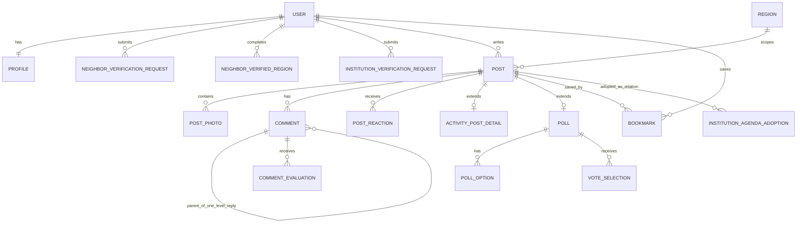
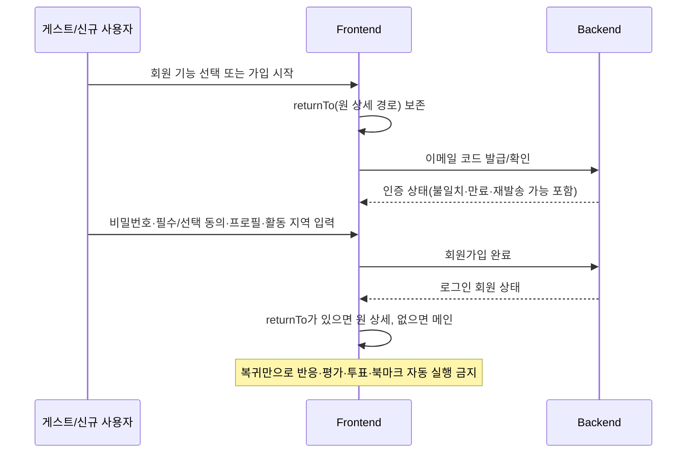
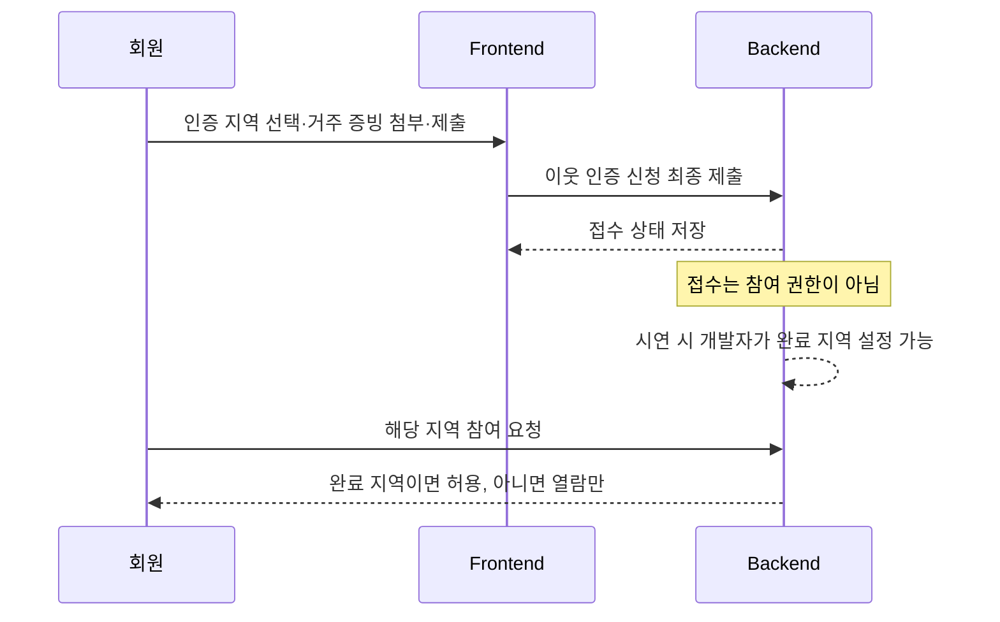
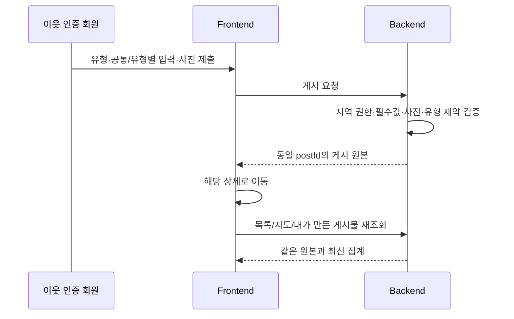
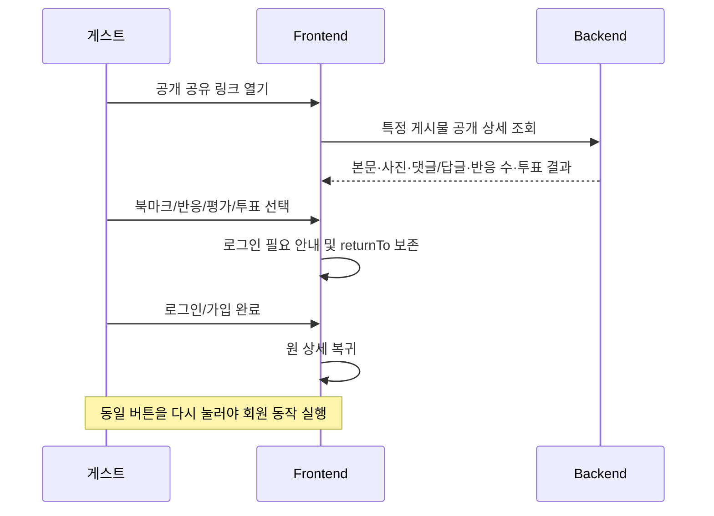
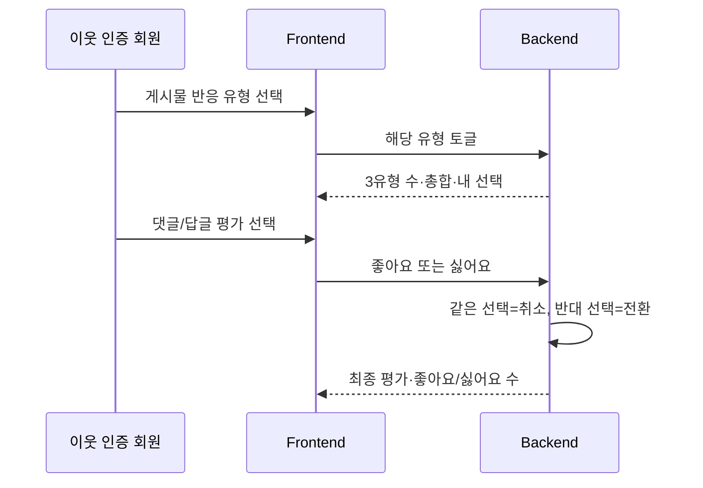
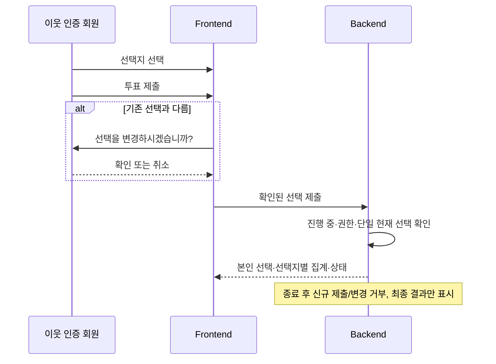
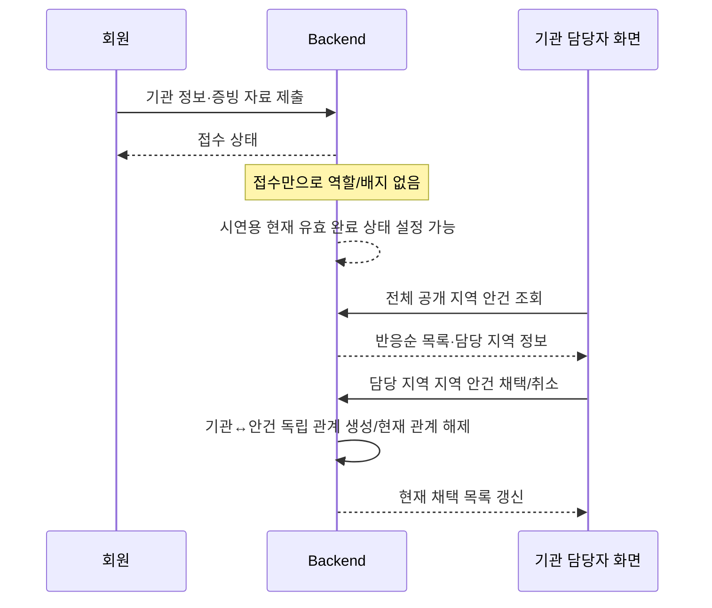

# Discushion MVP 백엔드·프론트엔드 통합 지침서
## 2026-10-08 #13 구현 준비 — 실제 연결 대기

사용자 요청으로 이번 구현을 back/develop 대상 **Draft PR**로 공유한다. `Refs #13`이며 이슈 전체 완료/자동 종료·배포·사진 API 활성화를 뜻하지 않는다. 공유 파일/트랜잭션·인증/권한 영향은 BE1 정합성 리뷰 대상이다. 삭제 후 재생성 방어·권한 발급 상한·실제 서버 DB/Privy 및 FE 연결 조건은 아래 기록대로 유지한다.

2026-10-08 02:20 KST Storage 준비 갱신: 지정 Supabase 프로젝트에 공개 `discushion-post-photos` 버킷(image/jpeg·image/png, 파일당10,000,000 bytes)을 생성하고 서명 PUT/RAW·익명 공개 열람·삭제, MIME/용량 거부와 localhost:3000 PUT preflight를 실제 REST로 확인했다. FE 전체 흐름/Spring 사진 API 연결 완료는 아니다. 삭제 후에도 유효한 서명 URL로 재생성되는 것을 확인했으므로 서버의 DELETE_PENDING 방어와 사진 API/worker 비활성화를 유지한다. 실제 DB 계정·Privy·발급 상한·진행 중 전송 종료 및 FE 연결 조건은 남아 있다. 시험 파일 잔여0개, 상세 기록은 Backend README의 실제 Storage 준비 절을 따른다.

사진 계약 PR #107은 BE1 yuyichan의 최신 변경 승인 후 back/develop 42dfb14에 병합됐다. FE sungjin0616의 코멘트와 사용자가 전달한 계약 구현 가능성 확인을 따르며 구현/실제 연결 완료와 구분한다.

BE2의 back/feature/13-photos에서 `/api/v1/photo-uploads` 예약 POST, `/{fileId}/complete` POST, 본인 상태 GET, 미연결 취소 DELETE와 서버 검증·정리 코드를 준비했다. 기존 §13의 JSON/PUT·RAW·202/200·상태 계약을 유지한다. 신규 API와 worker는 기본 비활성이고 실제 Supabase bucket/PUT·RAW/CORS·MIME/크기·발급 상한 검증 후 활성화한다. 현재 Supabase adapter는 업로드 종료 증거가 없어 삭제 후에도 DELETE_PENDING을 유지한다. FE는 사진 서비스의 연결/완료를 아직 주장하지 않고 #30/#31에서 실제 서버와 상태/재시도/삭제 흐름을 확인한다.

게시물 생성/상세/수정/삭제 endpoint, 작성자 전용 상세 fileId와 PATCH meta 조립은 #14~16에서 구현하며 #13의 연결 도우미만 준비했다. FE 브랜치/공통 Client는 변경하지 않았다. 2026-10-08 01:49 KST, PR #121 병합 기준 back/develop `91fa30d`를 반영하고 #13 변경을 보존한 뒤 로컬 실제 DB·HTTP를 포함한94개 테스트 중91통과/원격3제외, 실패0/오류0/빌드 성공을 확인했다. 이는 실제 Supabase·Privy·FE 연결 성공을 뜻하지 않는다. 현재 Feature는 아직 commit/PR/통합 전이며 자세한 실행·활성화·남은 조건은 [Backend README](../../backend/README.md)를 따른다.

2026-10-08 FE 계약 확인 기록: FE 담당 sungjin0616은 [PR #107 코멘트](https://github.com/2026-KW-HACKATHON/33_Last-Stand-Before-Enlistment/pull/107#issuecomment-6041114660)에서 상세 사진 DTO·PUT/RAW 전송·응답 유실 재시도·meta 보존을 구현 가능한 계약으로 확인했다. 사용자는 같은 날 FE에게 계약 자체에 문제가 없고 구현 가능하다는 확인을 전달받았다고 명시했다. 아래 과거 FE 확인 대기 표시는 이 기록으로 갱신한다. FE 코드 구현·실제 연동 완료나 GitHub Approve를 뜻하지 않는다. 최신 사진 계약에 대한 BE1 승인 1명과 back/develop 통합은 아직 필요하며, 실제 Storage/서버 계정 검증과 사용자 흐름은 #13/#30/#31에서 수행한다.

## 2026-10-07 사진 잔여 계약 — FE 전달/확인

PR #85의 DB 보완 이후 BE2 실행 기준을 [API 정본 §13.5~13.7](../api/Discushion_API_SPEC_v2.md#135-재시도재발급시연용-예약-제한)에 정리했다. FE는 §13.7 체크리스트의 네 endpoint·숫자 fileId/photoId·10,000,000 bytes·생성 photoFileIds/수정 photoOrder·오류·삭제 예약/최종 완료 의미를 확인한다. 실제 Storage URL/method/headers는 #13 adapter 검증 후 제공하고 사진 본문은 Storage로 직접 보낸다. Privy/Backend secret을 Storage 요청에 덧붙이지 않는다.

같은 예약의 업로드 권한 재발급은 제공하지 않는다. 전송 응답이 유실되면 complete로 기존 object를 확인하고, fileId를 아는 최초 URL 만료/전송 정보 유실은 기존 미연결 예약 취소 후 새 fileId/key로 예약한다. 최초 예약 응답 전체가 유실돼 fileId를 모르면 아래 복구 기준을 따른다. 초기 서버 예약 제한은 회원당 미정리20개·신고 합계100MB·최근60초 새 예약20개다. 제품 사진 한도10장·합계10MB와 별개이며 예약 제한을 FE 표시/추가 업로드 제한으로 혼동하지 않는다. 409 슬롯 부족·429 발급 빈도 제한은 취소/상태 확인·Retry-After를 적용하고 무한 자동 재시도를 하지 않는다.

확인자·날짜·대상 PR/SHA·이견은 #74에 기록한다. 현재는 FE wire 확인 대기이며 실제 FE 승인·사진 API/worker 구현·Storage/사용자 흐름 완료로 표시하지 않는다. 잠재 권한 만료 상한과 진행 중 전송 종료/재생성 방어는 #13 실제 adapter 검증 조건이고 FE timer나 임의 대기시간으로 대신하지 않는다. 인증 관련 공통 계약은 BE1의 별도 #74/#4 범위를 유지한다.

### PR #107 리뷰 보완안 — FE 구현 접점

상세 계약은 [API §13.8](../api/Discushion_API_SPEC_v2.md#138-pr-107-리뷰-보완안--사진-응답직접-전송최초-응답-유실)을 따른다. 실제 FE 확인과 BE1 승인은 대기이며 아래 문구를 실 연동 완료로 취급하지 않는다.

| 접점 | FE 적용 기준 |
| --- | --- |
| 상세 images | photoId/url/contentType/sizeBytes의 첨부 순서 배열, 사진 없음 []. fileId는 검증된 작성자에게만 포함. 수정은 기존 photoId/신규 fileId 구분, 게시물 삭제 전 본인 fileId 보존 |
| Storage 전송 | 예약 응답 upload.method=PUT·bodyMode=RAW. File/Blob을 그대로 body에 전달하고 반환 Content-Type/x-upsert=false 사용. FormData/JSON/base64 제외. 별도 fetch 함수, credentials=omit·redirect=error·취소 signal. 앱 API Client/prepareRequest·Privy Bearer 재사용 금지 |
| PATCH 응답 | data뿐 아니라 meta.photoDeletion도 검증/보존하는 도메인 decoder 사용. 현재 decodeApiResponse의 data-only 결과로 삭제 예약 정보가 사라지지 않게 처리 |
| fileId 미확보 | 최초 POST 응답 전체 유실은 기존 예약 취소 불가. 폼/File을 유지하고 사용자 명시적 재시도로 제한 내 새 예약. 이전 예약은 서버 추적·createdAt+24h 정리 후보. 발급 실패 확인 시 서버 즉시 DELETE_PENDING |
| quota/rate | 모르는 예약도 미정리20개/100MB·최근60초20개에 포함. 409는 새 예약 반복 중지·정리 대기, 429는 Retry-After 이후 명시적 재시도. 취소만으로 슬롯 복구라고 표시하지 않음 |

예약/완료/상태/취소 앱 API는 기존 Client를 사용한다. Storage 요청만 별도 전송 함수로 구현하며 실제 PUT·RAW 수용과 CORS·권한 만료/크기 제한은 #13/#30에서 검증한다. SDK 전송으로 변경하면 본문 형식 차이를 숨기지 않고 계약을 재검토한다. 이번 보완은 FE 브랜치·공통 Client·Schema를 변경하지 않는다.

## 2026-10-07 독립 개발 공통 준비

사용자 위임으로 BE1·BE2 공동 준비까지 진행한다. BE1은 A·C·D, BE2는 B·사진·탐색·AI·환경을 담당하며 각자 자기 API·Migration을 작성한다. Backend 내부 port와 공통 test-only fixture/CI는 [계약 검토표 §11](../api/Discushion_API_CONTRACT_검토표_2026-10-07.md)을 따른다. 실제 wire 승인·adapter·DB 경합·FE 연결은 준비 완료와 구분한다.

참여 집계는 부모 댓글/답글·세 반응·현재 표를 분리하고 본인 반응·북마크·선택은 검증된 현재 회원에게만 반환한다. guest에게 본인 상태나 타회원 개인 선택을 제공하지 않는다. 게시물 요약은 batch로 조합하고 삭제 행의 표시 필드는 비운다. 삭제 시 북마크 자동 해제·사진 참조 제거/삭제 예약은 같은 DB transaction으로 확정하고 참여·활동·기관 감사 관계는 보존하되 삭제 내용을 노출하지 않는다. 삭제 투표 개인 이력은 기존 UNAVAILABLE 기준을 유지한다.

이 내부 규약은 FE HTTP 필드를 새로 고정하지 않는다. API 정본과 실제 DTO를 구현 전 대조하며 진행 중/종료 투표의 기존 수정·삭제·제출 제한은 유지한다. GitHub 이슈의 착수 조건은 필수 계약/Schema/테스트 기반 통합, 완료 조건은 실제 의존 adapter와 권한·데이터 검증으로 구분한다. FE 연결은 #30/#31에서 해소하고 CI 통과만으로 FE 연결/배포 완료를 기록하지 않는다.

## 2026-10-07 합의: 공통 인증·조회와 영역별 작성

사용자가 공통 기반 1~5번대로 팀 합의를 확인했다. 인증은 FE의 Privy Bearer access token을 Spring이 직접 검증하며 자체 세션 교환은 채택하지 않는다. 검증된 Privy 식별자로 로컬 회원을 연결하고 인증 성공·가입 완료를 구분한다. 토큰 보관/갱신·로그아웃 범위·미가입 처리·오류 등 정확한 FE/API 세부는 #74/#4에서 확인한다. 같은 주제의 인증 방식 선택 대기 표현보다 이 합의를 우선하되 구현·FE 검토·실제 연동 완료로 표시하지 않는다.

BE1은 A·C·D와 공통 인증/자격 조회, BE2는 B와 최소 게시물 내부 조회·실행환경을 담당한다. 각 담당자가 자기 API 정본 해당 절·ERD·Migration을 작성하고 BE1은 전체 정합성을 검토한다. 공통/타 영역·기존 합의 계약 변경은 사전 공동 검토하며 이미 적용된 Migration은 보존한다. 공유 DB 적용은 통합된 Migration을 BE2 조율 아래 지정 담당자가 수행한다.

게시물 기본 조회는 ID·유형·지역·작성자·공개/삭제 상태와 투표 선택지/종료 정보를 제공하는 내부 규약으로 먼저 준비한다. 공통 데이터/오류는 기존 API 정본의 규칙을 대조해 고정하고 새 형식을 임의 만들지 않는다. 정확한 내부 DTO/인터페이스 상세안은 [API 계약 검토표](../api/Discushion_API_CONTRACT_검토표_2026-10-07.md) §11을 대조해 양쪽 리뷰 후 반영한다. 실제 코드 구현은 아직 없다. 필수 계약/Schema가 back/develop에 준비되면 합의된 대체 구현으로 독립 개발할 수 있지만 실제 상대 기능 연결과 권한/데이터 검증은 완료 조건으로 유지한다.

전체 규칙은 [AGENTS.md](../../AGENTS.md)의 “2026-10-07 합의: Backend 공통 기반과 독립 개발” 절을 따른다. 이전 BE1 전담 Migration 작성 요청은 담당 영역 작성+BE1 정합성 검토로 읽는다. 사진 공통 제약과 타 용도 영향은 공동 검토하며 사진 정책·한도는 유지한다. 실제 코드·DDL·환경·GitHub 이슈 담당/선행 갱신은 별도 작업이다.

### 2026-10-07 사진 실행 방향 추가 결정

사용자가 사진 처리 1~4번 추천안을 채택했다. 이 절은 같은 주제의 앞선 합의 대기 표현보다 우선하며 다른 제품 권한·사진 한도는 유지한다.

- 사진은 소유자에게 연결하고 업로드 지역에 묶지 않는다. 가입 완료 회원의 업로드·파일 소유권을 확인하며, 최종 게시물 생성/수정/삭제 때 대상 지역 자격·게시물 소유권·유형/상태 제약을 다시 검사한다.
- BE가 실제 파일의 형식/크기를 검증한 최초 완료시각부터 24시간 동안 게시물 미연결이면 정리 대상이다. 완료시각이 없는 전송 중단 파일은 최초 업로드 예약부터 24시간을 적용한다. 재호출/권한 재발급으로 기한을 연장하지 않는다. 1시간마다 조사하며 취소·검사 실패는 즉시 삭제 예약한다. 연결 완료·LEGACY 파일과 실제 활성 참조는 자동 정리에서 보호한다.
- 발급 권한의 마지막 만료를 추적하고 취소/정리 후 늦은 업로드·재생성도 정리한다. 저장 경로는 재사용하지 않는다. token/서명 URL 원문은 저장·로그에 남기지 않는다.
- 파일 연결과 게시물 참조·상태 갱신은 공통 파일 행 잠금과 같은 DB 트랜잭션으로 처리한다. 사진 제거/교체/게시물 삭제는 참조 처리와 삭제 예약을 함께 기록하고 커밋 후 저장 파일 삭제를 시도한다. 실패는 영속 기록으로 재시도한다.
- 사용자 요청의 성공은 관계 제거/취소와 삭제 예약의 확정이며 실제 파일 삭제 완료와 구분한다. 늦은 전송의 재생성 방어까지 확인한 뒤 최종 삭제 완료로 처리한다. 삭제 예약만으로 저장 파일 삭제 요구를 충족한 것으로 표시하지 않는다.

세부 결정·DB 보완 요구는 [API 계약 검토표 §10.9](../api/Discushion_API_CONTRACT_검토표_2026-10-07.md#109-사용자-채택-사진-처리-14번-실행-방향-2026-10-07)를 따른다. BE1의 Schema/Migration 검토·반영과 API 경로/DTO·응답 코드·오류·bytes 환산·FE 데이터 계약 확인은 남아 있다. 미완료 전송 삭제 상태·마지막 발급 만료·worker 선점/복구 저장 구조와 진행 중 전송 종료/재확인 기준을 보완한 뒤 의존 코드를 구현한다. 이번 결정은 BE1/FE 승인·#74 완료·#13 구현·실제 Storage/FE 연동 완료를 뜻하지 않는다.

## 2026-10-07 결정 반영

사용자가 확정한 아래 변경이 같은 주제의 변경 전 v10.1 본문·예시·MVP 표보다 우선한다. 상세 근거와 남은 계약은 [MVP 결정 변경 기록](./Discushion_MVP_결정변경_2026-10-07.md)을 확인한다. 제품 범위·서비스 선택과 팀 계약 합의·실제 구현/연동 완료를 구분한다. 기능 ID는 유지하며 PRD·기능명세서의 현재 파일명과 참조는 v10.2로 갱신했다.

- **계정:** Privy 이메일 OTP로 인증·로그인한다. 최초 사용자는 필수/선택 동의·프로필·활동 지역을 완료해 로컬 회원으로 가입한다. 자체 비밀번호 설정·확인·로그인과 자체 가입 코드 발급은 대체한다. OTP 세부 제한과 토큰/회원 연결 계약은 #74에서 합의한다. `returnTo`를 전체 과정에서 보존하고 복귀만으로 참여·북마크를 자동 실행하지 않는다.
- **이웃 자격:** 증빙 선택·첨부·신청 제출·접수·실제 인증 처리는 이번 MVP에서 제외한다. 별도 시연용 계정의 완료 지역을 서버에 준비하고 상태 조회·최대 3지역·해당 지역 참여 자격은 유지한다. 일반 가입·Privy 로그인·활동 지역 설정·기관 자격만으로 이웃 자격을 부여하지 않는다. 계정 준비는 #75, 조회 계약은 #74/#11을 따른다.
- **기관 자격:** 기관 증빙 입력·첨부·자료 제출·접수·실제 심사는 이번 MVP에서 제외한다. 별도 시연용 계정의 기관 정본·담당 지역·유효기간/완료 상태를 준비하고 현재 유효 상태 기반 역할·배지·업무 권한은 유지한다. 기관 자격이 주민 참여의 이웃 자격을 대신하지 않는다. 계정 준비는 #75, 조회 계약은 #74/#12를 따른다.
- **사진:** 게시물 사진은 Supabase Storage에 저장하며 회원·게스트·사진 URL을 아는 앱 외부 사람 모두 열람할 수 있다. JPG/PNG·최대 10장·게시물 합계 10MB를 유지한다. 사진 제거·교체 및 게시물 전체 삭제 시 해당 저장 파일을 지운다. 미완료 업로드는 임시 보관 후 24시간이 지나면 정리한다. 업로드 권한·최종 연결·bytes 환산·삭제 보상·24시간 기준시각/정리 간격/경합·임시 파일 공개 시점은 #74/#13/#30에서 합의한다. 이는 게시물 임시저장 기능을 추가한다는 뜻이 아니다.
- **AI:** Google Gemini 3.5 Flash-Lite 선택. 공개 지역 안건 원문 기반 3문장 한 문단·원문 fallback은 유지한다. 실제 API 모델 ID·사용 가능 여부·키/요금·생성/저장/재생성/재시도 기준은 #20/#30에서 확인·합의한다.
- **진행:** 완료된 #2의 변경 후속은 #74, 별도 시연용 계정은 #75. 지역·기관·소유권·게스트 공유 범위는 유지한다. 비밀번호 복구·계정 변경/탈퇴 등 비-MVP 기능은 추가하지 않는다. 증빙 첨부 기능 ID `S-JRMYIV`는 변경 이력으로 유지하되 현재 MVP에서 제외한다.

> 문서 개정일: 2026-10-07 / 제품 기준: PRD·기능명세서 v10.2 / API 문서: v1.1.2 (변경 계약 합의 대기)
> 유일한 요구사항 근거: `Discushion_PRD_2026-10-07_MVP반영_정리본_v10.2.md`, `Discushion_기능명세서_2026-10-07_MVP반영_정리본_v10.2.md`
> 표기: **[확정]**은 두 기준 문서에서 MVP로 명시된 정책, **[권장안]**은 확정 정책을 만족시키기 위한 기술적 설계 제안, **[확인 필요]**는 구현 전에 PO/기획자가 결정해야 할 항목이다. 권장안은 제품 정책을 새로 만드는 근거가 아니다.

## 1. 문서 목적 및 적용 범위

### MVP 목표

해커톤 MVP는 주민 회원이 지역 콘텐츠를 탐색하고, **이웃 인증이 완료된 지역에서만** 게시·참여하며, 공유 링크 게스트는 받은 특정 공개 게시물 안에서만 열람·댓글/답글을 할 수 있게 하는 통합 구현 기준이다. 세 게시물 유형(지역 안건, 지역 활동 정보, 투표)은 하나의 게시물 원본을 공유한다. 기관 인증 완료 사용자는 전체 공개 지역 안건을 열람하고 담당 지역의 안건을 기관 관계로 채택할 수 있다. [확정]

### 참조 문서와 우선순위

1. 두 문서의 **`2026-10-07 결정 반영`** → **`확정 정책 보완 (2026-10-04)`** 및 **`범위 대조 및 확인 필요 (2026-10-06)`**
2. 기능명세서의 기능 ID별 동작·예외·데이터 명세·인수 기준
3. PRD의 제품 정책·사용자 흐름·MVP 영역(A~AA) 연결

충돌처럼 보이는 문장은 위 우선순위로 해석하되, 해결되지 않는 부분은 10절의 확인 필요 사항으로 남긴다. 사용자가 선택한 스택/provider는 2026-10-07 결정 기록을 따른다. 추가 라이브러리·최종 API/DB 계약을 이 지침서에서 임의 확정하지 않는다.

### 포함/제외 범위 요약

| 구분 | MVP에 포함 | 명시적 제외/후순위 |
| --- | --- | --- |
| 계정 | Privy OTP 인증/로그인, 로컬 동의·프로필·활동 지역, returnTo | 자체 비밀번호/가입 코드, 복구·계정 변경·탈퇴·다크 모드 |
| 탐색·게시물 | 지역/유형/주제 목록, 메인, 지도, 상세, 세 유형 작성·수정·삭제, 사진 | 자유 검색의 필수 구현, 별도 인기글 선정, 임시저장, 참고 자료 링크, 익명 작성, AI 이미지 |
| 참여 | 댓글/1단계 답글, 반응, 댓글 평가, 실제 투표, 북마크, 개인 기록 | 신고, 알림·푸시·투표 예약 |
| 인증·기관 | 시연 계정의 완료 지역·유효 기관 상태/담당 지역·권한·배지·기관 채택 | 증빙 입력/첨부·신청·제출·접수·심사·보완 메일·증빙 운영 |
| AI | 공개 지역 안건 원문 기반 3문장 요약 | AI 추천, 관심 지역/키워드 관리 |

`일부 포함` 기능은 위 표와 각 기능 본문에서 명시적으로 포함된 부분만 구현한다. `정책만 유지`는 화면·API·배치 작업을 추가하라는 뜻이 아니다.

## 2. 도메인 및 권한 모델

### 사용자 상태, 역할, 인증 상태, 지역 권한의 관계

**[확정]** 게스트는 계정 역할이 아니다. 로그인하지 않은 공유 링크 방문자라는 접근 컨텍스트다. 로그인 회원은 기본적으로 공개 콘텐츠를 열람할 수 있으나, 지역 참여는 해당 게시물 지역의 이웃 인증 완료 여부가 필요하다. 기관 인증은 이웃 인증을 대체하지 않는다.

| 구분 | 판정 입력 | 파생 결과 |
| --- | --- | --- |
| 주민 회원 | 로그인 세션/계정 | 메인·목록·지도·마이 접근, 본인 데이터 조회 가능 |
| 이웃 인증 완료 | 회원 + 완료 지역(최대 3개) | 그 지역에서 게시, 댓글/답글, 반응, 댓글 평가, 투표 제출 가능 |
| 기관 인증 완료 | 회원 + 현재 유효한 완료 상태 + 담당 지역 | 기관 역할, 파란 배지, 담당자 안건 목록 접근, 담당 지역 안건 채택 가능 |
| 공유 링크 게스트 | 공개 게시물의 유효한 공유 진입 | 그 **특정 게시물 상세**의 공개 본문·사진·댓글/답글·반응 수·투표 결과 열람 및 게스트 댓글/답글 가능 |

기관 배지는 별도 저장 플래그가 아니라 현재 유효한 기관 인증 완료 상태에서 파생한다. 기관 인증의 1년 유효기간 정책은 유지하며, 만료 시 기관 전용 접근과 과거 작성물의 배지를 제거한다. 일반 회원으로서의 게시 권한은 유지하되, 지역 참여에는 여전히 이웃 인증이 필요하다. [확정]

기관 인증 사용자(민원담당자)는 실제 민원 업무 담당자만을 의미한다. 단순 학교·기관 소속 학생이나 실제 민원 업무 담당자가 아닌 일반 직원에게 기관 권한을 부여하지 않는다. 실제 심사 UI는 비-MVP이나, 이 기준은 시연용 완료 상태를 설정하거나 역할을 설명할 때도 변경하지 않는다. [확정 정책·심사 UI 비-MVP]

### 주민 회원/게스트/기관 인증 사용자별 접근 가능 기능

| 기능 | 주민 회원(이웃 미완료/타 지역) | 해당 지역 이웃 인증 회원 | 공유 링크 게스트 | 현재 유효 기관 인증 완료 사용자 |
| --- | --- | --- | --- | --- |
| 메인·통합 게시판·전체 지도 | 가능 | 가능 | 불가 | 가능 |
| 공개 상세 열람 | 가능 | 가능 | 공유받은 특정 게시물만 | 가능 |
| 게시물 작성·수정·삭제 | 불가(대상 지역 기준) | 본인 게시물, 유형 규칙 내 가능 | 불가 | **담당 지역과 무관하게** 이웃 인증을 완료한 해당 지역에서 동일 적용 |
| 댓글·답글 | 불가(대상 지역 기준) | 가능 | 공유 링크의 특정 공개 게시물에서만 가능 | 이웃 인증 완료 지역에서만 가능 |
| 게시물 반응·댓글 평가·투표 | 불가 | 가능 | 불가; 로그인 안내 | 이웃 인증 완료 지역에서만 가능 |
| 북마크 | 로그인 회원이면 가능 | 가능 | 저장 불가, 로그인 안내 | 가능 |
| 기관 안건 목록 | 불가 | 불가 | 불가 | 전체 공개 지역 안건 열람 가능 |
| 기관 채택 | 불가 | 불가 | 불가 | 담당 지역의 공개 **지역 안건**만 가능 |

게스트가 반응·평가·투표·북마크를 누르면 `로그인이 필요한 기능입니다.`를 안내하고 로그인/가입 흐름으로 이동한다. 복귀 후에는 원 동작을 자동 실행하지 않는다. [확정]

### 지역별 이웃 인증 및 기관 담당 지역의 권한 판정

| 작업 | 백엔드 필수 조건 | 프론트엔드 선행 안내 |
| --- | --- | --- |
| 게시, 댓글/답글, 반응, 댓글 평가, 투표 제출 | 로그인 회원이고 `post.regionId`가 사용자의 이웃 인증 완료 지역 | 미완료/타 지역은 참여 불가 상태를 표시하되 서버 거부를 대체하지 않음 |
| 공유 링크 게스트 댓글/답글 | 요청이 유효한 공개 공유 상세 컨텍스트이고 해당 게시물에 한정 | 작성자명 `게스트`, 로그인·전화번호 인증 요구 없음 |
| 기관 안건 열람 | 현재 유효 기관 인증 완료 | 담당 지역 밖도 열람 가능 |
| 기관 채택/취소 | 현재 유효 기관 인증 완료 + 대상이 공개 지역 안건 + 대상 지역이 담당 지역 + 본인 기관 관계 | 담당 지역 밖/다른 유형에는 채택 UI 비활성 또는 미노출 |

### 프론트엔드 가드와 백엔드 권한 검증의 책임 분리

| 층 | 책임 |
| --- | --- |
| 프론트엔드 | 세션·상세 응답의 `capabilities`로 버튼/입력 상태를 표시한다. 게스트의 회원 기능 시도에는 안내와 안전한 `returnTo`를 보존한다. 확인 대화상자(투표 변경)를 표시하고, 실패 시 낙관 상태를 되돌린다. |
| 백엔드 | 요청 시점에 로그인, 공유 상세 범위, 공개/삭제 상태, 이웃 인증 완료 지역, 기관 인증 유효성·담당 지역, 작성자 소유권, 투표 종료를 재검증한다. 클라이언트 전달 `regionId`, 배지, 역할을 신뢰하지 않는다. |
| 공통 계약 | 상세/목록 응답은 화면이 재추론하지 않도록 본인 선택·집계·권한 가능 여부를 반환한다. 권한 오류의 사유 코드는 UI가 로그인 유도와 이웃 인증 안내를 구분하는 데만 사용한다. [권장안] |

## 3. 핵심 도메인 모델 및 데이터 설계 지침

### 엔터티 목록과 책임

| 엔터티 | 책임 및 연결 |
| --- | --- |
| User / Profile | 등록 이메일·비밀번호 검증 정보와 공개 프로필(사진, 닉네임, 한 줄 소개, 복수 이웃 속성, 기본 활동 지역)을 분리한다. |
| Region | 활동/탐색/인증/게시물/기관 담당 지역이 참조하는 지역 식별자다. 동 단위 지도 데이터와 연결한다. |
| NeighborVerificationRequest / NeighborVerifiedRegion | 이웃 인증 신청 지역·증빙·접수/완료 상태와 사용자별 완료 지역을 연결한다. |
| InstitutionVerificationRequest / InstitutionCredential | 기관 신청 입력·증빙·접수/완료 상태·담당 지역·유효기간을 보관하고 역할/배지의 근거가 된다. |
| Post | 세 게시물 유형의 공통 원본: 유형, 주제, 지역, 제목, 본문, 작성자, 게시/삭제 상태, 시각. |
| ActivityPostDetail | 활동 정보 전용: 출처, 일정, 장소, 활동 상태, 선택적 외부 참여 링크. |
| Poll / PollOption / VoteSelection | 투표 질문·선택지·종료 일시와 회원별 현재 선택을 분리한다. |
| PostPhoto | 게시물 사진의 정렬 순서와 파일 참조를 보관한다. |
| Comment | 부모 댓글 또는 1단계 답글, 대상 사용자 표시, 공개 작성자명, 게스트/회원 작성 주체를 보관한다. |
| PostReaction | 회원-게시물-반응유형의 독립 반응 관계다. |
| CommentEvaluation | 회원-댓글/답글-평가(좋아요/싫어요)의 상호배타 관계다. |
| Bookmark | 회원-게시물 저장 관계다. |
| ActivityEvent | 실제 행동 횟수와 참여 목록을 재구성하는 원본 행동 기록이다. [권장안: 아래 규칙을 만족하는 방식이면 구현체는 자유] |
| InstitutionAgendaAdoption | 기관-지역 안건-채택 사용자-채택 시각의 독립 관계이며 취소 이력을 보존한다. |
| AiAgendaSummary | 공개 지역 안건 원문과 생성 상태·생성 시각·요약 결과를 연결한다. |

### 연결 구조

### 엔터티별 핵심 필드, 상태값, 식별자, 제약조건

| 엔터티 | 핵심 필드/상태 | 필수 제약 |
| --- | --- | --- |
| User/Profile | `userId`, 등록 이메일, 비밀번호 검증값, 닉네임(중복 불가·최대 10자), 소개(최대 50자), 기본 활동 지역, 이웃 속성(거주자/학생/직장인/상인 복수) | 로그인 정보와 공개 프로필을 구분; 이웃 속성은 권한/배지를 부여하지 않음 |
| Post | `postId`, `type`(지역 안건/지역 활동 정보/투표), `topic`(7개), `regionId`, 제목, 본문, `authorId`, 게시/삭제 상태, 작성/수정 시각 | `전체`는 저장값이 아님; 유형·주제·지역은 하나씩; 삭제 게시물은 공개 상세 불가 |
| ActivityPostDetail | `postId`, 출처, 일정, 장소, 활동 상태(예정/진행/종료/취소), 외부 링크 | 출처·일정·장소·상태 필수, 상태 기본값 없음; 종료/취소 시 외부 링크 비활성 |
| Poll/PollOption | `postId`, 질문, 종료 일시, 선택지 식별자/내용, 진행/종료 | 선택지 2~10개; 진행 중 작성자는 제목·본문·사진·종료 일시만 수정; 질문·선택지·지역·주제 불가; 종료 후 수정/삭제 불가 |
| PostPhoto | `photoId`, `postId`, 파일 참조, MIME, 크기, 첨부 순서 | JPG/PNG, 최대 10장, 게시물 전체 합계 최대 10MB; 첫 번째가 지도 썸네일 |
| Comment | `commentId`, `postId`, `parentCommentId`(답글만), `replyToDisplayName`(기존 답글에 답할 때), 본문, 작성 주체, 공개명, 시각 | 답글 깊이 1; 게스트 공개명은 정확히 `게스트`; 빈 내용 불가; 금칙어 사전 통과 뒤 즉시 공개; 게스트 댓글/답글은 가입 후 새 회원 계정으로 자동 이관하지 않음 |
| PostReaction | `postId`, `userId`, `reactionType`, 생성/변경 시각 | `(postId,userId,reactionType)` 유일; 3유형은 서로 독립·복수 가능 |
| CommentEvaluation | 대상 댓글/답글 식별자, `userId`, 평가 종류 | 한 회원-한 대상은 하나만; 반대 선택은 전환, 같은 선택 재클릭은 취소 |
| VoteSelection | `pollId`, `userId`, `optionId`, 제출 시각 | `(pollId,userId)` 유일; 종료 후 생성/변경 불가 |
| Bookmark | `userId`, `postId`, 등록 시각 | `(userId,postId)` 유일; 삭제 게시물 관계 자동 해제 |
| ActivityEvent | 사용자, 게시물, 행동 종류, 발생 시각 | 활동 +1 규칙을 반영; 현재 참여 표시와 행동 횟수는 별도 집계 |
| 인증 신청 | 사용자, 신청 지역/담당 지역, 증빙 참조, 신청·접수·완료 상태, 시각 | 접수 ≠ 완료; 이웃 완료 지역은 최대 3개; 기관 증빙은 비공개 |
| InstitutionAgendaAdoption | 기관, 지역 안건, 채택 사용자, 채택 시각, 현재 유효 여부/취소 이력 | 게시물 상태를 변경하지 않음; 기관별 독립; 공개에는 기관명·채택 시각만 |

이웃 인증의 구체적 증빙 필드/허용 형식은 문서가 확정하지 않았으므로 위 표 이상으로 고정하지 않는다. 기관 증빙은 PDF/JPG/PNG, 개수 제한 없음, 파일당 10MB·요청 합계 50MB다. [확정]

### 집계값의 정의와 갱신 원칙

| 집계 | 정의 | 갱신/표시 원칙 |
| --- | --- | --- |
| 게시물 반응 수 | 공감해요 + 필요해요 + 궁금해요 | 투표 수·댓글 수와 별도; 지도/기관 목록은 이 합계를 참조 |
| 댓글 수 | 부모 댓글 + 답글 수 | 반응 수와 섞지 않음 |
| 댓글 좋아요/싫어요 | 대상별 현재 유효 평가 수 | 답글 좋아요는 부모 댓글 정렬에 합산하지 않음 |
| 투표 결과 | 선택지별 현재 선택 수, 득표율, 전체 참여자 수 | 다른 사용자의 개인 선택은 공개하지 않음 |
| 지도 대표 | 동별 지역 안건/투표 중 반응 수 최대, 동률 최신 | 활동 정보·댓글 수·투표 득표 수 제외; 반응 변경 후 재조회 시 재선정 |
| 개인 활동 횟수 | 아래 +1 행동의 누적 횟수 | 참여 게시물 카드 수와 다름 |

활동 횟수는 게시물 작성, 북마크 등록, 세 반응 각각의 등록, 댓글 작성, 답글 작성, 댓글 좋아요/싫어요, 답글 좋아요/싫어요, 투표 최초 참여에 각각 +1이다. 조회·수정·삭제·설정 변경·반응/평가 취소·평가 직접 전환·투표 선택 변경은 +0이다. 취소 뒤 같은 행동 재등록과 북마크 재등록은 다시 +1이다. [확정]

### 삭제·취소·전환 시 관계 및 집계 처리

| 사건 | 확정 처리 |
| --- | --- |
| 반응 재선택 | 해당 반응만 취소; 나머지 반응 유지; 반응 집계 갱신 |
| 댓글 평가 반대 선택 | 기존 평가 제거 후 반대 평가 적용; 활동 횟수 +0 |
| 댓글 평가 같은 선택 | 평가 취소; 활동 횟수 +0 |
| 투표 선택 변경 | 확인 후 기존 표 대체; 참여 1회 유지; 집계 원자적으로 재계산 |
| 투표 종료 | 신규 제출·변경 거부, 최종 결과만 표시 |
| 게시물 삭제 | 상세 콘텐츠 비공개; 북마크 자동 해제·목록 제거; 참여 투표 기록은 유지하되 상세는 접근 불가 안내와 함께 본문/선택지 재노출 금지 |
| 기관 채택 취소 | 해당 기관의 현재 표시/목록에서 제거, 다른 기관 채택 유지, 취소 이력 내부 보존 |

게시물 삭제 시 댓글·반응·사진·투표 선택·활동 기록·채택 기록을 물리 삭제/비공개 처리 중 어느 방식으로 보존할지는 문서가 명시하지 않았다. 공개 접근 차단과 명시된 북마크/투표 기록 처리만 확정으로 구현하고, 나머지 보존 방식은 확인 후 정한다.

### 데이터 무결성 규칙

- 모든 목록·상세·지도·개인 기록·기관 목록은 같은 `Post` 원본과 관계를 참조한다. 복제본으로 집계가 갈라지지 않게 한다. [확정]
- 반응, 북마크, 투표 선택, 댓글 평가는 유일 제약과 트랜잭션/원자적 갱신으로 중복 요청에도 일관되게 처리한다. [권장안]
- 게시물 수정/삭제는 작성자 소유권과 유형별 상태를 서버가 확인한다. 기관 채택은 게시물 작성 상태와 독립이다. [확정]
- AI 요약은 공개 지역 안건 원문에만 연결한다. 다른 유형·비공개 원문·원문 외 사실을 입력/출력 근거로 삼지 않는다. [확정]

## 4. 프론트엔드·백엔드 책임 매트릭스

| 기능 (영역/ID) | 화면·클라이언트 상태 | 서버 검증·저장 | 성공 응답/실패 처리 | 동시성·중복 요청 |
| --- | --- | --- | --- | --- |
| 가입 A / F-KZRSXU | Privy OTP·동의/프로필/지역·returnTo 보존 | 검증된 Privy 주체·로컬 가입 상태·필수 동의/프로필/지역 저장 | 인증과 로컬 가입 완료 분리·실패 시 상태 보존 | token/회원·OTP 오류 계약 #74 |
| 로그인 A / F-TSOXGG | Privy OTP·로그인 상태·returnTo | 토큰 검증·로컬 회원 상태 확인 | 기존 회원 복귀/미가입 후속 단계·자동 행동 금지 | #74 토큰/세션·오류 합의 |
| 권한 A,C,Y,Z,AA | `capabilities`, 게스트/회원 UI, 이웃·기관 상태 | 요청 시 지역·유효기관·담당지역 재판정 | 로그인 안내/권한 오류; 서버 상태 재조회 | 상태 변경 직후 최신 권한 응답 사용 |
| 작성 G,H,I / F-FTLHCX | 유형별 입력, 사진 큐, 저장 실패 시 초안 유지 | 이웃 인증, 필수 필드, 소유자 수정, 투표/활동 제약 | 원본 상세; 유효성 오류는 필드별, 저장 실패 재시도 | 게시 요청 중복 방지 키 [권장안] |
| 사진 / F-GSMCLD | 미리보기·교체·제거, 취소 시 기존 입력 유지 | 형식/개수/총량 검증, 원본과 연결 | 파일 참조; 업로드 실패 시 해당 파일 미연결·기존 입력 유지 | 업로드별 상태, 최종 게시 시 서버 재검증 |
| 반응 K / S-HNVDPO | 3개 독립 선택 상태, 요청 중 버튼 | 로그인·이웃 인증·공개/삭제, 유형별 토글 | 유형별 수·총합·내 선택; 실패 시 낙관 갱신 롤백 | `(user,post,type)` 유일, 같은 유형 최종 상태 하나 |
| 댓글/답글 L,N / S-JCEZAP,S-YYDGUS | 입력값, 부모/대상 사용자, 정렬, 게스트 컨텍스트 | 이웃 인증 또는 유효 공유 게스트, 빈 값·금칙어, 깊이 1 | 생성 항목/정렬용 집계; 실패 시 입력 유지 | idempotency 키로 동일 의견 중복 생성 방지 [권장안] |
| 댓글 평가 M / F-CDIBRF | 현재 평가·집계, 게스트 로그인 유도 | 로그인·이웃 인증, 대상 존재, 상호배타 전환 | 최종 평가/좋아요·싫어요 수; 실패 시 완료 표시 금지 | 대상별 단일 현재 평가를 원자 전환 |
| 투표 O / S-CMGJIG | 임시 선택과 제출 선택 분리, 변경 확인 모달 | 이웃 인증, 진행 중, 옵션 소속, `(poll,user)` 단일 선택 | 최신 결과·본인 실제 선택·상태; 종료/권한 오류 안내 | 변경과 종료 경합에서 서버 시점 우선, 중복 표 금지 |
| 북마크 R / F-FYQJPT | 상세 단일 버튼, 저장 팝업, 게스트 `returnTo` | 로그인 회원·게시물 공개/삭제, 관계 토글 | 본인 저장 상태; 등록 시 `저장되었습니다`, 게스트는 저장 없음 | `(user,post)` 유일; 삭제 시 관계 제거 |
| 자격 상태 C,Y | 실제 완료 지역/기관 유효 상태·제한 안내 | 시연 상태 조회·지역/유효기간/담당 지역 판정 | 일반/완료/타 지역/만료 구분 | 증빙 신청/접수 제외, #75로 데이터 준비 |
| 기관 채택 AA / F-TUGMEP | 채택/취소 가능 여부, 현재 기관 표기 | 유효 기관 인증·담당 지역·지역 안건·관계 소유권 | 현재 채택 관계/기관명/시각; 실패 시 표시 갱신 안 함 | 기관-안건 관계 단위로 중복 생성 방지, 취소 이력 보존 |

## 5. API 계약 지침

아래 경로와 HTTP 상태 코드는 **[권장안]**이다. 문서가 확정한 것은 리소스·권한·동작이며, 실제 프로젝트의 라우팅 규칙이 있으면 그 규칙을 우선한다.

### 공통 계약 원칙

- 목록은 `region`, `type`, `topic` 필터를 지원한다. `전체`는 조회값일 뿐 저장 열거값이 아니다. 목록 복귀 시 진입한 지역·유형·주제·페이지/커서 맥락을 유지한다. [확정]
- 목록 갱신 방식(페이지 번호/커서)은 문서 미정이다. 대량 데이터와 신규 게시 반영을 위해 불투명 `cursor` + `nextCursor`를 쓰는 방식을 권장한다. [권장안]
- 상세는 프론트엔드가 별도 조합하지 않도록 공통 원본, 유형 확장 정보, 사진, 집계, 댓글/답글, 현재 채택 기관, 로그인 본인의 선택/저장/권한 가능 여부를 한 응답에 포함한다. 게스트 응답에는 타인의 개인 정보나 본인 상태를 넣지 않는다. [권장안]
- 권한 관련 오류는 확정 제품 메시지를 우선한다. `401/403/404/409/422` 등 상태 코드는 구현 권장안이며 제품 정책 자체가 아니다.

| API 그룹 (권장 경로) | 목적·요청 주체·권한 | 요청 핵심값 | 성공 응답 핵심 필드 | 오류/프론트 처리 |
| --- | --- | --- | --- | --- |
| 인증 (경로 #74 합의 대기) | Privy OTP 및 로컬 가입 | 합의된 토큰·동의·프로필·활동 지역·returnTo | 검증된 회원/가입 상태·합의된 세션 | provider 확인된 OTP 오류/재시도·미가입 처리, 자체 비밀번호 제외 |
| 내 정보 (`/me`, `/me/profile`, `/me/regions`) | 프로필·활동 지역; 본인만 | 닉네임, 소개, 사진, 속성, 기본 활동 지역 | 최신 프로필, 파생 배지, 완료 지역/권한 요약 | 닉네임 중복·길이 오류 표시; 탐색 지역은 여기 저장하지 않음 |
| 게시물 목록/상세 (`/posts`, `/posts/{id}`) | 회원 목록, 회원/공유 링크 상세 | 필터·정렬·커서; 공유 컨텍스트 | 공통 카드/상세, `typeDetail`, 사진, 반응/댓글/투표 집계, `myState`, `capabilities`, 채택 표시 | 게스트 목록 거부; 삭제/비공개 상세는 콘텐츠 미반환 |
| 게시물 작성/수정/삭제 (`/posts`, `/posts/{id}`) | 이웃 인증 완료 회원/작성자 | 공통 필드 + 활동/투표 확장 | 원본 `postId`, 최신 상태, 상세 이동 대상 | 필수값·지역 권한·투표 수정 제한; 입력 보존 |
| 미디어 (`/posts/{id}/photos` 또는 업로드 세션) | 이웃 인증 완료 작성 중 회원 | JPG/PNG 파일, 순서 | 파일 참조·크기·순서 | 10장/전체 10MB/형식 오류 안내; 취소 시 기존 유지 |
| 댓글 (`/posts/{id}/comments`, `/comments/{id}/replies`) | 이웃 인증 회원 또는 유효 공유 게스트 | 본문, 부모/대상 사용자 | 생성 댓글, 공개명, 시각, 집계 | 금칙어·빈 값·권한 오류; 입력 보존, 중복 생성 방지 |
| 반응 (`/posts/{id}/reactions/{type}`) | 이웃 인증 완료 회원 | 반응 유형 | 3개 수, 총합, 내 3개 선택 | 게스트는 로그인 안내; 타 지역은 참여 불가 안내 |
| 댓글 평가 (`/comments/{id}/evaluation`) | 이웃 인증 완료 회원 | 좋아요/싫어요 또는 토글 의도 | 최종 내 평가, 좋아요/싫어요 수 | 게스트 로그인 안내; 실패 시 UI 롤백 |
| 투표 (`/polls/{postId}/selection`) | 이웃 인증 완료 회원 | `optionId`, 변경 확인 후 제출 | 본인 선택, 선택지별 수/율, 참여자 수, 진행/종료 | 종료/권한/중복 오류; 변경 취소 시 요청하지 않음 |
| 북마크 (`/posts/{id}/bookmark`, `/me/bookmarks`) | 로그인 회원 | 등록/해제 의도, 목록 필터 | 저장 상태, 목록 카드 | 게스트는 API 호출 없이 로그인 이동; 삭제 게시물 제거 |
| AI 요약 (`/posts/{id}/ai-summary`) | 회원, 유효 공유 상세 게스트 | 없음 | 3문장 한 문단/생성 상태/**원문과 출처**/원문 링크 | 실패·짧은 원문은 원문 우선과 상태 안내 |
| 이웃 자격 (조회 경로 #74 대조) | 로그인 본인 | 검증된 서버 주체 | 완료 지역·지역 자격 | 최대 3지역·타 지역/무자격 제한, 신청/증빙 제외 |
| 기관 자격 (조회 경로 #74 대조) | 로그인 본인 | 검증된 서버 주체 | 현재 유효 상태·담당 지역·파생 역할/배지 | 만료/담당 지역 제한, 신청/증빙 제외 |
| 기관 목록/채택 (`/institution/agendas`, `/institution/adoptions`) | 유효 기관 인증 사용자 | 지역 필터, 안건, 채택/취소 | 반응순 안건, 현재 채택 관계, 공개 기관명/시각 | 담당 지역 밖·비안건·미인증 거부; 알림 생성 없음 |
| 개인 기록 (`/me/posts`, `/me/participations`, `/me/votes`, `/me/activity`) | 로그인 본인 | 유형/주제·투표 상태 필터, 커서 | 원본 카드, 내 유효 행동, 실제 선택, 활동 횟수 | 삭제 투표는 기록 유지·상세 접근 불가 표시 |

## 6. 기능별 통합 구현 지침

| 영역 | 요구사항 ID | 통합 구현 지침·인수 기준 |
| --- | --- | --- |
| A 회원가입/로그인 | R-TIUREM, F-WLXSSC, F-TSOXGG, F-KZRSXU | Privy OTP 인증/로그인 → 최초 동의·프로필·활동 지역 완료. returnTo 보존·자동 행동 금지. 토큰/회원 계약은 #74. |
| B 프로필 | R-TIUREM, F-RBVFZX | 본인 프로필 조회/수정, 사진·닉네임·소개·복수 속성·활동 지역을 저장한다. 닉네임 중복/10자, 소개 50자를 검증한다. 비익명 작성자 표시는 최신 프로필을 반영한다. |
| C 이웃 자격 | R-TIUREM, F-ATWJDJ | #75 시연 완료 지역을 #11에서 조회. 최대 3지역·지역 참여 판정 유지. 증빙 신청/접수 제외. |
| D 메인 | R-ERLWRR, F-UPRLMN | 로그인 후 현재 탐색 지역 콘텐츠와 게시판/지도/상세 진입을 제공한다. 데이터가 없으면 섹션/CTA를 유지하고 `아직 등록된 게시물이 없습니다.`를 표시한다. 진행 중 투표 미리보기는 원본 상세로 이동한다. |
| E 통합 게시판 | R-ERLWRR, F-EAJPVC | 세 유형을 단일 원본에서 지역→유형→주제 순으로 필터한다. 7개 주제를 사용하며 필터 복귀 맥락을 보존한다. 게스트에게 일반 목록을 제공하지 않는다. |
| F AI 안건 요약 | R-OLUPOB, F-WSCKDN | 공개 지역 안건 원문만 3문장 자연스러운 한 문단으로 요약한다. 원문 외 사실을 추가하지 않으며, **원문과 출처를 함께 확인**할 수 있게 한다. 생성 실패/짧은 원문에는 원문 우선·상태 안내·원문 링크를 제공한다. |
| G 지역 안건 | R-UKZZFM, F-FTLHCX, S-NVXXYQ | 지역·주제·제목·본문·선택 사진을 같은 `Post`에 저장한다. 활동 입력/임시저장/참고 링크/익명 입력은 넣지 않는다. 이웃 인증 완료 지역의 작성자만 작성하고 완료 뒤 상세로 이동한다. |
| H 지역 활동 정보 | R-JXMZJA, F-UCDVNA, F-FTLHCX | 공통 원본에 출처·일정·장소·상태를 필수, 외부 링크를 선택으로 저장한다. 상태는 예정/진행/종료/취소에서 필수 선택하고 자동 변경하지 않는다. 종료/취소 시 외부 링크를 비활성화한다. 문의는 현재 등록 로그인 이메일을 참조하며 없으면 지정 문구를 표시한다. |
| I 투표 게시물 | R-UKZZFM, S-TBFIHO | 공통 필드+질문+2~10개 선택지+종료 일시+선택 사진을 독립 투표 원본으로 저장한다. 진행 중 수정은 제목/본문/사진/종료 일시만, 종료 뒤 수정/삭제 불가다. 알림 예약은 구현하지 않는다. |
| J 공통 상세 | R-ERLWRR, F-PUDHYO | 한 응답/화면에서 공통 정보, 사진, 작성자/배지, 반응, 댓글/답글, 공유, 북마크, 유형 확장, 채택 표시를 렌더링한다. 삭제물은 콘텐츠를 표시하지 않는다. |
| K 게시물 반응 | R-UOLHDN, F-GOMLGG, S-HNVDPO | 세 반응을 독립적으로 복수 선택·등록/취소하고 각 수와 합계를 갱신한다. 투표/댓글 집계와 섞지 않는다. 이웃 인증 완료 회원만 가능하다. |
| L 댓글/답글 | R-UOLHDN, F-EDNVWZ, S-JCEZAP, S-YYDGUS | 회원은 지역 인증 조건, 게스트는 공유 상세 예외로 작성한다. 금칙어 단순 포함 검사 통과 시 즉시 공개한다. 답글은 부모 아래 1단계만 저장하고 기존 답글에 답할 땐 같은 부모+대상 사용자명을 저장한다. |
| M 댓글/답글 평가 | R-UOLHDN, F-CDIBRF | 좋아요/싫어요는 상호배타, 반대 선택 전환, 같은 선택 취소다. 댓글과 답글 모두 같은 규칙이며 게스트는 불가다. 답글 좋아요를 부모 정렬에 더하지 않는다. |
| N 댓글 정렬 | R-UOLHDN, S-OXTKEP | 부모 댓글만 좋아요 내림차순(동률 최신) 또는 최신순으로 정렬한다. 답글은 부모 아래 순서를 유지한다. |
| O 실제 투표 참여 | R-UOLHDN, F-FCPVIS, S-CMGJIG | 선택은 임시 상태이고 `투표 제출` 때 저장한다. 다른 기존 선택 제출은 `선택을 변경하시겠습니까?` 확인 후 교체, 취소 시 기존 유지다. 종료 후 신규/변경 불가, 본인 선택은 본인에게만 공개한다. |
| P 게시물 공유 | R-UKZZFM, F-OWFYWE | 공개 게시물 식별자를 참조하는 링크 생성/복사/공유를 제공한다. 링크는 로그인 없이 상세로 직행한다. |
| Q 공유 링크 게스트 | R-UKZZFM, F-OWFYWE, S-NYUECP | 특정 공개 상세의 공개 본문·사진·댓글/답글·반응 수·투표 결과만 제공한다. 일반 메인/목록/지도는 노출하지 않으며 회원 행동은 로그인 유도 후 재클릭 원칙이다. |
| R 북마크 | R-AWYGMM, F-FYQJPT | 상세의 단일 버튼으로 회원은 등록/해제·`저장되었습니다`·현재 상세 유지를, 게스트는 저장 없이 로그인 이동을 처리한다. 개인 목록은 유형/주제 필터와 원본 상세 이동을 제공한다. 등록만 활동 +1, 참여 게시물에는 미포함이다. |
| S 이슈 지도 | R-ERLWRR, F-QIGKAK | 기본 활동 지역 중심으로 동을 표시하며 GPS·실시간 위치 추적·지도 표시용 위치 권한은 사용하지 않는다. 동별 지역 안건/투표 중 최고 반응(동률 최신) 하나만 말풍선, 첫 사진만 썸네일로 쓴다. 후보 없는 동은 유지하고 `등록된 게시물이 없습니다`를 표시한다. |
| T 마이페이지 | R-AWYGMM, F-WYMXXP | 프로필·나의 활동·내가 만든/참여한 게시물·참여 투표·북마크·프로필 수정·이웃/기관 인증 진입을 제공한다. 제외 메뉴는 넣지 않는다. |
| U 내가 만든 게시물 | R-AWYGMM, F-SSHXAA | 세 유형 본인 원본을 유형별로 조회한다. 안건은 별도 상태 없음, 활동은 4상태, 투표는 진행/종료를 표시한다. 수정/삭제는 작성자 및 투표 상태 규칙을 적용한다. |
| V 참여한 게시물 | R-AWYGMM, F-NZTUYE | 세 반응·댓글/답글·댓글 평가·투표 참여를 게시물당 한 카드로 유효 행동만 표시한다. 북마크만 한 게시물/타인의 내 글 행동은 제외한다. 빈 상태는 `아직 참여한 게시물이 없습니다`+게시판 CTA다. |
| W 참여한 투표 | R-AWYGMM, F-QPGNCF | 실제 참여 투표만 전체/진행 중/종료 필터로 표시한다. 실제 본인 선택과 최다 득표를 혼동하지 않는다. 삭제/접근 불가 투표는 기록을 남기되 본문/선택지는 재노출하지 않는다. |
| X 개인 활동 횟수 | R-AWYGMM, F-WYMXXP | 3절의 +1/+0 규칙을 행동 원본에 적용한다. 게시물별 참여 카드 수와 같은 값으로 구현하지 않는다. |
| Y 기관 자격 | R-HVZQJW, F-OPNIXL, S-YLSPHQ, F-GDASNA, F-MUBDJD | #75 시연 기관 유효 상태·담당 지역을 #12에서 조회. 역할/배지/권한 유지. 증빙 제출 제외. |
| Z 기관 담당자 화면 | R-HVZQJW, F-CNNPYL, S-PCCNUU | 유효 기관 인증 사용자만 전체 공개 지역 안건을 반응 수 내림차순, 지역 필터로 조회한다. 제목·지역·반응 수·의견 수·게시 시각·상세를 제공하고 담당 지역은 열람 범위를 제한하지 않는다. |
| AA 기관 안건 채택 | R-HVZQJW, F-TUGMEP, S-AQOBIE | 담당 지역 공개 지역 안건만 기관↔안건 관계로 채택/취소한다. 기관별 독립·복수 채택, 게시물 상태 미변경, 현재 유효 관계만 일반 상세/담당자 목록에 표시, 기관명·시각만 공개한다. |

### 영역별 프론트엔드·백엔드 인수 보완

| 영역 | 사용자 흐름·프론트엔드 구현 | 백엔드·데이터 영향 | 권한·예외·인수 기준 |
| --- | --- | --- | --- |
| A | Privy OTP 및 최초 동의/프로필/지역·returnTo를 연결한다. | 토큰 검증·로컬 회원 연결/가입 상태를 제공한다. | 인증 성공만으로 로컬 가입/지역 자격 완료 또는 자동 행동 불가. |
| B | 프로필 편집 취소/실패 시 저장 전 값을 유지하고 작성자 영역은 최신 공개 프로필을 렌더링한다. | 프로필만 갱신하고 로그인 정보·기관 인증을 분리한다. | 본인만 수정; 닉네임 중복/길이 오류 시 저장 불가. |
| C | 실제 완료 지역·참여 제한을 표시한다. | #75의 상태를 저장/조회하고 지역 수·권한을 검증한다. | 증빙 신청/접수 제외, 기본 지역과 자격 분리. |
| D | 현재 탐색 지역별 로딩/빈 상태와 상세·게시판·지도 진입을 제공한다. | 메인 카드도 동일 게시물/투표 집계를 조회한다. | 회원 탐색 영역; 빈 상태 CTA 유지가 인수 기준이다. |
| E | 지역→유형→주제 필터와 상세 복귀 상태를 유지한다. | 공통 원본에 필터와 목록 갱신을 적용한다. | 게스트 목록 접근 불가; `전체` 저장 금지, 신규 게시 원본 반영. |
| F | 요약/생성 실패/짧은 원문 상태와 **원문·출처 확인 및 원문 이동**을 표시한다. | 지역 안건 원문과 요약 상태·시각을 연결한다. | 공개 안건만; 원문 외 사실 금지, 3문장 한 문단과 원문·출처 확인이 인수 기준. |
| G | 안건 양식은 공통 항목·사진만 노출하고 저장 실패 시 입력을 보존한다. | 공통 `Post`를 생성/작성자 소유권으로 수정·삭제한다. | 완료 지역만; 활동 입력·임시저장·익명은 보이면 안 된다. |
| H | 활동 전용 입력과 외부 링크 비활성 상태, 문의 이메일/미확인 문구를 렌더링한다. | 활동 확장 값과 현재 등록 이메일 참조를 저장한다. | 필수 4항목 누락 차단; 종료/취소는 링크 비활성, 내부 신청/결제 없음. |
| I | 질문·선택지 편집·종료 시각 UI와 진행/종료 상태를 표시한다. | 투표/선택지를 공통 원본에 연결하고 수정 가능 필드를 제한한다. | 완료 지역만; 2~10개, 종료 후 수정/삭제 불가. |
| J | 한 상세 화면에서 공통/유형/집계/권한 상태를 렌더링한다. | 관계들을 같은 `postId`로 조립해 응답한다. | 삭제물 콘텐츠 차단; 게스트는 공유 상세 범위만. |
| K | 세 버튼의 독립 선택·수와 요청 중 상태를 관리한다. | 반응 유형별 유일 관계와 합계 집계를 갱신한다. | 완료 지역만; 같은 유형 재선택은 그 유형만 취소, 복수 선택 인수. |
| L | 부모·대상 사용자·게스트 이름·금칙어 오류를 표시한다. | 댓글/답글 부모 관계, 게스트 식별자/공개명을 저장하며 가입 후에도 게스트 작성물을 회원 계정으로 자동 이관하지 않는다. | 완료 회원 또는 공유 게스트; 빈 값/금칙어/2단계 답글 거부. |
| M | 대상별 좋아요/싫어요와 최종 상태를 표시한다. | 단일 평가 관계를 전환/취소하고 참여 기록에 반영한다. | 완료 지역 회원만; 게스트 평가 불가, 답글 좋아요 미합산. |
| N | 좋아요순/최신순 선택과 현재 정렬 상태를 유지한다. | 부모 댓글 집계·시각으로만 정렬한다. | 공개 열람 범위; 답글은 독립 정렬하지 않는 것이 인수 기준. |
| O | 선택과 제출을 분리하고 변경 확인 모달을 제어한다. | 회원별 현재 한 표와 선택지 집계를 원자 갱신한다. | 완료 지역 회원만; 종료/권한 오류 저장 금지, 타인 선택 비공개. |
| P | 공유 버튼에서 링크를 복사/전달한다. | 공개 게시물 식별자를 링크 조회에 연결한다. | 삭제물 링크는 콘텐츠 미표시. |
| Q | 일반 내비게이션 없이 공유 상세와 게스트 댓글/답글만 보인다. | 공유 컨텍스트가 대상 게시물과 공개 상태를 검증한다. | 회원 기능은 로그인 유도만, 복귀 뒤 재클릭이 인수 기준. |
| R | 상세 단일 버튼·저장 팝업·저장 목록 필터를 제공한다. | 회원-게시물 관계와 활동 등록 이벤트를 함께 처리한다. | 게스트 저장 금지; 삭제 시 관계 제거; 북마크만 참여 목록 제외. |
| S | 지도 로딩/재시도·확대/축소·말풍선/후보 없음 상태를 제공하고 위치 권한 요청 UI를 두지 않는다. | 동별 대표를 반응 합계·최신 시각·첫 사진으로 계산한다. | 회원 전용 지도; GPS/실시간 위치 추적 없이 기본 활동 지역 중심, 활동 정보/댓글/득표는 대표 계산에서 제외. |
| T | 마이 메뉴를 포함 범위로만 구성하고 원 목록 복귀를 유지한다. | 프로필·활동·개인 기록 원본을 조회한다. | 로그인 본인만; 관심/알림/탈퇴 메뉴는 미구현. |
| U | 유형 필터와 투표 상태 카드, 본인 수정/삭제 진입을 제공한다. | 작성자 관계와 유형별 상태를 조회한다. | 본인만; 종료 투표 수정/삭제 불가. |
| V | 유형 필터, 게시물당 유효 행동 배지와 빈 상태 CTA를 제공한다. | 반응/댓글/평가/투표 원본을 `postId`로 중복 제거한다. | 본인만; 북마크만/타인 행동 제외. |
| W | 진행/종료 필터와 실제 본인 선택·결과를 분리 표시한다. | 투표 원본·현재 선택·집계를 읽는다. | 본인만; 삭제 투표는 기록 유지·본문/선택지 미노출. |
| X | 나의 활동 숫자를 카드 개수와 별도 표시한다. | 행동별 +1 이벤트/집계를 사용한다. | 취소·전환·표 변경 +0, 재등록 +1을 인수한다. |
| Y | 실제 기관 유효/만료·담당 지역·배지를 표시한다. | 시연 기관 자격·담당 지역·유효기간을 조회/검증한다. | 증빙 입력/제출 제외, 현재 유효 상태에서만 권한 파생. |
| Z | 기관 담당자에게 반응순·지역 필터·채택 목록 구역을 제공한다. | 공개 지역 안건과 반응/의견 집계를 조회한다. | 유효 기관만; 담당 지역 밖도 열람 가능, 빈 목록 안내. |
| AA | 채택/취소 버튼과 현재 기관명·시각 표시를 동기화한다. | 기관-안건 독립 관계와 취소 이력을 저장한다. | 유효 기관+담당 지역+지역 안건만; 게시물 상태/알림/후속 처리 상태 변경 금지. |

## 7. 상태 전이 및 주요 시퀀스

### 이메일 인증 기반 회원가입 및 로그인 후 복귀 (A)

**2026-10-07 현재 흐름**

Privy 이메일 OTP로 인증·로그인한다. 최초 사용자는 필수/선택 동의·프로필·활동 지역을 완료해 로컬 회원으로 가입한다. 자체 비밀번호 설정·확인·로그인과 자체 가입 코드 발급은 대체한다. OTP 세부 제한과 토큰/회원 연결 계약은 #74에서 합의한다. `returnTo`를 전체 과정에서 보존하고 복귀만으로 참여·북마크를 자동 실행하지 않는다.

FE는 Privy 인증 결과를 합의된 방식으로 Backend에 전달하고 Backend는 인증 주체와 로컬 가입 상태를 확인한다. 가입 미완료자는 동의·프로필·활동 지역을 완료한다. 구체 Endpoint/세션 방식·오류는 #74에서 합의한다.

변경 전 v10.1 / API 초안 — 이번 MVP에 적용하지 않음

아래 내용은 변경 이력 보존용이다. 현재 동작·완료 조건은 위의 2026-10-07 기준을 적용한다.

### 이웃 인증 신청과 지역 참여 권한 판정 (C)

**2026-10-07 현재 흐름**

증빙 선택·첨부·신청 제출·접수·실제 인증 처리는 이번 MVP에서 제외한다. 별도 시연용 계정의 완료 지역을 서버에 준비하고 상태 조회·최대 3지역·해당 지역 참여 자격은 유지한다. 일반 가입·Privy 로그인·활동 지역 설정·기관 자격만으로 이웃 자격을 부여하지 않는다. 계정 준비는 #75, 조회 계약은 #74/#11을 따른다.

별도 시연 상태 준비 → 로그인 → 완료 지역 조회 → 쓰기마다 서버에서 대상 지역 자격 확인 → 허용/거부. FE 임의 승인 동작은 없다.

변경 전 v10.1 / API 초안 — 이번 MVP에 적용하지 않음

아래 내용은 변경 이력 보존용이다. 현재 동작·완료 조건은 위의 2026-10-07 기준을 적용한다.

### 게시물 작성부터 통합 목록/상세 반영 (G,H,I,E,J)

### 게스트 공유 링크 열람과 로그인 유도 (P,Q,R)

### 게시물 반응 및 댓글 좋아요/싫어요 토글 (K,M)

### 투표 제출·변경·종료 처리 (I,O)

### 기관 인증 상태와 안건 채택 (Y,Z,AA)

**2026-10-07 현재 흐름**

기관 증빙 입력·첨부·자료 제출·접수·실제 심사는 이번 MVP에서 제외한다. 별도 시연용 계정의 기관 정본·담당 지역·유효기간/완료 상태를 준비하고 현재 유효 상태 기반 역할·배지·업무 권한은 유지한다. 기관 자격이 주민 참여의 이웃 자격을 대신하지 않는다. 계정 준비는 #75, 조회 계약은 #74/#12를 따른다.

별도 시연 상태 준비 → 로그인 → 기관 현재 유효 상태 조회 → 전체 공개 안건 열람 → 담당 지역 안건만 채택/취소 → 기관명·시각 공개 표시. 주민 참여 자격은 별도로 판정한다.

변경 전 v10.1 / API 초안 — 이번 MVP에 적용하지 않음

아래 내용은 변경 이력 보존용이다. 현재 동작·완료 조건은 위의 2026-10-07 기준을 적용한다.

## 8. 화면·상태 관리·오류 처리 지침

| 화면/영역 | 로딩·빈 상태 | 권한/유효성/서버 오류 | 상태 보존 |
| --- | --- | --- | --- |
| 시작·로그인·가입 | Privy 인증과 로컬 가입/후속 단계 구분 | provider 확인된 오류/취소/만료·필수 동의 차단 | 동의/프로필/지역 입력·returnTo 보존, 비밀번호 단계 제외 |
| 메인·게시판·지도 | 지역 데이터 없음은 `아직 등록된 게시물이 없습니다.`; 지도 로딩 실패는 오류+다시 시도 | 게스트는 일반 탐색 진입 불가 | 임시 탐색 지역, 필터, 목록 위치/커서, 상세 복귀 맥락 보존 |
| 상세 | 공통/유형 데이터·댓글·집계 로딩 상태를 구분 | 삭제된 게시물은 콘텐츠 미노출; 게스트 회원 행동은 `로그인이 필요한 기능입니다.` | `returnTo`, 원 목록 필터, 정렬, 임시 투표 선택을 적절히 보존 |
| 작성·수정 | 업로드별 진행/실패, 저장 중 상태 | 필수 필드/유형 제약·사진 한도 안내; 저장 실패 재시도 | 유형·공통/확장 입력·기존 사진은 사진 선택 취소/화면 왕복에 유지 |
| 댓글/답글 | 정렬 변경 시 부모+답글 구조 유지 | 빈 값/금칙어 차단과 수정 안내; 실패 시 입력 유지 | 부모 댓글, 대상 사용자, 내용, 정렬 상태 보존 |
| 투표 | 결과·본인 선택·진행/종료 상태 분리 | 종료/권한 오류는 저장하지 않음; 변경 확인 취소는 기존 선택 유지 | 선택지는 제출 전 임시 상태로만 보존; 복귀 후 자동 제출 금지 |
| 북마크 | 목록 빈 상태와 상세 저장 상태 동기화 | 게스트는 저장/팝업 없이 로그인, 삭제 게시물은 제거 | 복귀는 원 상세만; 재클릭 전 자동 저장 금지 |
| 이웃/기관 인증 | 첨부 목록·접수/완료 상태 표시 | 기관 파일 형식·용량 오류, 제출 실패 시 입력/첨부 상태 유지 | 업로드와 최종 제출을 구분; 접수 상태를 재조회해 유지 |
| 마이/개인 기록 | 참여 없음은 지정 문구+CTA, 기관 목록 빈 안내 | 본인 데이터만 노출, 삭제 투표 상세는 접근 불가 안내 | 목록 필터와 상세 복귀 맥락 유지 |

**탐색 상태 원칙.** 기본 활동 지역은 프로필의 저장값이고, 메인에서 바꾼 탐색 지역은 임시값이다. 탐색 지역 변경으로 기본 활동 지역을 덮어쓰지 않는다. `returnTo`에는 최소한 원 게시물 식별자와 상세 경로를 포함하고, 신뢰할 수 있는 내부 경로만 허용한다. 경로 검증 방식은 보안 구현 권장안이다.

**사진 처리.** 작성 중 사진은 JPG/PNG, 최대 10장, 게시물 합계 10MB를 클라이언트에서 사전 안내하고 서버에서 확정 검증한다. 사진이 없으면 카드/상세/지도 말풍선의 이미지 영역 자체를 생략한다. 기본·대체 이미지나 AI 생성 이미지를 추가하지 않는다. [확정]

**게스트 UI.** 게스트에게는 공유받은 상세만 렌더링하고 일반 내비게이션을 제공하지 않는다. 댓글/답글 입력은 허용하되 공개명은 `게스트`로 고정한다. 로그인 뒤에도 이웃 인증이 없는 지역의 참여 기능은 활성화하지 않는다.

### 개발환경 및 FE/BE 연결 기준 (Issue #1)

아래 기술 선택은 개발환경의 출발점이다. 기능 동작·API 계약은 이 문서와 API 정본을 따르며, 개발환경 선택만으로 미확정 계약을 확정하지 않는다.

| 구분 | 현재 기준 | 프론트엔드 전달 사항 |
| --- | --- | --- |
| Frontend | Next.js, TypeScript, Tailwind CSS | 버전과 App Router 여부는 실제 `package.json`에서 확인한다. TanStack Query, React Hook Form, Zod, Zustand, Axios는 선택 후보이며 설치를 선행조건으로 삼지 않는다. |
| Backend | Java 17, Spring Boot 4.0.8, Gradle Wrapper 9.7.1 | 로컬 백엔드 주소는 `http://localhost:8080`이다. 로컬 FE에서 API를 연결할 때는 API 정본의 `/api/v1` 경로를 사용한다. |
| Database | Supabase PostgreSQL | 현재 선택은 백엔드 JDBC 연결용 DB다. FE에서 DB에 직접 연결하거나 브라우저에 DB 자격증명을 노출하지 않는다. Supabase Auth·Storage·Realtime은 별도로 선택되지 않았다. |
| Deployment | Vercel 플러그인 사용 예정 | 실제 Vercel 프로젝트, 배포 형태, FE→BE 라우팅과 환경별 API 주소는 Issue #30에서 BE2와 합의한다. 아직 운영/Preview 주소는 없다. |

**API 및 인증 연결.** API 정본의 Base path는 `/api/v1`이며 실제 호스트는 환경별 설정으로 제공한다. 개발 중 사용할 주소와 환경변수 이름은 현재 FE 프로젝트 설정을 확인해 정하고, 별도 호스트 배포·동일 Vercel 프로젝트 라우팅·CORS·쿠키/토큰 전달 방식은 BE2와 합의한다. 인증 방식 및 보호 경로는 API 계약과 Issue #4를 따른다. API 초안 또는 Health Check만으로 실제 사용자 기능의 FE/BE 연동이 완료된 것으로 보지 않는다. Health Check는 상태 확인용이며 제품 화면의 기능 API를 대체하지 않는다.

**사진 업로드·삭제·정리.** 게시물 사진은 Supabase Storage에 저장하며 회원·게스트·사진 URL을 아는 앱 외부 사람 모두 열람할 수 있다. JPG/PNG·최대 10장·게시물 합계 10MB를 유지한다. 사진 제거·교체 및 게시물 전체 삭제 시 해당 저장 파일을 지운다. 미완료 업로드는 임시 보관 후 24시간이 지나면 정리한다. 업로드 권한·최종 연결·bytes 환산·삭제 보상·24시간 기준시각/정리 간격/경합·임시 파일 공개 시점은 #74/#13/#30에서 합의한다. 이는 게시물 임시저장 기능을 추가한다는 뜻이 아니다. 직접 업로드와 최종 파일 연결의 구체 API/DTO는 #74에서 합의하고 FE가 #54, BE2가 #13에서 구현한다. 증빙 업로드는 이번 MVP에서 제외한다.

**합의 대기 항목.** 서비스 선택(Privy·Supabase Storage·Gemini)은 결정됐다. 환경별 API 주소·Privy 세션/회원 연결·직접 업로드/삭제·24시간 정리·시연 계정 세부·Vercel 실제 실행/도메인 설정은 합의/구성이 남아 있다. #74/#75/#30에서 근거와 담당자 확인을 기록하고 Mock·API 단독·실제 FE/BE 연동을 구분한다.

## 9. 통합 테스트 및 인수 체크리스트

테스트 전제: 해커톤 시연을 위해 개발자는 테스트 계정에 이웃 인증 **완료 지역**과 현재 유효 기관 인증 **완료 상태/담당 지역**을 직접 설정할 수 있어야 한다. 접수 상태만 설정한 계정은 권한을 얻으면 안 된다. [C,Y]

| 사용자 여정 | 확인 항목 | 영역/요구사항 |
| --- | --- | --- |
| 게스트가 공유 투표 링크를 열고 댓글 작성 | 로그인 없이 특정 상세·공개 집계·`게스트` 댓글/1단계 답글은 가능, 메인/목록/지도는 불가; 이후 가입해도 기존 게스트 댓글/답글은 새 회원 계정으로 자동 이관되지 않음 | P,Q,L / F-OWFYWE,S-NYUECP,F-EDNVWZ |
| 게스트가 북마크/반응/평가/투표 시도 후 가입 | 로그인 안내와 `returnTo` 보존, 가입 뒤 원 상세 복귀, 어떤 동작도 자동 저장/제출되지 않음, 재클릭 후만 실행 | A,K,M,O,Q,R / F-TSOXGG,F-KZRSXU,F-FYQJPT |
| 이메일 가입 실패와 재시도 | 불일치·만료·발송 실패가 성공 처리되지 않음, 재발송은 이전 코드 무효, 필수 동의 없이 완료 불가 | A / F-KZRSXU |
| 이웃 완료 지역과 지역 참여 | #75의 완료/미인증/타 지역 계정으로 실제 참여 제한·최대 3지역을 검증. 증빙 신청/접수는 제외 | C,G,K,L,M,O / F-ATWJDJ |
| 세 유형 게시 및 원본 일관성 | 안건/활동/투표 작성 후 각각 상세로 이동, 목록·메인·내가 만든 게시물은 같은 원본/집계를 표시; 활동 필수 필드와 투표 2~10 선택지 검증 | E,G,H,I,J,U / F-FTLHCX,S-TBFIHO,F-UCDVNA |
| AI 안건 요약 열람 | 공개 지역 안건만 3문장 한 문단으로 요약하고, 요약 화면에서 원문과 출처를 함께 확인; 실패/짧은 원문은 원문 우선 | F / F-WSCKDN |
| 사진 한도/취소 | JPG·PNG 외 거부, 10장·전체 10MB 초과 거부, 선택 취소/실패 시 기존 입력과 사진 유지, 사진 없음은 이미지 영역 없음 | G,H,I / F-GSMCLD |
| 반응 복수/동시 요청 | 세 반응 동시 선택 가능, 한 유형 취소가 다른 유형에 영향 없음, 같은 유형 중복 요청에도 최종 상태 하나·총합 정확 | K,X / F-GOMLGG,S-HNVDPO |
| 댓글 정렬 및 평가 전환 | 좋아요순은 부모 좋아요/동률 최신, 답글은 부모 아래; 좋아요→싫어요 전환·같은 버튼 취소·답글 좋아요 미합산; 참여 카드/활동 횟수 규칙 확인 | L,M,N,V,X / F-EDNVWZ,S-OXTKEP,F-CDIBRF |
| 투표 제출·변경·종료 경합 | 선택만으로 저장되지 않음, 변경 확인 취소는 기존 유지, 확인은 한 표로 교체, 종료 직전/직후 요청은 서버 종료 상태 우선, 중복 표 없음 | I,O,W,X / F-FCPVIS,S-CMGJIG,F-QPGNCF |
| 삭제·개인 기록 | 게시물 삭제 시 북마크 제거·상세 비공개; 참여 투표 기록은 남지만 삭제 본문/선택지는 보이지 않음 | I,R,W / F-FYQJPT,F-QPGNCF |
| 지도 갱신 | 활동 정보 제외, 반응 합계 최대/동률 최신 대표, 첫 사진만 썸네일, 후보 없는 동 문구, 반응 변경 후 재조회 갱신; GPS/실시간 위치 추적·지도 표시용 위치 권한을 사용하지 않음 | S,K / F-QIGKAK |
| 기관 유효 상태와 배지 | #75의 유효/만료 기관·담당 지역으로 실제 배지/업무 권한을 검증. 증빙 신청/접수 제외 | Y / F-OPNIXL,S-YLSPHQ,F-GDASNA |
| 기관 계정의 지역 참여와 채택 분리 | 기관 담당 지역과 다른 이웃 인증 완료 지역에서는 일반 게시·댓글·반응·평가·투표 가능, 그러나 기관 채택은 담당 지역의 공개 지역 안건만 가능 | C,G,K,L,M,O,AA / F-ATWJDJ,F-TUGMEP,S-AQOBIE |
| 기관 열람·채택·취소 | 전체 공개 지역 안건을 반응순 열람, 담당 지역 밖은 열람만; 담당 지역 지역 안건만 채택; 게시물 상태 불변; 기관별 독립 채택/취소·공개는 기관명/시각만 | Z,AA / F-CNNPYL,S-PCCNUU,F-TUGMEP,S-AQOBIE |
| 개인 기록 재구성 | 북마크만 참여 목록 제외, 유효 행동은 게시물당 한 카드, 활동은 실제 행동 횟수, 취소/전환/표 변경은 +0·재등록 +1 | R,T,V,W,X / F-WYMXXP,F-NZTUYE,F-QPGNCF |

## 10. 비-MVP 및 확인 필요 사항

### 비-MVP 기능 목록과 구현 금지 경계

- AI 의제 추천·개인 맞춤/새로고침, 관심 지역·관심 키워드 관리
- 알림 목록·푸시·수신 설정, 댓글/반응/투표/채택 알림, 종료 전 투표 예약과 예약 데이터/실행
- 신고 진입·접수·심사·경고·제재 전체
- 비밀번호 찾기/재설정, 이메일/비밀번호 변경, 탈퇴, 다크 모드 등 계정 관리
- 지역 안건 임시저장, 참고 자료 링크, 익명 작성, AI 이미지 생성
- 이웃/기관 인증 운영자 심사·승인/반려 UI, 백오피스, 보완 요청 이메일, 증빙 보관/삭제 운영
- 외부 행정 시스템 연동, 채택 후 검토 중/처리 중/완료 상태, 실제 해결 보장

### 문서상 미확정 항목 및 개발 시작 전 질문

| 우선순위 | 문서 위치/기능 ID | 영향 범위 | 확인이 필요한 결정 |
| --- | --- | --- | --- |
| 높음 | 확정 정책 보완, F-EDNVWZ/S-JCEZAP | 댓글·답글 등록 | MVP 금칙어의 실제 사전 문자열 목록은 무엇인가? 목록 없이 단순 포함 필터를 완결할 수 없다. |
| 높음 | F-ATWJDJ | 완료 지역·참여 자격 | 증빙 종류/파일 정책은 이번 구현 제외. #75 계정 상태·#74 조회 계약·제한 안내를 맞춘다. |
| 높음 | F-FTLHCX, F-FYQJPT, F-QPGNCF | 삭제·데이터 보존 | 게시물 삭제 시 댓글·반응·사진·투표 선택·활동 이벤트·채택 관계를 어떤 공개/보존 방식으로 처리할 것인가? 북마크 해제와 삭제 투표 기록 정책 외에는 명시되지 않았다. |
| 중간 | F-ATWJDJ, F-OPNIXL | 인증 상태 모델 | 신청/접수/완료 외 추가 상태값을 MVP에 둘 것인가? 문서는 실제 반려 심사를 비-MVP로 두므로 임의 상태 확장은 피해야 한다. |
| 중간 | F-OWFYWE, S-NYUECP | 공유 링크 | 공유 링크의 수명·재발급·추측 방지 토큰 형식은 미정이다. 게시물 식별자 참조와 공개 상태 확인만 확정이다. |
| 중간 | F-WSCKDN | AI 요약 | 요약 결과의 저장/재생성 시점·실패 재시도 정책은 미정이다. 원문 기반 3문장·실패 시 원문 우선만 확정이다. |
| 중간 | F-FTLHCX, F-EDNVWZ | 수정/삭제 범위 | 게시물 외 댓글/답글의 수정·삭제 권한/UX는 명시되지 않았다. MVP에서 임의 제공하지 말아야 한다. |
| 낮음 | F-OPNIXL | 기관 운영 | 보완 요청 수신 이메일, 전화번호 별도 인증, 이메일 회신 자료 연결·보관·삭제 구조는 후순위 운영 세부다. |
| 낮음 | 목록 기능 전반 | API/UX | 페이지 번호/커서, 목록 정렬의 기본값(기관 목록 반응순 외)은 미정이다. 기술 방식은 권장안으로만 결정한다. |

### 임의 구현이 특히 위험한 영역

1. **지역 참여 권한**: 활동 지역 설정·기관 인증·로그인만으로 지역 참여를 허용하면 확정 정책 위반이다. 완료 지역 판정을 모든 쓰기 API에 공통 적용해야 한다.
2. **게스트 범위**: 게스트에게 일반 탐색, 반응·평가·투표·북마크 저장, 로그인 후 자동 실행을 추가하면 안 된다.
3. **기관 채택**: 게시물 상태값으로 채택을 구현하거나 담당 지역 밖 안건을 채택하게 하면 안 된다. 독립 관계·기관별 독립·취소 이력 정책을 유지한다.
4. **집계와 개인 기록**: 게시물 반응/투표/댓글 평가를 하나의 카운터로 합치거나, 북마크를 참여 게시물에 넣거나, 활동 횟수를 게시물 카드 수로 대체하면 안 된다.
5. **인증 운영**: 접수와 완료를 혼동하거나, 비-MVP 운영자 심사·반려·보관 정책을 독자적으로 구현 결정하면 안 된다.

### 사진 PR #125 리뷰 보완 상태 (2026-10-08)

투표 종료 사진 수정 경합과 Storage 본문 대기 문제를 보완했다. 모든 DB 잠금 이후 첫 사진 변경 직전에 투표 종료를 재검사하고, Storage 본문 수신과 이미지 확인에 같은30초 제한시간을 적용한다. metadata/오류 응답64KiB, 실제 사진은 기존10,000,000 bytes 한도이며 초과/중단 시 취소·기술 실패 또는 기존 사진 크기 오류로 처리한다. 공개 API/DTO·Migration·FE 전송 계약 변경은 없다.

PR #127을 포함한 back/develop d93cbf5를 반영한56b4cae의2026-10-08 04:10 KST 로컬 실제 DB/HTTP 재검증:133개 중130통과/원격3skip·실패0/오류0/build 성공. 상세는 Backend README의 PR #125 보완 기록을 따른다. 실제 Privy·Storage·FE 사용자 흐름 완료가 아니며 업로드 종료 안전성·최소 권한 서버 계정·실제 연결 후속과 사진 API/worker 비활성 조건을 유지한다. Draft와 BE1 최신 변경 재승인 상태는 실제 PR에서 확인한다.

### #13 실제 연결 후속 검증 범위 (2026-10-08)

PR #125는 병합된 기존 사진 구현이다. 후속 `PhotoStorageLiveIntegrationTests`는 지정 Supabase Storage의 실제 object를 기존 Spring 사진 API·JWT 검증·회원/사진 adapter와 연결해 시험한다. 회원·서명키·최소 권한 DB LOGIN은 localhost 격리 DB의 합성 fixture이며 실제 Privy OTP·공유 DB의 사용자 데이터·FE 브라우저 연결을 대신하지 않는다. 실제 Supabase 서버 계정은 TLS/사진 SELECT·INSERT·UPDATE·물리 DELETE 거부·RLS3개를 별도 읽기 전용으로 확인했다.

FE 전달 계약은 기존 PUT/RAW·반환 headers·본인 fileId·완료 호출·202 삭제 대기를 유지한다. 삭제/정리 시 object를 지운 뒤에도 기존 유효 업로드 URL로 재생성될 수 있으므로, 정리 재시도와 `DELETE_PENDING`/`deletionCompleted=false`를 유지해야 한다. URL을 숨기거나 Storage DELETE가 성공했다고 최종 삭제로 표시하지 않는다. 테스트 시계로 24시간 경계를 확인하는 것은 실제 URL 만료/진행 중 전송 종료의 증거가 아니다.

이번 검증은 운영 발급 상한·전송 종료 보장·사진 API/worker 활성화·실제 FE 사용자 흐름의 완료를 뜻하지 않는다. `PHOTO_*` 운영 플래그는 비활성으로 유지하며 #13의 남은 안전성 조건, #14~16 사진 연결, #30/#31 실제 Privy·FE 검증을 유지한다. 실행 결과와 재현 조건은 Backend README의 `#13 실제 Storage 검증 후속` 절에 기록한다.

2026-10-08 15:00 KST 재검증: 기준 `3c4b6aa`와 미커밋 후속 테스트에서226개 중223통과/실패0/오류0/관리자 감사3skip·build 성공. 실제 Storage 시험2개는 Spring HTTP/인증/격리 서버 LOGIN과 연결해 업로드·공개 조회·완료·삭제·늦은 재업로드/재삭제·24시간 경계와 DELETE_PENDING 보존을 통과했다. 시험 object·로컬 사진 회원/파일을 정리했다. 관리자 감사3개는 최초 실행의 계정 불일치 실패로 별도 대기하며 실제 서버 계정의 읽기 전용 확인을 이3개 통과로 기록하지 않는다. FE 요청/응답 계약은 바뀌지 않았고 실제 Privy·FE 사용자 흐름 완료도 아니다.

### #13 발급 응답 보완·감사 후속 상태 (2026-10-08)

감사 변수 준비와 username 오입력 수정 후 15:52 KST 관리자 감사3개는 모두 실제 실행해 통과했다. 기존의 감사 대기 사유는 해소됐으며 원격 DB 권한이나 비밀번호를 변경한 것은 아니다. 이후 Feature 기준은 PR #162가 병합된 back/develop `04d60fa`이며 기존 미커밋 사진 검증 변경을 보존했다.

사진 예약에서 관측한 업로드 권한 만료가 미리 기록한 상한보다 길거나 이미 만료된/잘못된 전송 응답이면 기존 PHOTO_STORAGE_UNAVAILABLE로 실패하고 URL을 전달하지 않는다. 실제 만료시각의 최대값은 보존하고 UPLOADING 예약을 즉시 DELETE_PENDING으로 전환한다. FE의 PUT/RAW·반환 headers·본인 fileId·완료 호출·202 삭제 대기 계약은 유지한다.

이는 provider 발급 지연·시각 오차의 상한 또는 진행 중 전송 종료를 입증한 것이 아니다. 물리 삭제 후 재생성 가능성이 남는 현재 adapter는 DELETED로 전환하지 않으며 사진 API/worker 비활성 조건을 유지한다. #13의 두 안전성 완료 조건에는 공급자 보장 확인 또는 직접 업로드/삭제 계약 변경안에 대한 BE1·FE 공동 확인이 필요하다. 기존 계약을 임의 변경하거나 실제 연동 완료로 기록하지 않는다.

2026-10-08 16:01 KST 최신 `04d60fa`와 미커밋 보완의 전체 test/build 결과는245개 모두 통과·실패0/오류0/skip0·build 성공이다. 실제 Storage2개와 관리자 감사3개도 모두 실행했다. 신규 사진 JDBC 회귀2개로 만료 상한 초과·만료된 응답의 즉시 삭제 예약을 확인했다. 시험 데이터 정리와 운영 JAR의 테스트 제외를 확인했으며 상세 재현 조건은 Backend README를 따른다. 이 결과는 #13 최종 삭제/발급 상한이나 실제 FE 연동의 완료를 의미하지 않는다.

### #13 안전성 해결을 위한 전송 변경 제안 — 합의 대기 (2026-10-08)

두 미완료 항목의 해결 요청으로 [API 계약 검토표 §17](../api/Discushion_API_CONTRACT_검토표_2026-10-07.md#17-13-삭제발급-안전성-해결을-위한-서버-중계-검토안-2026-10-08)에 검토안을 마련했다. 추천은 FE→Spring→Supabase 중계다. 새 예약에서 외부 signed upload URL을 없애고 공통 회원 인증·소유권·DB의 허용기한/취소 상태로 실제 전송을 통제한다. Storage 쓰기 시작/종료를 영속 기록하고, 새 쓰기 차단·모든 쓰기 종료·참조 없음·실제 삭제/부재를 모두 확인한 새 파일만 DELETED로 전환한다.

FE에는 앱 origin의 RAW PUT endpoint 및 Bearer 사용 방식 변경이 필요하다. BE1에는 시도 추적 Schema/권한·잠금/종료/삭제 장벽 리뷰, BE2에는 실제 배포의10MB 수용·메모리/동시 전송 제약 확인이 필요하다. 신규 endpoint·2시간 허용기한·Schema는 제안이며 확정 API 정본이나 운영 구현으로 취급하지 않는다. 기존 직접 업로드 계약을 유지한 상태에서 코드/공유 DB/운영 플래그를 변경하지 않았다.

중계만으로 결과 불명확한 외부 쓰기가 종료됐다고 판단하지 않는다. timeout/응답 유실/서버 장애는 추적을 보존하고 DELETE_PENDING을 유지하며, 기존 직접 업로드 파일도 새 방식의 안전한 파일로 임의 전환하지 않는다. 정상 종료가 확인된 새 전송에는 최종 삭제 경로를 제공할 수 있지만 모든 장애의 유한 시간 내 정리까지 보장하는 안은 아니다. 공동 계약 확인 후 구현·실제 Storage/배포 검증 및 #30/#31 FE 사용자 흐름을 진행한다.

### #13 2026-10-08 합의 반영: 앱 서버로 사진 전송

사용자가 서버 중계 검토안의 팀 합의를 확인했다. 새 사진에 대해서는 이 절과 API 정본 §13.9가 위 직접 Storage 전송 안내보다 우선한다. 예약의 upload.url은 앱 API 상대 경로 `/api/v1/photo-uploads/{fileId}/content`이며 신뢰한 앱 API base로 해석한다. PUT/RAW File·Blob에 현재 Privy Bearer를 앱 origin에만 추가하고 Content-Type은 반환 값을 사용한다. Storage에 Privy 토큰을 전달하지 않는다. 업로드 전송에 공통 앱 인증 계층을 사용할 수 있으며, Storage 별도 client/서명 URL 방식은 새 예약에 적용하지 않는다.

DB 기준2시간 안에 전송을 시작하고 실제 크기를 예약 sizeBytes와 일치시킨다. 성공 PUT 후에도 기존 complete를 호출한다. 성공 PUT/응답 유실은 같은 key 자동 재전송 대신 상태 조회·complete로 확인한다. 503 결과 불명확은 삭제 대기로 보존할 수 있다. 삭제202를 최종 완료로 표시하지 않고 deletionCompleted를 확인한다. 기존10장·총10MB와 공개 열람·최초24시간 정책은 유지한다.

새 Schema·구현·검증은 Feature 작업 중이며 공유 DB·배포·FE 실제 연결은 완료로 취급하지 않는다. 배포 환경의 10MB 수용·실제 Privy OTP·FE 사용자 흐름은 #30/#31에서 검증한다. GitHub 상대 승인도 사용자 합의와 별개로 받는다. 종료가 확인되지 않은 외부 전송과 기존 직접 업로드 행은 시간/lease 경과로 DELETED 처리하지 않는다.

2026-10-08 16:48 KST 최종 검증: 기준 back/develop `04d60fa`와 현재 `back/feature/13-storage-verification`의 미커밋 서버 중계 구현으로 Java17 test/build를 새로 실행했다. **전체256개 통과·실패0·오류0·skip0·build 성공(7분6초)**. 관리자 원격 감사3개, 기존 직접 Storage 회귀2개, 새 서버 중계 실제 Storage2개와 JDBC 안전성9개를 포함한다. 새 실제 시험은 합성 인증·격리된 최소 권한 서버 LOGIN으로 Spring PUT→실제 Storage 쓰기/익명 공개 조회→complete→취소→최종 DELETED→늦은 PUT 거부를 확인했으며 정확히10,000,000 bytes PNG도 같은 흐름을 통과했다. JPG 내용 검사 등 기존 검증은 유지한다. 실제 Privy OTP·FE 화면·배포 환경의10MB 수용 시험을 대신하지 않는다.

로컬 PostgreSQL 제약133개, 공개 역할 차단9개, 전체7 Migration의 적용/재실행 불변성, ERD27테이블/185컬럼 일치를 검증했다. 시험 Storage object 삭제·부재, 로컬 사진 회원/파일0개, 임시 서버 역할 NOLOGIN/비밀번호 제거, 운영 JAR의 테스트 fixture0개를 확인했다. 문서 상대 링크와 diff 공백 검사를 통과했다. 공유 Supabase에는 새 Migration을 적용하지 않았으며 PHOTO_* 활성화·FE 연결·GitHub 상대 승인·commit/push/PR은 별도다. 결과 불명확 전송과 기존 직접 전송 파일은 삭제 대기를 유지하고 시간 경과로 최종 삭제하지 않는다.

### #13 공유 DB 적용과 실제 인증 연결 대기 (2026-10-08)

사진 중계 코드는 back/develop에 통합됐고 이번 기준 dd5cb52에서 공유 DB에도 해당 Migration을 적용했다. 전송 추적5컬럼·제약/trigger/최소 권한을 확인하고 실제 원격 감사3개/build를 통과했다. 사진 API 계약 §13.9·10장/총10,000,000 bytes·공개 열람·최초24시간 정리 정책은 변경하지 않았다.

Render 사진 Storage 설정3개는 사용자 승인 후 비밀 환경변수에 저장했으며 아직 재배포/사진 활성화하지 않았다. Privy 앱은 미준비다. FE와 BE는 같은 실제 Privy 앱을 사용하고 FE는 현재 access token을 앱 API에만 Bearer로 전달한다. 테스트 인증을 배포하지 않는다. 실제 로그인/가입 회원 준비 후 배포10MB 업로드→공개 조회→complete→취소/최종 삭제·늦은 PUT 거부, 24시간 후보 정리 및 휴면 뒤 재개와 FE 흐름을 확인해야 한다. 새 문서/파일명을 만들지 않고 기존 문서에 진행 상태를 갱신했다.

### 실제 Privy 앱 연결 준비 — FE 전달 (2026-10-08)

사용자 승인으로 Discushion Privy 앱을 무료 개발 모드로 생성했다. 공개 App ID는 `cmuzh7iga01ao0cjv2jqayvxa`이며 로컬 Backend와 Render의 PRIVY_APP_ID에 저장했다. 이메일 OTP만 활성화하고 외부 지갑 로그인·자동 지갑 생성은 비활성화했다. 공식 JWKS의 EC/P-256 공개키2개 조회도 확인했다. 자동 생성 Secret의 재조회가 불가능해 대기했던 추가 발급을 사용자가 허용하여 서버용 새 Secret1개를 발급하고 ignored backend/.env와 Render PRIVY_APP_SECRET에 저장했다. 공식 사용자 목록 API의 HTTP200·사용자0건으로 서버 키 인증을 확인했다. Secret은 FE나 Git에 제공하지 않았다. Render는 Save only이며 재배포하지 않았다. 실제 OTP/가입/FE 연동과 허용 origin 설정 완료는 아니다. frontend 파일은 변경하지 않았다.

FE와 BE는 같은 Privy 앱을 사용한다. FE에는 공개 App ID만 전달하며 실제 FE 변수 이름과 SDK 구성은 FE가 현재 구현에 맞춰 선택한다. 조회한 origin/front/develop에는 Privy SDK와 앱 변수 설정이 아직 없고 source='privy' 세션 adapter 계약만 준비돼 있으므로 별도 실제 adapter 연결이 필요하다. 서버 App Secret은 Backend의 검증된 이메일 조회에만 사용하고 FE에 제공하지 않는다.

로그인은 Privy 이메일 OTP로 수행하고 최신 access token을 공통 앱 API Bearer로 전달한다. 기존 가입/회원 API 및 오류 계약으로 미가입/가입 미완료/완료를 구분하고 최초 가입 후 상태를 다시 확인한다. 허용 origin에는 실제 FE 주소만 확인해 등록한다. 사용자가 구매 도메인 galds.shop을 확인해 예정 FE origin을 https://galds.shop으로 기록했다. 조회 시점의 apex A/AAAA IP 주소는 없으며 실제 FE 배포·DNS/HTTPS 연결은 후속이다. www·preview·개발 포트는 별도 확인하고 Render API 주소를 FE origin으로 대신 등록하지 않는다. OTP·현재 회원·사진 앱 서버 중계·오류/재시도·로그아웃의 실제 사용자 흐름을 확인하기 전에는 연동 완료로 기록하지 않는다.

2026-10-08 후속: Privy 설정 저장 후 기존 Live `4fffb1e`를 수동 재배포해 Live 전환을 확인했다. HTTPS `/health`와 실제 DB의 월계1동 조회는 모두 HTTP200이다. 가입 검증용 지역 `서울특별시 노원구 월계1동`(ID1)을 준비했으며 공적 코드/지도 key는 미확인으로 NULL이다. 이 지역 등록만으로 이웃/기관 자격을 부여하지 않는다. 최신 back/develop `26cb5e8` 전체를 배포한 것은 아니며 추가 기능과 권한 Migration은 별도 rollout 대상이다.

실제 OTP/가입 확인에는 프로젝트 밖의 임시 Privy SDK 화면과 로컬 중계로 Render API를 사용했다. 테스트 JWT나 서버 Secret을 FE에 전달하지 않았고 frontend 브랜치/파일을 변경하지 않았다. 공식 Privy 모달 OTP 성공→가입 전 회원 조회403→사용자 동의 후 가입201→가입 재요청200→본인 프로필200을 실제 확인했다. 이 성공은 실제 Privy와 Backend 연결 검증이며 프로젝트 FE 화면·배포 origin/CORS 검증 완료를 대신하지 않는다.

사용자 승인 후 사진 플래그3개를 true로 저장하고 같은 `4fffb1e`를 재배포했다. 실제 Privy 회원으로 예약201·Render10,000,000 bytes RAW PUT200·complete200/UNLINKED·익명 공개 조회200/원본 내용 일치·complete 시각 불변을 확인했다. 미인증 PUT401·상한 초과 예약413·삭제202/DELETE_PENDING·삭제 이후 늦은 PUT409·worker 최종 DELETED/공개 파일 부재도 확인했다. 미완료25시간 전 예약은 시험용 새 행을 생성해 실제 worker 정리를 검증했으며 실제24시간 대기와 구분한다. Storage 잔여 object0개, 삭제된 검증 파일 이력2행은 보존한다. 무료 휴면 후 재개와 FE SDK/adapter·실제 배포 origin/CORS·프로젝트 화면 연결은 후속이며 이 결과로 전체 연동을 완료 처리하지 않는다.

22:06:30 KST 실제15분 무요청 후 서버 종료를 확인했다. 휴면 중 생성한 별도 만료 예약은 정리 시도0회로 남았고, Health 요청 후76.29초 만에 UP 응답과 서버 재기동을 확인했다.22:10:56에 worker가 해당 예약을 DELETED·정리1회·오류 없음으로 처리해 **실제 휴면 후 재개**도 검증했다. 최종 삭제 이력3행·Storage object0개를 유지한다. 이 후속 결과가 위 휴면 검증 대기 표현을 대체한다. FE SDK/adapter·배포 origin/CORS·프로젝트 화면과 게시물 사진 연결은 별도 후속이다. 무료 플랜에서는24시간 이후 정리 대상이어도 휴면 동안 실제 실행이 지연될 수 있다.

### #18 메인 소비 계약 확정 (2026-10-08)

사용자 채택: GET /api/v1/home?regionId=<지역 ID>, 가입 완료 회원 전용. 미지정은 최신 프로필 기본 활동 지역, 지정은 임시 탐색이며 프로필 저장값을 바꾸지 않는다. data.region/posts/openVotes/boardCounts를 사용하고 게시물 최신6개·진행 중 투표 최신3개를 created_at DESC, id DESC로 표시한다. boardCounts는 전체 공개 원본 건수다. 원본 ID로 기존 상세에 이동하며 새 추천 API를 요구하지 않는다. 빈 배열이어도 기존 섹션/CTA를 유지한다. 잘못된 query400, 없는 지역404, 게스트401, 미가입/미완료403을 기존 오류 처리에 연결한다. 이 기록은 사용자 확정이며 실제 FE adapter·화면 연결은 #30/#31에 남긴다.
